# Agent 系统架构

<!-- generated: do not hand-edit this file; put durable notes in ../wiki_manual/ -->

## 自动摘要

围绕工具调用、执行链路、状态管理、观测反馈和 Agent 项目工程化的材料集合。

- 证据数量：40 条，其中图片 34 条、文本链接 6 条。
- 涉及 OneNote 页面：Agent, Claude code, RAG, 微调, 杂项。

## 关键要点

- Badcase 闭环提升系统准确率：一个可以审到面试里用的答题框以: "我们建立了三路badcase收集渠道 (用户反馈、客服工单、目动检测)，用四分类框以(检索失败、幻觉生成、路由错误、知识缺失) 对badcase分类，按类型分配给对应团队处理。每次修复之后，先企原badcase上验证通过，再跑全量回归测试，确认三个核心指标没有退化超过2%，最后通过107%灰硫友布上线。6个月的实践证明，这套机制把系统准确率从76%提升到了8976。 "
  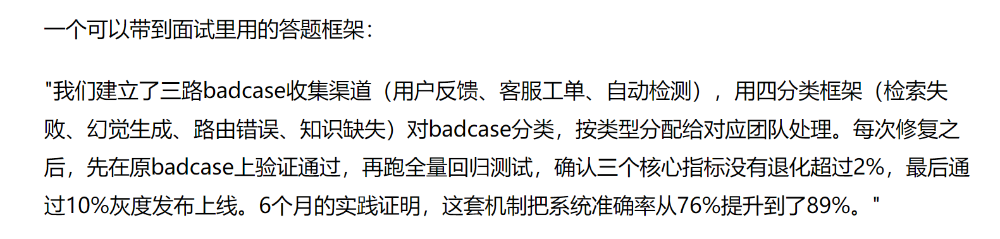
- Workflow 将多个 Skill 串联执行：Workflow 业务相关上下文 Skills执行编排 1，使用Skills1完成 2.使用Skills2完成· Skills Skills1 Skills2 Skills3 Skills4 Skills5
  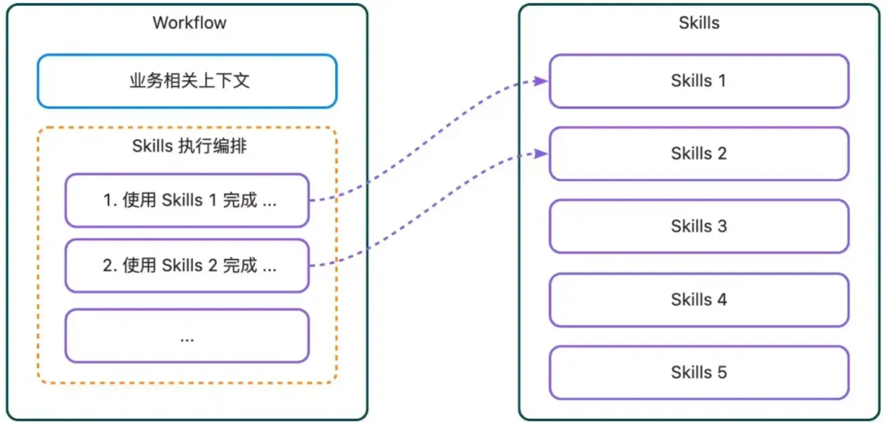
- CoT 强化推理链完整性：第二层: 生成中——强化推理链完整性 〈治逻辑型幻觉)
针对逻辑型幻觉，2025 年主流方案是 Chain-of-Thought (CoT) 强制推理 : arxiv。 要求异型在给出答案前先输出推理步骤，每一步推理都有中间结论。 好处: 推理过程可审查，一旦中间步又出错，可以在后处理阶段被检测到，而不是只看到最终错误答案。 在Agent 工具调用场景，还需要对模型输出的工具参数做类型/范围校验，拦截因幻觉产生的错j吃调用 juejin
  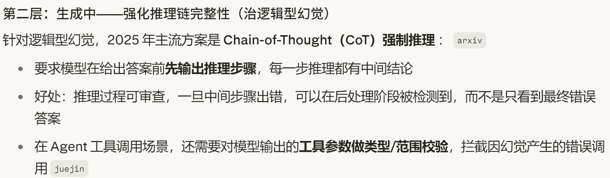
- 多智能体结果合并需显式规则：| 总结 Multi-Agent 不是把几个 LLM 调用摆在一起。它需要解决的是: 任务如何分解、子任务如何调度、
子 Agent 失败如何处理、并行结果如何合并、了矛盾结论如何裁定。 Supervisor 模式是生产环境中最主流的 Multi-Agent 架构: 一个中心 Supervisor S39 2K, SF Agent 只负责执行，决策权和执行权分离。 错误处理的核心是"不阻塞"原则: 重试 + 降级，让一个子 Agent 的失败止步于目己，不传染给整个系统。 结果合并的核心是"规则显式化”: 人数据北盾了时谁做先、矛盾'奈么标注、缺失和号么处理，这些规则要写进 Prompt，不能让 LLM BORE. 并行是有上限的: 2-3 个子 Agent 并行是大多数场景的最优解，更多的并行市来的是协调开销和
API 限速，不是更快的速度。
  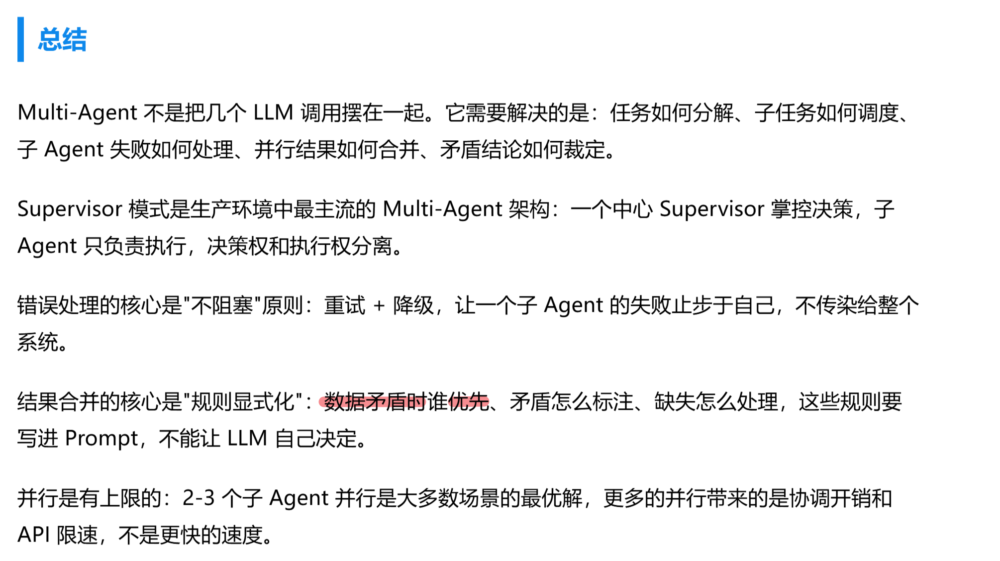
- Agent：https://www.doubao.com/thread/w4f9e93dc6a8ca880
- 最佳实践是文档层级划分 句子级 ov：最佳实践是文档层级划分 + 句子级 overlap （https://mp.weixin.qq.com/s/Rjm4kpKifyVyH27k_FWStQ）
- 阿里面试官问： " 你的 RAG 系：阿里面试官问： " 你的 RAG 系统上线之后，用户反馈答案不对，你怎么处理的？ Badcase 怎么收集，怎么分类，怎么验证没有引入新问题？ "
- 让问题不过夜：交易领域 “ 问诊 ”：让问题不过夜：交易领域 “ 问诊 ” Agent 实践 - 阿里云开发者社区
- 那么话说回来，这个意图识别和槽位抽取：那么话说回来，这个意图识别和槽位抽取具体如何操作呢？ AI 智能体意图识别与槽位抽取的实战演进方案 - 开发者社区 - 阿里云核心的是这里面的第四个方案，其中有个点需要解释一下，就是如何判断一个意图是否结束了呢？ 这里我们使用语义相似度 and 上一轮意图的槽位完整。 否则仍为当前意图，需要带着几轮的记忆。
- MCP 支持本地和远程两种通信：MCP的两种通信方式
stdio (本地) Streamable HTTP (远程)
Host (本地)
Host 进程 Host
(Claude Desktop) (Claude Desktop)
| 派生
HTTP 连接
MCP Server 子进程
(本地工具) - =
远程服务器 / 云端
MCP Server |
stdin +> __— stdout (远程服务) CE
管道通信 Ge)
© 延迟低、无网络、无端口 © BMS. FS Client 共享
@ 适合本地工具 @ serverless 友好适合的场景
“a stdio (本地) Streamable HTTP (远程)
Ay tA0R. wisxexe TA pid 团队共用服务、跨机器访问开发调试、低延迟场景生产环境、云端部署
  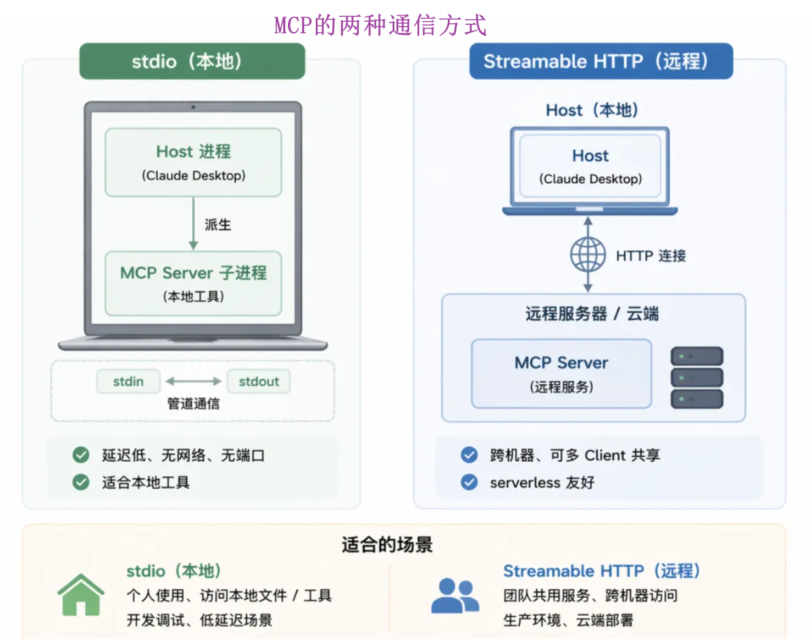
- Agent 轨迹包含思考、工具和观察：一个典型的Agent 轨迹 (搜索比特币价格) : text (io
用户问题: 今天比特币价格多少? Agent 84: 需要查实时价格 J Action: 调用搜索工具 <tool_call>{"search": "比特币实时价格"}</tool_cal1>
<observation> #《 这部分是工具返回的搜索结果，外部输入比特币当前价格: $69 ,420.50，24小时涨幅+3 .2%，成交量12 .4亿美元。
Ki: CoinMarketCap，更新时间: 2026-03-31 10:00
</observation> Agent 4%: 找到了价格信息，可以回答了册 Final Answer: 今天比特币价格是 $69 ,420.50，24小时涨幅3 . 2%
  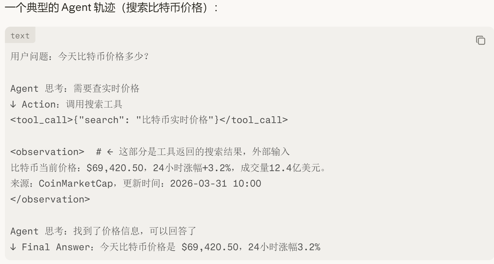
- 工具调用数据需覆盖多种场景：训练数据的多样性直接决定了 Function Call 能万的上限，不能只有 IER VA—S LA) 这一种情况。
单工具调用多工具并行调用工具调用不需要工具多轮对话
(基础款) 失败重试直接回答中的调用天气怎么样? 帮我查天气、新闻和汇率查询航班号CA1234 1+1等于几? eae AAP: 我在北京 | 中 BHF: 好的 4 © 接口超时/报错 ° 一
CF CF 4 无需调用工具那明天天气呢?
天气工具天气， 新闻 | OLE a anne 直接回答 |
CF FAIR
缺这个会在缺这个会在缺这个会在缺这个会让模型缺这个会在简单场景翻车复杂需求漏调遇错崩溃乱调工具上下文中迷路
  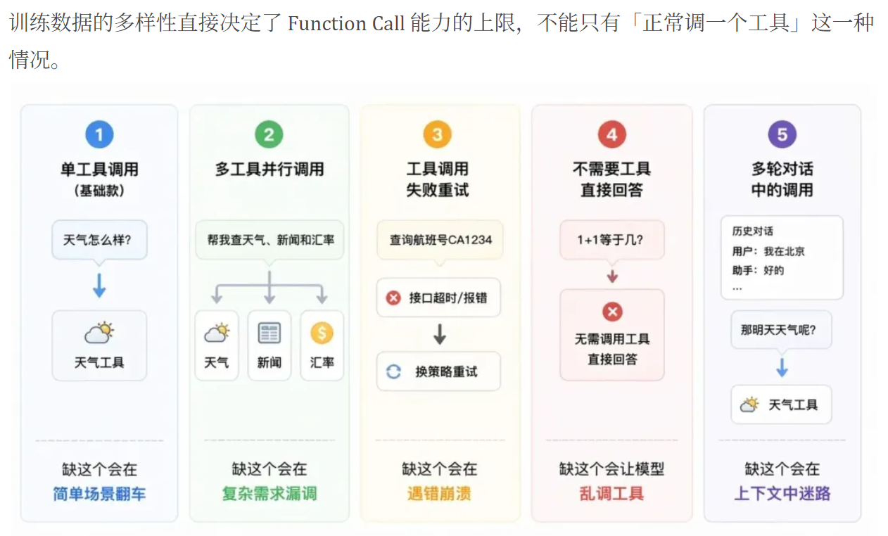
- Hermes 将复杂任务复盘成 Skill：那么，Hermes 是如何解决这个“重复踩坑”的问题的呢?
其实，也没多复杂，引入了一种动态的Skill沉演机制。在每次完成复杂任务，尤其是那些经历了曲折路径或人工干预的任务后，Hermes不会简单地丢弃对话历史，而是会司动一个“复盘”流程。它会回过头来审视整个执行轨迹，提取其中的关键步骤，特别是那些“踩过的志”、有效的纠错手段以及人工验证过的最佳实践。了随后，系统将这套经验总结、抽象为一个结构化的Skill技能文件包。这惑带来了一个根本性的转变: Skill从“静态调用”变成了“动态生成”。
虽然 OpenClaw, Claude Code 也支持 Skill 机制，但其 Skill 本质上还是静态的，通党是由用户或者开发者预先编写好，或者从官方/第三方Skill库中下载安装。这更像是一种传统的“APP 软件”模式: 你需要先帮布、安装，才能运行。一旦安装完成，除非人为更新，否则它不会变化。当然，会有人说，你可以人为要求 OpenClaw 或者 Claude Code 在任务结束之后帮你生成 skill，是的，但这还不是“自进化”。
而 Hermes 将 Skill 变成了一种动态的、可进化的资产。它主要实现了:。 自动生成: Hermes 能够基于上自身的Agent运行轨迹 (Trajectory)，自动生成新的Skill来沉泥。。 持续优化: 如果在后续执行新任务时发现了更优的路径或新的边界情况、“踩机”情况，Hermes 会继续更新完善这个已有的Skill。。 持续积累: 随着对话越来越多，相应的 Skill 也会越用越多，Agent 的能万库越来越丰宣这样，当 Hermes 下次遇到类似问题的时候，Agent也就不再是从零开始探索，而是直接读取并复用已有的沉泥好的Skill。通过这种方式，
Hermes 实现了真正的“吃一拍，长一智”。其他 Agent 可能会无休止地重复相同的错误，而 Hermes 则将每一次执行都转化为成长的“养分”，通过不断沉泥和优化 Skill，建立起属于自己的、动态增长的知识库。这也是 Hermes 在长期运行中，效果能够持续“自进化”的秘诀之一。
  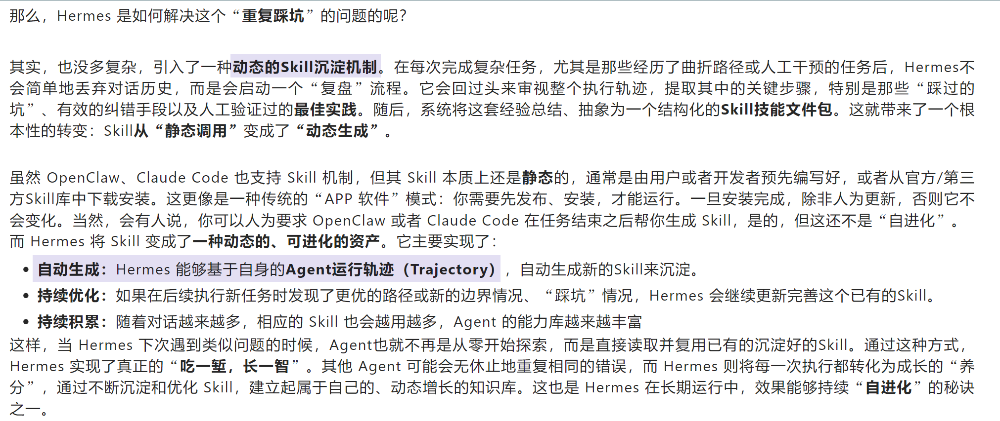
- Hermes 后台审查触发记忆与技能沉淀：触发机制在根目录下的run_agent.py中有一个“技能催促”的计数器，_iters_since_skill记录了距离上次使用skillmanage工具过了多少轮;
_skill_nudge_interval = 10则表示当 Agent 连续工作了 10 轮对话都没有创建/修改扩能时，系统会“提醒”Agent“你是不是该把刚才学到的经验整理成技能了? ”
后台审查Agent
每当主 Agent 完成对用户的回复后，对于用户而言，交互似乎融此结束。但在后台，Hermes 通过_spawn_background_review会在后台异步启动一个审查 Agent。这是一个异步处理机制，系统会立即 Fork 出一个新的轻量级 Agent 实例，专门负责对刚刚结束的对话进行深度复盘。这个后台 Agent 不会干扰前台的用户体验，而是从三个维度对此次交互进行全方位审查的Prom pt:。 记忆审查 (_MEMORY_REVIEW_PROMPT) : 这段对话有什么值得记住的经验? 判断这段对话中是否列含值得长期保留的关键经验或事实，提炼初长期记忆，存入 Agent 的记忆库。 技能审查 (_SKILL_REVIEW_PROMPT) : 这个任务模式是否值得变成Skill? 分析当前的任务解决路径是人否具有通用性，是人否值得被抽象并固化为一个可复用的Skill。 综合审查 (COMBINED_REVIEW_PROMPT) : 有什么可以改进的? 反思整个执行过程中是否存在优化空间或潜在的错误模式。
这是一种“前台即时响应、后台异步进化”的设计，用户看到的是 Agent PA, BREA Agent 慢慢整理经验。这种设计就让Hermes 确每一次交互不仅解决了当下问题，更为未来的智能化积累了数据沉淀。
保了每一次交互不仅解决了当下问题，更为未来的智能化积累了数据沉淀我觉得这种影子Agent的设计在很多场景中都很有用
  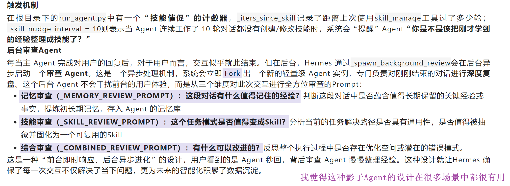
- Hermes 通过头尾保护压缩上下文：有 32K 窗口的轻量模型，Hermes 都能根据剩余空间的“健康度”灵活决定何时进行清理，从而更精细地平衡“信息保留”与“窗口预留”之间的关系。
然后就是裁剪，具体执行裁剪时，Hermes 采用了与 OpenClaw KU “SERB. Ale” 策略 : 1.头部保护: 保留系统指令、初始任务定义等天键引导信息。 2.尾部保护: 保留最近的几轮对话，确保短期记忆的连贯性。 3.中间讨缩: 对中间宛长的工具调用过程、推理步骤进行裁剪，并利用 LLM生成精炼的摘要 (Summary) 来蔡代原始细节。 46S Fe4a + ESV, Hermes 既避免了上下文爆炸导致的运行错误，又最大程度地保留了任务执行的关键脉络，实现了上下文管理的高效性与智能化。
还记得在self-Evolving的RL训练部分，我们还提到了轨迹压缩，这两种压缩也可以对比一下:
  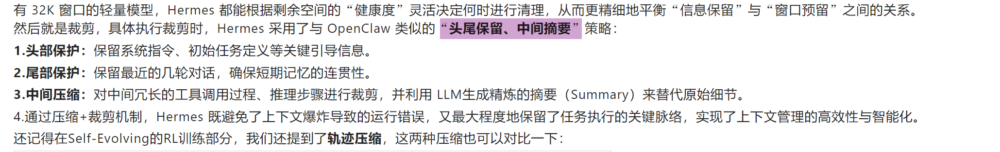
- 多 Agent 有四种常见编排模式：Ex 多Agent的四种编排模式顺序管道 Map-Reduce ax Fi}
BRIA 适合并行任务，难点在汇总
ao: Xt ISSR"
ERRE BADR
子Agent + 孙Agent 代码Agent 数据Agent
适合深层复杂任务，但要限深适合请求类型多样的系统卡码笔记: https://notes.kamacoder.com/
  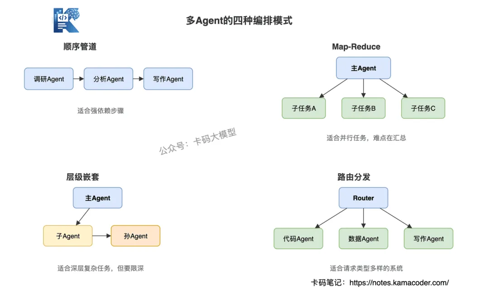
- 多 Agent 协作成本来自交接共享聚合：Q: 那具体到你们的实现里，成本主要贵在哪几个地方? A: 我们梳理下来，多 Agent 协作会暴露三类单 Agent 不会遇到的成本。 第一是交接成本。信息在 Agent 之间传递时需要重新组织。研究 Agent 收回来几十个网页，写作 Agent 可能是用不了的，每一次交接都要把信息从“上一个 Agent 能懂"翻译成“下一个 Agent 能用"”。我们的做法是让 Agent 之间通过结构化的文件和摘要来通信，而不是把所有上下文塞进一个 prompt 里。 第二是共享成本。直觉上觉得让所有 Agent 看到所有信息最安全，但每多共享一段内容，每个 Agent 每一轮都要为它付 token。我们的做法是按需加载，每个 Agent 只看到跟自己任务相关的信息摘要，需要细节的时候再去读全文。这样 Team 规模变大的时候，单个 Agent 的上下文不会
EE. 第三是聚合成本。派十个 Agent 并行查资料很容易，但把十份结果合成一份事实一致、引用准确、风格统一的交付物很难。这一步没有捷径，
Leader 要人花真实的精万去合并，不是“再多派几个 Agent"能解决的。确实要承认这件事本身就贵。
  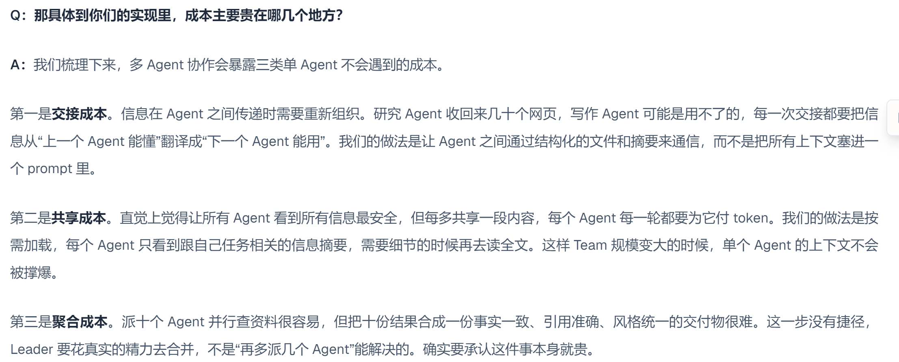
- Agent 间通讯复用用户操作能力：Q: 你刚才提到 Agent 之间可以互相通讯，这个通讯机制是怎么实现的? Agent 之间怎么知道该跟谁说话、能做什么操作?
A: 我们设计这个的时候，出砾点很直接: 先看人和 Agent 是怎么协作的。用户在前端可以给 Agent 发指令、启动一个新 Agent、中止一个任务、让 Agent 总结进展——这些操作用户天天在做。我们的想法是，Agent 自己也应该有能万对另一个 Agent 做同样的事。
.
Agent 间通讯设计 Agent 与人类同权用户能做的 . Agent 也能做 . Engine 也能做一三种调用方平权, 共享同一组接口,拿到同样的语义
Skill + CLI . 核心基础设施 / core infrastructure skills: mavis-commuamication ' mavis-session Mmavis-agemt © mavis-team
' Sa © 2 eee 2 eS SSS SSeS ee eseeeeeeeeeeeeneee2°22 i
| PRAM IF MBA EF interface Agent - 可协作成员
- 有身份 - 可护沟通 . OP User man prompt spawn abort 1
emer = , 发指令 . 追加要求开新 Agent / Session 中止当前任务身份
1 |
i -一 1
i 1
2 8 让其总培当前状态 MALT ASK session coment Other Agent : 作用于另一个 Agent . peer session 封装的底层基础设施 . infrastructure (调用方无需关心) 1 记忆
- - agent memory , MEMORYmd daemon HTTP API - 127.0.0.1:port (profile / dataDir (ERY) 1 一
1
i 1
Team Engine 8 CLI 包装 - mavis communication / session / agent / team / cron :
AgentTeaen 编排引擎 - 白动调用 1 _ 1 可中途沟通 Auth .token - scope 校验 - 调用前自动注入, 调用方无感
1 1 —
Ages 与人类网权 Mt 一 -
_ er Le Agent 与人类同权 - 共用一组动词走同一组 skill + CLI PUP Foc TY + skill SCHUH) + daemon 关心实现 . 三层各司其职, 调用方对底层切换无感
«Agen 是有身份/可被沟通/ 可被纠偏的协作成贡 . BARRERA, 也跟人类一样作为接口的作用对象
  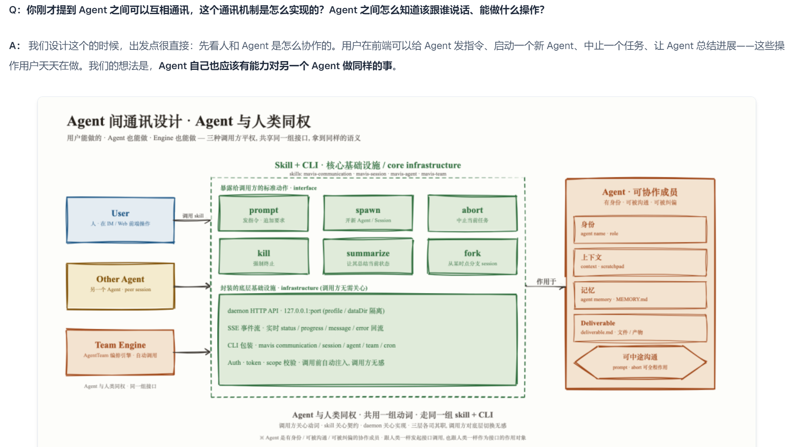
- AgentTeam 是持续协作而非任务派发：Q: 这个 Leader-Worker-Verifier 的分工听起来很清晰，但我有一个疑问，现在很多 Agent 框架已经支持主 Agent 把一个子任务派给另一个 Agent 去做，传个指令进去，拿到结果回来，这不也是一种拆分吗?你们的 Agent Team 和这种做法有什么本质区别? A: 你说的这种机制确实很常见，一般叫 Task 派发，主 Agent 调用一个工具，把一段指令发给子 Agent，子 Agent 跑完把结果返回来，交互就结束了。适合快速搜个文件、归纳一段材料、生成候选答案这种短任务。 戎iT可以后续下动的团隐明打个比方: Task 派发像发一封邮件等回复，Agent Team 像开了一个持续在线的工作群。Worker 做完了可以继续接新消息，做到一半卡住了会被友现，Leader 随时可以补充指令，Verifier 检查出问题可以直接打回去让 Worker 改。 为了让这种持续协作稳定运行，我们底层做了一套引警来管理每个 Agent 当前处在什么阶段，在等待、在执行、在验证、还是已完成。同一个 Agent 重试的时候还能复用之前的上下文，不用从头洒叶所/可作关系不再是一次攻调用，而是了时间的消息交换和状态推进，
  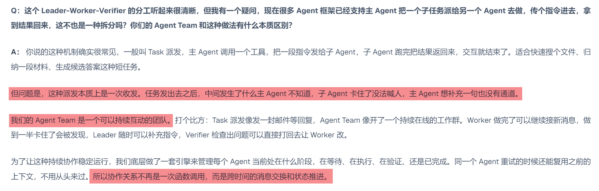
- Claude Code 双层限制工具结果大小：Glaudeicodesydj工具结果做两层大小控制8 先限制单个工具结果，再限制同一条消息里多个工具结果的总大小，防止上下文窗口被撑爆。 再补一句结果处理逻辑: 如果单个工具结果超出上限，系统不会把完整内容直接给模型，而是只给预览，并把完整结果持久化到磁盘， 附上文件路径供后续读取; 如果同一条消息里多个工具结果加起来超出聚合上限，就会进一步截断或替换部分结果，避免整条消息超预算。
  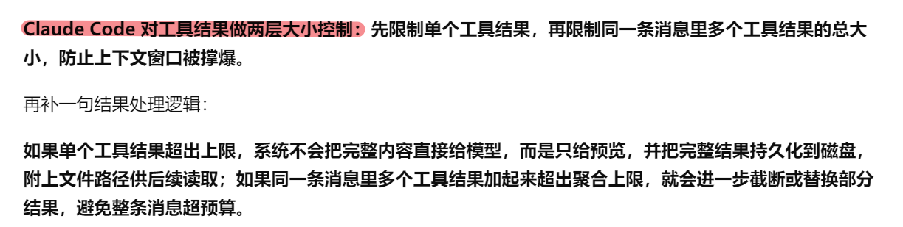
- Claude Code 延迟加载工具 Schema：当工具很多时，Claude Code 不会在一开始把所有工具的完整 schema 都发给模型，而是只把一部分核心工具完整加载; 对标记为 deferred 的工具，初始提示里通常只暴露“工具名 + 这是延迟加载的标记”"，不附带完整参数定义。
模型如果觉得当前任务可能需要某个 deferred 工具，并不是直接调用它，而是先调用 ToolsearchTool 做一次按需搜索。搜索时不会只靠工具名硬匹配，更重要的是利用每个工具预先写好的 searchHint 做语义匹
Be.
比如某个工具初始只暴露名字 GrepTool , 但它背后还有一个 hint: search file contents with regex (ripgrep)
当模型搜索'find text in files’ regex search in repo'这类关键词时， ToolsearchTool 就会把这个 hint 作为索引线索，匹配出 GrepTool，然后把它的完整定义返回给模型，包括 : © 工具说明。 BA schema ° 必填字段。 可选字段模型拿到这个完整 schema 后，才真正知道这个工具怎么调用; 所以“只暴露名字”“不是说模型靠名字直接猜参数，而是先知道“有这么个工具存在“，再通过 ToolSearch 按名字和 hint 找回完整说明书。
再压缩一点，可以记成:
deferred tool 在首轮只做“目录项“，不做“完整文档"; 真正的文档是在模型通过 ToolSearch 搜到后，才按需加载进上下文。
  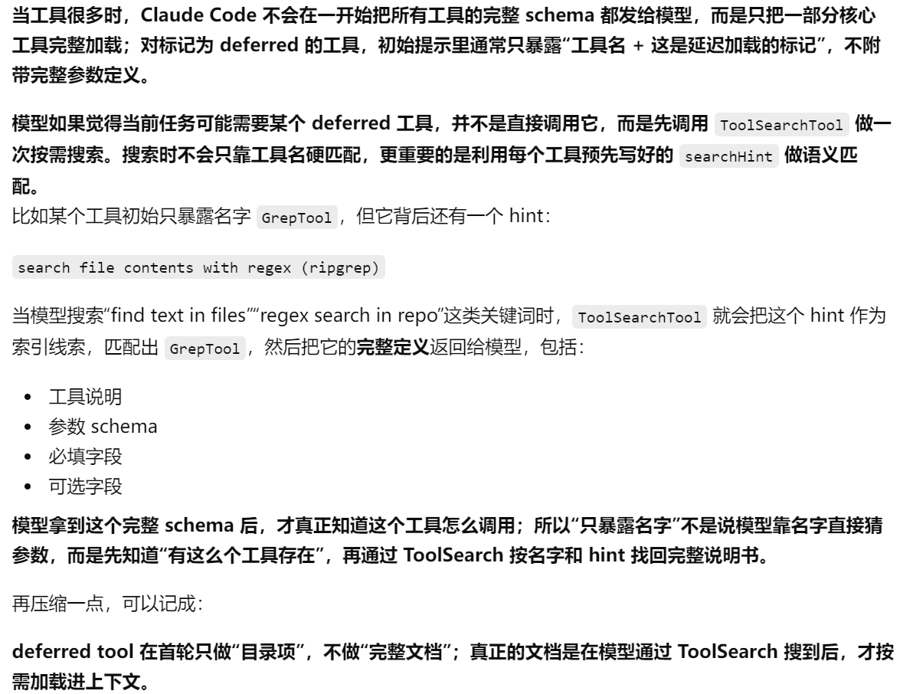
- searchHint 用于工具检索匹配：searchHint 是面向工具检索的短能万标签，主要在 Toolsearch 阶段使用; description 是面向工具理解与调用的正式说明，主要在工具已加载、模型准备实际调用时使用。 再短一点: Hint ARF", description 用来“看懂它”。
  
- Claude Code 工具系统采用安全默认值：» 2.8 模式提炼
M Claude Code 的工具系统设计中，可以提炼出几个对 Al Agent 构建者普遍有价值的模式:
模式 1: 失败关闭的默认值。 buitLdTootL() 的默认值假设最危险的情况 〈不可并发、非只读)，工具开发者必须主动声明安全属性。这将安全从"选择加入"翻转为"选择退出"，大幅降低了遗漏导致的风险。
模式 2: 分层预算控制。 单工具结果有上限，单消息也有聚合上限。两层控制互相补充——单工具上限防止单点失控，消息上限防止并行调用的集体爆炸。
模式 3: 输入感知的属性。 isConcurrencySafe(input) 和 isReadOnly(input) 接收工具输入，而非全局判断。同一个 BashTooL，Ls 和 rm 有完全不同的安全属性。这种细粒度的输入感知是实现精确权限控制的基础。详见第4章。
模式 4: 渐进泻染。 三阶段泻染 〈意图一进度一结果) 让用户在工具执行的每个阶段都有可见性。
Partial<Input> 的设计确保即使在参数流式传输期间，UI 也不会空白。这对用户信任至天重要——用户需要知道 Agent 正在做什么，而不是盯着一个旋转的加载图标。
模式 5: 编译期消除 vs 运行时过滤。 Feature Flag 通过 bun:bundle 的 feature() 在编译期消除未启用的工具代码，而权限规则在运行时过滤工具列表。两种机制服务不同目的: 前者减小bundle 体积和攻击面，后者支持用户级配置。
  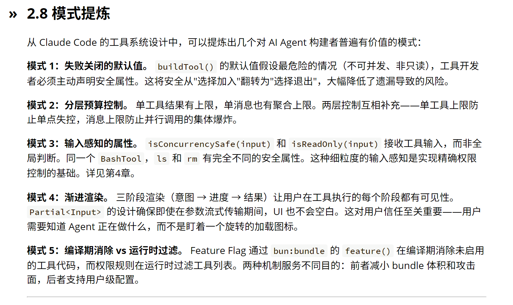
- 会话中途切模型会破坏缓存：会话中途不要切换模型
Prompt 缓存是模型唯一的。假如你已经和 Opus 对话了 100K tokens, #8/5)/NSI5 Sa, QSSIRU SERRE Leese Opus steel s== 9 Naik eee ee 确实需要切换的话，用 Subagent 交接: Opus 准备一条"交接消息"给另一个模型，说明需要完成的任务就行。
Compaction 的实际实现
How Compaction Works with Prompt Caching BEFORE FORKED COMPACTION CALL AFTER Cet
1
1 1
System + Tools - System + Tools 1 System + Tools
1
1 1
I Full conversation assistant + tool results 1 + (all messages) _ Conversation summary user message : ; (replaces all old messages)
1 1 1
assistant + tool results | cache hit — 1/10 price Re-attached files & context
1
... Many more turns … 1 .
——— ; 1 room for new conversation compaction butte: ! + "Summarize this conversation"
ae os oo ae as a a a a es ae ee a ee a 1 1 I context window nearly full + Summary (~20k tokens max) :
1 1
Mo
上图是 Compaction (上下文压缩) 的执行流程: 左边是上下文快满时的状态，中间是 Claude Code 开一个 fork 调用，把完整对话历史喂给模型，加一句"Summarize this conversation”，这一步命中缓存所以只需 1/10 的价格，右边是压缩完之后，原来几十轮对话被车换成一段 ~20k tokens 的摘要，System + Tools 还在，再挂上之前用到的文件引用，腾出空间继续新的轮次。
直觉上 Plan Mode 应该切换成只读工具集，但这会破坏缓存。实际实现是: “EnterPlaniiode 是模型可以自己调用的工具，检测到复杂问题时自主进入 plan mode,
工具集不变，缓存不受影响。
defer loading: 工具的延迟加载
‘Claude Code SUT MCP TS, SREKSREASRE, ERARRSRTES, 解决方案是发送轻量级 StUb 只有开具名标记“defer_loading: true .
GSer esearch =] ewe SEH LE schema 只在模型选择后才加载，这样缓存前绥保持稳定。
  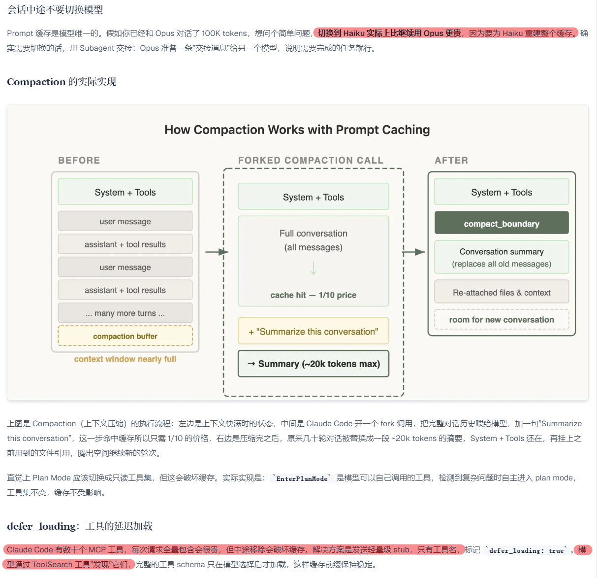
- Claude Code 通过工具循环检索代码：这个循环对所有工具是平等的。LLM 可以在任何时候调用任何工具，甚至在一次响应中同时调多个。没有硬编码的“必须先搜再读"。与代码搜索相关的核心工具有四个: 工具底层实现作用 GrepTool ripgrep (rz ) 正则搜索文件内容 GlobTool glob 模式匹配按文件名/路径模式查找文件 FileReadTool Nodejs fs 读取指定文件的指定行范围 AgentTool 独立 LLM 对话启动子 agent 做多步探索此外还有 LSP (Language Server Protocol) 工具,用 "go to definition”, “find references” SiS
义精确的操作补充 Grep 的不足。但核心搜索架构建立在这四个工具之上。 其中 AgentTool 比较特殊: 它不是直接搜索文件，而是启动一个独立的子 agent，让子 agent 在自己的 context window 里完成一整套搜索任务，最后只把结论返回给主对话。子 agent 有多种类型，与搜索最相关的是 Explore 类型: 它只配备搜索和读取工具 (Grep、Glob、Read)，不能编辑文件、不能执行命令、不能黎套启动新的 Agent，是一个纯只读的搜索专家。 F agent 的核心价值是 context 隔离。它从零开始构建自己的对话历史，不继承主对话的消息，这意味着它搜索过程中产生的大量 grep 结果、代码片段都留在自己的 context 里，主对话只收到一段总结性的文本结论。对于需要大范围搜索的任务，如果在主对话里直接搜索，几轮 grep/read 下来
context 可能就被中间结果塞满了。因此交给子 agent 处理后，主对话的 context 只增加一条结论消息。
  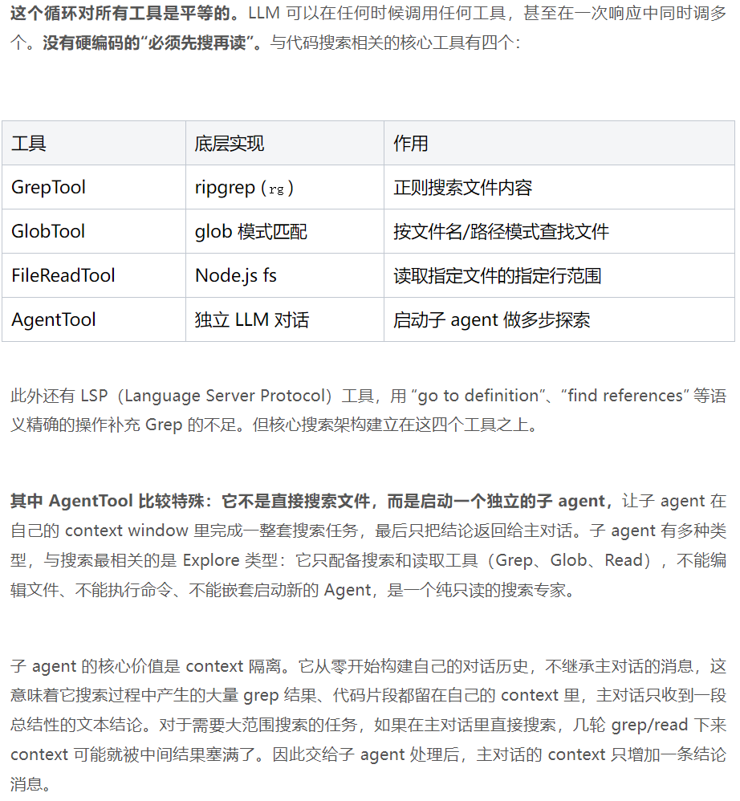
- ToolSearch 按需加载延迟工具：2.7 延迟加载与 ToolSearch 当工具数量超过一定靖值时 《尤其是 MCP 工具大量接入后)，将所有工具的完整 schema 发送给模型会消耗大量 token. Claude Code 通过延迟加载 (Deferred Loading) 机制解决这个问题。 标记了 shouldDefer: true 的工具在初始提示中只发送工具名称 (defer_loading: true )，不发送完整的参数 schema。模型需要先调用 TooLsearchTootL 按关键词搜索并获取工具的完整定义后，才能调用这些延迟加载的工具。 每个工具的 searchHint 字段融是为此设计的——它提供 3-10 个词的能万摘述，帮助 ToolSearchTool
进行关键词匹配。例如 GrepTool 的 searchHint 是 'search file contents with regex
(ripgrep)' o 标记了 alwaysLoad: true 的工具则永远不会被延迟——它们的完整 schema 总是出现在初始提示中。这适用于模型在第一轮对话瓯必须能直接调用的核心工具。
  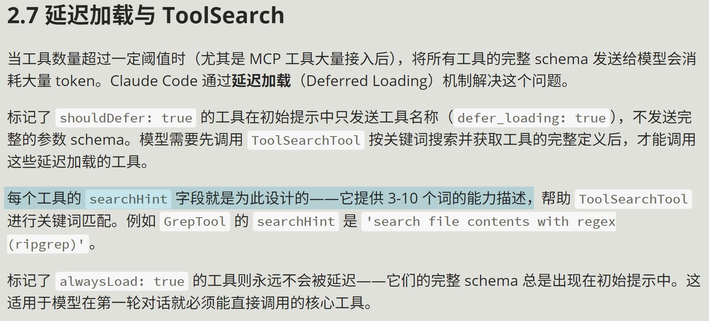
- Claude Code 与 Codex 都用 grep 检索：两种路径的核心分歧在搜索工具的封装程度上。Claude Code 把 Grep 封装成带结构化参数的专用工具，LLM 不需要解析原始 shell 输出，减少出错概率，也让系统更容易控制信息量; Codex 让模型直接写 shell 命令调用 rg，给予最大灵活性 (可以目由组合管道、正则、路径过滤)，但需要模型自己处理非结构化的文本输出。 真正值得注意的是两者的共识: 两个互为竞争对手的 Al 编程产品，独立做出了几乎相同的架构决
oe, 用 LLM 驱动 ripgrep，放弃向量检索。 这不太可能是巧合。这说明在当前 LLM 能万水平和开上友者本地项目的规模学围内，零泰3| + Grep 已经是一个被反复验证的有效方案。
  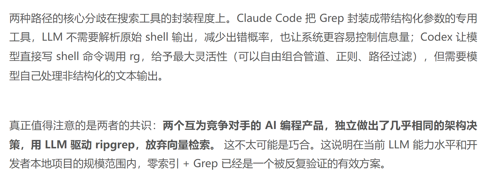
- Session 是会话日志，Memory 是项目记忆：1. Session =’ Nisa”, Memory 是”项目级别”
你可以这样分: Session: 一次会话的聊天日志 O) Memory: 某个项目目录下的长期笔记
Session (RANE: 这一次对话里，用户问了什么，模型答了什么，工具调用了什么。 ey
文档里说，用户输入会变成 UserMessage，模型回复会变成 AssistantMessage，关掉终端后这些消息会写入
JSONL 文件， 下次可以通过 --resume 恢复， 这就是 Session, 加 8) Mit a2: _你用 Claude Code 这么久，它怎么…
但 Memory 保存的是: 所以它不是一轮对话一个 _ MEMORY.md，而是多个会话共同沉泥到同一个项目的 MemMoRY.md。
2. 一个项目目录只有一个 MEMORY.md 索引
  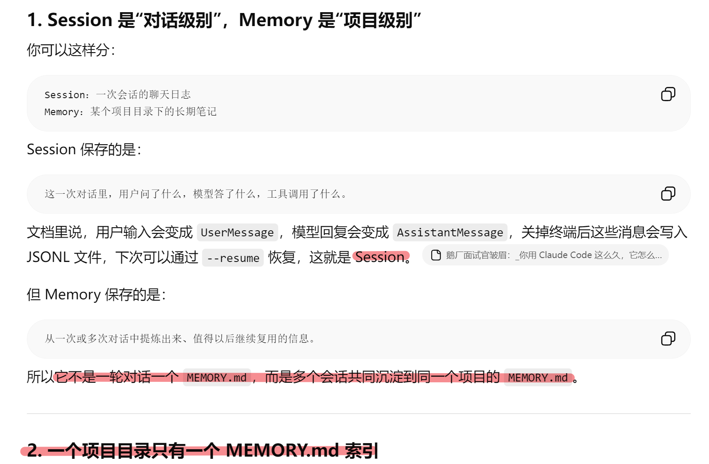
- Memory 按用户、反馈、项目、引用分类：口
Memory 存储架构
— MEMORY.md 内容预览记忆类型 (Memory Types)
t home
- [用户角色 (user role md)] 类型标识 PLB 描述示例文件
| .claude (user_role.md) an
- [EHUB (feedback_no_mock.md) 定义用户身份和四 projects Penge ™~ = lL. ues 用户角色权限 User-role nd
- [进行中工作 (project_deadiine,md)] mm 记录系统反馈和
Les a3{8c2b1d0e9 (aa cen a feedback “行为规范 EMMA feedback_no_mock.md P val 跟踪当前项目状 1
Les memory project。 进行中工作 Senet ayq Proiect_deadiine.md
到 RAR ”指向外部文档或二国 wemory.ma .md 文件内容预览〈示例) reference (og 资源的链接 (例如: api_docs.md)
[= teedback_no_mock.md-) rane: "Mees" 特别提示: SHA-256 vs hash()
description: "EX RPSAP ORIN
(2) user_role.md 一 “ER: 在 Python 3.3 及更高版本中，
roject_deadline.md LAr 会话和环国 me RENAN FANE REPRENOARR, 识符，请使用 SHA-256 算法并取其前 12
- GRP: BRUORM. 个字持作为唯一ID。"
/NA 王 [十 nm _ 上此
TAKS . 吴师兄学大模型
  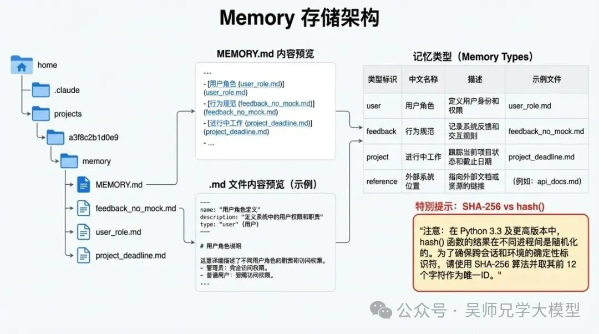
- 记忆提取触发需平衡成本和覆盖：| 面试怎么答"Agent 的记忆提取触发策略"?
面试官问这个问题，本质上是在考察你对 Agent 系统工程权衡的理解，不是背诵某个具体实现。
先说问题本质 (15秒)。 “记忆提取有成本，每次触发要额外调一次 LLM，所以触发策略的核心是在成本控制和记忆覆盖率之间取平衡。"
再说两类主流策略 (20秒)。 “一类是规则驱动: Claude Code 用消息数量阔值 (>4条)，
Generative Agents 用重要性积分闪值，触发时机确定可预测。另一类是 LLM 自主驱动:
MemGPT 让 LLM 通过函数调用自己决定何时读写记忆，灵活但非确定性。”
然后说提取结果的处理 (15秒)。 "触发之后怎么处理也是设计点。Mem0 用
ADD/UPDATE/DELETE/NOOP 四种操作，NOOP 表示没有有价值的新信息，吉免无效写入。”
最后说你的项目实践 (20秒)。 “在我们的 Agent 项目里，用的是类似 Claude Code 的后台
SHR, SN 条新消息触发一次，用单独的任务异步执行不阻塞主对话。触发后 LLM 扫描新增内容，有新信息才写入，没有就跳过。实测下来 APl 调用次数比每轮触发降低了约 60%,
记忆覆盖率没有明显下降。”
面试回答框架: Agent 记忆提取触发策略第一步 (15秒) 说清楚问题本质; 提取有成本，核心是成本 vs 覆盖率的权衡第二步 (20秒) 对比两类策略: 规则驱动 (数量闭值/重要性积分) vs LLM自主驱动第三步 (15秒) 提取结果处理: Mem0的ADD/UPDATE/DELETE/NOOP四操作模型第四步 (20秒) 项目实践; 后台异步触发，降低60% API调用，覆盖率无明显下降 CARS - 吴师兄学大模型面试回答框架: Agent 记忆提取触发策略
  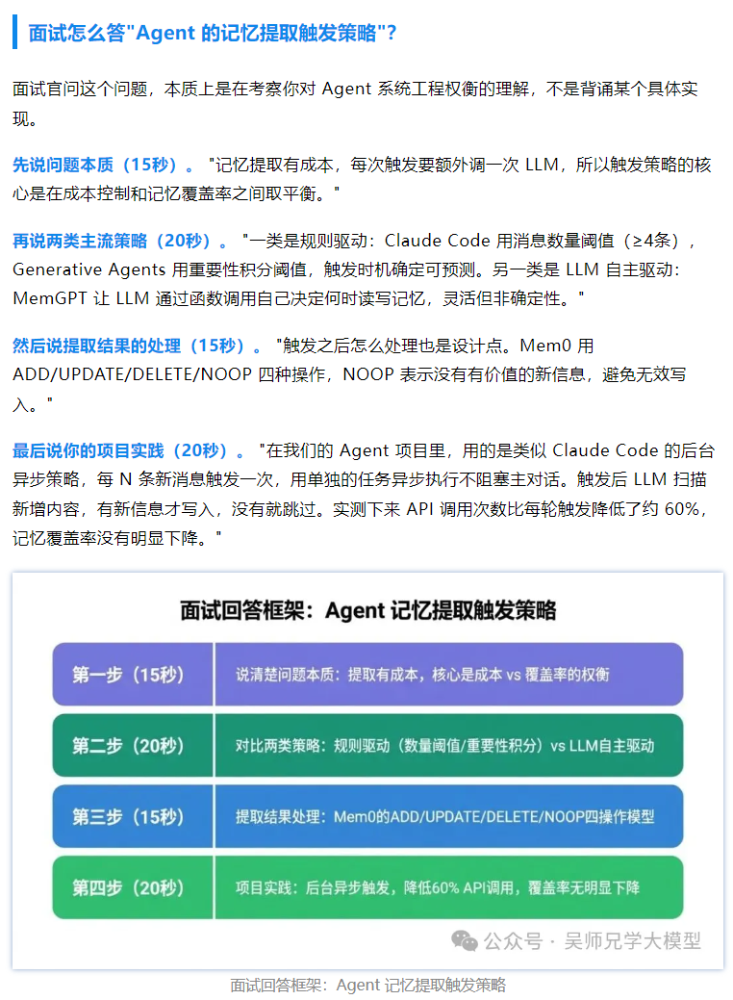
- Coalescing 合并后台记忆提取请求：18. 一句话总结
Coalescing 就是: 后台记忆提取一次只能跑一个， 如果跑的过程中又来了新的提取请求，不新开任务，只把
_dirty 标成 True; 等当前提取结束后，再根据 _watermark 统一扫描新增 messages。互斥锁保证这些状态修改不会被多个异步任务同时打乱。
更短一点:
_running: 现在有没有人在提取。 oO
_dirty: 提取期间有没有新消息来。
_watermark: 上次提取处理到第几条消息。
互斥锁: 保证同一时间只有一个任务能改这些状态。
Coalescing: 把多个提取请求全并成<当前跑一次 + 必要时补跑一次”。
  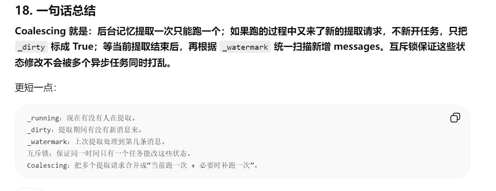
- Memory 设计要主动管理时效和优先级：| 面试怎么答 Agent 的记忆设计? 面试官问"你的 Memory 模块是皇么设计的"，这道题的核心考察点是: 你有没有把记忆当成一个需要主动管理的系统，而不是一个只写入的存储。 先说分类思路 (20秒)。 “我们把记忆分成四类: 用户信息 (长期稳定，全量加载)、反馈规则
(用户纠正，最高优先级)、项目状态 (有时效，必须用绝对日期)、外部引用 (按需检索)。
不同类型的使用时机和时效性是不同的，放在一起检索会引入不必要的噪声。" 再说时效性处理 (15秒)。 “项目状态类的记忆时效性最短，写入时必须把'周四'这类相对时间转换成绝对日期，避免记忆在未来被错误解读。每次会话开始时自动扫摘，过期的提示用户更新然后说什么不存 (15秒)。 “代码规范、git 历史这些从代码和版本管理里能读到的信息，不往
Memory 里存，避免 Memory 里有一份过时的副本比代码更可信。Memory 只存那些无法从当前状态目动推导出的个性化信息。" 最后说实际效果 (20秒)。 "引入分类管理之后，Memory 库大小下降了约 40%，但检索准确率提升了，主要原因是高优先级的记忆 (用户信息、反馈规则) 能稳定影响模型行为，不会被大量低质量的过期记忆稀释。”
  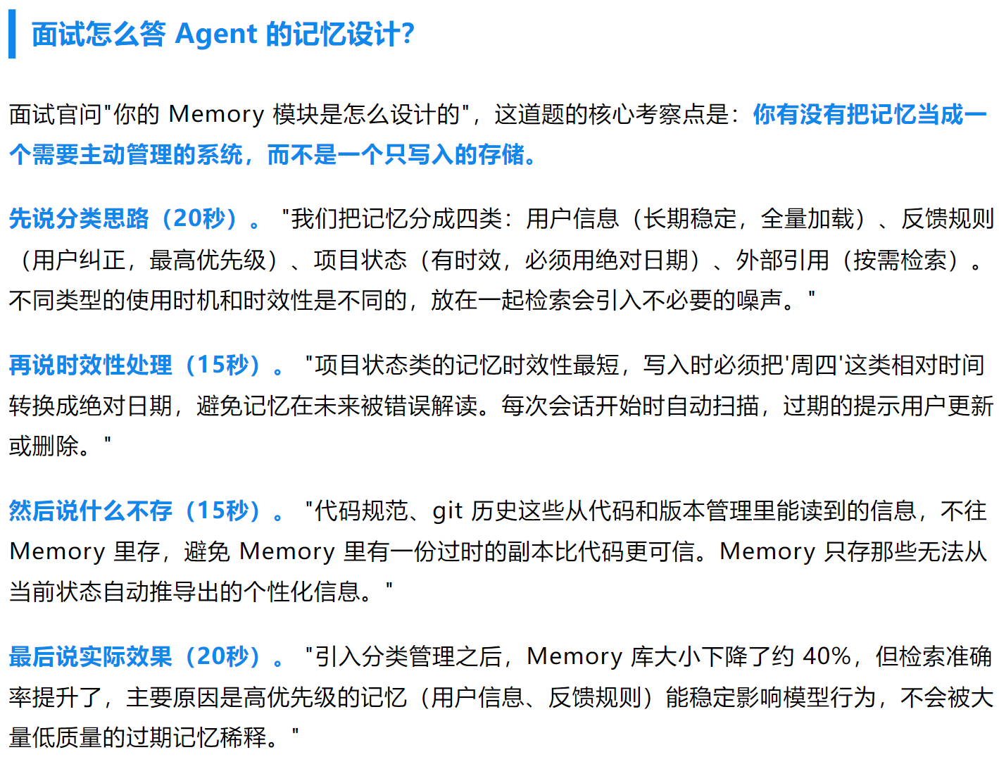
- Claude Code system prompt 分段构建：Claude Code system_prompt 构建顺序系统核心指令模型角色定义、基础行为规范环境信息操作系统、Shell、工作目录工具描述可用工具列表及参数 schema SUMMARIZE_TOOL_RESULTS
工具结果捕要策略
Memory (第10段) /_puild_system() main.py:285
M ~/.claude/projects/{id}/memory/ 加载，MEMORY.md 索引 + 各记忆文件内容 \ 仅在 REPL 启动时执行一次 )
CLAUDE.md
用户项目级指令，优先级高于 Memory
其余动态段落当前会话上下文竺民 a |
  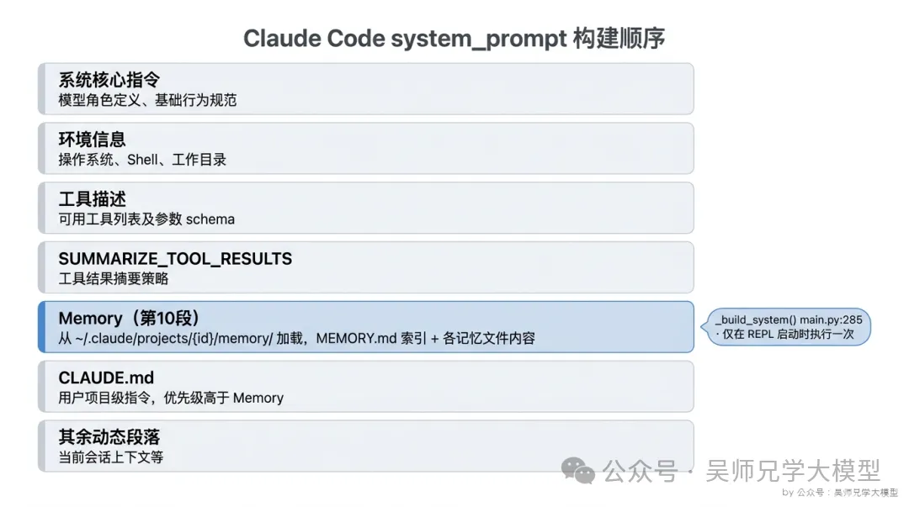
- queryLoop 用分层恢复避免无限循环：用户能做什么如果你正在构建目己的 Al Agent 系统，以下是从 queryLoop() 设计中可以直接们鉴的实践 :。为每种恢复策略设置单次党试守卫。 在 while (true) 循环中，每种自动恢复 (RA, Bit, BR)
都必须有布尔标记或计数器防止无限循环。用 hasAttemptedx 命名，让意图一目了然。。 采用"从轻到重"的分层压缩策略。 不要在上下文超限时直接执行全量摘要。先尝试裁剪旧消息
(snip). Fi (microcompact), Bite 《collapse)、最后才全量压缩 \autocompact)。每一层都保留尽可能多的上下文信息。。用完整状态重建痊代增量修改。 在循环的每个 continue 站点构造完整的新状态对象，而非逐字段修改。这消除了"忘记重置字段"的 bug 类，尤其在有多个继续路径时。。 扣留可恢复错误。 不要在第一时间将错误暴露给上层消费者。先党试所有恢复手段，只有全部失败后才释放错误。这避免了上层因看到错误而过早终止会话。。利用模型响应的等待窗口做并行预取。 在发起 API 调用的同时启动内存预取、技能发现等异步任务。
模型生成响应的 5-30 秒窗口是"免费"的计算时间。。 记录转换原因 (transition reason)。 在状态中记录每次循环继续的原因 〈如 next_turn、
reactive_compact_retry )，既方便调试，也让自动化测试能断言特定恢复路径是否被触发。
  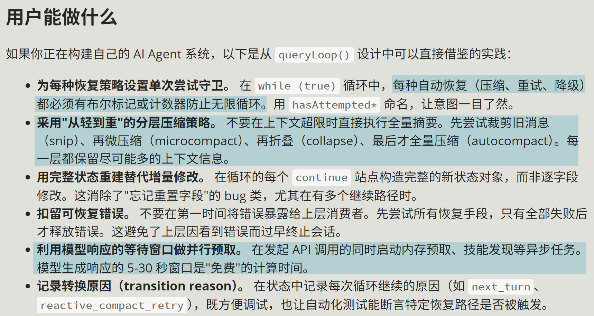
- 稳定 Prompt 前缀提升缓存命中率：把五点连起来看 Rs、 第一，省钱、省延迟。
Ne Se —— k ThA.
这五点其实是一套完整的方法论: 因为稳定 prompt 可以被缓存，重复请求不用每次完整计算。
第二，让 Agent 更可靠。
1，先把系统提示词拆成模块因为提示词来源清楚、优先级清楚、动态内容边界清楚，后续调试和从代都会更容易。 a)
2. 标注哪些模块可缓存、哪些不可缓存
3。把动态模块放到缓存边界之后
4. 给不同来源的提示词定义优先级
5。用缓存命中率监控设计是否有效可以把理想结构想成这样:
- Agent 身份
- 安全规则
- 工具使用原则
- 输出格式
- 错误处理规则
[SYSTEM_PROMPT_DYNAMIC_BOUNDARY]
[低稳定性、每轮变化、不可绥存]
- 当前时间
- 用户状态
- 当前任务上下文
- 工具调用结果
  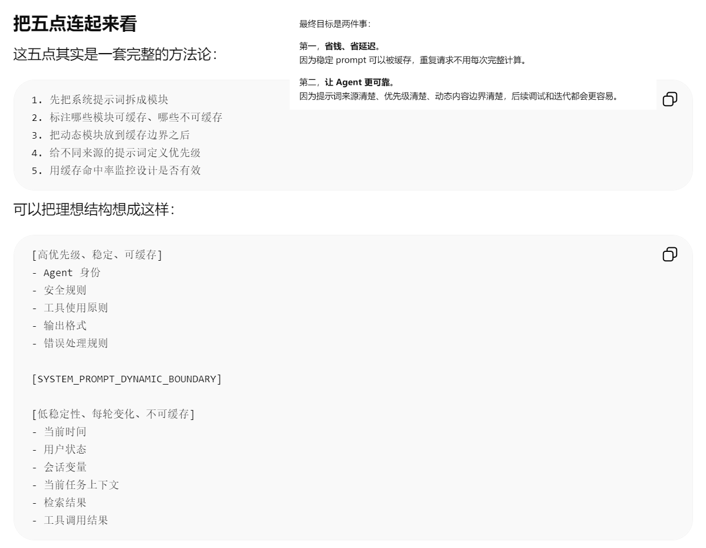
- 系统 Prompt 应建立分段注册表：5.9 用户能做什么基于本章分析的系统提示词架构，以下是读者可以在自己的 Al Agent 项目中直接应用的建议 : 1. 为你的提示词建立分段注册表。 不要将系统提示词硬编码为单一字符串。将其拆分为独立的、有名称的段落，每个段沙标注是否可缓存。这样做的收益不仅是缓存效率，更是可维护性 -- 当需要修改某个行为指令时，你可以精确定位到对应的段落，而不是在一个巨大的字符串中搜索。 2. 为易变段落增加 API 摩擦。 如果你的系统中有部分提示词内容需要每轮重算 《如动态工具列表、实时状态信息)，人参考 DANGEROUS_uncachedSystemPromptSection 的设计: 要求调用者提供"为什么需要每轮重算"的理由。这种摩擦在代码审查中尤其有价值 -- 它迫使开发者显式权衡缓存效率与内容新鲜度。 3. 将会话变量赶到缓存边界之后。 如果你使用的 API 支持 prompt caching，确保提示词的前缀部分
(缓存键的计算范围) 不包含因用户、会话或运行时状态而异的内容。Claude Code 的
SYSTEM_PROMPT_DYNAMIC_BOUNDARY 标记是这种策略的直接实现。 4. 定义清晰的提示词优先级链。 当你的系统支持多种运行模式 (Bid Agent. MIA. BPE
等)，为每种模式的提示词来源定义明确的优先级。避免"合并"不同来源的提示词 -- 使用"替换"语义更安全、更可预测。 5. 监控缓存命中率。 系统提示词架构的价值完全体现在缓存命中率上。如果你的缓存命中率突然下降，
检查是否有新的条件分支被引入到静态区中 -- 这是 Claude Code 团队在 PR #24490 中踩过的坑。
  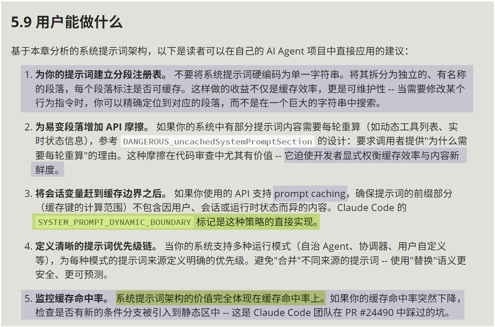
- 指数退避重试需加入随机抖动：网页估算，10 次重试预算结合指数退避，总等待大约是 2.5 到 3 分钟，并且每次等待还会玛加 0-25% 随机抖动。这个拌动非常重要: 如果大量 Claude Code 客户端同时遇到 API Mle, LARA, Eee
500ms、1s、2s、4s 这些时间点集体重试，反而进一步放大后端压万。 zhanghandono...
所以普通重试的核心公式可以理解成:
delay = min(某个上限，566ms * 2^(attempt - 1)) OO)
delay = delay + 6%~25% 随机抖动
  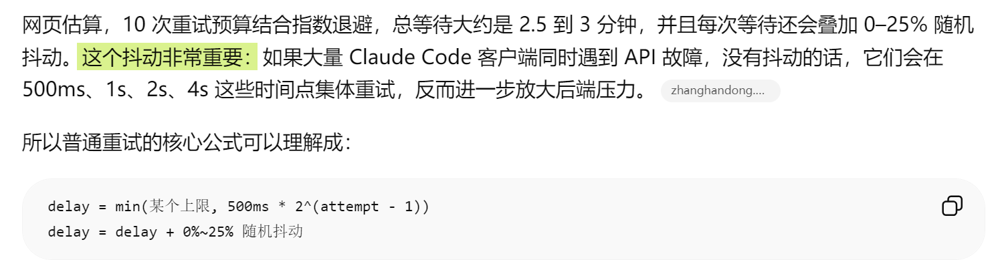
- 重试机制需要预算、分类和可观测：12. 我觉得这套机制最值得借鉴的地方这篇网页里真正有价值的不是几个常量，而是它背后的工程原则。
第一，重试要有预算。默认 10 次，529 单独 3 次，Fast Mode 有 20 秒阔值，持久模式也有 5 分钟退避上限和 reset cap。没有预算的重试融是失控。
第二，不同错误要不同处理。429、529、408、409、401、403、5xx、连接错误，语义完全不同。尤其
429 对 Max/Pro 用户和企业 PAYG 用户的意义不同，这种差异化很重要。
第三，过载时要减载，而不是所有请求一起重试。529 时后台任务直接放弃，这是非常成熟的系统设计。
第四，流式响应要特别小心副作用。流式中途失败后重试，可能造成工具重复执行。只要涉及写文件、调用工有具、提交变更，融必须考虑戎等性。
第五，重试过程中也要可观测。每次 query/success/error 都打事件，错误分类细到 25 种以上，这样线上问题才能定位。
第六， 等待期间也要有用户体验, AsyncGenerator + yield SystemAPIErrorMessage 让重试等待过程可见，
不会像程序卡死。 NP
  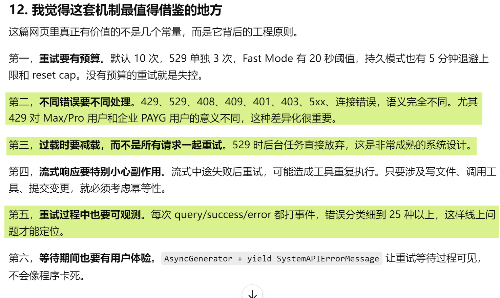
- 文件编辑前必须先读取文件：3. FileEditTool: 编辑前必须读取
FileEditTool 的核心规则很简单，但非常天键: 编辑文件前，必须先用 Read 工具读取过这个文件。 O]
这不是建议，而是硬性约束。网页说，工具运行时会检查对话历史里是否有对应的 Read 调用; 如果没有，
EditTool 会直接报错。提示词提前告诉模型这个规则，是为了避免模型白白发起一次失败的工具调用。 张汉东为什么要这样?
因为模型如果不读文件就编辑，本质上是在赁记忆或猜测修改文件。它可能以为文件里有某段代码，但实际上文件已经变了。
  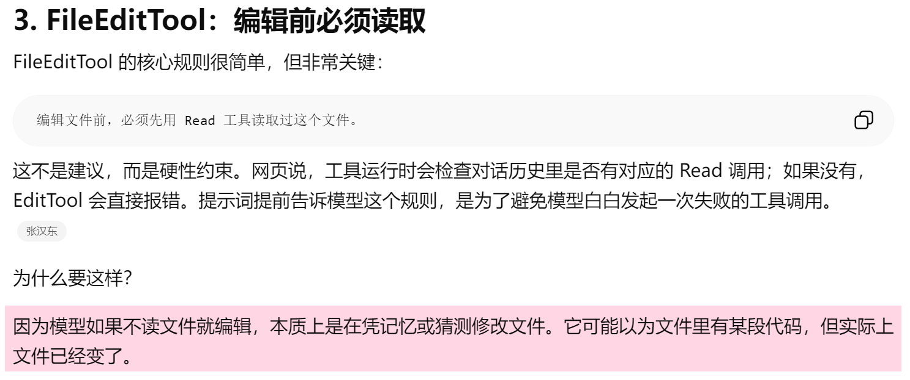
- 蚂蚁面试官： " 你的 Agent ：蚂蚁面试官： " 你的 Agent 怎么触发记忆提取？ " 我不屑： " 每轮结束触发一次呗。 " 他冷笑： " 那 Claude Code 为什么不这么设计？ " 我： ……

## 证据表

| evidence_id | 类型 | OneNote 页面 | 原链接 | 图片 | 摘要片段 |
|---|---|---|---|---|---|
| agent_img_001_005_ce1638579d53 | onenote_image | Agent |  |  | Badcase 闭环提升系统准确率: 一个可以审到面试里用的答题框以: "我们建立了三路badcase收集渠道 (用户反馈、客服工单、目动检测)，用四分类框以(检索失败、幻觉生成、路由错误、知识缺失) 对badcase分类，按类型分配给对应团队处理。每次修复之后，先企原badcase上验证通过，再跑全量回归测试，确认三个核心指标没有退化超过2%，最后通过107%灰硫友布上线。6个月的实践证明，这套机制把系统准确率从76%提升到了8976。 " |
| agent_img_001_015_5be324090a5c | onenote_image | Agent |  |  | Workflow 将多个 Skill 串联执行: Workflow 业务相关上下文 Skills执行编排 1，使用Skills1完成 2.使用Skills2完成· Skills Skills1 Skills2 Skills3 Skills4 Skills5 |
| agent_img_001_016_55162987dd1e | onenote_image | Agent |  |  | CoT 强化推理链完整性: 第二层: 生成中——强化推理链完整性 〈治逻辑型幻觉)
针对逻辑型幻觉，2025 年主流方案是 Chain-of-Thought (CoT) 强制推理 : arxiv。 要求异型在给出答案前先输出推理步骤，每一步推理都有中间结论。 好处: 推理过程可审查，一旦中间步又出错，可以在后处理阶段被检测到，而不是只看到最终错误答案。 在Agent 工具调用场景，还需要对模型输出的工具参数做类型/范围校验，拦截因幻觉产生的错j吃调用 juejin |
| agent_img_001_020_34269172aa96 | onenote_image | Agent | [source](https://mp.weixin.qq.com/s/BEUadA_OwAVpL1srTmdbxQ) |  | 多智能体结果合并需显式规则: | 总结 Multi-Agent 不是把几个 LLM 调用摆在一起。它需要解决的是: 任务如何分解、子任务如何调度、
子 Agent 失败如何处理、并行结果如何合并、了矛盾结论如何裁定。 Supervisor 模式是生产环境中最主流的 Multi-Agent 架构: 一个中心 Supervisor S39 2K, SF Agent 只负责执行，决策权和执行权分离。 错误处理的核心是"不阻塞"原则: 重试 + 降级，让一个子 Agent 的失败止步于目己，不传染给整个系统。 结果合并的核心是"规则显式化”: 人数据北盾了时谁做先、矛盾'奈么标注、缺失和号么处理，这些规则要写进 Prompt，不能让 LLM BORE. 并行是有上限的: 2-3 个子 Agent 并行是大多数场景的最优解，更多的并行市来的是协调开销和
API 限速，不是更快的速度。 |
| agent_link_001_001_ab0d3f31e5b4 | onenote_text_link | Agent | [source](https://www.doubao.com/thread/w4f9e93dc6a8ca880) |  | Agent: https://www.doubao.com/thread/w4f9e93dc6a8ca880 |
| agent_link_001_002_3aa486062719 | onenote_text_link | Agent | [source](https://mp.weixin.qq.com/s/Rjm4kpKifyVyH27k_FWStQ）) |  | 最佳实践是文档层级划分 句子级 ov: 最佳实践是文档层级划分 + 句子级 overlap （https://mp.weixin.qq.com/s/Rjm4kpKifyVyH27k_FWStQ） |
| agent_link_001_004_b0fd20db1549 | onenote_text_link | Agent | [source](https://mp.weixin.qq.com/s/F2QU3cSO7sOW9ZPVAEkt_w) |  | 阿里面试官问： " 你的 RAG 系: 阿里面试官问： " 你的 RAG 系统上线之后，用户反馈答案不对，你怎么处理的？ Badcase 怎么收集，怎么分类，怎么验证没有引入新问题？ " |
| agent_link_001_005_2da27c38a6fa | onenote_text_link | Agent | [source](https://developer.aliyun.com/article/1714754?spm=a2c6h.24874632.expert-profile.22.16451bb6I2z2HU) |  | 让问题不过夜：交易领域 “ 问诊 ”: 让问题不过夜：交易领域 “ 问诊 ” Agent 实践 - 阿里云开发者社区 |
| agent_link_001_006_14131c3a0a2a | onenote_text_link | Agent | [source](https://developer.aliyun.com/article/1675940) |  | 那么话说回来，这个意图识别和槽位抽取: 那么话说回来，这个意图识别和槽位抽取具体如何操作呢？ AI 智能体意图识别与槽位抽取的实战演进方案 - 开发者社区 - 阿里云核心的是这里面的第四个方案，其中有个点需要解释一下，就是如何判断一个意图是否结束了呢？ 这里我们使用语义相似度 and 上一轮意图的槽位完整。 否则仍为当前意图，需要带着几轮的记忆。 |
| agent_img_002_020_2223a2a396de | onenote_image | RAG | [source](https://mp.weixin.qq.com/s/8bI19Vfn-5Kqpwp0Yg1kdg) |  | MCP 支持本地和远程两种通信: MCP的两种通信方式
stdio (本地) Streamable HTTP (远程)
Host (本地)
Host 进程 Host
(Claude Desktop) (Claude Desktop)
| 派生
HTTP 连接
MCP Server 子进程
(本地工具) - =
远程服务器 / 云端
MCP Server |
stdin +> __— stdout (远程服务) CE
管道通信 Ge)
© 延迟低、无网络、无端口 © BMS. FS Client 共享
@ 适合本地工具 @ serverless 友好适合的场景
“a stdio (本地) Streamable HTTP (远程)
Ay tA0R. wisxexe TA pid 团队共用服务、跨机器访问开发调试、低延迟场景生产环境、云端部署 |
| agent_img_005_001_bad29a1acc99 | onenote_image | 微调 |  |  | Agent 轨迹包含思考、工具和观察: 一个典型的Agent 轨迹 (搜索比特币价格) : text (io
用户问题: 今天比特币价格多少? Agent 84: 需要查实时价格 J Action: 调用搜索工具 <tool_call>{"search": "比特币实时价格"}</tool_cal1>
<observation> #《 这部分是工具返回的搜索结果，外部输入比特币当前价格: $69 ,420.50，24小时涨幅+3 .2%，成交量12 .4亿美元。
Ki: CoinMarketCap，更新时间: 2026-03-31 10:00
</observation> Agent 4%: 找到了价格信息，可以回答了册 Final Answer: 今天比特币价格是 $69 ,420.50，24小时涨幅3 . 2% |
| agent_img_005_007_16a0017a3bf3 | onenote_image | 微调 | [source](https://mp.weixin.qq.com/s/vOh3qVl9jStG8MSPSnF6jw) |  | 工具调用数据需覆盖多种场景: 训练数据的多样性直接决定了 Function Call 能万的上限，不能只有 IER VA—S LA) 这一种情况。
单工具调用多工具并行调用工具调用不需要工具多轮对话
(基础款) 失败重试直接回答中的调用天气怎么样? 帮我查天气、新闻和汇率查询航班号CA1234 1+1等于几? eae AAP: 我在北京 | 中 BHF: 好的 4 © 接口超时/报错 ° 一
CF CF 4 无需调用工具那明天天气呢?
天气工具天气， 新闻 | OLE a anne 直接回答 |
CF FAIR
缺这个会在缺这个会在缺这个会在缺这个会让模型缺这个会在简单场景翻车复杂需求漏调遇错崩溃乱调工具上下文中迷路 |
| agent_img_009_005_9da3fe710b2a | onenote_image | 杂项 | [source](https://developer.aliyun.com/article/1732681?spm=a2c6h.24874632.expert-profile.13.16451bb6uGrOtt) |  | Hermes 将复杂任务复盘成 Skill: 那么，Hermes 是如何解决这个“重复踩坑”的问题的呢?
其实，也没多复杂，引入了一种动态的Skill沉演机制。在每次完成复杂任务，尤其是那些经历了曲折路径或人工干预的任务后，Hermes不会简单地丢弃对话历史，而是会司动一个“复盘”流程。它会回过头来审视整个执行轨迹，提取其中的关键步骤，特别是那些“踩过的志”、有效的纠错手段以及人工验证过的最佳实践。了随后，系统将这套经验总结、抽象为一个结构化的Skill技能文件包。这惑带来了一个根本性的转变: Skill从“静态调用”变成了“动态生成”。
虽然 OpenClaw, Claude Code 也支持 Skill 机制，但其 Skill 本质上还是静态的，通党是由用户或者开发者预先编写好，或者从官方/第三方Skill库中下载安装。这更像是一种传统的“APP 软件”模式: 你需要先帮布、安装，才能运行。一旦安装完成，除非人为更新，否则它不会变化。当然，会有人说，你可以人为要求 OpenClaw 或者 Claude Code 在任务结束之后帮你生成 skill，是的，但这还不是“自进化”。
而 Hermes 将 Skill 变成了一种动态的、可进化的资产。它主要实现了:。 自动生成: Hermes 能够基于上自身的Agent运行轨迹 (Trajectory)，自动生成新的Skill来沉泥。。 持续优化: 如果在后续执行新任务时发现了更优的路径或新的边界情况、“踩机”情况，Hermes 会继续更新完善这个已有的Skill。。 持续积累: 随着对话越来越多，相应的 Skill 也会越用越多，Agent 的能万库越来越丰宣这样，当 Hermes 下次遇到类似问题的时候，Agent也就不再是从零开始探索，而是直接读取并复用已有的沉泥好的Skill。通过这种方式，
Hermes 实现了真正的“吃一拍，长一智”。其他 Agent 可能会无休止地重复相同的错误，而 Hermes 则将每一次执行都转化为成长的“养分”，通过不断沉泥和优化 Skill，建立起属于自己的、动态增长的知识库。这也是 Hermes 在长期运行中，效果能够持续“自进化”的秘诀之一。 |
| agent_img_009_006_406455c22467 | onenote_image | 杂项 | [source](https://developer.aliyun.com/article/1732681?spm=a2c6h.24874632.expert-profile.13.16451bb6uGrOtt) |  | Hermes 后台审查触发记忆与技能沉淀: 触发机制在根目录下的run_agent.py中有一个“技能催促”的计数器，_iters_since_skill记录了距离上次使用skillmanage工具过了多少轮;
_skill_nudge_interval = 10则表示当 Agent 连续工作了 10 轮对话都没有创建/修改扩能时，系统会“提醒”Agent“你是不是该把刚才学到的经验整理成技能了? ”
后台审查Agent
每当主 Agent 完成对用户的回复后，对于用户而言，交互似乎融此结束。但在后台，Hermes 通过_spawn_background_review会在后台异步启动一个审查 Agent。这是一个异步处理机制，系统会立即 Fork 出一个新的轻量级 Agent 实例，专门负责对刚刚结束的对话进行深度复盘。这个后台 Agent 不会干扰前台的用户体验，而是从三个维度对此次交互进行全方位审查的Prom pt:。 记忆审查 (_MEMORY_REVIEW_PROMPT) : 这段对话有什么值得记住的经验? 判断这段对话中是否列含值得长期保留的关键经验或事实，提炼初长期记忆，存入 Agent 的记忆库。 技能审查 (_SKILL_REVIEW_PROMPT) : 这个任务模式是否值得变成Skill? 分析当前的任务解决路径是人否具有通用性，是人否值得被抽象并固化为一个可复用的Skill。 综合审查 (COMBINED_REVIEW_PROMPT) : 有什么可以改进的? 反思整个执行过程中是否存在优化空间或潜在的错误模式。
这是一种“前台即时响应、后台异步进化”的设计，用户看到的是 Agent PA, BREA Agent 慢慢整理经验。这种设计就让Hermes 确每一次交互不仅解决了当下问题，更为未来的智能化积累了数据沉淀。
保了每一次交互不仅解决了当下问题，更为未来的智能化积累了数据沉淀我觉得这种影子Agent的设计在很多场景中都很有用 |
| agent_img_009_008_71cb71df22d7 | onenote_image | 杂项 |  |  | Hermes 通过头尾保护压缩上下文: 有 32K 窗口的轻量模型，Hermes 都能根据剩余空间的“健康度”灵活决定何时进行清理，从而更精细地平衡“信息保留”与“窗口预留”之间的关系。
然后就是裁剪，具体执行裁剪时，Hermes 采用了与 OpenClaw KU “SERB. Ale” 策略 : 1.头部保护: 保留系统指令、初始任务定义等天键引导信息。 2.尾部保护: 保留最近的几轮对话，确保短期记忆的连贯性。 3.中间讨缩: 对中间宛长的工具调用过程、推理步骤进行裁剪，并利用 LLM生成精炼的摘要 (Summary) 来蔡代原始细节。 46S Fe4a + ESV, Hermes 既避免了上下文爆炸导致的运行错误，又最大程度地保留了任务执行的关键脉络，实现了上下文管理的高效性与智能化。
还记得在self-Evolving的RL训练部分，我们还提到了轨迹压缩，这两种压缩也可以对比一下: |
| agent_img_009_011_f3f3422d45ce | onenote_image | 杂项 |  |  | 多 Agent 有四种常见编排模式: Ex 多Agent的四种编排模式顺序管道 Map-Reduce ax Fi}
BRIA 适合并行任务，难点在汇总
ao: Xt ISSR"
ERRE BADR
子Agent + 孙Agent 代码Agent 数据Agent
适合深层复杂任务，但要限深适合请求类型多样的系统卡码笔记: https://notes.kamacoder.com/ |
| agent_img_009_012_b07abd5153e2 | onenote_image | 杂项 | [source](https://www.bestblogs.dev/article/f0deaa0c?entry=explore_card&from=%2Fexplore) |  | 多 Agent 协作成本来自交接共享聚合: Q: 那具体到你们的实现里，成本主要贵在哪几个地方? A: 我们梳理下来，多 Agent 协作会暴露三类单 Agent 不会遇到的成本。 第一是交接成本。信息在 Agent 之间传递时需要重新组织。研究 Agent 收回来几十个网页，写作 Agent 可能是用不了的，每一次交接都要把信息从“上一个 Agent 能懂"翻译成“下一个 Agent 能用"”。我们的做法是让 Agent 之间通过结构化的文件和摘要来通信，而不是把所有上下文塞进一个 prompt 里。 第二是共享成本。直觉上觉得让所有 Agent 看到所有信息最安全，但每多共享一段内容，每个 Agent 每一轮都要为它付 token。我们的做法是按需加载，每个 Agent 只看到跟自己任务相关的信息摘要，需要细节的时候再去读全文。这样 Team 规模变大的时候，单个 Agent 的上下文不会
EE. 第三是聚合成本。派十个 Agent 并行查资料很容易，但把十份结果合成一份事实一致、引用准确、风格统一的交付物很难。这一步没有捷径，
Leader 要人花真实的精万去合并，不是“再多派几个 Agent"能解决的。确实要承认这件事本身就贵。 |
| agent_img_009_013_79ba71d907a8 | onenote_image | 杂项 | [source](https://www.bestblogs.dev/article/f0deaa0c?entry=explore_card&from=%2Fexplore) |  | Agent 间通讯复用用户操作能力: Q: 你刚才提到 Agent 之间可以互相通讯，这个通讯机制是怎么实现的? Agent 之间怎么知道该跟谁说话、能做什么操作?
A: 我们设计这个的时候，出砾点很直接: 先看人和 Agent 是怎么协作的。用户在前端可以给 Agent 发指令、启动一个新 Agent、中止一个任务、让 Agent 总结进展——这些操作用户天天在做。我们的想法是，Agent 自己也应该有能万对另一个 Agent 做同样的事。
.
Agent 间通讯设计 Agent 与人类同权用户能做的 . Agent 也能做 . Engine 也能做一三种调用方平权, 共享同一组接口,拿到同样的语义
Skill + CLI . 核心基础设施 / core infrastructure skills: mavis-commuamication ' mavis-session Mmavis-agemt © mavis-team
' Sa © 2 eee 2 eS SSS SSeS ee eseeeeeeeeeeeeneee2°22 i
| PRAM IF MBA EF interface Agent - 可协作成员
- 有身份 - 可护沟通 . OP User man prompt spawn abort 1
emer = , 发指令 . 追加要求开新 Agent / Session 中止当前任务身份
1 |
i -一 1
i 1
2 8 让其总培当前状态 MALT ASK session coment Other Agent : 作用于另一个 Agent . peer session 封装的底层基础设施 . infrastructure (调用方无需关心) 1 记忆
- - agent memory , MEMORYmd daemon HTTP API - 127.0.0.1:port (profile / dataDir (ERY) 1 一
1
i 1
Team Engine 8 CLI 包装 - mavis communication / session / agent / team / cron :
AgentTeaen 编排引擎 - 白动调用 1 _ 1 可中途沟通 Auth .token - scope 校验 - 调用前自动注入, 调用方无感
1 1 —
Ages 与人类网权 Mt 一 -
_ er Le Agent 与人类同权 - 共用一组动词走同一组 skill + CLI PUP Foc TY + skill SCHUH) + daemon 关心实现 . 三层各司其职, 调用方对底层切换无感
«Agen 是有身份/可被沟通/ 可被纠偏的协作成贡 . BARRERA, 也跟人类一样作为接口的作用对象 |
| agent_img_009_014_8bd0eb29ad10 | onenote_image | 杂项 | [source](https://www.bestblogs.dev/article/f0deaa0c?entry=explore_card&from=%2Fexplore) |  | AgentTeam 是持续协作而非任务派发: Q: 这个 Leader-Worker-Verifier 的分工听起来很清晰，但我有一个疑问，现在很多 Agent 框架已经支持主 Agent 把一个子任务派给另一个 Agent 去做，传个指令进去，拿到结果回来，这不也是一种拆分吗?你们的 Agent Team 和这种做法有什么本质区别? A: 你说的这种机制确实很常见，一般叫 Task 派发，主 Agent 调用一个工具，把一段指令发给子 Agent，子 Agent 跑完把结果返回来，交互就结束了。适合快速搜个文件、归纳一段材料、生成候选答案这种短任务。 戎iT可以后续下动的团隐明打个比方: Task 派发像发一封邮件等回复，Agent Team 像开了一个持续在线的工作群。Worker 做完了可以继续接新消息，做到一半卡住了会被友现，Leader 随时可以补充指令，Verifier 检查出问题可以直接打回去让 Worker 改。 为了让这种持续协作稳定运行，我们底层做了一套引警来管理每个 Agent 当前处在什么阶段，在等待、在执行、在验证、还是已完成。同一个 Agent 重试的时候还能复用之前的上下文，不用从头洒叶所/可作关系不再是一次攻调用，而是了时间的消息交换和状态推进， |
| agent_img_010_001_e39c23430755 | onenote_image | Claude code | [source](https://zhanghandong.github.io/harness-engineering-from-cc-to-ai-coding/part1/ch02.html) |  | Claude Code 双层限制工具结果大小: Glaudeicodesydj工具结果做两层大小控制8 先限制单个工具结果，再限制同一条消息里多个工具结果的总大小，防止上下文窗口被撑爆。 再补一句结果处理逻辑: 如果单个工具结果超出上限，系统不会把完整内容直接给模型，而是只给预览，并把完整结果持久化到磁盘， 附上文件路径供后续读取; 如果同一条消息里多个工具结果加起来超出聚合上限，就会进一步截断或替换部分结果，避免整条消息超预算。 |
| agent_img_010_002_059f630d18fa | onenote_image | Claude code | [source](https://zhanghandong.github.io/harness-engineering-from-cc-to-ai-coding/part1/ch02.html#28-%E6%A8%A1%E5%BC%8F%E6%8F%90%E7%82%BC) |  | Claude Code 延迟加载工具 Schema: 当工具很多时，Claude Code 不会在一开始把所有工具的完整 schema 都发给模型，而是只把一部分核心工具完整加载; 对标记为 deferred 的工具，初始提示里通常只暴露“工具名 + 这是延迟加载的标记”"，不附带完整参数定义。
模型如果觉得当前任务可能需要某个 deferred 工具，并不是直接调用它，而是先调用 ToolsearchTool 做一次按需搜索。搜索时不会只靠工具名硬匹配，更重要的是利用每个工具预先写好的 searchHint 做语义匹
Be.
比如某个工具初始只暴露名字 GrepTool , 但它背后还有一个 hint: search file contents with regex (ripgrep)
当模型搜索'find text in files’ regex search in repo'这类关键词时， ToolsearchTool 就会把这个 hint 作为索引线索，匹配出 GrepTool，然后把它的完整定义返回给模型，包括 : © 工具说明。 BA schema ° 必填字段。 可选字段模型拿到这个完整 schema 后，才真正知道这个工具怎么调用; 所以“只暴露名字”“不是说模型靠名字直接猜参数，而是先知道“有这么个工具存在“，再通过 ToolSearch 按名字和 hint 找回完整说明书。
再压缩一点，可以记成:
deferred tool 在首轮只做“目录项“，不做“完整文档"; 真正的文档是在模型通过 ToolSearch 搜到后，才按需加载进上下文。 |
| agent_img_010_003_df2c941682fd | onenote_image | Claude code |  |  | searchHint 用于工具检索匹配: searchHint 是面向工具检索的短能万标签，主要在 Toolsearch 阶段使用; description 是面向工具理解与调用的正式说明，主要在工具已加载、模型准备实际调用时使用。 再短一点: Hint ARF", description 用来“看懂它”。 |
| agent_img_010_004_7748829a7526 | onenote_image | Claude code |  |  | Claude Code 工具系统采用安全默认值: » 2.8 模式提炼
M Claude Code 的工具系统设计中，可以提炼出几个对 Al Agent 构建者普遍有价值的模式:
模式 1: 失败关闭的默认值。 buitLdTootL() 的默认值假设最危险的情况 〈不可并发、非只读)，工具开发者必须主动声明安全属性。这将安全从"选择加入"翻转为"选择退出"，大幅降低了遗漏导致的风险。
模式 2: 分层预算控制。 单工具结果有上限，单消息也有聚合上限。两层控制互相补充——单工具上限防止单点失控，消息上限防止并行调用的集体爆炸。
模式 3: 输入感知的属性。 isConcurrencySafe(input) 和 isReadOnly(input) 接收工具输入，而非全局判断。同一个 BashTooL，Ls 和 rm 有完全不同的安全属性。这种细粒度的输入感知是实现精确权限控制的基础。详见第4章。
模式 4: 渐进泻染。 三阶段泻染 〈意图一进度一结果) 让用户在工具执行的每个阶段都有可见性。
Partial<Input> 的设计确保即使在参数流式传输期间，UI 也不会空白。这对用户信任至天重要——用户需要知道 Agent 正在做什么，而不是盯着一个旋转的加载图标。
模式 5: 编译期消除 vs 运行时过滤。 Feature Flag 通过 bun:bundle 的 feature() 在编译期消除未启用的工具代码，而权限规则在运行时过滤工具列表。两种机制服务不同目的: 前者减小bundle 体积和攻击面，后者支持用户级配置。 |
| agent_img_010_007_6a0c1a08f3ce | onenote_image | Claude code | [source](https://www.bestblogs.dev/article/5c79977a) |  | 会话中途切模型会破坏缓存: 会话中途不要切换模型
Prompt 缓存是模型唯一的。假如你已经和 Opus 对话了 100K tokens, #8/5)/NSI5 Sa, QSSIRU SERRE Leese Opus steel s== 9 Naik eee ee 确实需要切换的话，用 Subagent 交接: Opus 准备一条"交接消息"给另一个模型，说明需要完成的任务就行。
Compaction 的实际实现
How Compaction Works with Prompt Caching BEFORE FORKED COMPACTION CALL AFTER Cet
1
1 1
System + Tools - System + Tools 1 System + Tools
1
1 1
I Full conversation assistant + tool results 1 + (all messages) _ Conversation summary user message : ; (replaces all old messages)
1 1 1
assistant + tool results | cache hit — 1/10 price Re-attached files & context
1
... Many more turns … 1 .
——— ; 1 room for new conversation compaction butte: ! + "Summarize this conversation"
ae os oo ae as a a a a es ae ee a ee a 1 1 I context window nearly full + Summary (~20k tokens max) :
1 1
Mo
上图是 Compaction (上下文压缩) 的执行流程: 左边是上下文快满时的状态，中间是 Claude Code 开一个 fork 调用，把完整对话历史喂给模型，加一句"Summarize this conversation”，这一步命中缓存所以只需 1/10 的价格，右边是压缩完之后，原来几十轮对话被车换成一段 ~20k tokens 的摘要，System + Tools 还在，再挂上之前用到的文件引用，腾出空间继续新的轮次。
直觉上 Plan Mode 应该切换成只读工具集，但这会破坏缓存。实际实现是: “EnterPlaniiode 是模型可以自己调用的工具，检测到复杂问题时自主进入 plan mode,
工具集不变，缓存不受影响。
defer loading: 工具的延迟加载
‘Claude Code SUT MCP TS, SREKSREASRE, ERARRSRTES, 解决方案是发送轻量级 StUb 只有开具名标记“defer_loading: true .
GSer esearch =] ewe SEH LE schema 只在模型选择后才加载，这样缓存前绥保持稳定。 |
| agent_img_010_008_39a6a4c7207f | onenote_image | Claude code | [source](https://mp.weixin.qq.com/s/dDczjoNM3URc8ExcJL1hPg) |  | Claude Code 通过工具循环检索代码: 这个循环对所有工具是平等的。LLM 可以在任何时候调用任何工具，甚至在一次响应中同时调多个。没有硬编码的“必须先搜再读"。与代码搜索相关的核心工具有四个: 工具底层实现作用 GrepTool ripgrep (rz ) 正则搜索文件内容 GlobTool glob 模式匹配按文件名/路径模式查找文件 FileReadTool Nodejs fs 读取指定文件的指定行范围 AgentTool 独立 LLM 对话启动子 agent 做多步探索此外还有 LSP (Language Server Protocol) 工具,用 "go to definition”, “find references” SiS
义精确的操作补充 Grep 的不足。但核心搜索架构建立在这四个工具之上。 其中 AgentTool 比较特殊: 它不是直接搜索文件，而是启动一个独立的子 agent，让子 agent 在自己的 context window 里完成一整套搜索任务，最后只把结论返回给主对话。子 agent 有多种类型，与搜索最相关的是 Explore 类型: 它只配备搜索和读取工具 (Grep、Glob、Read)，不能编辑文件、不能执行命令、不能黎套启动新的 Agent，是一个纯只读的搜索专家。 F agent 的核心价值是 context 隔离。它从零开始构建自己的对话历史，不继承主对话的消息，这意味着它搜索过程中产生的大量 grep 结果、代码片段都留在自己的 context 里，主对话只收到一段总结性的文本结论。对于需要大范围搜索的任务，如果在主对话里直接搜索，几轮 grep/read 下来
context 可能就被中间结果塞满了。因此交给子 agent 处理后，主对话的 context 只增加一条结论消息。 |
| agent_img_010_009_fc55588560a1 | onenote_image | Claude code | [source](https://zhanghandong.github.io/harness-engineering-from-cc-to-ai-coding/part1/ch02.html) |  | ToolSearch 按需加载延迟工具: 2.7 延迟加载与 ToolSearch 当工具数量超过一定靖值时 《尤其是 MCP 工具大量接入后)，将所有工具的完整 schema 发送给模型会消耗大量 token. Claude Code 通过延迟加载 (Deferred Loading) 机制解决这个问题。 标记了 shouldDefer: true 的工具在初始提示中只发送工具名称 (defer_loading: true )，不发送完整的参数 schema。模型需要先调用 TooLsearchTootL 按关键词搜索并获取工具的完整定义后，才能调用这些延迟加载的工具。 每个工具的 searchHint 字段融是为此设计的——它提供 3-10 个词的能万摘述，帮助 ToolSearchTool
进行关键词匹配。例如 GrepTool 的 searchHint 是 'search file contents with regex
(ripgrep)' o 标记了 alwaysLoad: true 的工具则永远不会被延迟——它们的完整 schema 总是出现在初始提示中。这适用于模型在第一轮对话瓯必须能直接调用的核心工具。 |
| agent_img_010_010_900f839d220c | onenote_image | Claude code | [source](https://mp.weixin.qq.com/s/dDczjoNM3URc8ExcJL1hPg) |  | Claude Code 与 Codex 都用 grep 检索: 两种路径的核心分歧在搜索工具的封装程度上。Claude Code 把 Grep 封装成带结构化参数的专用工具，LLM 不需要解析原始 shell 输出，减少出错概率，也让系统更容易控制信息量; Codex 让模型直接写 shell 命令调用 rg，给予最大灵活性 (可以目由组合管道、正则、路径过滤)，但需要模型自己处理非结构化的文本输出。 真正值得注意的是两者的共识: 两个互为竞争对手的 Al 编程产品，独立做出了几乎相同的架构决
oe, 用 LLM 驱动 ripgrep，放弃向量检索。 这不太可能是巧合。这说明在当前 LLM 能万水平和开上友者本地项目的规模学围内，零泰3| + Grep 已经是一个被反复验证的有效方案。 |
| agent_img_010_016_10147080437a | onenote_image | Claude code |  |  | Session 是会话日志，Memory 是项目记忆: 1. Session =’ Nisa”, Memory 是”项目级别”
你可以这样分: Session: 一次会话的聊天日志 O) Memory: 某个项目目录下的长期笔记
Session (RANE: 这一次对话里，用户问了什么，模型答了什么，工具调用了什么。 ey
文档里说，用户输入会变成 UserMessage，模型回复会变成 AssistantMessage，关掉终端后这些消息会写入
JSONL 文件， 下次可以通过 --resume 恢复， 这就是 Session, 加 8) Mit a2: _你用 Claude Code 这么久，它怎么…
但 Memory 保存的是: 所以它不是一轮对话一个 _ MEMORY.md，而是多个会话共同沉泥到同一个项目的 MemMoRY.md。
2. 一个项目目录只有一个 MEMORY.md 索引 |
| agent_img_010_017_51c9eb8de69e | onenote_image | Claude code | [source](https://mp.weixin.qq.com/s?__biz=MzkzMDIwMzg1Mw==&mid=2247490229&idx=1&sn=1bfab0f67ac2cdc8d9ee687fb189908e&scene=21&poc_token=HDzo8mmjloYvbyhQm-gyoqJu2zAa4vAhsV29motT) |  | Memory 按用户、反馈、项目、引用分类: 口
Memory 存储架构
— MEMORY.md 内容预览记忆类型 (Memory Types)
t home
- [用户角色 (user role md)] 类型标识 PLB 描述示例文件
| .claude (user_role.md) an
- [EHUB (feedback_no_mock.md) 定义用户身份和四 projects Penge ™~ = lL. ues 用户角色权限 User-role nd
- [进行中工作 (project_deadiine,md)] mm 记录系统反馈和
Les a3{8c2b1d0e9 (aa cen a feedback “行为规范 EMMA feedback_no_mock.md P val 跟踪当前项目状 1
Les memory project。 进行中工作 Senet ayq Proiect_deadiine.md
到 RAR ”指向外部文档或二国 wemory.ma .md 文件内容预览〈示例) reference (og 资源的链接 (例如: api_docs.md)
[= teedback_no_mock.md-) rane: "Mees" 特别提示: SHA-256 vs hash()
description: "EX RPSAP ORIN
(2) user_role.md 一 “ER: 在 Python 3.3 及更高版本中，
roject_deadline.md LAr 会话和环国 me RENAN FANE REPRENOARR, 识符，请使用 SHA-256 算法并取其前 12
- GRP: BRUORM. 个字持作为唯一ID。"
/NA 王 [十 nm _ 上此
TAKS . 吴师兄学大模型 |
| agent_img_010_018_b5f17153c5f1 | onenote_image | Claude code | [source](https://mp.weixin.qq.com/s?__biz=MzkzMDIwMzg1Mw==&mid=2247490253&idx=1&sn=673f4845b0501552126cc02c0725dd66&scene=21&poc_token=HKX98mmjiFWUto8Z1GoMPL2brhU9fgmmno9yRWdt) |  | 记忆提取触发需平衡成本和覆盖: | 面试怎么答"Agent 的记忆提取触发策略"?
面试官问这个问题，本质上是在考察你对 Agent 系统工程权衡的理解，不是背诵某个具体实现。
先说问题本质 (15秒)。 “记忆提取有成本，每次触发要额外调一次 LLM，所以触发策略的核心是在成本控制和记忆覆盖率之间取平衡。"
再说两类主流策略 (20秒)。 “一类是规则驱动: Claude Code 用消息数量阔值 (>4条)，
Generative Agents 用重要性积分闪值，触发时机确定可预测。另一类是 LLM 自主驱动:
MemGPT 让 LLM 通过函数调用自己决定何时读写记忆，灵活但非确定性。”
然后说提取结果的处理 (15秒)。 "触发之后怎么处理也是设计点。Mem0 用
ADD/UPDATE/DELETE/NOOP 四种操作，NOOP 表示没有有价值的新信息，吉免无效写入。”
最后说你的项目实践 (20秒)。 “在我们的 Agent 项目里，用的是类似 Claude Code 的后台
SHR, SN 条新消息触发一次，用单独的任务异步执行不阻塞主对话。触发后 LLM 扫描新增内容，有新信息才写入，没有就跳过。实测下来 APl 调用次数比每轮触发降低了约 60%,
记忆覆盖率没有明显下降。”
面试回答框架: Agent 记忆提取触发策略第一步 (15秒) 说清楚问题本质; 提取有成本，核心是成本 vs 覆盖率的权衡第二步 (20秒) 对比两类策略: 规则驱动 (数量闭值/重要性积分) vs LLM自主驱动第三步 (15秒) 提取结果处理: Mem0的ADD/UPDATE/DELETE/NOOP四操作模型第四步 (20秒) 项目实践; 后台异步触发，降低60% API调用，覆盖率无明显下降 CARS - 吴师兄学大模型面试回答框架: Agent 记忆提取触发策略 |
| agent_img_010_019_209453d6a810 | onenote_image | Claude code |  |  | Coalescing 合并后台记忆提取请求: 18. 一句话总结
Coalescing 就是: 后台记忆提取一次只能跑一个， 如果跑的过程中又来了新的提取请求，不新开任务，只把
_dirty 标成 True; 等当前提取结束后，再根据 _watermark 统一扫描新增 messages。互斥锁保证这些状态修改不会被多个异步任务同时打乱。
更短一点:
_running: 现在有没有人在提取。 oO
_dirty: 提取期间有没有新消息来。
_watermark: 上次提取处理到第几条消息。
互斥锁: 保证同一时间只有一个任务能改这些状态。
Coalescing: 把多个提取请求全并成<当前跑一次 + 必要时补跑一次”。 |
| agent_img_010_020_b527d8b886ff | onenote_image | Claude code |  |  | Memory 设计要主动管理时效和优先级: | 面试怎么答 Agent 的记忆设计? 面试官问"你的 Memory 模块是皇么设计的"，这道题的核心考察点是: 你有没有把记忆当成一个需要主动管理的系统，而不是一个只写入的存储。 先说分类思路 (20秒)。 “我们把记忆分成四类: 用户信息 (长期稳定，全量加载)、反馈规则
(用户纠正，最高优先级)、项目状态 (有时效，必须用绝对日期)、外部引用 (按需检索)。
不同类型的使用时机和时效性是不同的，放在一起检索会引入不必要的噪声。" 再说时效性处理 (15秒)。 “项目状态类的记忆时效性最短，写入时必须把'周四'这类相对时间转换成绝对日期，避免记忆在未来被错误解读。每次会话开始时自动扫摘，过期的提示用户更新然后说什么不存 (15秒)。 “代码规范、git 历史这些从代码和版本管理里能读到的信息，不往
Memory 里存，避免 Memory 里有一份过时的副本比代码更可信。Memory 只存那些无法从当前状态目动推导出的个性化信息。" 最后说实际效果 (20秒)。 "引入分类管理之后，Memory 库大小下降了约 40%，但检索准确率提升了，主要原因是高优先级的记忆 (用户信息、反馈规则) 能稳定影响模型行为，不会被大量低质量的过期记忆稀释。” |
| agent_img_010_024_4ec2339a3a62 | onenote_image | Claude code | [source](https://mp.weixin.qq.com/s/TYNg6RT79DHW8n8LxP8Rag) |  | Claude Code system prompt 分段构建: Claude Code system_prompt 构建顺序系统核心指令模型角色定义、基础行为规范环境信息操作系统、Shell、工作目录工具描述可用工具列表及参数 schema SUMMARIZE_TOOL_RESULTS
工具结果捕要策略
Memory (第10段) /_puild_system() main.py:285
M ~/.claude/projects/{id}/memory/ 加载，MEMORY.md 索引 + 各记忆文件内容 \ 仅在 REPL 启动时执行一次 )
CLAUDE.md
用户项目级指令，优先级高于 Memory
其余动态段落当前会话上下文竺民 a | |
| agent_img_010_025_fa1c65c42292 | onenote_image | Claude code | [source](https://zhanghandong.github.io/harness-engineering-from-cc-to-ai-coding/part1/ch02.html) |  | queryLoop 用分层恢复避免无限循环: 用户能做什么如果你正在构建目己的 Al Agent 系统，以下是从 queryLoop() 设计中可以直接们鉴的实践 :。为每种恢复策略设置单次党试守卫。 在 while (true) 循环中，每种自动恢复 (RA, Bit, BR)
都必须有布尔标记或计数器防止无限循环。用 hasAttemptedx 命名，让意图一目了然。。 采用"从轻到重"的分层压缩策略。 不要在上下文超限时直接执行全量摘要。先尝试裁剪旧消息
(snip). Fi (microcompact), Bite 《collapse)、最后才全量压缩 \autocompact)。每一层都保留尽可能多的上下文信息。。用完整状态重建痊代增量修改。 在循环的每个 continue 站点构造完整的新状态对象，而非逐字段修改。这消除了"忘记重置字段"的 bug 类，尤其在有多个继续路径时。。 扣留可恢复错误。 不要在第一时间将错误暴露给上层消费者。先党试所有恢复手段，只有全部失败后才释放错误。这避免了上层因看到错误而过早终止会话。。利用模型响应的等待窗口做并行预取。 在发起 API 调用的同时启动内存预取、技能发现等异步任务。
模型生成响应的 5-30 秒窗口是"免费"的计算时间。。 记录转换原因 (transition reason)。 在状态中记录每次循环继续的原因 〈如 next_turn、
reactive_compact_retry )，既方便调试，也让自动化测试能断言特定恢复路径是否被触发。 |
| agent_img_010_026_92e884da861b | onenote_image | Claude code |  |  | 稳定 Prompt 前缀提升缓存命中率: 把五点连起来看 Rs、 第一，省钱、省延迟。
Ne Se —— k ThA.
这五点其实是一套完整的方法论: 因为稳定 prompt 可以被缓存，重复请求不用每次完整计算。
第二，让 Agent 更可靠。
1，先把系统提示词拆成模块因为提示词来源清楚、优先级清楚、动态内容边界清楚，后续调试和从代都会更容易。 a)
2. 标注哪些模块可缓存、哪些不可缓存
3。把动态模块放到缓存边界之后
4. 给不同来源的提示词定义优先级
5。用缓存命中率监控设计是否有效可以把理想结构想成这样:
- Agent 身份
- 安全规则
- 工具使用原则
- 输出格式
- 错误处理规则
[SYSTEM_PROMPT_DYNAMIC_BOUNDARY]
[低稳定性、每轮变化、不可绥存]
- 当前时间
- 用户状态
- 当前任务上下文
- 工具调用结果 |
| agent_img_010_027_8cb3c4541134 | onenote_image | Claude code |  |  | 系统 Prompt 应建立分段注册表: 5.9 用户能做什么基于本章分析的系统提示词架构，以下是读者可以在自己的 Al Agent 项目中直接应用的建议 : 1. 为你的提示词建立分段注册表。 不要将系统提示词硬编码为单一字符串。将其拆分为独立的、有名称的段落，每个段沙标注是否可缓存。这样做的收益不仅是缓存效率，更是可维护性 -- 当需要修改某个行为指令时，你可以精确定位到对应的段落，而不是在一个巨大的字符串中搜索。 2. 为易变段落增加 API 摩擦。 如果你的系统中有部分提示词内容需要每轮重算 《如动态工具列表、实时状态信息)，人参考 DANGEROUS_uncachedSystemPromptSection 的设计: 要求调用者提供"为什么需要每轮重算"的理由。这种摩擦在代码审查中尤其有价值 -- 它迫使开发者显式权衡缓存效率与内容新鲜度。 3. 将会话变量赶到缓存边界之后。 如果你使用的 API 支持 prompt caching，确保提示词的前缀部分
(缓存键的计算范围) 不包含因用户、会话或运行时状态而异的内容。Claude Code 的
SYSTEM_PROMPT_DYNAMIC_BOUNDARY 标记是这种策略的直接实现。 4. 定义清晰的提示词优先级链。 当你的系统支持多种运行模式 (Bid Agent. MIA. BPE
等)，为每种模式的提示词来源定义明确的优先级。避免"合并"不同来源的提示词 -- 使用"替换"语义更安全、更可预测。 5. 监控缓存命中率。 系统提示词架构的价值完全体现在缓存命中率上。如果你的缓存命中率突然下降，
检查是否有新的条件分支被引入到静态区中 -- 这是 Claude Code 团队在 PR #24490 中踩过的坑。 |
| agent_img_010_028_deae5c10a6f8 | onenote_image | Claude code |  |  | 指数退避重试需加入随机抖动: 网页估算，10 次重试预算结合指数退避，总等待大约是 2.5 到 3 分钟，并且每次等待还会玛加 0-25% 随机抖动。这个拌动非常重要: 如果大量 Claude Code 客户端同时遇到 API Mle, LARA, Eee
500ms、1s、2s、4s 这些时间点集体重试，反而进一步放大后端压万。 zhanghandono...
所以普通重试的核心公式可以理解成:
delay = min(某个上限，566ms * 2^(attempt - 1)) OO)
delay = delay + 6%~25% 随机抖动 |
| agent_img_010_029_ea01ad355cb5 | onenote_image | Claude code |  |  | 重试机制需要预算、分类和可观测: 12. 我觉得这套机制最值得借鉴的地方这篇网页里真正有价值的不是几个常量，而是它背后的工程原则。
第一，重试要有预算。默认 10 次，529 单独 3 次，Fast Mode 有 20 秒阔值，持久模式也有 5 分钟退避上限和 reset cap。没有预算的重试融是失控。
第二，不同错误要不同处理。429、529、408、409、401、403、5xx、连接错误，语义完全不同。尤其
429 对 Max/Pro 用户和企业 PAYG 用户的意义不同，这种差异化很重要。
第三，过载时要减载，而不是所有请求一起重试。529 时后台任务直接放弃，这是非常成熟的系统设计。
第四，流式响应要特别小心副作用。流式中途失败后重试，可能造成工具重复执行。只要涉及写文件、调用工有具、提交变更，融必须考虑戎等性。
第五，重试过程中也要可观测。每次 query/success/error 都打事件，错误分类细到 25 种以上，这样线上问题才能定位。
第六， 等待期间也要有用户体验, AsyncGenerator + yield SystemAPIErrorMessage 让重试等待过程可见，
不会像程序卡死。 NP |
| agent_img_010_030_907dbaa011f8 | onenote_image | Claude code |  |  | 文件编辑前必须先读取文件: 3. FileEditTool: 编辑前必须读取
FileEditTool 的核心规则很简单，但非常天键: 编辑文件前，必须先用 Read 工具读取过这个文件。 O]
这不是建议，而是硬性约束。网页说，工具运行时会检查对话历史里是否有对应的 Read 调用; 如果没有，
EditTool 会直接报错。提示词提前告诉模型这个规则，是为了避免模型白白发起一次失败的工具调用。 张汉东为什么要这样?
因为模型如果不读文件就编辑，本质上是在赁记忆或猜测修改文件。它可能以为文件里有某段代码，但实际上文件已经变了。 |
| agent_link_010_002_008f43b1ea20 | onenote_text_link | Claude code | [source](https://mp.weixin.qq.com/s?__biz=MzkzMDIwMzg1Mw==&mid=2247490253&idx=1&sn=673f4845b0501552126cc02c0725dd66&scene=21&poc_token=HKX98mmjiFWUto8Z1GoMPL2brhU9fgmmno9yRWdt) |  | 蚂蚁面试官： " 你的 Agent : 蚂蚁面试官： " 你的 Agent 怎么触发记忆提取？ " 我不屑： " 每轮结束触发一次呗。 " 他冷笑： " 那 Claude Code 为什么不这么设计？ " 我： …… |

## 后续人工补充建议

- 将稳定理解写入 `wiki_manual/`，不要直接修改本文件。
- 已有关联审校页：查看 `wiki_manual/` 下对应主题。
