# Prompt 约束与上下文设计

<!-- generated: do not hand-edit this file; put durable notes in ../wiki_manual/ -->

## 自动摘要

围绕 System Prompt、上下文约束、工具调用边界、参数 schema 和决策规则的材料集合。

- 证据数量：14 条，其中图片 14 条、文本链接 0 条。
- 涉及 OneNote 页面：Agent, Claude code, RAG, 提示词, 杂项。

## 关键要点

- Workflow 封装业务上下文和编排：土十斗士 ~。
上下文封妆的基本单位: Workflow
工作流包含特定业务的上下文，以及对通用 Skill 的执行编排。
工作流本质是对我们一整个工作流程的语义描述，在编写工作流的时候，我们要在人的角度思考，人是怎么完成这个工作的，随后对其进行语义化表述，就是我们的工作流。
  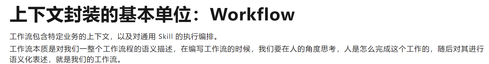
- 结构化输出和引用校验压制幻觉：M 遗漏的天键点 1. 结构化输出约束 (Structured Output) 金融场景最重要的事前手段之一: 强制模型输出JSON 格式，每个字段 (利率、条款编号、结论) 都有严格的类型和值域约束，数字字段直接从 RAG 原文抽取而间推算。这可以从根源上杜绝"上自行推算利率出
fe IX SSE ZI. OK 2.引用一致性自动校验 (Attribution Verification) 事中检测的核心: 对模型输出中每一名引用声明，用文本相似度或 NLI 模型自动比对原始检索文档，判断该句是否有文献驻撑。蚂蚁集团 HOP 框以中明确提出了"声明级别的溯源验证"。 OK 3. 置信度分级+ 人工审核路由 (SRP) 金融场景不能只靠自动化儿底，工业界标准是: 低置信和度 / 校验失败的案例强制路由至人工复炉，同时将这些样本沉泥为难例数据集，用于后续模型迭代。闪
  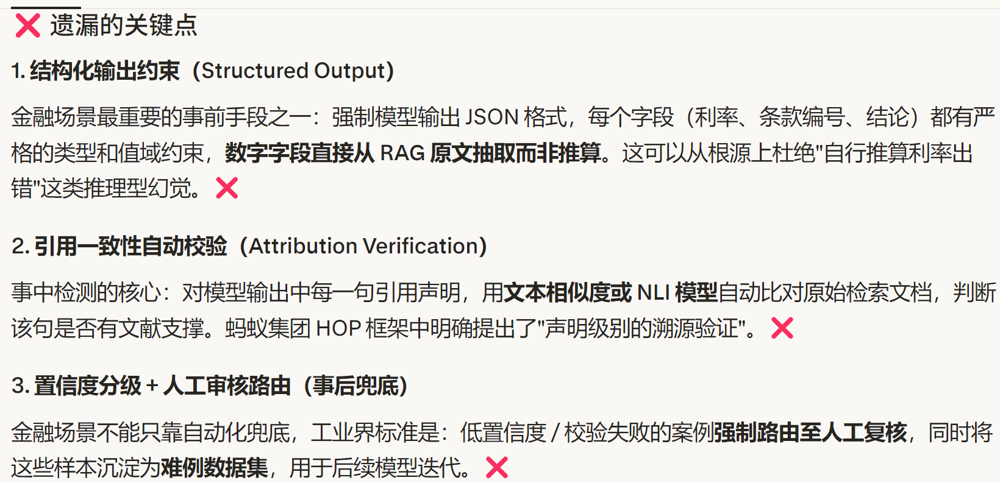
- RAG 专用 Prompt 约束回答来源：RAG专用Prompt结构设计
System Prompt User Prompt
角色定义参考文档
”金融保险智能客服格式化的检索片段回答规则 ee ee。 只用文档。 引用来源。 数字核实 ame
用户问题+回答指令负面约束 | , ie ~ Senn 用户的问题内容和具体的回答要求
RAG专用Prompt结构设计
  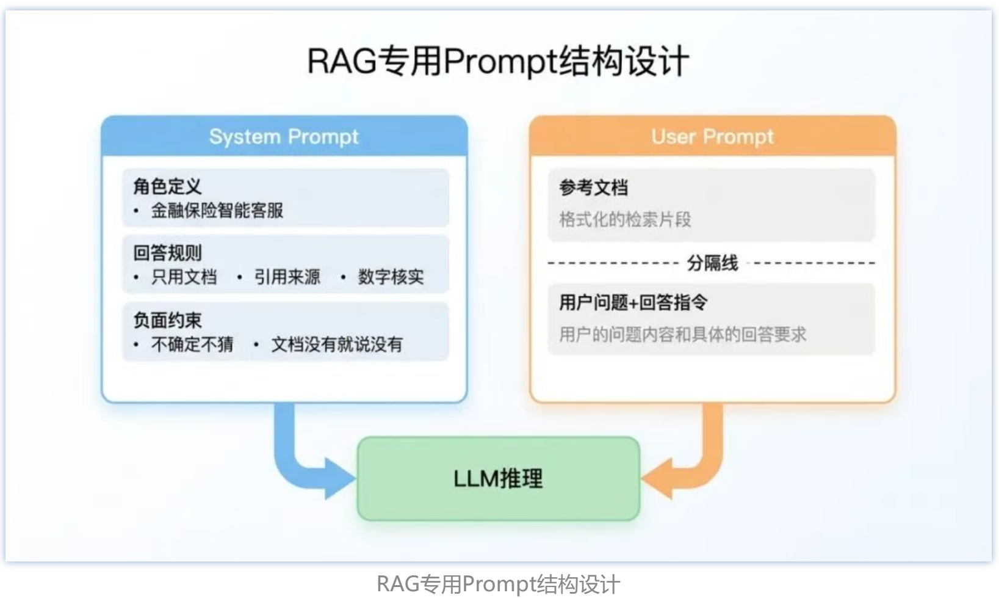
- MCP 三层结构区分 Host 和 Client：© 面试总结回到开头踩的雷，最大的问题是把 MCP 简单理解成 【Client + Server」 的二元结构，忽略了
Host 这个角色。
面试回答这道题，第一个要氮是三层结构要说清楚: 角色层 〈Host / Client / Server)、能万层 (Tools / Resources / Prompts)、协议层 〈JSON-RPC 2.0 + stdio / Streamable HTTP)。
特别是 Host 和 Client 的区别，Host 是牡主应用本身，Client 是 Host 内部负贡和 Server 通信的模块，一个 Host 可以同时连多个 Server，这个一对多的关系是 MCP 的核心设计。
第二个容易踩的雷是把 Server 暴露的能万全归为 【工具J。Tools、Resources、Prompts 三者职贡分明，Tools 有副作用、改变外部状态，Resources 是只读数据、没有副作用，Prompts 是提示词模板。面试时说清楚三者的区别，尤其是 Tools 和 Resources 的本质差异〈有无副作用)，会让面试官觉得你真正理解了 MCP 的设计意图，而不是只停留在表面。
第三个要提到的是协议层的解耘设计: 消息格式和传输方式是独立的，JSON-RPC 2.0 定义了消息长什么样，stdio 和 Streamable HTTP 定义了消息怎么传，两者互不耦合，这也是 MCP 灵活
  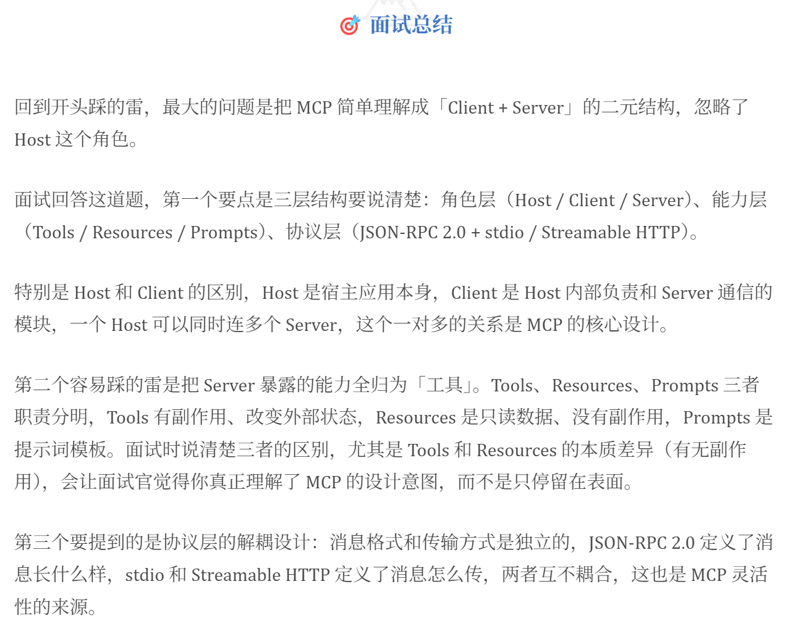
- MCP 由角色、能力、协议三层组成：° 口& &
一“ [|
角色层
Host Client Server
谁在通信核心概念: 角色定位、会话、权限边界
4 大 | @ SS
能万层 Tools Resources Prompts 三层独立演进暴露什么能万一 see
核心概念: 工具、资源、提示词、发现与描述解看设计
a 7 (2) stdio /
a { } sail fame (y) Streamable HTTP
协议层消息怎么传核心概念: 消息格式、传输方式、流式支持、错误处理
”MCP 不是一个东西，是三层职责明确的组合
  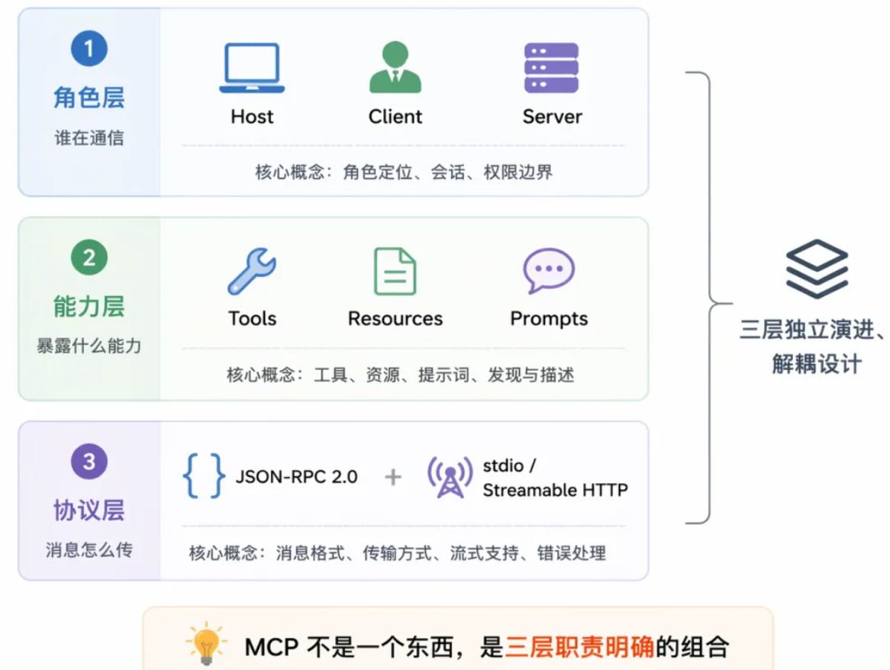
- Prompt 要明确工具调用边界：二。第二大核心:Prompt 上玉文没有约束好很多人写 Agent 的 System Prompt 是这样的:
“你是一个智能旅行助手，你可以使用以下工具.……请正确调用工具。 " 非常常见，但问题也非常致命:。 没告诉模型什么时候必须调用工具。 没告诉模型什么时候不能调用工具。 没要求模型必须先思考再调用。 没明确参数必须 JSON 格式且严格遵守 Schema。 没告诉它错误时要反思和修正简而言之: 模型不知道该怎么做决定，也不知道自己的决策怎么被评价。
  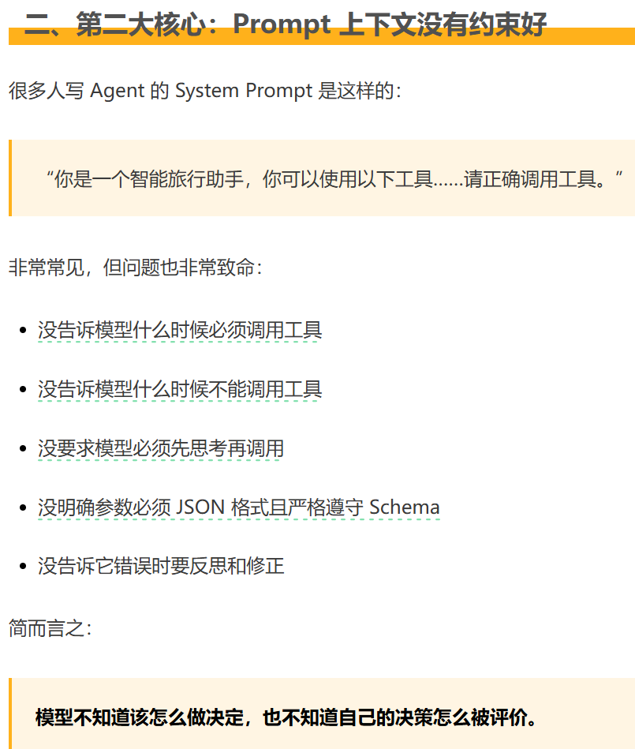
- 模型训练内存由参数梯度优化器组成：接下来，我们用LLaMA-6B 模型为例估算其大致需要的内存。
首先考虑精度对所需内人存的影响 :。 fp32 精度，一个参数需要 32 bits, 4 bytes.。 fp16 精度，一个参数需要 16 bits, 2 bytes.
e inti 精度，一个参数需要 8 bits, 1 byte.
其次，考虑模型需要的 RAM 大致分三个部分:。 梯度
e 模型参数: 等于参数量*每个参数所需内存。
对于fp32，LLaMA-6B 需要 6B*4 bytes = 24GBAN
对于 int8, LLaMA-6B 需要 6B*1 byte = 6GB。 梯度: 同上，等于参数量*每个梯度参数所需内人存。
e 优化器参数: 不同的优化器所储仓的参数量不同。
对于单用的 AdamW 来说，需要储存两倍的模型参数 (用来储存一阶和二阶momentum)。
e fp32 AY LLaMA-6B, AdamW 需要 6B*8 bytes = 48 GB e int8 AY LLaMA-6B, AdamW 需要 6B*2 bytes = 12 GB
除此之外，CUDA kernel 也会占据一些 RAM, AHL 1.3GB 左右，查看方式如下。
  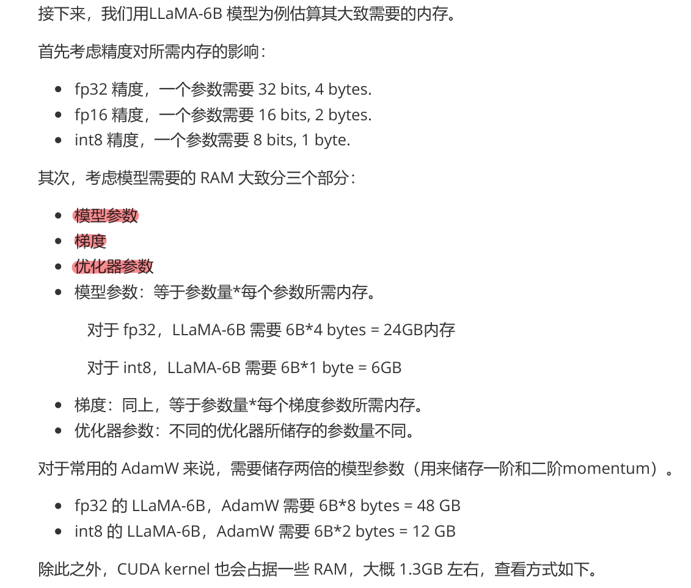
- Map-Reduce 处理长上下文评审：3.2.2 Map-Reduce长上下文处理智能CR推进落地过程中，出现了因为大MR或大规则集导致模型注意万不集中引起漏召甚至超出模型上下文窗口的问题，我们采用类似于Map-Reduce的分布式处理逻辑，将长上下文问题分解为拆分一处理一合并三个阶段。
MAP阶段 (拆分) PROCESS阶段 (处理) REDUCE阶段 (合并)
文件级分组上下文融合评论分类按文件路径分组，每个文件独立处理将拆分块上下文与原始上下文合并按类型分类 (安全性、性能、代码质量)
功能块识别评论生成相似度计算
AST解析，识别相关的函数、类、模块等逻辑单元规则引擎与大型语言模型(LLM)联合生成向量化，余弦相似度一> 一依赖分析中间结果聚类与合并
PNRM, Rae 每个分块的评论集合将相似评论归类，合并重复评论优先级排序按严重程度、价值密度排序
  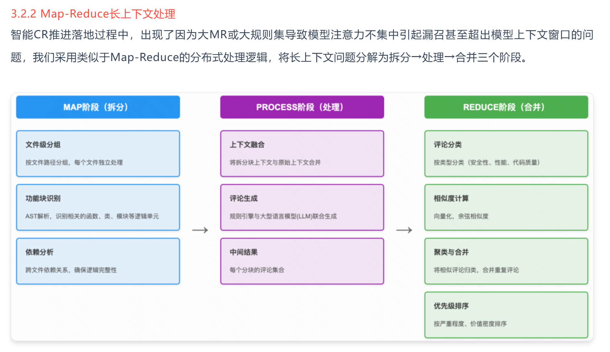
- 结构化输出技术路线各有取舍：当前，大语言模型结构化输出的技术生态已日趋成熟，从最初依赖于开发者经验的Prompt引导，发展到由模型原生支持的硬性接口化能万。每种技术路径都有其独特的优势和局限性，
适用于不同的应用场景和成本考量。下表对本报告中讨论的核心技术进行了综合比较，以期为读者在技术选型时提供决策参考。
  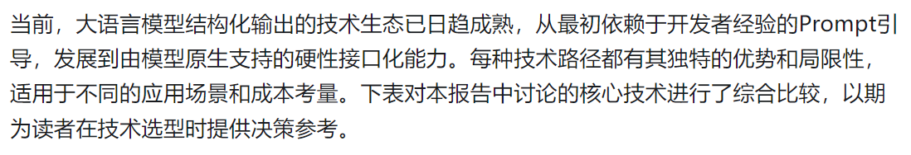
- 结构化输出从 Prompt 到硬约束演进：实可技术路、、 施 ”成典型应用
i 原理概述核心优势主要局限 nox SSR
度
acts) 通过Prompt提供软性指令无法保证100%的格式 @| 天和示物;引导模型生成特。 简单易用，零成本。 合规性，吻受模型随机低低 -，
导生成关键性任定格式， 性影响， 中 &
cope 在生成后对输出进行语法 — 需要额外的开发和计算容错性要验证修。 和内容验证，并进行修。 提供了,事后"保障，提。。 开销，无法解决根本问中中中， 求高的生复框架高了可靠性。
正。 题。 产环境在模型逐令牌生成时，通。。 100%保证语法合规中高精度数色天和过外部语法规则进行硬性性，从根本上解决非确 «= SERS: NRSRR mM.
约束。 定性问题。。 高代码生成
ay 在有标签数据集上训练，。。 永久性地改变入型行。 URINARY eon crt ERESRSRSES。 | 为,无需复杂Prompt。 | 害入(站高原"现象。 ~ | 高 | 高 See
通过奖励机制对输出进行 ligt en Ce, a a ae a a eC sie | SHERe. 务，能突破SFT高原。 RMS. 高，高，高，多步推理颈。 任务接口化。 将约束解码等能万抽象为。。 极大地简化开发流程，。 依束于特定模型供应人襄 ZaRe
能万 ”API，通过参数强制执行。。 实现端到端类型安全，。。 商，可控性有限。 | |
  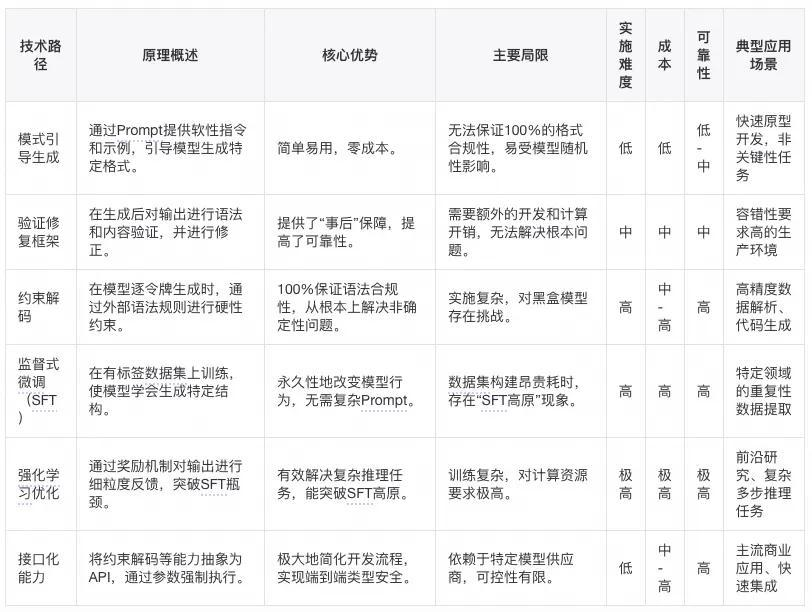
- AskUserQuestion 工具让提问显式暂停：我看到 Claude Code 团队内部工具的这段演进时，感觉还挺有意思。像这种需要在任务中途停下来问用户的场景，他们前后试了三种做法:
第一版: 给已有工具 (如 Bash) 加一个“auestion ” 参数，让 Claude 在调用工具时顺带提问。结果 Claude 大多数时候直接忽略这个参数，继续往下跑，根本不停下来问。
第二版: BK Claude 在输出里写特定 markdown 格式，外层解析到这个格式就暂停。问题是没有强制约束，Claude 经常"忘了"按格式写，提问逻辑非常胸弱。
第三版: 做成独立的“AskUserQuestion TH. Claude 想提问就必须显式调用它，调用即暂停，没有歧义。效果显著好于前两版。
下面这张图刚好能解释，为什么第三版明显更稳:
FINDING THE SWEET SPOT NO STRUCTURE TOO RIGID modified markdown AskUserQuestion ExitPlanTool output tool parameter model free but messy, structured + composable, plan already formed,
hard to format clear UI surface questions come too late
左边 (markdown 自由输出) 太松，模型格式随意、外层解析脆弱; 右边 (ExitPlanTool 参数) 太死，等到退出计划阶段提问已经太晚; “AskUserQuestion ”独立工具落在中间，结构化且随时可调用，是这三者里最稳定的设计。
说白了，既然你就是要 Claude 停下来问一句，那就直接给它一个专门的工具。加个 flag 或者约定一段输出格式，很多时候它一顺手就略过去了。
  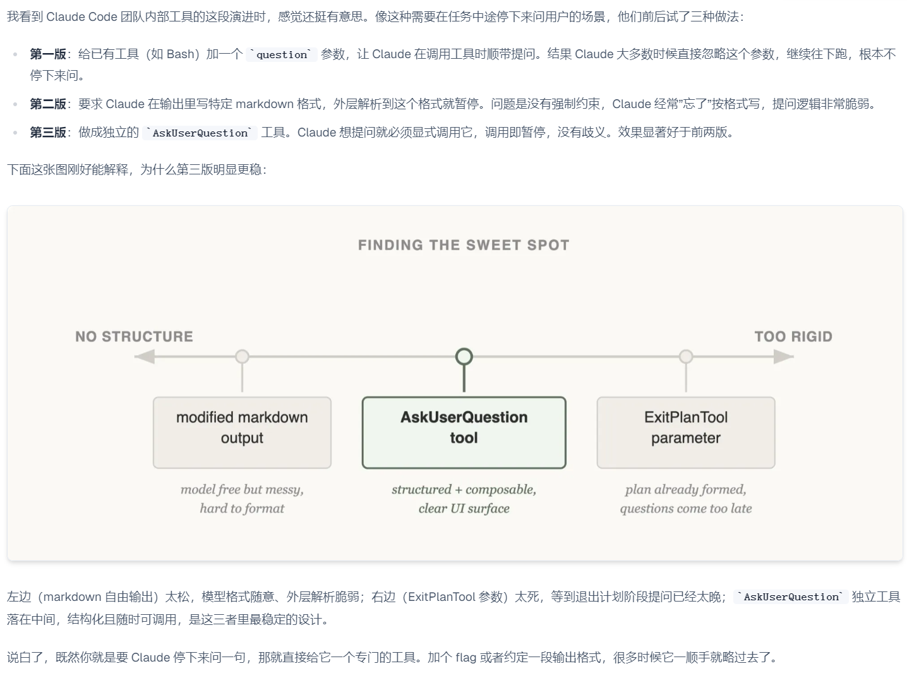
- Hooks 适合轻量阻断和自动化：当前支持的 Hook 点 CW WELT = -
个 ©
) /hooks Hooks 8 hooks
1. PreToolUse - Before tool execution
) 2. PostToolUse - After tool execution
3. PostToolUseFailure - After tool execution fails
4. Notification - When notifications are sent J’ 5. UserPromptSubmit - When the user submits a prompt
适合 vs 不适合放到 Hooks 的适合: 阻断修改受保护文件、Edit 后自动格式化/int/轻量校验、SessionStart 后注入动态上下文 (Git 分支、环境变量)、任务完成后推送通知。
不适合: 需要读大量上下文的复杂语义判断、长时间运行的业务流程、需要多步推理和权衡的决策，这些该在 Skill 或Subagent 里。
  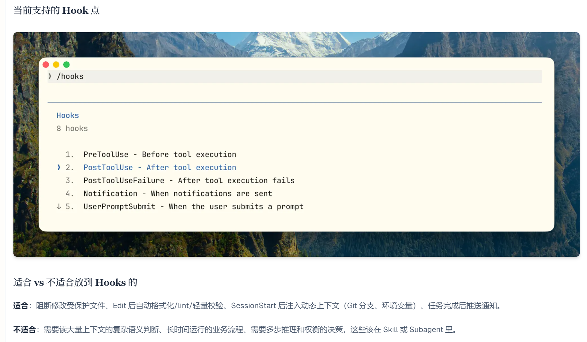
- Memory 注入在 system prompt 中前部：| 二、注入位置: system prompt 的第十段，在 CLAUDE.md 之前知道了"在 REPL 局动时注入"，下一个问题是: 注入在 system_prompt 的哪个位置? 对应源码: Lbuilder.py:74-135 |， 函数里有完整的 system_prompt Hee
辑，Memory 段落排在第 10 段。具体顺序是: 系统核心指令一环境信息一工具摘述 = — Memory ~ CLAUDE md 一其余动态段落为什么这个位置重要”大量实验表明，LLM 对 system prompt 不同位置的内容关注度是不均匀的，靠近开头和结尾的内容通常有更高的注意万权重，中间位置的内容容易在长上下文里被稀释。Memory 排在第 10 段，紧接在工具描述之后、用户项目配置之前，属于
system_prompt 的中前部，能确保模型在规划行动时能有效读取记忆内容。 排在 Memory 之后的 CLAUDE.md 是用户的项目级指令 (比如 "这个项目用 TypeScript, &
数命名用驼峰")，它的优先级比 Memory 高，如果 Memory 里记着"用户喜欢用单引号"，但
CLAUDE.md 里写了"统一用双引号"，模型会优先遵从 CLAUDE.md 的指令。这是一个合理的设计: 项目级的明确约定应该覆盖历史偏好。
  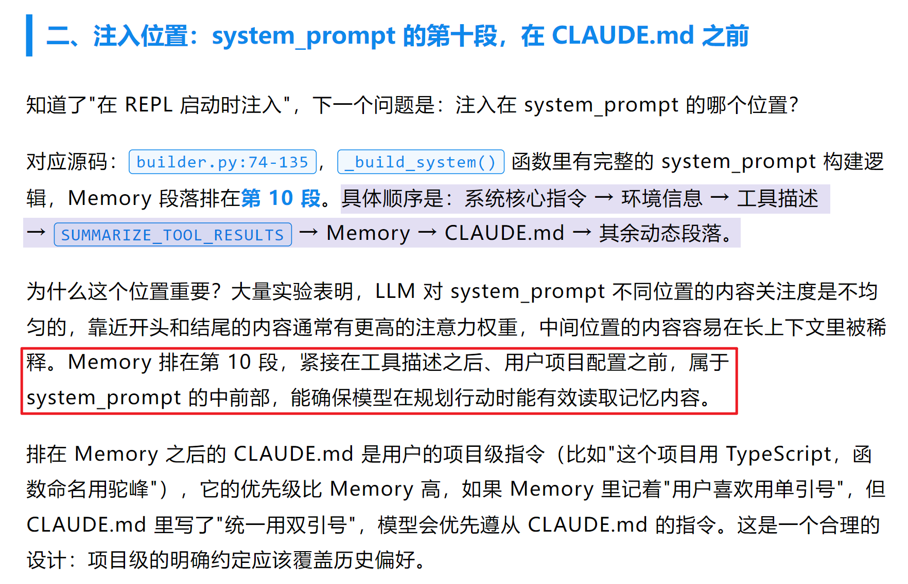
- Claude Code 用提示和工具双层防御：所以 Claude Code 用了双层防御:
提示词层， 告诉模型必须先读 O THE: 真的检查有没有读过这是一个非常重要的设计模式: 前置条件强制。
  

## 证据表

| evidence_id | 类型 | OneNote 页面 | 原链接 | 图片 | 摘要片段 |
|---|---|---|---|---|---|
| agent_img_001_014_65226eff0183 | onenote_image | Agent |  |  | Workflow 封装业务上下文和编排: 土十斗士 ~。
上下文封妆的基本单位: Workflow
工作流包含特定业务的上下文，以及对通用 Skill 的执行编排。
工作流本质是对我们一整个工作流程的语义描述，在编写工作流的时候，我们要在人的角度思考，人是怎么完成这个工作的，随后对其进行语义化表述，就是我们的工作流。 |
| agent_img_001_017_29006a1055a1 | onenote_image | Agent |  |  | 结构化输出和引用校验压制幻觉: M 遗漏的天键点 1. 结构化输出约束 (Structured Output) 金融场景最重要的事前手段之一: 强制模型输出JSON 格式，每个字段 (利率、条款编号、结论) 都有严格的类型和值域约束，数字字段直接从 RAG 原文抽取而间推算。这可以从根源上杜绝"上自行推算利率出
fe IX SSE ZI. OK 2.引用一致性自动校验 (Attribution Verification) 事中检测的核心: 对模型输出中每一名引用声明，用文本相似度或 NLI 模型自动比对原始检索文档，判断该句是否有文献驻撑。蚂蚁集团 HOP 框以中明确提出了"声明级别的溯源验证"。 OK 3. 置信度分级+ 人工审核路由 (SRP) 金融场景不能只靠自动化儿底，工业界标准是: 低置信和度 / 校验失败的案例强制路由至人工复炉，同时将这些样本沉泥为难例数据集，用于后续模型迭代。闪 |
| agent_img_001_019_e69b9d279a6c | onenote_image | Agent | [source](https://mp.weixin.qq.com/s/8GKYJtG3SZDA_8KTN55ThQ) |  | RAG 专用 Prompt 约束回答来源: RAG专用Prompt结构设计
System Prompt User Prompt
角色定义参考文档
”金融保险智能客服格式化的检索片段回答规则 ee ee。 只用文档。 引用来源。 数字核实 ame
用户问题+回答指令负面约束 | , ie ~ Senn 用户的问题内容和具体的回答要求
RAG专用Prompt结构设计 |
| agent_img_002_018_21ba6bfa8425 | onenote_image | RAG | [source](https://mp.weixin.qq.com/s/8bI19Vfn-5Kqpwp0Yg1kdg) |  | MCP 三层结构区分 Host 和 Client: © 面试总结回到开头踩的雷，最大的问题是把 MCP 简单理解成 【Client + Server」 的二元结构，忽略了
Host 这个角色。
面试回答这道题，第一个要氮是三层结构要说清楚: 角色层 〈Host / Client / Server)、能万层 (Tools / Resources / Prompts)、协议层 〈JSON-RPC 2.0 + stdio / Streamable HTTP)。
特别是 Host 和 Client 的区别，Host 是牡主应用本身，Client 是 Host 内部负贡和 Server 通信的模块，一个 Host 可以同时连多个 Server，这个一对多的关系是 MCP 的核心设计。
第二个容易踩的雷是把 Server 暴露的能万全归为 【工具J。Tools、Resources、Prompts 三者职贡分明，Tools 有副作用、改变外部状态，Resources 是只读数据、没有副作用，Prompts 是提示词模板。面试时说清楚三者的区别，尤其是 Tools 和 Resources 的本质差异〈有无副作用)，会让面试官觉得你真正理解了 MCP 的设计意图，而不是只停留在表面。
第三个要提到的是协议层的解耘设计: 消息格式和传输方式是独立的，JSON-RPC 2.0 定义了消息长什么样，stdio 和 Streamable HTTP 定义了消息怎么传，两者互不耦合，这也是 MCP 灵活 |
| agent_img_002_019_6a3f08dd5a27 | onenote_image | RAG | [source](https://mp.weixin.qq.com/s/8bI19Vfn-5Kqpwp0Yg1kdg) |  | MCP 由角色、能力、协议三层组成: ° 口& &
一“ [|
角色层
Host Client Server
谁在通信核心概念: 角色定位、会话、权限边界
4 大 | @ SS
能万层 Tools Resources Prompts 三层独立演进暴露什么能万一 see
核心概念: 工具、资源、提示词、发现与描述解看设计
a 7 (2) stdio /
a { } sail fame (y) Streamable HTTP
协议层消息怎么传核心概念: 消息格式、传输方式、流式支持、错误处理
”MCP 不是一个东西，是三层职责明确的组合 |
| agent_img_007_001_e34249d9df55 | onenote_image | 提示词 | [source](https://mp.weixin.qq.com/s/uU5Q8K2hYpqsc0PDxoyFUQ) |  | Prompt 要明确工具调用边界: 二。第二大核心:Prompt 上玉文没有约束好很多人写 Agent 的 System Prompt 是这样的:
“你是一个智能旅行助手，你可以使用以下工具.……请正确调用工具。 " 非常常见，但问题也非常致命:。 没告诉模型什么时候必须调用工具。 没告诉模型什么时候不能调用工具。 没要求模型必须先思考再调用。 没明确参数必须 JSON 格式且严格遵守 Schema。 没告诉它错误时要反思和修正简而言之: 模型不知道该怎么做决定，也不知道自己的决策怎么被评价。 |
| agent_img_009_002_7af3c22a8eaf | onenote_image | 杂项 |  |  | 模型训练内存由参数梯度优化器组成: 接下来，我们用LLaMA-6B 模型为例估算其大致需要的内存。
首先考虑精度对所需内人存的影响 :。 fp32 精度，一个参数需要 32 bits, 4 bytes.。 fp16 精度，一个参数需要 16 bits, 2 bytes.
e inti 精度，一个参数需要 8 bits, 1 byte.
其次，考虑模型需要的 RAM 大致分三个部分:。 梯度
e 模型参数: 等于参数量*每个参数所需内存。
对于fp32，LLaMA-6B 需要 6B*4 bytes = 24GBAN
对于 int8, LLaMA-6B 需要 6B*1 byte = 6GB。 梯度: 同上，等于参数量*每个梯度参数所需内人存。
e 优化器参数: 不同的优化器所储仓的参数量不同。
对于单用的 AdamW 来说，需要储存两倍的模型参数 (用来储存一阶和二阶momentum)。
e fp32 AY LLaMA-6B, AdamW 需要 6B*8 bytes = 48 GB e int8 AY LLaMA-6B, AdamW 需要 6B*2 bytes = 12 GB
除此之外，CUDA kernel 也会占据一些 RAM, AHL 1.3GB 左右，查看方式如下。 |
| agent_img_009_003_61e2922ef802 | onenote_image | 杂项 | [source](https://www.bestblogs.dev/article/288cbab6) |  | Map-Reduce 处理长上下文评审: 3.2.2 Map-Reduce长上下文处理智能CR推进落地过程中，出现了因为大MR或大规则集导致模型注意万不集中引起漏召甚至超出模型上下文窗口的问题，我们采用类似于Map-Reduce的分布式处理逻辑，将长上下文问题分解为拆分一处理一合并三个阶段。
MAP阶段 (拆分) PROCESS阶段 (处理) REDUCE阶段 (合并)
文件级分组上下文融合评论分类按文件路径分组，每个文件独立处理将拆分块上下文与原始上下文合并按类型分类 (安全性、性能、代码质量)
功能块识别评论生成相似度计算
AST解析，识别相关的函数、类、模块等逻辑单元规则引擎与大型语言模型(LLM)联合生成向量化，余弦相似度一> 一依赖分析中间结果聚类与合并
PNRM, Rae 每个分块的评论集合将相似评论归类，合并重复评论优先级排序按严重程度、价值密度排序 |
| agent_img_009_009_fd719d4b2dcf | onenote_image | 杂项 |  |  | 结构化输出技术路线各有取舍: 当前，大语言模型结构化输出的技术生态已日趋成熟，从最初依赖于开发者经验的Prompt引导，发展到由模型原生支持的硬性接口化能万。每种技术路径都有其独特的优势和局限性，
适用于不同的应用场景和成本考量。下表对本报告中讨论的核心技术进行了综合比较，以期为读者在技术选型时提供决策参考。 |
| agent_img_009_010_1123d496a7e0 | onenote_image | 杂项 |  |  | 结构化输出从 Prompt 到硬约束演进: 实可技术路、、 施 ”成典型应用
i 原理概述核心优势主要局限 nox SSR
度
acts) 通过Prompt提供软性指令无法保证100%的格式 @| 天和示物;引导模型生成特。 简单易用，零成本。 合规性，吻受模型随机低低 -，
导生成关键性任定格式， 性影响， 中 &
cope 在生成后对输出进行语法 — 需要额外的开发和计算容错性要验证修。 和内容验证，并进行修。 提供了,事后"保障，提。。 开销，无法解决根本问中中中， 求高的生复框架高了可靠性。
正。 题。 产环境在模型逐令牌生成时，通。。 100%保证语法合规中高精度数色天和过外部语法规则进行硬性性，从根本上解决非确 «= SERS: NRSRR mM.
约束。 定性问题。。 高代码生成
ay 在有标签数据集上训练，。。 永久性地改变入型行。 URINARY eon crt ERESRSRSES。 | 为,无需复杂Prompt。 | 害入(站高原"现象。 ~ | 高 | 高 See
通过奖励机制对输出进行 ligt en Ce, a a ae a a eC sie | SHERe. 务，能突破SFT高原。 RMS. 高，高，高，多步推理颈。 任务接口化。 将约束解码等能万抽象为。。 极大地简化开发流程，。 依束于特定模型供应人襄 ZaRe
能万 ”API，通过参数强制执行。。 实现端到端类型安全，。。 商，可控性有限。 | | |
| agent_img_010_005_772065f10bc8 | onenote_image | Claude code | [source](https://www.bestblogs.dev/article/5c79977a) |  | AskUserQuestion 工具让提问显式暂停: 我看到 Claude Code 团队内部工具的这段演进时，感觉还挺有意思。像这种需要在任务中途停下来问用户的场景，他们前后试了三种做法:
第一版: 给已有工具 (如 Bash) 加一个“auestion ” 参数，让 Claude 在调用工具时顺带提问。结果 Claude 大多数时候直接忽略这个参数，继续往下跑，根本不停下来问。
第二版: BK Claude 在输出里写特定 markdown 格式，外层解析到这个格式就暂停。问题是没有强制约束，Claude 经常"忘了"按格式写，提问逻辑非常胸弱。
第三版: 做成独立的“AskUserQuestion TH. Claude 想提问就必须显式调用它，调用即暂停，没有歧义。效果显著好于前两版。
下面这张图刚好能解释，为什么第三版明显更稳:
FINDING THE SWEET SPOT NO STRUCTURE TOO RIGID modified markdown AskUserQuestion ExitPlanTool output tool parameter model free but messy, structured + composable, plan already formed,
hard to format clear UI surface questions come too late
左边 (markdown 自由输出) 太松，模型格式随意、外层解析脆弱; 右边 (ExitPlanTool 参数) 太死，等到退出计划阶段提问已经太晚; “AskUserQuestion ”独立工具落在中间，结构化且随时可调用，是这三者里最稳定的设计。
说白了，既然你就是要 Claude 停下来问一句，那就直接给它一个专门的工具。加个 flag 或者约定一段输出格式，很多时候它一顺手就略过去了。 |
| agent_img_010_006_91f3a9315fd6 | onenote_image | Claude code | [source](https://www.bestblogs.dev/article/5c79977a) |  | Hooks 适合轻量阻断和自动化: 当前支持的 Hook 点 CW WELT = -
个 ©
) /hooks Hooks 8 hooks
1. PreToolUse - Before tool execution
) 2. PostToolUse - After tool execution
3. PostToolUseFailure - After tool execution fails
4. Notification - When notifications are sent J’ 5. UserPromptSubmit - When the user submits a prompt
适合 vs 不适合放到 Hooks 的适合: 阻断修改受保护文件、Edit 后自动格式化/int/轻量校验、SessionStart 后注入动态上下文 (Git 分支、环境变量)、任务完成后推送通知。
不适合: 需要读大量上下文的复杂语义判断、长时间运行的业务流程、需要多步推理和权衡的决策，这些该在 Skill 或Subagent 里。 |
| agent_img_010_023_d582b70d06a2 | onenote_image | Claude code | [source](https://mp.weixin.qq.com/s/TYNg6RT79DHW8n8LxP8Rag) |  | Memory 注入在 system prompt 中前部: | 二、注入位置: system prompt 的第十段，在 CLAUDE.md 之前知道了"在 REPL 局动时注入"，下一个问题是: 注入在 system_prompt 的哪个位置? 对应源码: Lbuilder.py:74-135 |， 函数里有完整的 system_prompt Hee
辑，Memory 段落排在第 10 段。具体顺序是: 系统核心指令一环境信息一工具摘述 = — Memory ~ CLAUDE md 一其余动态段落为什么这个位置重要”大量实验表明，LLM 对 system prompt 不同位置的内容关注度是不均匀的，靠近开头和结尾的内容通常有更高的注意万权重，中间位置的内容容易在长上下文里被稀释。Memory 排在第 10 段，紧接在工具描述之后、用户项目配置之前，属于
system_prompt 的中前部，能确保模型在规划行动时能有效读取记忆内容。 排在 Memory 之后的 CLAUDE.md 是用户的项目级指令 (比如 "这个项目用 TypeScript, &
数命名用驼峰")，它的优先级比 Memory 高，如果 Memory 里记着"用户喜欢用单引号"，但
CLAUDE.md 里写了"统一用双引号"，模型会优先遵从 CLAUDE.md 的指令。这是一个合理的设计: 项目级的明确约定应该覆盖历史偏好。 |
| agent_img_010_031_94b80bbf7ca5 | onenote_image | Claude code |  |  | Claude Code 用提示和工具双层防御: 所以 Claude Code 用了双层防御:
提示词层， 告诉模型必须先读 O THE: 真的检查有没有读过这是一个非常重要的设计模式: 前置条件强制。 |

## 后续人工补充建议

- 将稳定理解写入 `wiki_manual/`，不要直接修改本文件。
- 已有关联审校页：查看 `wiki_manual/` 下对应主题。
