# RAG 与检索增强

<!-- generated: do not hand-edit this file; put durable notes in ../wiki_manual/ -->

## 自动摘要

围绕 RAG、GraphRAG、LightRAG、知识库构建、检索策略、chunk 和评测的材料集合。

- 证据数量：45 条，其中图片 38 条、文本链接 7 条。
- 涉及 OneNote 页面：Agent, Claude code, RAG, RAGAS评估与Doc2Query, 杂项。

## 关键要点

- RAG 幻觉来自生成阶段补全：|一、幻觉问题: MENT, BSE 这是 RAG 生成阶段最致命的问题。你明明检索到了正确的文档片段，喂给了大模型，但模型生成的回答里居然出现了文档中根本不存在的信息。 为什么会这样?”因为大模型的本质是"续写"——它会基于自己在预训练阶段学到的知识来补全内容。当检索到的上下文不够明确、或者模型对某个话题有"先入为主"的知识时，它就可能混入自己编造的内容，而不是老老实实只用你提供的资料。 在我们训练曹的实战项目中，金融保险场景下这个问题尤其严重。用户问"ABC寿险的保障学围"，
检索到的文档明确写了"涵盖身故、全残保障，附加重大疾病险"，但模型有时会自行补充一句 "还包含住院津贴保障`——这个内容根本不在检索到的文档里，纯粹是模型自己编的。在金融场景下，这种幻觉可能导致严重的合规风险。这也是我在训练营里反复提醒的: 幻觉不是小概率事件，而是
LLM 的天性，必须主动压制。
  
- 记忆模块是第二检索源：| 一、记忆模块在 RAG 里到底扮演什么角色? 很多人把"记忆”简单理解为"把对话历史塞进 Prompt"，这只是最初级的做法。 一个完整的记忆模块，本质上是 RAG 系统的第二个检索源。| 第一个检索源是知识库 (静态的、所有用户共享的)，第二个检索源是记忆库 (动态的、跟特定用户/会话绑定的)。 引入记忆模块后，系统的数据流变成了这样: 用户查询进来一同时从知识库检索静态知识、从记忆库检索历史上下文一融合两路信息一 LLM 生成回答一新一轮对话写入记忆库。 这个循环让系统具备了"越聊越介你"的能万。客服场景里，系统记住了用户之前提过的保单信息，
就不用让用户每次都重复报保单号;个人助理场景里，系统记住了用户的饮食偏好，推荐餐厅时就能自动避开不合适的。
  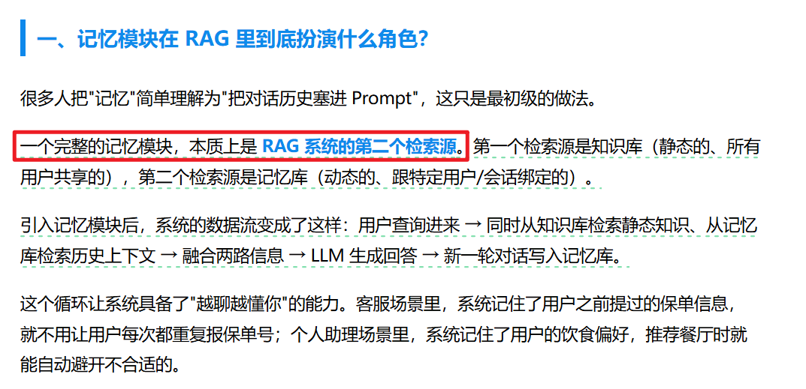
- HyDE 用假设答案增强检索：| “HyDE® 感觉比较费万" 这位朋友说的没错，HyDE 确实有成本。 回顾一下 HyDE 的思路: 让 LLM 先根据 query 生成一个"假设的理想回答"，再用这个回答的
Embedding 去检索，而不是直接用 query 的 Embedding。好处是假设文档比短 query 语义更丰富，检索效果更好。 但代价也很明显: 每次检索前要多一次 LLM 调用。 这意味着额外的延迟 〈几百毫秒到几秒) 和额外的 API 费用。对于响应速度敏感的在线场景，这个代价可能不划算。 我的建议是: HyDE 不是默认开启的功能，而是针对特定场景的增强策略。 什么时候用 HyDE? 当你的 query 特别短、特别模糊，直接检索效果很差的时候。比如用户只输入了"退保"两个字，向量检索不知道他想问退保流程、退保费用还是退保条件，召回一堆不相关内容。这时候让 LLM 先生成一段关于人退保的完整回答，再用这段回答去检索，效果会好很多。
什么时候不用?”当 query 本身已经足够清晰完整 (比如"2024年车险理赔需要提交哪些材料")，直接检索就能命中，没必要多花一次 LLM 调用。 工程上的做法是: 先用一个简单的 query 分类器判断当前 query 是否"模糊/过短"，只对这部分
query 启用 HyDE。其他情况走正常检索流程。这样既能在需要的时候提升效果，又不会拖慢整体响应速度。
  
- RAG 权限控制分三层过滤：| 三屋权限控制架构一 — o RAGRA= Wi mF MEY (Pwrrotennamemeratian [>| © ancateniit RE: 向量数据库过滤 |
RY | 局 wivus元数据过滤(expr条件) = > 目目分区物理隔 i 返回层: 二次验证请求 RAG系统三层权限控制以构
  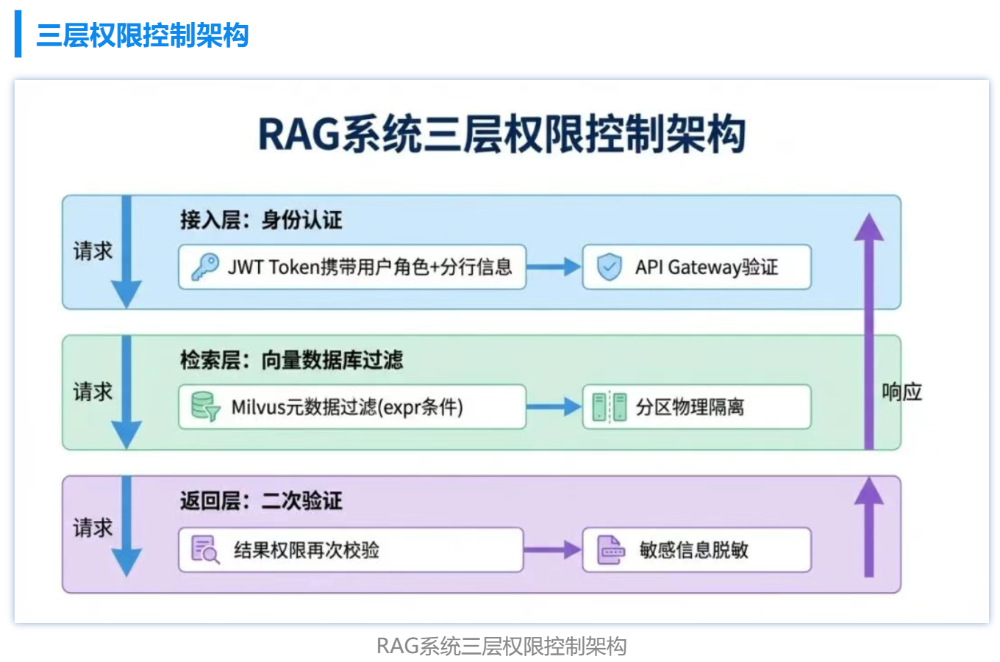
- 不同查询应路由到不同链路：| 一、为什么不能所有 query 都走同一条路? 在我们训练膏的金融保险实战项目里，用户的问题类型非溃杂: 有的是事实型查询——"A 款保险的保障光围是什么)”“，这种直接去知识库检索束行。 有的是计算型查询——"我投保了 50 万，免赔额 5000，这次理赔能拿多少? "，这种需要路由到计算异块，而不是检索。 有的是数据库查询——"上个月理赔审批的平均时长是多少天?"，这种需要走 NL2SQL“，把自然语言转成数据库碍询语句。 有的是带时间约束的查询——"最新的车险理赔流程是什么)“"“，这种虽然走检索，但需要加时间过有的是闲聊——"今天天和气怎么样? "，这种根本不该进 RAG 流程。 如果你把所有 query 都一股脑丢进向量检索，会出现两种乾众情况: 一是该算的不算 (计算题去检索文档，拿回来的是理赔政策而不是计算结果)，二是该过滤的不过滤 (要最新流程却召回了旧版本，因为语义检索不理解"最新"这个约束)。
  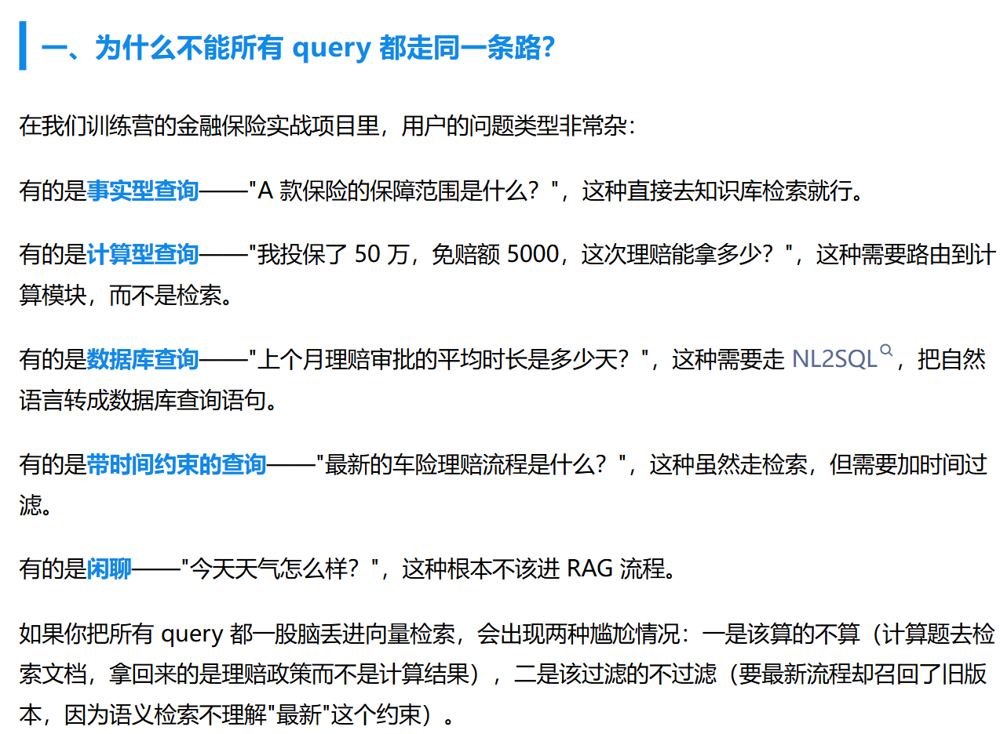
- RAG Prompt 限制模型只用文档：RAG Prompt 的逻辑完全不同: 你传进去问题 + 检索到的文档片段，要求模型只用这些文档片段来回答，不能用参数台识。 这里有一个根本性的矛盾: LLM 在预训练阶段见过海量文本，脑子里已经仔了大量燥识。当你给它一段检索文档，问它问题，它的默认行为是: 把检索文档的信息和自己的参数知识混合使用。
  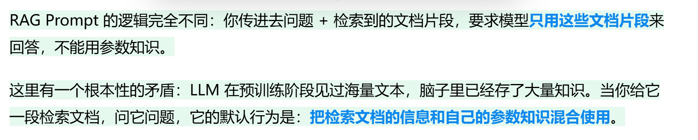
- GraphRAG、LightRAG、PathRAG 对比：特性 GraphRAG LightRAG PathRAG
子图/社区检索: 利用社区检测 ” 双阶段检索: 结合快速的局部检索和深 BARR: 使用基于流的剪枝算法识检索机制算法找到相关社区，并聚合其所 ”入的全局检索。 别并提取最相关的关系路径。
有信息。
将整个相关社区或子图的信息在保证效率的前提下，从图中检索相关 ”将检索出的关系路径转换为文本，作信息处理方式 (可能包含大量节点和边) 进行 ”信息片段。 为上下文提供给生成模型。
RA.
1. BMPR: 擅长发现群体社 1. RRBM: 在速度和深度间取得平 1. WHBIRKAK: 能更好地理解实区和全局趋势。 衡。 体间的复杂联系。
2，信息全面: 提供整个社区的 2.计算轻量: 兼顾了性能和效率。 2. MORE: 有效过滤宛余信息，
背景信息。 提升答案质量。
1. BAR: 可能包含大量不”1， 深度可能不足: 为避免元余而可能路径提取算法可能复杂，且依赖路径相关信息，引入噪声。 牺牲对复杂关系的深度探索。 的质量和覆盖度。
MESS 5 推理深度不足: 可能忽略复。 2，仍有关键信息遗漏的风险。
杂的多跳关系路径。
适用场景需要宏观分析、社区发现和趋势 “对响应速度和检索效率有较高要求的实 ”需要精确理解实体间复杂关系和多中概括的总结性任务。 时应用场景。 推理的问答任务。
  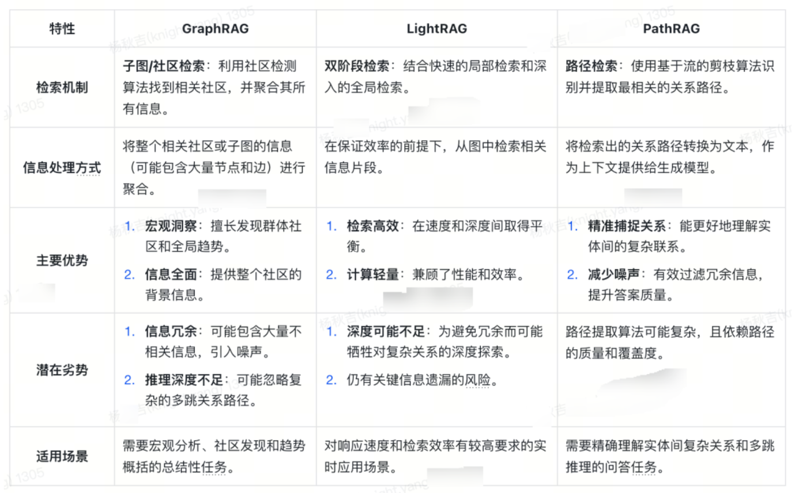
- Badcase 闭环提升系统准确率：一个可以审到面试里用的答题框以: "我们建立了三路badcase收集渠道 (用户反馈、客服工单、目动检测)，用四分类框以(检索失败、幻觉生成、路由错误、知识缺失) 对badcase分类，按类型分配给对应团队处理。每次修复之后，先企原badcase上验证通过，再跑全量回归测试，确认三个核心指标没有退化超过2%，最后通过107%灰硫友布上线。6个月的实践证明，这套机制把系统准确率从76%提升到了8976。 "
  
- RAG 幻觉来自生成阶段补全：|一、幻觉问题: MENT, BSE 这是 RAG 生成阶段最致命的问题。你明明检索到了正确的文档片段，喂给了大模型，但模型生成的回答里居然出现了文档中根本不存在的信息。 为什么会这样?”因为大模型的本质是"续写"——它会基于自己在预训练阶段学到的知识来补全内容。当检索到的上下文不够明确、或者模型对某个话题有"先入为主"的知识时，它就可能混入自己编造的内容，而不是老老实实只用你提供的资料。 在我们训练曹的实战项目中，金融保险场景下这个问题尤其严重。用户问"ABC寿险的保障学围"，
检索到的文档明确写了"涵盖身故、全残保障，附加重大疾病险"，但模型有时会自行补充一句 "还包含住院津贴保障`——这个内容根本不在检索到的文档里，纯粹是模型自己编的。在金融场景下，这种幻觉可能导致严重的合规风险。这也是我在训练营里反复提醒的: 幻觉不是小概率事件，而是
LLM 的天性，必须主动压制。
  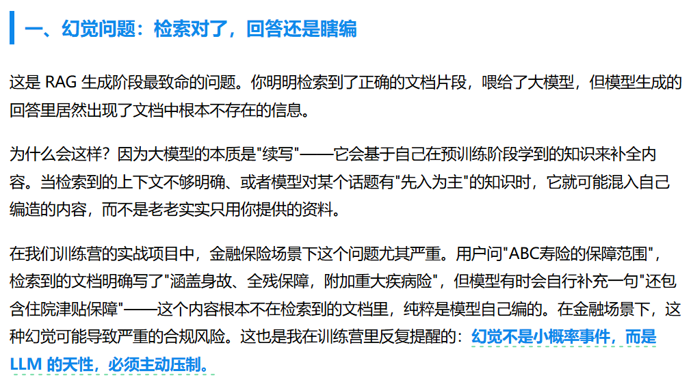
- 记忆模块是第二检索源：| 一、记忆模块在 RAG 里到底扮演什么角色? 很多人把"记忆”简单理解为"把对话历史塞进 Prompt"，这只是最初级的做法。 一个完整的记忆模块，本质上是 RAG 系统的第二个检索源。| 第一个检索源是知识库 (静态的、所有用户共享的)，第二个检索源是记忆库 (动态的、跟特定用户/会话绑定的)。 引入记忆模块后，系统的数据流变成了这样: 用户查询进来一同时从知识库检索静态知识、从记忆库检索历史上下文一融合两路信息一 LLM 生成回答一新一轮对话写入记忆库。 这个循环让系统具备了"越聊越介你"的能万。客服场景里，系统记住了用户之前提过的保单信息，
就不用让用户每次都重复报保单号;个人助理场景里，系统记住了用户的饮食偏好，推荐餐厅时就能自动避开不合适的。
  
- HyDE 用假设答案增强检索：| “HyDE® 感觉比较费万" 这位朋友说的没错，HyDE 确实有成本。 回顾一下 HyDE 的思路: 让 LLM 先根据 query 生成一个"假设的理想回答"，再用这个回答的
Embedding 去检索，而不是直接用 query 的 Embedding。好处是假设文档比短 query 语义更丰富，检索效果更好。 但代价也很明显: 每次检索前要多一次 LLM 调用。 这意味着额外的延迟 〈几百毫秒到几秒) 和额外的 API 费用。对于响应速度敏感的在线场景，这个代价可能不划算。 我的建议是: HyDE 不是默认开启的功能，而是针对特定场景的增强策略。 什么时候用 HyDE? 当你的 query 特别短、特别模糊，直接检索效果很差的时候。比如用户只输入了"退保"两个字，向量检索不知道他想问退保流程、退保费用还是退保条件，召回一堆不相关内容。这时候让 LLM 先生成一段关于人退保的完整回答，再用这段回答去检索，效果会好很多。
什么时候不用?”当 query 本身已经足够清晰完整 (比如"2024年车险理赔需要提交哪些材料")，直接检索就能命中，没必要多花一次 LLM 调用。 工程上的做法是: 先用一个简单的 query 分类器判断当前 query 是否"模糊/过短"，只对这部分
query 启用 HyDE。其他情况走正常检索流程。这样既能在需要的时候提升效果，又不会拖慢整体响应速度。
  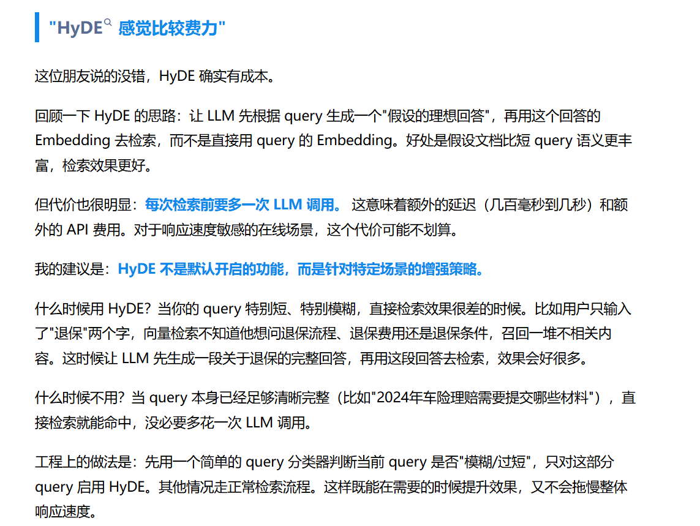
- RAG 权限控制分三层过滤：| 三屋权限控制架构一 — o RAGRA= Wi mF MEY (Pwrrotennamemeratian [>| © ancateniit RE: 向量数据库过滤 |
RY | 局 wivus元数据过滤(expr条件) = > 目目分区物理隔 i 返回层: 二次验证请求 RAG系统三层权限控制以构
  
- 智能 Overlap 提升 Chunk 召回：在 100 token 的基础上，我还加了一个优化: 基于句子边界的智能 overlap,
固定 overlap 有个问题: 可能恰好切在句子中间，上一个 chunk 的最后一段话只保留了半句。智能
overlap 在确定重晋区域后，向后扫摘到最近的句子结尾才真正规上断。
效果: 避免了 87% 的"句子在 overlap 区域被截断" 问题，召回率从 0.89 进一步提升到 0.91。
RAG Chunk 切分方案演进
V1 固定长度切分 Recall@5: 0.67 关键改进:
512 token固定截断 +24%
提升 © D 文档层级识别
+ @ 表格表头保留
V2 句子级切分 + @ 列表前导句不丢句子边界不截断 * @ 100 token智能Overlap V3 语义感知切分 Recall@5: 0.91
结构识别+智能Overlap RAG 三代切分方案召回率对比
  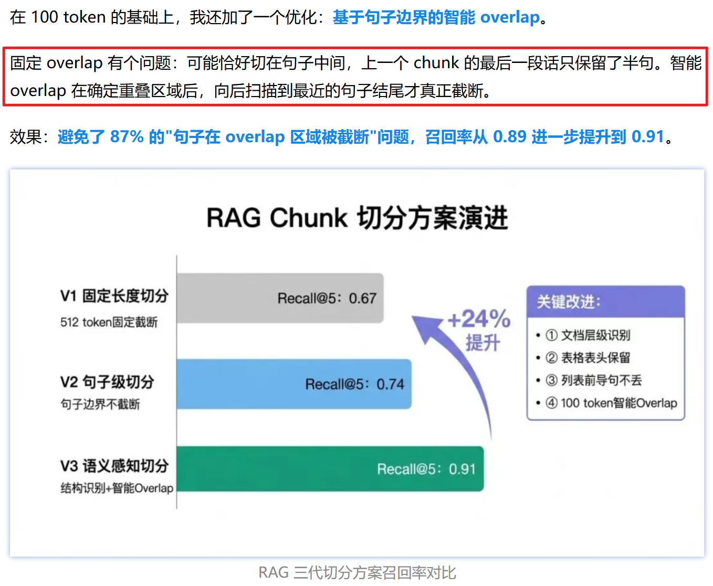
- Reranker 后需设置相关性阈值：|四、相似度阔值过滤: PRB 有了 Reranker 之后，还有一个常被忽略的细节: BBW. Reranker 给每条文档打了一个 0-1 的相关性分数，并按分数取 Top-K。但如果所有候选文档的相关性分数都很低，即使取了 Top-5，这 5 条文档也可能是噪声。此时强行把它们送给
LLM, LLM 会基于这些低质量的上下文生成回答，结果往往是幻觉。 正确的做法是在 Reranker 打分之后，再设一个绝对靖值 (比如 0.5)。低于靖值的文档直接丢
F, BU Top-K 里最终只剩 1 条甚至 0 条，也不要凌数仍加低质量文档。如果所有文档都低于闪值，应当直接告诉用户"在知识库中未找到相关内容"，而不是让 LLM 瞎编一个答案。
TRB, XH RAG 系统工程实践中非常重要的一个原则。
  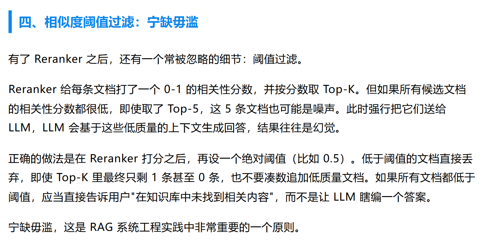
- SPLADE 融合稀疏匹配与语义泛化：值得一提的是，混合检索的前沿方向正在朝着更深层次的融合发展。SPLADE (SParse Lexical AnD Expansion) 是一类稀疏向量模型，它把 BM25 的精确匹配能万和向量的语义泛化能万结合到一个模型里。
SPLADE 的输出是一个高维稀朴向量 (维度等于词汇表大小)，每个维度对应一个词的权重，
但这个权重是通过神经网络学到的，不是简单的词频。这样既保留了精确匹配的能万，又通过神经网络实现了同义词扩展。
在我们项目的初步测试中，SPLADE + 向量检索的组合，在不需要独立维护 BM25 索引的情况
F, Recall@5 达到 0.87，接近 BM25+向量 RRF 的 0.89，工程复杂度更低。这是未来值得关注的方向，但目前中文 SPLADE 模型的成熟度还不如英文，需要根据场景谨慎评估。
各方案综合对比精确条款 Recall 语义理解 Recall 工程复杂 . 方案 @5 @5 Eg HEIR (P95) ab (A) ete 0.61 0.82 低 120ms 4H BM25 0.78 0.63 低 45ms DN MARA ( a=0. eas aga 由 35 ( 并 3) 行) RRF 融合 (k=6 089 0.87 中 195ms (# 0) 行) + 办量R 086 0.88 高 210ms
  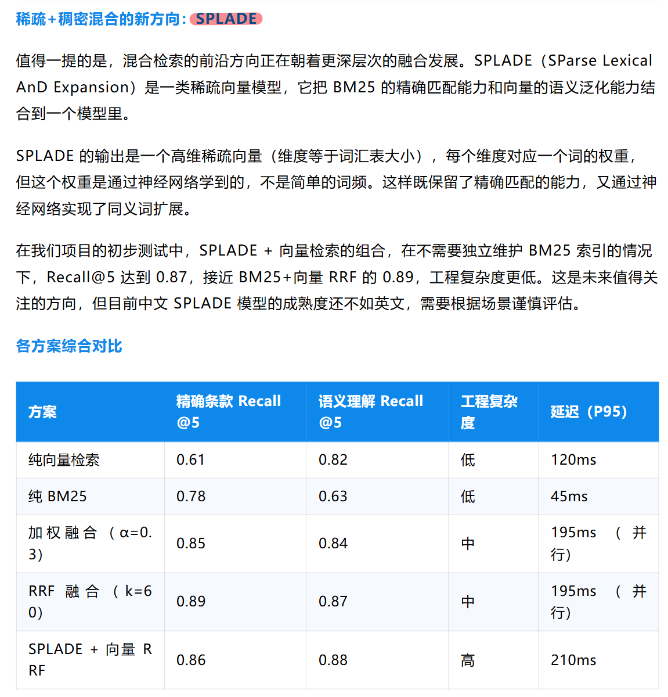
- RAG 质量治理要分层评估：习一页复盘; 本题核心框架 [RAG 质量治理」 框架 text A) A ART OCR) > 检索层〈召回精度) > ARE ORAZ
治理优先级: Prompt约束《〈最快) > mA GRE) > BARR Greta)
拒答核心: FEA BE + 引用才盖率双重判断，话术设计保用户体验更新同步增量索引 + 版本管理 + 缓存分层失效，三件事缺一个可评测闭环离线黄金集〈履盖三类题) + 在线用户信号 + BAAN
  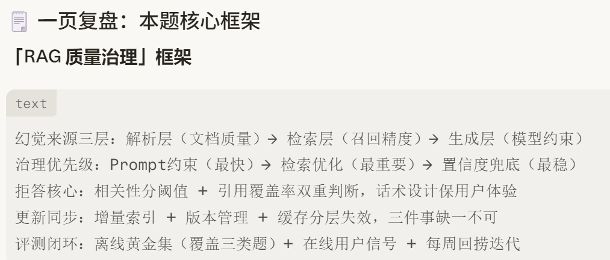
- 向量数据库支撑高维相似度检索：| 为什么需要专门的向量数据库?
理解了向量数据库是干什么的，接下来自然会问: 为什么不直接在 MySQL或者 ES 里存向量，
非要引入一个新的数据库?
普通的关系型数据库 (MySQL. PostgreSQL) 在存储结构化数据时靠B tree 索引，查询 WHERE id = 123 这种精确匹配效率极高。但向量检索要做的事完全不同——不是找 「等于| 的，而是找 [最相近的，没有精确匹配，只有相似度排序。
高维向量〈比如 1024 维) 的相似度搜索如果暴万遍历，把查询向量和库里每“-条向量都算遍余弱相似度，百万条数据就要算“百万次，延迟完全不可接受。
那为什么不用 B-tree AINE? 因为 B-tree 只能处理“维的有序索引，对高维向量这种 「多个维度同时要考虑距离) 的场景基本是失效的。你不可能对“个 1024 维的向量建一个 B-tree，然后说 「帮有我找和它最近的|，因为「近| 本身是一个高维空间的综合判断，不是某一个维度上的排序。
一维有序数据年龄) 高维向量空间 (1024 维)
查询: 年龄 = 25 查询: 哪个向量高查询向量最近?
B-tree X3
20 40 60 e ° © 最近的向量?
Q @ ov
10 | 15 30 | 35 70 | 80 : ° ane e
J/\ | /\ 5 a e Xo
5 10 15 20 F322 30 35 38 60 70 80 90 @ @ ®
x
@ B-tree ma 人 B-tree 完全无法工作距离由所有维度综合计算
A B-tree 只懂一维的顺序，懂不了多维的距离
  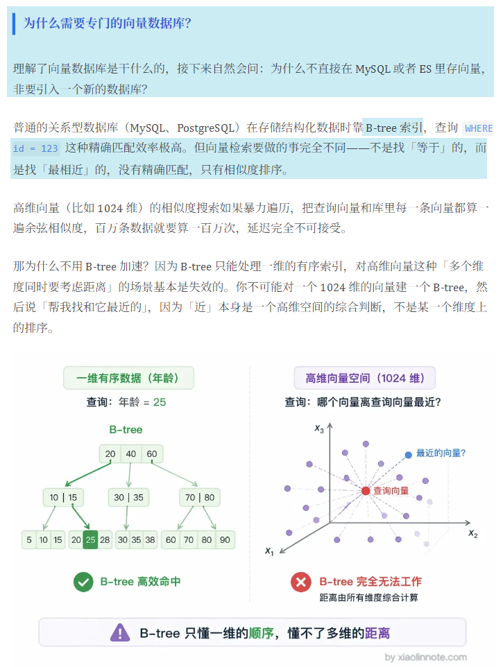
- HNSW 用分层图加速向量检索：回量数据库的索引 Index (索引) 是册量检索的关键加速结构。最单用的是 HNSW (Hierarchical Navigable Small World，分层可导航小世界图)，一种图结构索引。它的核心思想是: 把同量组织成多层图，查询时从稀芷的顶层开始，快速定位到大臻区域，再逐层细化找到最近邻，整体复杂度接近 O(log N)。 HNSW 有两个关键参数，用社交网络来类比很好理解: eM 是 [每个节避最多认识几个邻居」，M 越大，图越密，找到最近邻的精度越高，但建索引的内人存和时间都越多，通营设 16 ~ 32 ES. ef _construction 是 |建图时每个蔬点考察多少候选上|，越大走精确，但建索引越慢，通常设 100 ~ 200,。 查询时还有一个参数 ef (也叫 search_ef ) : 得询时搜索的候选集大小，趣大召回越准，
延迟也走高，按实际需求在 50 ~ 200 之间调。可以理解为 [查询时多看几个候选再决定最终
S|, ef 小查得快但可能漏折真正最近的那个，ef 大得得慢但结果更准。
  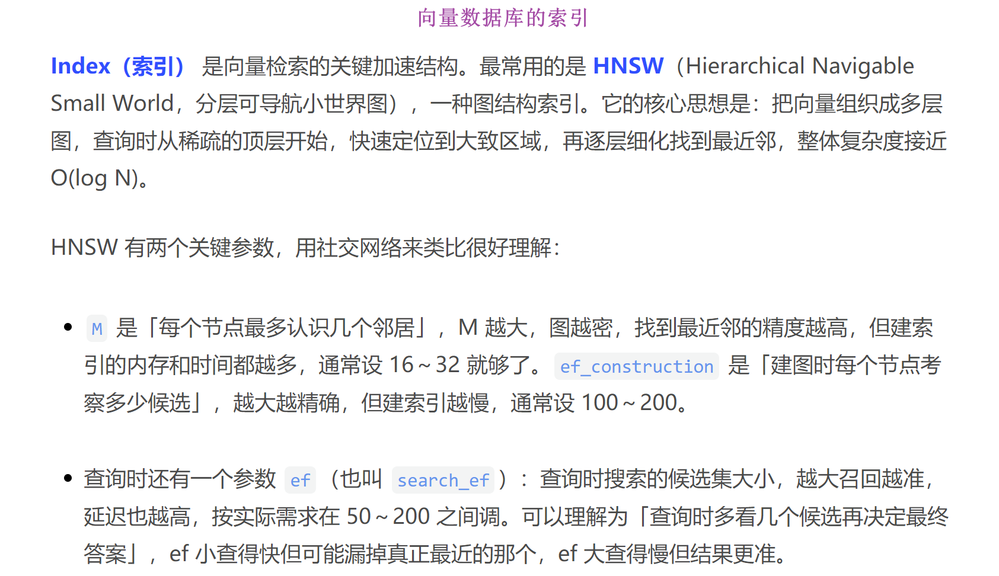
- IVF 通过聚类桶缩小搜索范围：IVF (Inverted File Index) 是男一种思路，它先对向量做聚类，把相似的向量分进同一个
Ai) 里，碍询时只搜最相关的几个桶，而不是全量遍历。这束像图书馆的分类体系: 找一本编程书，不需要把整个图书馆翻一遍，先找到 「计算机科学」 那个区域，再在里面找，范围大幅缩小。
IVF 的优点是内存占用小、适合超大规模; 缺点是精度比 HNSW 略低，需要调参 〈聚类数量
nlist、搜索桶数量 nprobe)。Milvus 在超大规模场景下会用IVF 系列索引。
IVF 桶结构 (倒排文件)
/. ® ° i. 9 + a oN a i @ Broa e @ E | @ @ 7 @ @ 5 e @ | eee (质心)
Ne fe) . ; NU an VA a 一 Ba) VA ° we
桶1 桶 2 \ 3 ‘ 桶4
‘Z y= ON (Cain * aN CO) 选中的桶
= ~ 7 e°? 4 e) ye = . . /e © am a (nprobe=3)。 < 汉 NA。 跳过的桶桶5 M6 A/S 桶8
SS ve e 查询向量
@ 查询向量只与 © 选择距离最近的 O 仅在这些桶内所有桶的中心点 -全 nprobe 个桶 = 遍历向量，
比较距离 (如图中 3 个) 其他桶整体跳过 HNSW = 图结构 (vs) e IVF = 桶结构基于图的邻接关系进行搜索 Si, BEARARIE
你可能会问，HNSW 精度高、速度快，为什么还需要 IVF? 原因很简单: HNSW 的内存消耗和向量数量成正比，到了亿级规模内存可能打不住。IVF 用聚类换内存，牺牲一点精度就能处理超大规模数据，两者各有适用场景。
  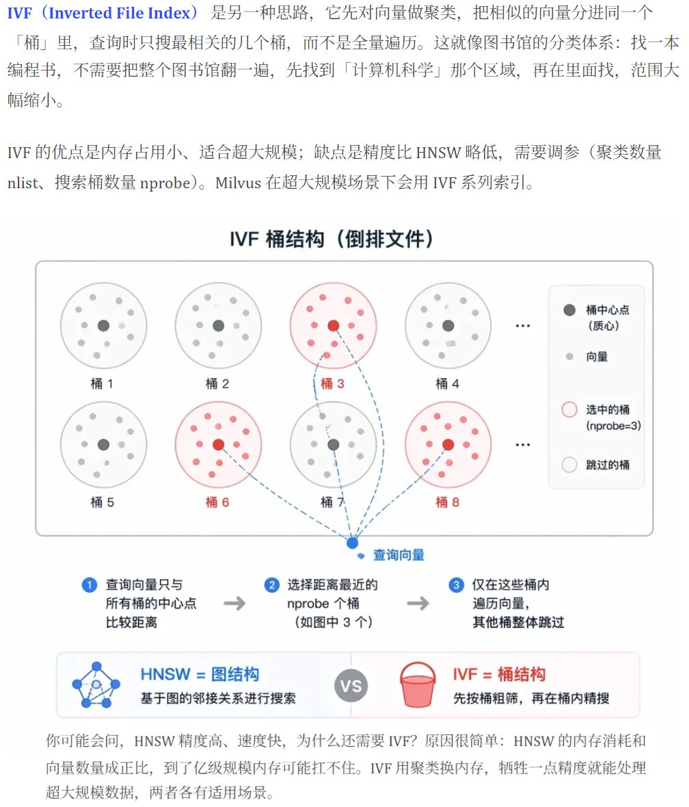
- 向量量化降低 Milvus 内存占用：| 数据规模和实测性能搞懂了概念，现在来看实际的数据。我们知识库大概有 150 万条 chunk，每条用 BGE-large-
zh 模型生成 1024 维的向量，索引用 HNSW (M=16, ef construction=128)。
先算一下原始数据的内存占用: 这是纯向量部分。实际 Milvus 进程完整跑起来大概要 10 ~ 12GB 内存，多出来的4~ 6GB 不是"索引翻倍"的神秘开销，而是 HNSW 图结构本身、metadata、Collection 管理开销、操作系统缓存这些合起来的占用。你可能会想，12GB 内存而已，现在随便一台服务器都有 32GB，有什么好担心
AN? 但别筷了这只是向量数据本身，同一台机器上还跑着应用服务、Redis、日志收集等各种组件，内存是要抢着用的。 a bi
解: 就像把精确到小数点后 7 位的数字保留到小数点后 2 位，大部分语义信息其实在高位，截掉低位精度损失极小，但数据量直接缩到 1/4。内存从 10GB 降到约 3GB，召回率基本无损 (通常只下降 1 个百分点以内)，是最划算的一个优化，几乎没有代价。
SQ8 量化效果对比图
float32 原始 SQ8 量化后
1024 维向量，每个数占 4 字节同一个向量，每个数压缩到 1 字节
1 Byte a 总量 1KB
总量 4KB Bi cox
: ee ed
极小的精度代全全下大的内存节省实测查询性能 (单机 16 核 32G、本地干兆网、HNSW 在内存、ef=100) : 单次 top-5 查询
P50 延迟约 20ms，P99 约 60ms，并发 100 QPS 时延迟基本稳定。这里报数字一定要带上硬件和参数背景，同样是 Milvus，跑在 8 核机上、跨机房调用、或者 ef 设到 200，数字能差一个量级。这些数字才是面试官想听到的，不是 「感觉挺快的|。
  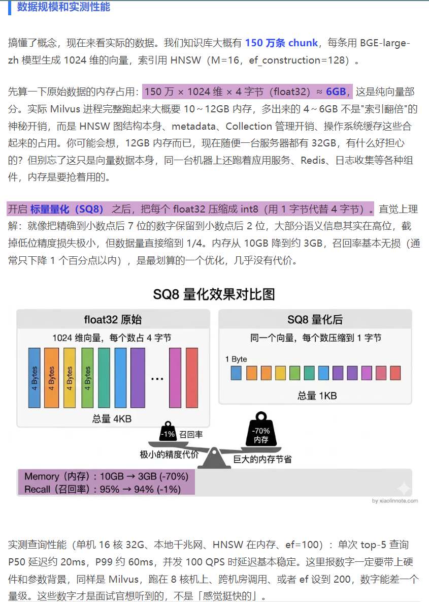
- HNSW 分层贪心搜索逐层逼近：HNSW 第2层 (BRI) 错误理解 (X )
7 入D点entry point 当前县最近节点 |，同层贪心搜索: 高层先找 top-N， O a (局部最优) 只要某个邻居更接近 q， | 每个都向下搜。
we ~>@)-.._ J 就中过去; 直到找不到 O x
Fg ~~ ie 28 --._.@ 更近邻居为止。 SS enema ee ee 56
@:- 仅把当前最佳节上 Lg de ws 带到下一层
ON [18 这一层仍然不是把 ERE A
: TOPS Me; = “On, srannatie, | SESRARI*
\ oes a " |
\ V ith Qc @ |! | 而是只保留当前层
4
‘, 继续只下降 O
\| 第0层 (最密集) 这1个入口节点上
‘ -人心一一 3¢—@a—@.- ¥
sa 6...
OR ES Oy mou | S885
bP OPFOR AAT) area, | | Wee!
O77 \ | SK; © ] Megs I Nop ane 人 70 搜索范围更广， SS Vaca OS O-0-6 0 | see a. ~人-----------------) ;候选过ef | 选出top-K结果。 | |
ee = | OC 当前层找到的最近节点 |
最终返回的 top-K 近邻结果 © 最终返回的近邻 |
| --> 查询路径 / 局部搜索路径。 |
| y 下降到下一层 | | 一图中的邻居连接妈 BE: 贪心定位，只带 1 个最佳入口往下走 | G 高县只做“食心定位”，每层只得到 1 个局部最优节点; | | > 候选池 ef (0 层使用) |
G % 底层: 用ef 扩大搜索范围，再输出 top-k， Q@ 只有在第0 层 (RE) 才维护较大的候过池 ef，
* 所以: 不是每层保留 top-N 再逐层展开。 | 并从候选池中过回最终的top-K TEER,
  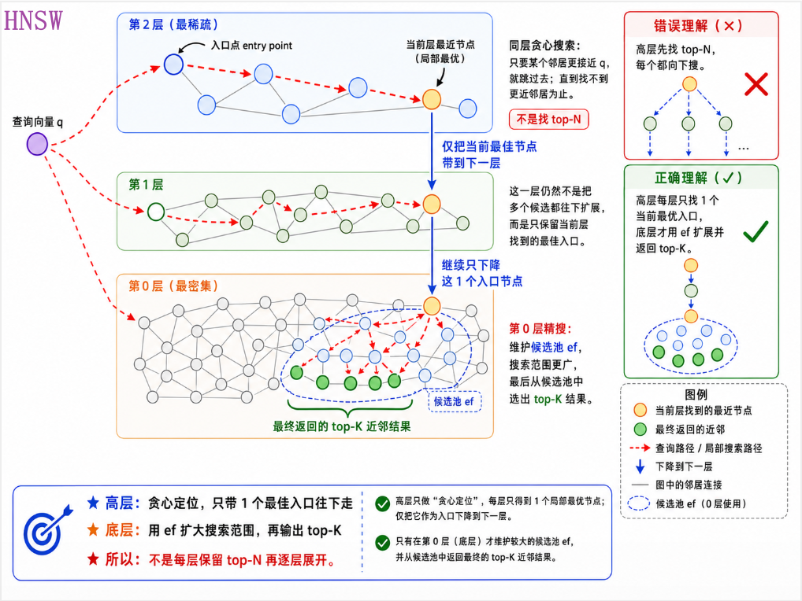
- Metadata 先过滤再做 ANN 搜索：第一个是 Metadata 过滤，也叫混合检索。实际业务里，知识库往往有多个部门、多个产品线的文档，用户查的时候只想搜 |技术部的文档或者【2024 年更新的内容J]。向量数据库支持给每个向量挂上 metadata 字段，检索时加过滤条件，只在符合条件的子集里做ANN 搜索。你可能会想，为什么不先ANN 搜完再过滤? 因为那样可能搜出来的 Top-K 结果大部分都不满足条件，白白浪费了检索名额。先过滤再 ANN 搜索，能保证召回的每一条都是真正想要的。
Vector Database 和 ANN 搜索铬|比
| 后过滤 (错误做法) — x
|e= Sl) 2, (oe sy. (oe ae fre ( x ae ae z=
查询 Oo o ] department= = 只
(Qi 又又过滤可能剩下只有 3 条 |
数据集 (Dataset) 未满足条件 (浪费了 17 个名客)。 召回了大量不相关的结果，效率低下先过滤 (推荐做法)
Cm) Gaz)
ae ot GHD Ba)
ANN = Ga) ma .
和王子一区 = = 每条结果都可用查询先按 metadata Ss
(Query) 得出技术部文档子集 > 先过滤更高效每条都满足条件，20 条全是想要的
  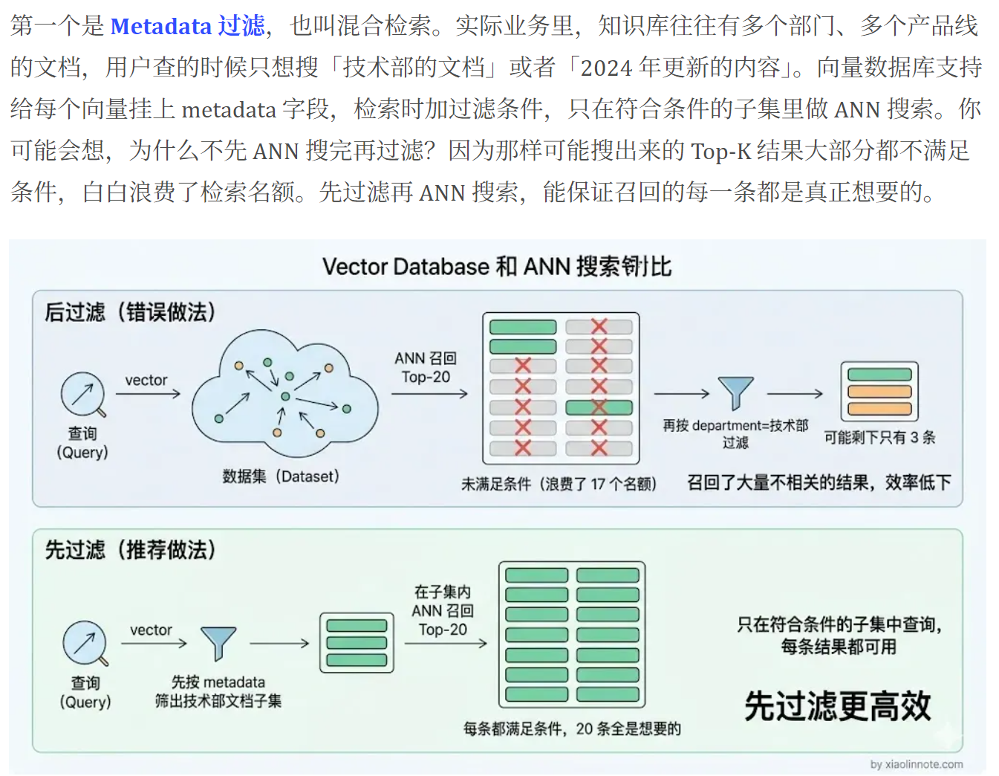
- Embedding 模型需用业务数据评估：如何评估 Embedding 模型?
这里有一个常见的误区: 很多人拿 MTEB 这类通用排行榜的分数来选模型，觉得分数高就一定好。MTEB 是一个权威的文本 Embedding 通用排行榜，用多种标准数据集评测模型的语义搜索能万，是好的参考。但它用的是通用数据集，你的业务场景〈比如医疗问诊、法律文档、客服知识库) 和通用数据分布差异很大，排行榜第一的模型不一定适合你。就好比高考状元不一定擅长你那个行业的专业考试，测评的数据分布不对，分数就没有参考意义。
正确的评估方法是在自己的业务数据上测: 准备几百条业务相关的 【问题 + 正确答案 chunk |
对，分别用候选模型做检索，看正确的 chunk 有没有出现在前人条结果里。这个指标叫
Hit@K, Hit@5=O0.8 的意思就是，80% 的问题，它对应的答案都出现在了检索结果的前5 条
EA, JAS Hit@5 低于 0.7 就要考虑换模型或者改进 Chunking 策略了。这种贴近真实场景的评估，比排行榜分数更有参考价值。
把第见的选型维度汇总对比一下: 模型维度中文效果 “是否开源 ”适用场景
text-embedding-3-small 1536 〈可降维) 一般否 (API) 英文为主、快速上手
text-embedding-3-large 3072 (可降维) 一般否 (API) 英文为主、精度要求高
bge-large-zh 1024 很好是中文知识库首选 bge-m3 1024 好是中英混合、多语言场景
  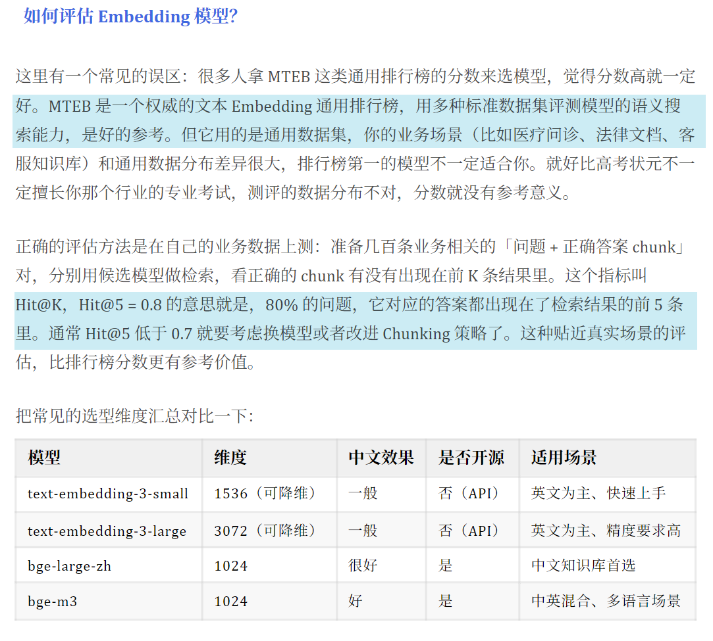
- 中文 RAG 优先考虑 BGE Embedding：常见Embedding 模型对比理解了 Embedding 的原理，接下来就是选模型了。目前主流的选择大概分三类。 e 第一类是 OpenAI 的 text-embedding 系列， text-embedding-3-small 是性价比最高的，
1536 维，支持降维到 256 维来节省存储，调用方便，英文效果非常好; 缺点是API 调用有费用，而且数据要发到 OpenAI 服务器，有些企业有数据出境合规问题。 e 第二类是 BGE 系列 (北京智源研究院出品)，这是目前中文 RAG 场景的首选开源模型， bg e-large-zh 在中文语义检索上的效果甚至超过 OpenAl 的模型，1024 维，可以本地部署，
数据不出境。如果你的知识库主要是中文内容，BGE 几乎是最优解。 © 第三类是多语言模型，比如 bge-m3，同时文持中更日等多种语言，向量维度 1024，适合知识库里中英文混排的场景。
  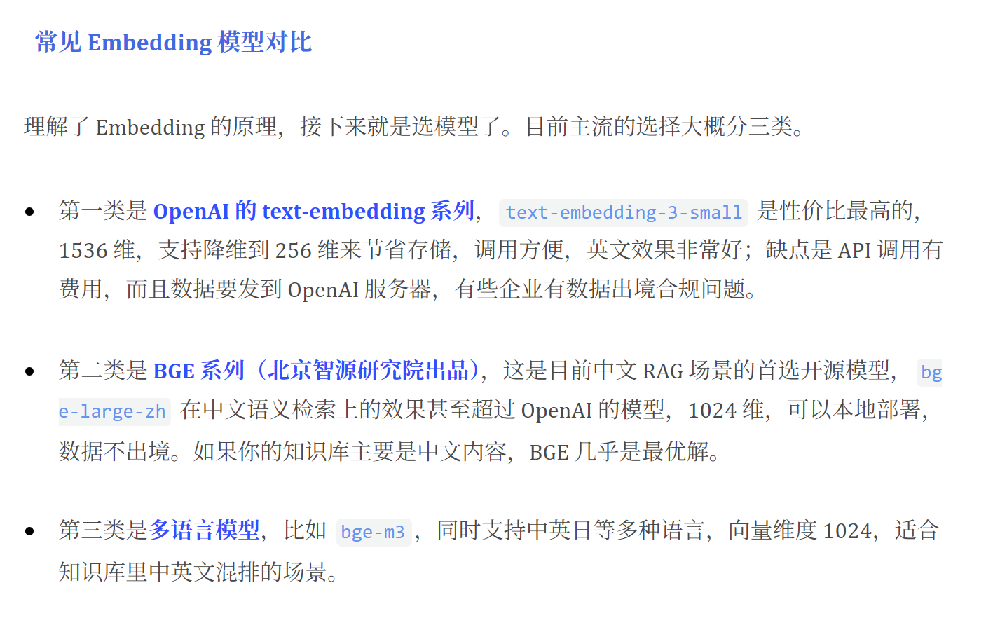
- Embedding 从词向量演进到语义检索：? fH 24
第一代是静态词癌量，以 Word2Vec 和 GloVe 为代表，把每个词映射成固定向量，但同一个词不管上下文是什么，向量永远不变，处理不了多义词。
第二代是以BERT 为代表的上下文相关向量，同一个词在不同语境下有不同的向量，表达能万大幅提升，但 BERT 本身输出的是 token 级别的向量，两个句子要比较相似度就必须拼在一起跑，百万条文档就要跑百万次，检索速度完全不可接受。
  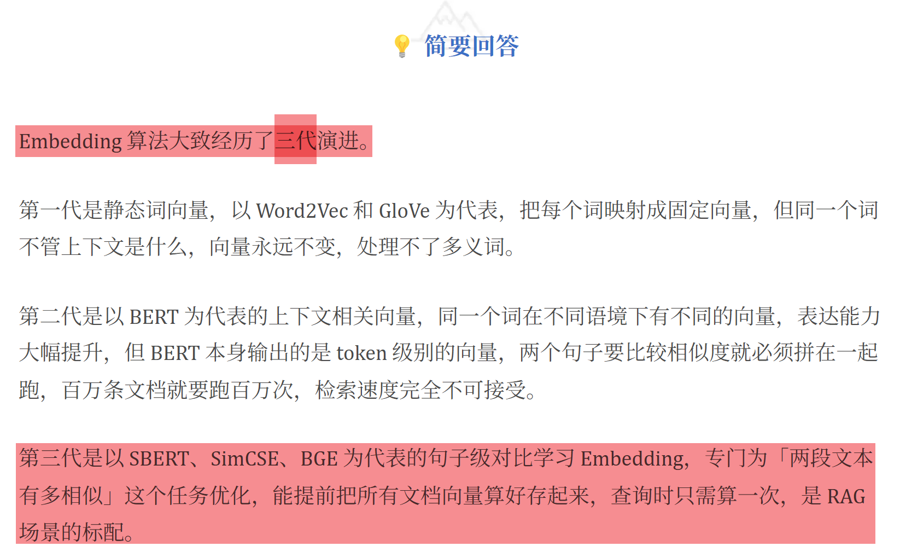
- 最佳实践是文档层级划分 句子级 ov：最佳实践是文档层级划分 + 句子级 overlap （https://mp.weixin.qq.com/s/Rjm4kpKifyVyH27k_FWStQ）
- 阿里面试官问： " 你的 RAG 系：阿里面试官问： " 你的 RAG 系统上线之后，用户反馈答案不对，你怎么处理的？ Badcase 怎么收集，怎么分类，怎么验证没有引入新问题？ "
- 让问题不过夜：交易领域 “ 问诊 ”：让问题不过夜：交易领域 “ 问诊 ” Agent 实践 - 阿里云开发者社区
- 面试官问：动态 RAG 的数据质量怎：面试官问：动态 RAG 的数据质量怎么评估？ :
- 文本生成流水线结合采样与质检：苹略组合与比较一个典型的高质量文本生成流水线是这样的:
不符合规则，重新抽签
1调味" mm a 4."质检”
用温度调整原始的概率分布 -P或Tes-K过渡大量不 ote 拒绝采样的规则来对选出的低温-严谱 ; 高温-创造性 OP ase Bin iF — iets 词进行最后的审查
  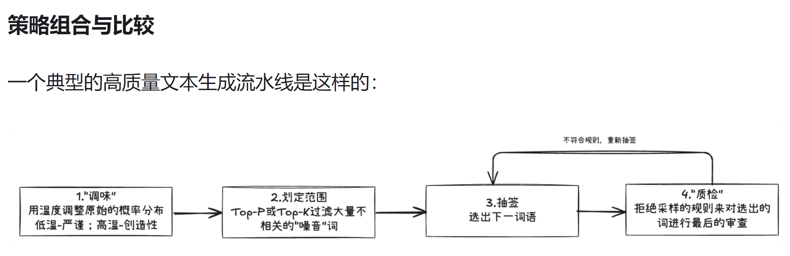
- RAG 首字延迟卡在检索前链路：一首字延迟到底卡在哪?
RAG 的全链路可以拆成四步:
1. Embedding (OpenAl 或自建模型)
2. 向量检索 (Milvus / Chroma / Faiss / PgVector)
3. Prompt 拼装
4. 大模型生成 (LLM Completion / Streaming)
其中影响 TTFT (Time-to-First-Token) 的主要瓶颈是:。Embedding API 等待时间。 向量检索耗时。 系统缺乏并发 / 缓存换句话说，卡的并不在 LLM, Mee LLM 之前的链路。
优化 TTFT，本质就是“把 Embedding 和检索变快，把重复计算干掉，把链路做成流水
  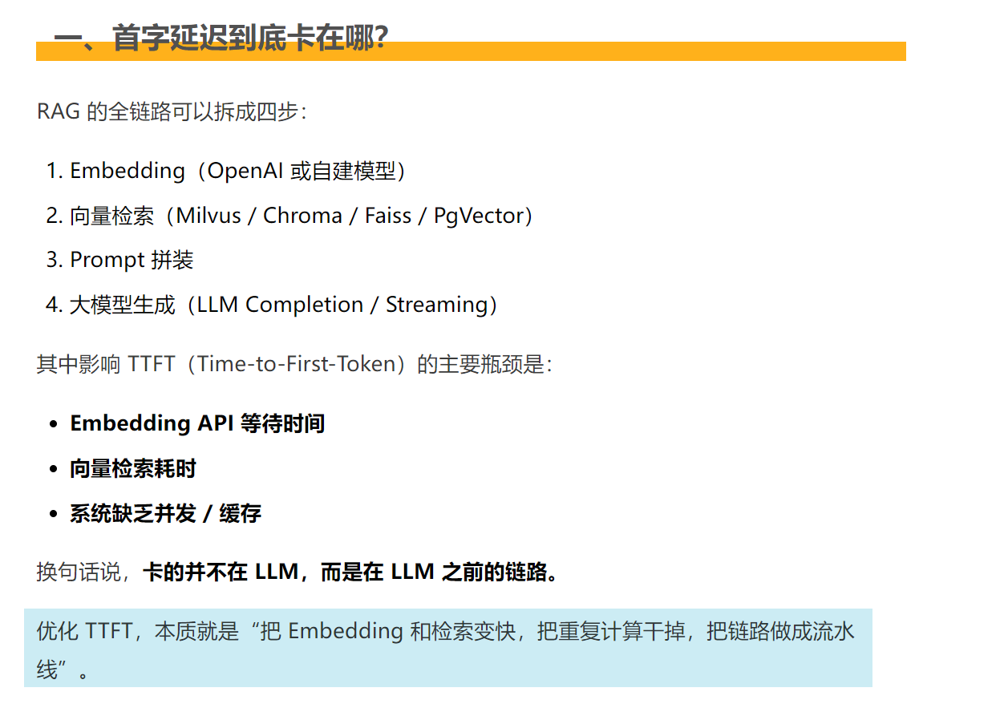
- Embedding 缓存减少重复向量计算：3. 缓存 (Embedding Cache) ——把重复的工作彻底去掉 Embedding 最“浪费钱”的地方就是: 重复调用。
现实里你会遇到 :。 用户各种用词相近的提问。 FAQ 类问题。 编写 RAG 项目时自己不断调试。 完全哈希匹配 or 近似>阔值相似最佳策略: 把 query 一 vector 缓存在 Redis / KV 里。
缓存命中率甚至能达到 30 ~ 50%,
对于语料库 embedding，要提前离线算好，这样查询时就不需要临时生成embedding。
训练营里的实际项目中，把缓存引入后能把首字延迟直接砍掉 40% 以上。
  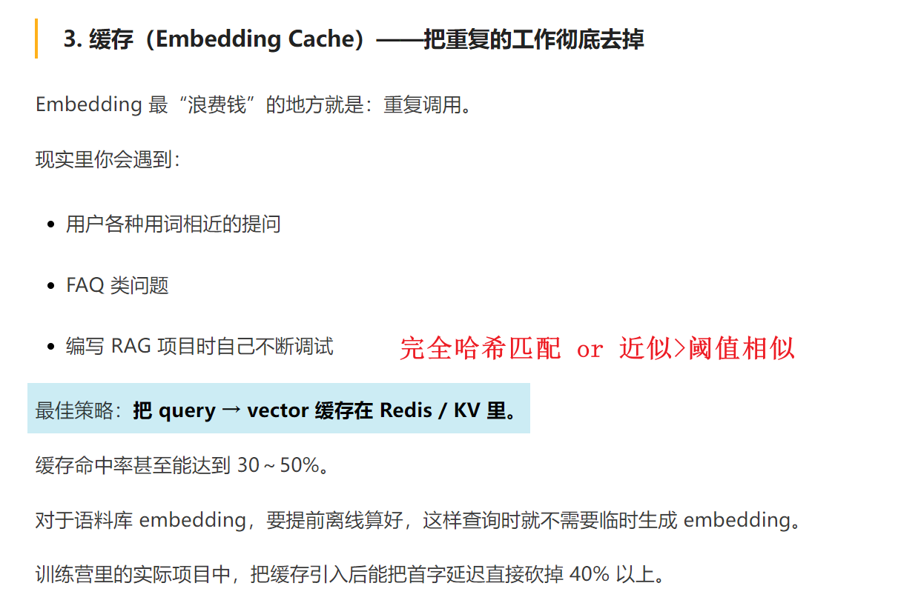
- 三层缓存降低 RAG 调用成本：2. 三层缓存体系 (Embedding / Retrieval / Answer) 这一点是很多在线 RAG 系统一定会做的:
第一层: Embedding 缓存避免重复算向量。
第二层: 检索结果缓存同样的 query，不需要每次都查向量库。
第三层: 答案缓存 (FAQ)
如果答案固定，那直接返回，甚至不需要走 RAG,
这三层缓存能把 © API 调用次数。 Milvus 查询次数。 LLM 调用次数统统减少至少 30% ~ 60%,
  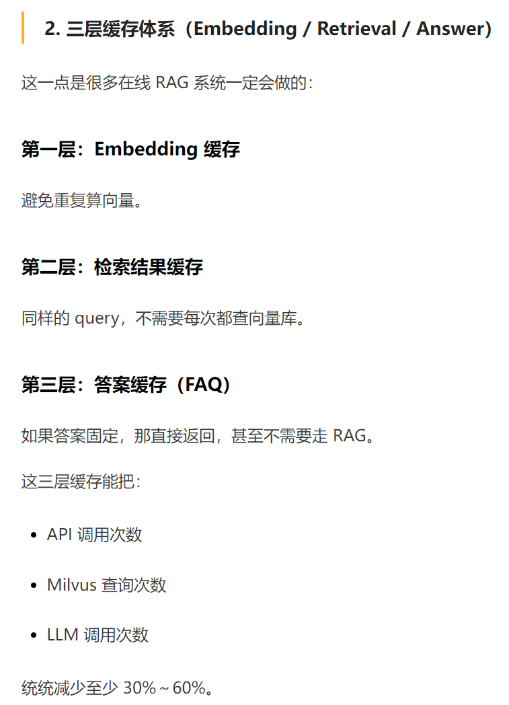
- RAG 延迟优化依赖异步与缓存：A, SB: 如何给面试官浓缩回答?
你可以总结成下面这个“面试官最爱听”的版本:
"RAG 的首字延迟主要卡在 embedding 和向量检索。
embedding 方面通过批处理、异步并帮和 KV 缓存减少等待，向量检索通过 HNSW 索引、分区过滤、批量碍询缩小学围。
系统层面用全链路异步流水线，并辅以embedding / retrieval / answer 三层缓存，整体能把延迟降低几十到上百富秒。
  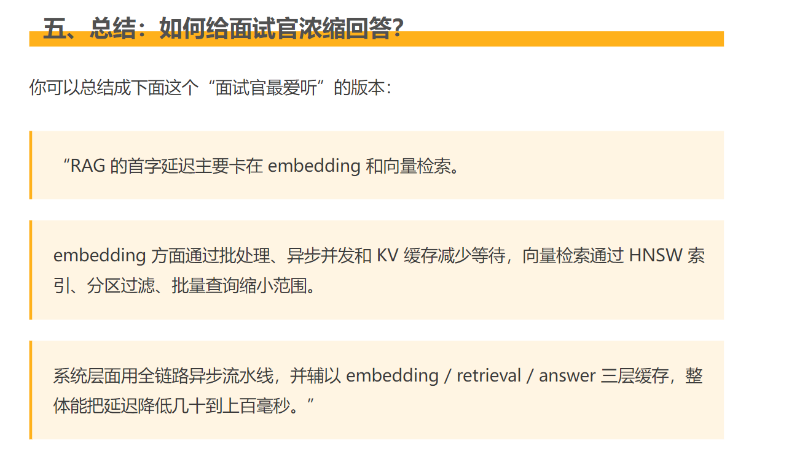
- 代码检索中 grep 可优于向量搜索：本文在上面已经解释了为什么在代码搜索这个具体场景上可以这么换，总结有三个原因 :。 ”代码本身就是 Grep 友好的。 代码里的函数名、类名、常量，本质是程序员埋进去的高精度锚点，精确匹配恰好是最直接的检索方式。GrepRAG 的论文在 CrossCodeEval 等基准上验证了这一点: 单轮 grep 驱动的检索就能超过 embedding RAG 基线。这也解释了为什么连 Cursor 这种把语义索引当核心卖点的公司，内部 system prompt 仍然把 grep_ search 标为"主要探索工。 ”开发者本地项目的规模撑得住暴万扫描。 4,500 个文件的项目 ripgrep 跑完只要 0.1 秒，这个数量级根本用不着离线索引。“暴万搜索慢“的前提是数据大到暴万算法跑不动，而大多数本地代码库离这个前提还差好几个数量级。。 Agent 带来的是检索模式的转变。 传统 RAG 是被动的: 系统在问题出现之前就预先决定“你可能需要看什么"，一次性检索一批相关块塞进 context，模型只能在这批给定的内容上做推理。而
Agent 时代的检索是主动的: 模型每一轮主动决定当前需要什么、用什么工具拿、拿到之后要不要继续找。第二章那四轮实战搜索就是主动搜索的具体形态，每一步搜什么都由上一步的发现决定，这条路径是任何预检索都猜不出来的。这种场景下，Grep 的潜万能够充分发挥，例如在4.5
章节的实验中，使用LLM对query进行改写后，仅单轮搜索准确率就提升了5-10售。 X72’ RAG 已死"那批标题背后真正在发生的事: 死的不是检索增强生成这个范式，而是代码搜索一定要靠 embedding 预索引这个默认假设。Claude Code 和 Codex 殊途同归地选择了零索引， 说明在代码搜索这个领域上，用 LLM 驱动 Grep 已经是一个足够好、甚至更省心的替代方案。至于范围之外呢? 在自然语言问答这类软语义主导的场景里，embedding 依然是重要的部分，在更大规模的代码仓库上，索引也无法被抛奔。总之，技术的选择由数据的特性和规模决定，不应该是信仰问题。
  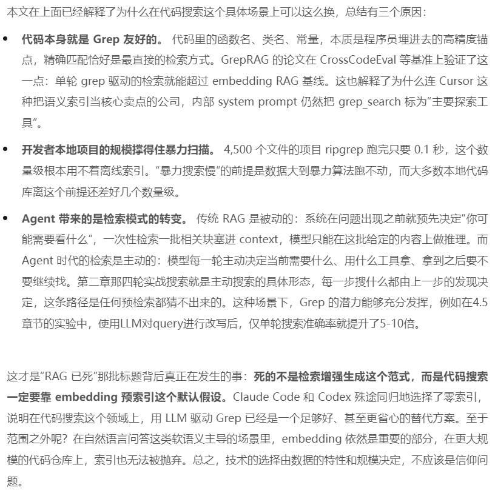
- Memory 从大杂烩改为分层管理：Memory 设计改进: 从大杂烩到分层管理优化前优化后向量库 (无分类) user feedback
用户是后端工程师用户是后端工程师| | 不要mock数据库下周四截止引入四类分型管理不要mock数据库 [一> project reference Linear tracking bugs
项目用PostgreSQL | ——
用户今天调试bug
@ feedback 优先级最高
Ay 时效性不同但混存 / @ project 自动检查时效过期信息难清除 / 检索噪声大四Memory A Or aoe!
  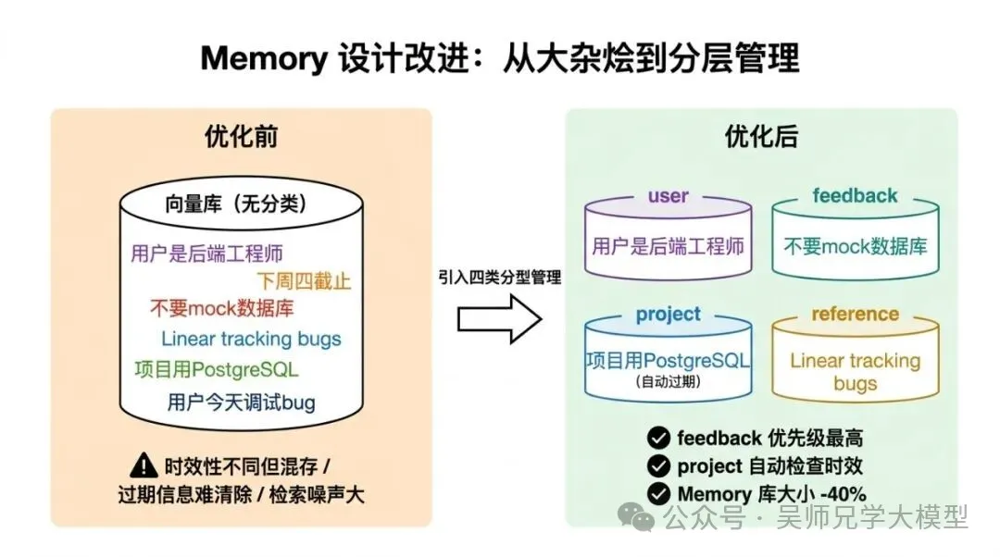
- 四类 Memory 采用不同检索策略：四类记忆的检索策略
Agent 收到用户请求
1 co
会话开始全量加载执行操作前触发检索任务相关性检索 ig wt 约束当前行为先检查绝对时效/ 找到系统位置后。 始终生效， 最高优先级过期则忽略、7诈三| EIB ss
  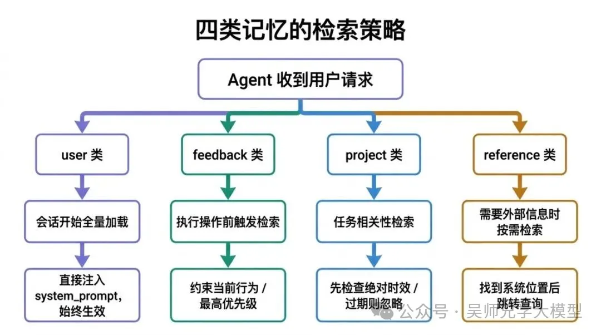
- 鹅厂面试官皱眉： " 你用 Clau：鹅厂面试官皱眉： " 你用 Claude Code 这么久，它怎么记住你偏好的？ " 我： "…… 存在对话历史里？ " 他： " 那重启之后呢？ "
- 鹅厂面试官： " 你的 Claude：鹅厂面试官： " 你的 Claude 把用户偏好和截止日期都往一个向量库里存？ " 我： "…… 对。 " 他： " 那记忆过期了呢？ " 我： 滴滴面试官追问： "Claude Code 自动帮你记了什么？你翻过 MEMORY.md 文件吗？ " 我打开一看，里面存的全是废话
- 鹅厂面试官： " 你的 Claude：鹅厂面试官： " 你的 Claude 把用户偏好和截止日期都往一个向量库里存？ " 我： "…… 对。 " 他： " 那记忆过期了呢？ " 我： 滴滴面试官追问： "Claude Code 自动帮你记了什么？你翻过 MEMORY.md 文件吗？ " 我打开一看，里面存的全是废话
- Doc2Query反向HyDE索引：反向 HyDE（Doc2Query）用于 RAG 检索增强：针对每个 chunk 离线生成可能的用户问题，再把这些 question 与原始 chunk 关联建索引。相比在线 HyDE，它把生成成本放到离线阶段，不影响实时调用 RT。示例中，差旅报销制度文本可生成“出差去二线城市住酒店一天能报销多少钱”“出差回来后最晚什么时候报销”“报销差旅费需要什么类型的发票”等虚构问题，从而提升用户自然问法和知识库 chunk 的匹配能力。
  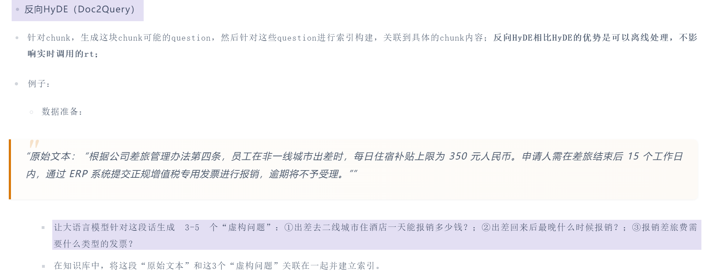
- RAGAS评估维度框架：RAGAS 是一种 RAG 自动评估框架，使用 LLM-as-a-Judge 评估 RAG 系统表现。它把评估拆成两个维度：生成维度关注 faithfulness 和 answer relevancy，衡量回答是否忠实于检索上下文、是否回答了用户问题；检索维度关注 context precision 和 context recall，衡量检索上下文的信噪比以及是否召回了回答所需信息。
  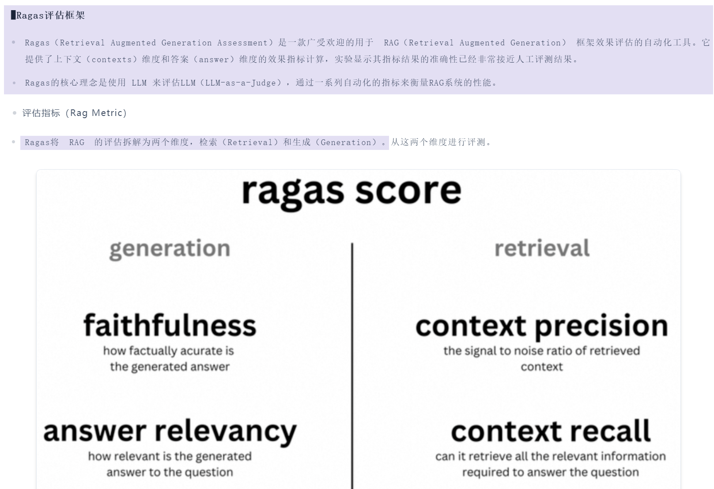
- RAGAS检索指标公式：RAGAS 检索指标包括 Context Precision 和 Context Recall。Context Precision 衡量检索结果排序质量：相关 chunk 是否排在不相关 chunk 前面，公式可写为 Context Precision@K = sum(Precision@k × v_k) / top K 中相关项数量，Precision@k = TP@k/(TP@k+FP@k)。Context Recall 衡量召回完整性：把参考答案拆成 claims，判断每个事实点是否能从 retrieved contexts 找到出处，公式为 supported claims / total claims。
  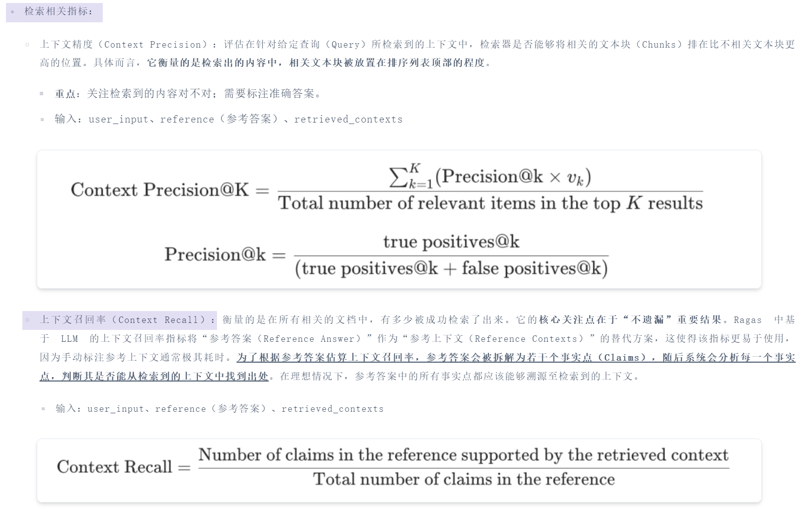
- RAGAS生成指标公式：RAGAS 生成指标包括 Faithfulness 和 Answer Relevancy。Faithfulness 衡量回答中 claims 是否被 retrieved contexts 支持，公式为 supported response claims / total response claims。Answer Relevancy 衡量回答和用户输入之间的相关性：先基于 response 生成若干合成问题，再计算这些问题 embedding 与原始 user_input embedding 的余弦相似度并取平均。
  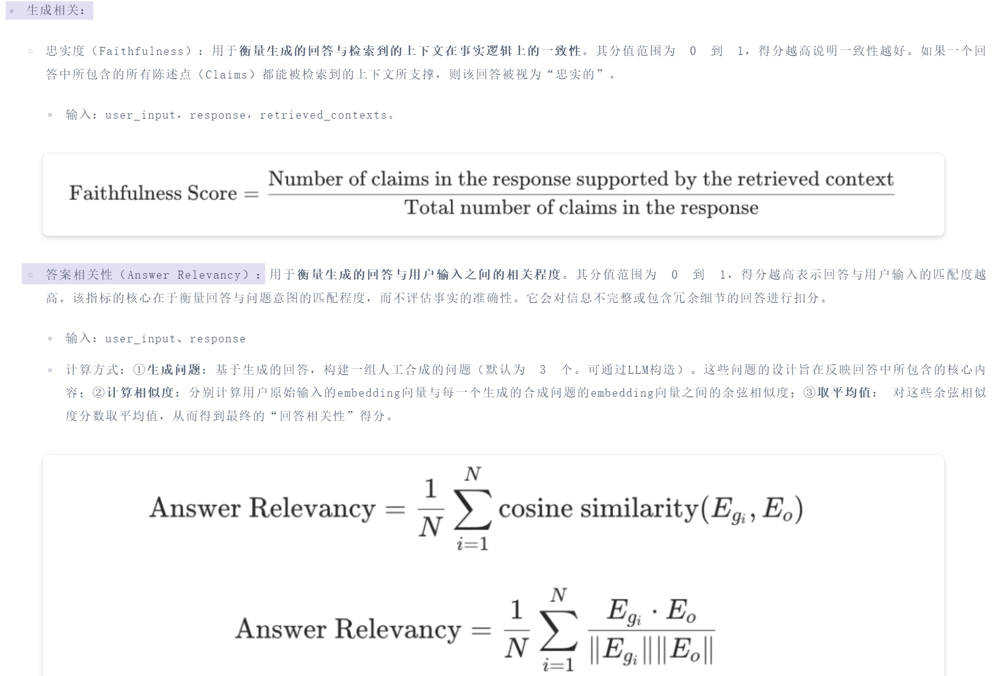
- RAGAS噪声敏感度指标：RAGAS 的 Noise Sensitivity 衡量 RAG 系统在检索上下文含噪声时生成错误回答的频率，分数越低越好。它分为相关上下文噪声敏感度和不相关上下文噪声敏感度：前者看相关文档中的多余信息是否被错误写入回答，后者看不相关文档是否带偏模型。计算时审查 response 中每个 claim，结合 reference 和 retrieved_contexts 判断 claim 是否正确以及错误是否可归因于噪声上下文。
  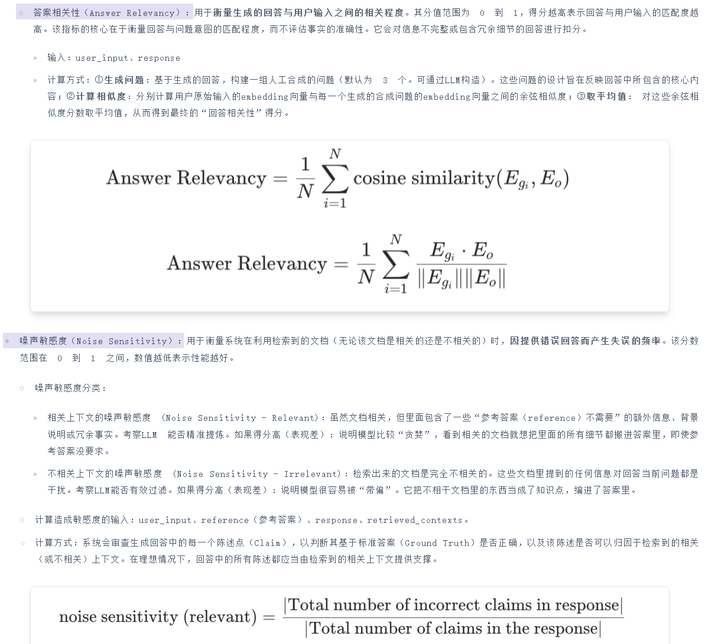

## 证据表

| evidence_id | 类型 | OneNote 页面 | 原链接 | 图片 | 摘要片段 |
|---|---|---|---|---|---|
| agent_img_001_007_d75dc63bc8b4 | onenote_image | Agent | [source](https://mp.weixin.qq.com/s/J3VEfZKh-EedIEnZkhFDJg) |  | RAG 幻觉来自生成阶段补全: |一、幻觉问题: MENT, BSE 这是 RAG 生成阶段最致命的问题。你明明检索到了正确的文档片段，喂给了大模型，但模型生成的回答里居然出现了文档中根本不存在的信息。 为什么会这样?”因为大模型的本质是"续写"——它会基于自己在预训练阶段学到的知识来补全内容。当检索到的上下文不够明确、或者模型对某个话题有"先入为主"的知识时，它就可能混入自己编造的内容，而不是老老实实只用你提供的资料。 在我们训练曹的实战项目中，金融保险场景下这个问题尤其严重。用户问"ABC寿险的保障学围"，
检索到的文档明确写了"涵盖身故、全残保障，附加重大疾病险"，但模型有时会自行补充一句 "还包含住院津贴保障`——这个内容根本不在检索到的文档里，纯粹是模型自己编的。在金融场景下，这种幻觉可能导致严重的合规风险。这也是我在训练营里反复提醒的: 幻觉不是小概率事件，而是
LLM 的天性，必须主动压制。 |
| agent_img_001_008_cd3df81953ab | onenote_image | Agent | [source](https://mp.weixin.qq.com/s/We7DOn_LN4LmH9Oqad99YA) |  | 记忆模块是第二检索源: | 一、记忆模块在 RAG 里到底扮演什么角色? 很多人把"记忆”简单理解为"把对话历史塞进 Prompt"，这只是最初级的做法。 一个完整的记忆模块，本质上是 RAG 系统的第二个检索源。| 第一个检索源是知识库 (静态的、所有用户共享的)，第二个检索源是记忆库 (动态的、跟特定用户/会话绑定的)。 引入记忆模块后，系统的数据流变成了这样: 用户查询进来一同时从知识库检索静态知识、从记忆库检索历史上下文一融合两路信息一 LLM 生成回答一新一轮对话写入记忆库。 这个循环让系统具备了"越聊越介你"的能万。客服场景里，系统记住了用户之前提过的保单信息，
就不用让用户每次都重复报保单号;个人助理场景里，系统记住了用户的饮食偏好，推荐餐厅时就能自动避开不合适的。 |
| agent_img_001_009_94911bd17c4e | onenote_image | Agent | [source](https://mp.weixin.qq.com/s/NmeedQyz7wu8tjNtgu6yTg) |  | HyDE 用假设答案增强检索: | “HyDE® 感觉比较费万" 这位朋友说的没错，HyDE 确实有成本。 回顾一下 HyDE 的思路: 让 LLM 先根据 query 生成一个"假设的理想回答"，再用这个回答的
Embedding 去检索，而不是直接用 query 的 Embedding。好处是假设文档比短 query 语义更丰富，检索效果更好。 但代价也很明显: 每次检索前要多一次 LLM 调用。 这意味着额外的延迟 〈几百毫秒到几秒) 和额外的 API 费用。对于响应速度敏感的在线场景，这个代价可能不划算。 我的建议是: HyDE 不是默认开启的功能，而是针对特定场景的增强策略。 什么时候用 HyDE? 当你的 query 特别短、特别模糊，直接检索效果很差的时候。比如用户只输入了"退保"两个字，向量检索不知道他想问退保流程、退保费用还是退保条件，召回一堆不相关内容。这时候让 LLM 先生成一段关于人退保的完整回答，再用这段回答去检索，效果会好很多。
什么时候不用?”当 query 本身已经足够清晰完整 (比如"2024年车险理赔需要提交哪些材料")，直接检索就能命中，没必要多花一次 LLM 调用。 工程上的做法是: 先用一个简单的 query 分类器判断当前 query 是否"模糊/过短"，只对这部分
query 启用 HyDE。其他情况走正常检索流程。这样既能在需要的时候提升效果，又不会拖慢整体响应速度。 |
| agent_img_001_011_6947aa966103 | onenote_image | Agent | [source](https://mp.weixin.qq.com/s/M6BiWlGmfijlU9yUQXmRoA) |  | RAG 权限控制分三层过滤: | 三屋权限控制架构一 — o RAGRA= Wi mF MEY (Pwrrotennamemeratian [>| © ancateniit RE: 向量数据库过滤 |
RY | 局 wivus元数据过滤(expr条件) = > 目目分区物理隔 i 返回层: 二次验证请求 RAG系统三层权限控制以构 |
| agent_img_001_012_922c16272133 | onenote_image | Agent | [source](https://mp.weixin.qq.com/s/YFCx_dGrsB2ufFzaulpOSw) |  | 不同查询应路由到不同链路: | 一、为什么不能所有 query 都走同一条路? 在我们训练膏的金融保险实战项目里，用户的问题类型非溃杂: 有的是事实型查询——"A 款保险的保障光围是什么)”“，这种直接去知识库检索束行。 有的是计算型查询——"我投保了 50 万，免赔额 5000，这次理赔能拿多少? "，这种需要路由到计算异块，而不是检索。 有的是数据库查询——"上个月理赔审批的平均时长是多少天?"，这种需要走 NL2SQL“，把自然语言转成数据库碍询语句。 有的是带时间约束的查询——"最新的车险理赔流程是什么)“"“，这种虽然走检索，但需要加时间过有的是闲聊——"今天天和气怎么样? "，这种根本不该进 RAG 流程。 如果你把所有 query 都一股脑丢进向量检索，会出现两种乾众情况: 一是该算的不算 (计算题去检索文档，拿回来的是理赔政策而不是计算结果)，二是该过滤的不过滤 (要最新流程却召回了旧版本，因为语义检索不理解"最新"这个约束)。 |
| agent_img_001_018_90388fa1fee2 | onenote_image | Agent |  |  | RAG Prompt 限制模型只用文档: RAG Prompt 的逻辑完全不同: 你传进去问题 + 检索到的文档片段，要求模型只用这些文档片段来回答，不能用参数台识。 这里有一个根本性的矛盾: LLM 在预训练阶段见过海量文本，脑子里已经仔了大量燥识。当你给它一段检索文档，问它问题，它的默认行为是: 把检索文档的信息和自己的参数知识混合使用。 |
| agent_img_002_001_dcd9267f7f8b | onenote_image | RAG | [source](https://www.53ai.com/news/RAG/2026031839178.html) |  | GraphRAG、LightRAG、PathRAG 对比: 特性 GraphRAG LightRAG PathRAG
子图/社区检索: 利用社区检测 ” 双阶段检索: 结合快速的局部检索和深 BARR: 使用基于流的剪枝算法识检索机制算法找到相关社区，并聚合其所 ”入的全局检索。 别并提取最相关的关系路径。
有信息。
将整个相关社区或子图的信息在保证效率的前提下，从图中检索相关 ”将检索出的关系路径转换为文本，作信息处理方式 (可能包含大量节点和边) 进行 ”信息片段。 为上下文提供给生成模型。
RA.
1. BMPR: 擅长发现群体社 1. RRBM: 在速度和深度间取得平 1. WHBIRKAK: 能更好地理解实区和全局趋势。 衡。 体间的复杂联系。
2，信息全面: 提供整个社区的 2.计算轻量: 兼顾了性能和效率。 2. MORE: 有效过滤宛余信息，
背景信息。 提升答案质量。
1. BAR: 可能包含大量不”1， 深度可能不足: 为避免元余而可能路径提取算法可能复杂，且依赖路径相关信息，引入噪声。 牺牲对复杂关系的深度探索。 的质量和覆盖度。
MESS 5 推理深度不足: 可能忽略复。 2，仍有关键信息遗漏的风险。
杂的多跳关系路径。
适用场景需要宏观分析、社区发现和趋势 “对响应速度和检索效率有较高要求的实 ”需要精确理解实体间复杂关系和多中概括的总结性任务。 时应用场景。 推理的问答任务。 |
| agent_img_002_006_ce1638579d53 | onenote_image | RAG |  |  | Badcase 闭环提升系统准确率: 一个可以审到面试里用的答题框以: "我们建立了三路badcase收集渠道 (用户反馈、客服工单、目动检测)，用四分类框以(检索失败、幻觉生成、路由错误、知识缺失) 对badcase分类，按类型分配给对应团队处理。每次修复之后，先企原badcase上验证通过，再跑全量回归测试，确认三个核心指标没有退化超过2%，最后通过107%灰硫友布上线。6个月的实践证明，这套机制把系统准确率从76%提升到了8976。 " |
| agent_img_002_008_d75dc63bc8b4 | onenote_image | RAG | [source](https://mp.weixin.qq.com/s/J3VEfZKh-EedIEnZkhFDJg) |  | RAG 幻觉来自生成阶段补全: |一、幻觉问题: MENT, BSE 这是 RAG 生成阶段最致命的问题。你明明检索到了正确的文档片段，喂给了大模型，但模型生成的回答里居然出现了文档中根本不存在的信息。 为什么会这样?”因为大模型的本质是"续写"——它会基于自己在预训练阶段学到的知识来补全内容。当检索到的上下文不够明确、或者模型对某个话题有"先入为主"的知识时，它就可能混入自己编造的内容，而不是老老实实只用你提供的资料。 在我们训练曹的实战项目中，金融保险场景下这个问题尤其严重。用户问"ABC寿险的保障学围"，
检索到的文档明确写了"涵盖身故、全残保障，附加重大疾病险"，但模型有时会自行补充一句 "还包含住院津贴保障`——这个内容根本不在检索到的文档里，纯粹是模型自己编的。在金融场景下，这种幻觉可能导致严重的合规风险。这也是我在训练营里反复提醒的: 幻觉不是小概率事件，而是
LLM 的天性，必须主动压制。 |
| agent_img_002_009_cd3df81953ab | onenote_image | RAG | [source](https://mp.weixin.qq.com/s/We7DOn_LN4LmH9Oqad99YA) |  | 记忆模块是第二检索源: | 一、记忆模块在 RAG 里到底扮演什么角色? 很多人把"记忆”简单理解为"把对话历史塞进 Prompt"，这只是最初级的做法。 一个完整的记忆模块，本质上是 RAG 系统的第二个检索源。| 第一个检索源是知识库 (静态的、所有用户共享的)，第二个检索源是记忆库 (动态的、跟特定用户/会话绑定的)。 引入记忆模块后，系统的数据流变成了这样: 用户查询进来一同时从知识库检索静态知识、从记忆库检索历史上下文一融合两路信息一 LLM 生成回答一新一轮对话写入记忆库。 这个循环让系统具备了"越聊越介你"的能万。客服场景里，系统记住了用户之前提过的保单信息，
就不用让用户每次都重复报保单号;个人助理场景里，系统记住了用户的饮食偏好，推荐餐厅时就能自动避开不合适的。 |
| agent_img_002_010_94911bd17c4e | onenote_image | RAG | [source](https://mp.weixin.qq.com/s/NmeedQyz7wu8tjNtgu6yTg) |  | HyDE 用假设答案增强检索: | “HyDE® 感觉比较费万" 这位朋友说的没错，HyDE 确实有成本。 回顾一下 HyDE 的思路: 让 LLM 先根据 query 生成一个"假设的理想回答"，再用这个回答的
Embedding 去检索，而不是直接用 query 的 Embedding。好处是假设文档比短 query 语义更丰富，检索效果更好。 但代价也很明显: 每次检索前要多一次 LLM 调用。 这意味着额外的延迟 〈几百毫秒到几秒) 和额外的 API 费用。对于响应速度敏感的在线场景，这个代价可能不划算。 我的建议是: HyDE 不是默认开启的功能，而是针对特定场景的增强策略。 什么时候用 HyDE? 当你的 query 特别短、特别模糊，直接检索效果很差的时候。比如用户只输入了"退保"两个字，向量检索不知道他想问退保流程、退保费用还是退保条件，召回一堆不相关内容。这时候让 LLM 先生成一段关于人退保的完整回答，再用这段回答去检索，效果会好很多。
什么时候不用?”当 query 本身已经足够清晰完整 (比如"2024年车险理赔需要提交哪些材料")，直接检索就能命中，没必要多花一次 LLM 调用。 工程上的做法是: 先用一个简单的 query 分类器判断当前 query 是否"模糊/过短"，只对这部分
query 启用 HyDE。其他情况走正常检索流程。这样既能在需要的时候提升效果，又不会拖慢整体响应速度。 |
| agent_img_002_012_6947aa966103 | onenote_image | RAG | [source](https://mp.weixin.qq.com/s/M6BiWlGmfijlU9yUQXmRoA) |  | RAG 权限控制分三层过滤: | 三屋权限控制架构一 — o RAGRA= Wi mF MEY (Pwrrotennamemeratian [>| © ancateniit RE: 向量数据库过滤 |
RY | 局 wivus元数据过滤(expr条件) = > 目目分区物理隔 i 返回层: 二次验证请求 RAG系统三层权限控制以构 |
| agent_img_002_013_046fc4a9b9b8 | onenote_image | RAG | [source](https://mp.weixin.qq.com/s/Mry0c5FsE5dNYMPXGOPMKg) |  | 智能 Overlap 提升 Chunk 召回: 在 100 token 的基础上，我还加了一个优化: 基于句子边界的智能 overlap,
固定 overlap 有个问题: 可能恰好切在句子中间，上一个 chunk 的最后一段话只保留了半句。智能
overlap 在确定重晋区域后，向后扫摘到最近的句子结尾才真正规上断。
效果: 避免了 87% 的"句子在 overlap 区域被截断" 问题，召回率从 0.89 进一步提升到 0.91。
RAG Chunk 切分方案演进
V1 固定长度切分 Recall@5: 0.67 关键改进:
512 token固定截断 +24%
提升 © D 文档层级识别
+ @ 表格表头保留
V2 句子级切分 + @ 列表前导句不丢句子边界不截断 * @ 100 token智能Overlap V3 语义感知切分 Recall@5: 0.91
结构识别+智能Overlap RAG 三代切分方案召回率对比 |
| agent_img_002_014_997cdfa9a54b | onenote_image | RAG | [source](https://mp.weixin.qq.com/s/1GZtibu07K2rzhGF-PZJ2Q) |  | Reranker 后需设置相关性阈值: |四、相似度阔值过滤: PRB 有了 Reranker 之后，还有一个常被忽略的细节: BBW. Reranker 给每条文档打了一个 0-1 的相关性分数，并按分数取 Top-K。但如果所有候选文档的相关性分数都很低，即使取了 Top-5，这 5 条文档也可能是噪声。此时强行把它们送给
LLM, LLM 会基于这些低质量的上下文生成回答，结果往往是幻觉。 正确的做法是在 Reranker 打分之后，再设一个绝对靖值 (比如 0.5)。低于靖值的文档直接丢
F, BU Top-K 里最终只剩 1 条甚至 0 条，也不要凌数仍加低质量文档。如果所有文档都低于闪值，应当直接告诉用户"在知识库中未找到相关内容"，而不是让 LLM 瞎编一个答案。
TRB, XH RAG 系统工程实践中非常重要的一个原则。 |
| agent_img_002_016_99f8be553c37 | onenote_image | RAG | [source](https://mp.weixin.qq.com/s/wZeLHeOqkHDM8ZRStxzCkg) |  | SPLADE 融合稀疏匹配与语义泛化: 值得一提的是，混合检索的前沿方向正在朝着更深层次的融合发展。SPLADE (SParse Lexical AnD Expansion) 是一类稀疏向量模型，它把 BM25 的精确匹配能万和向量的语义泛化能万结合到一个模型里。
SPLADE 的输出是一个高维稀朴向量 (维度等于词汇表大小)，每个维度对应一个词的权重，
但这个权重是通过神经网络学到的，不是简单的词频。这样既保留了精确匹配的能万，又通过神经网络实现了同义词扩展。
在我们项目的初步测试中，SPLADE + 向量检索的组合，在不需要独立维护 BM25 索引的情况
F, Recall@5 达到 0.87，接近 BM25+向量 RRF 的 0.89，工程复杂度更低。这是未来值得关注的方向，但目前中文 SPLADE 模型的成熟度还不如英文，需要根据场景谨慎评估。
各方案综合对比精确条款 Recall 语义理解 Recall 工程复杂 . 方案 @5 @5 Eg HEIR (P95) ab (A) ete 0.61 0.82 低 120ms 4H BM25 0.78 0.63 低 45ms DN MARA ( a=0. eas aga 由 35 ( 并 3) 行) RRF 融合 (k=6 089 0.87 中 195ms (# 0) 行) + 办量R 086 0.88 高 210ms |
| agent_img_002_017_644feb67b2da | onenote_image | RAG |  |  | RAG 质量治理要分层评估: 习一页复盘; 本题核心框架 [RAG 质量治理」 框架 text A) A ART OCR) > 检索层〈召回精度) > ARE ORAZ
治理优先级: Prompt约束《〈最快) > mA GRE) > BARR Greta)
拒答核心: FEA BE + 引用才盖率双重判断，话术设计保用户体验更新同步增量索引 + 版本管理 + 缓存分层失效，三件事缺一个可评测闭环离线黄金集〈履盖三类题) + 在线用户信号 + BAAN |
| agent_img_002_021_9b3378ea7e27 | onenote_image | RAG | [source](https://mp.weixin.qq.com/s/V9S2u4w9RDFMguKjB6trBg) |  | 向量数据库支撑高维相似度检索: | 为什么需要专门的向量数据库?
理解了向量数据库是干什么的，接下来自然会问: 为什么不直接在 MySQL或者 ES 里存向量，
非要引入一个新的数据库?
普通的关系型数据库 (MySQL. PostgreSQL) 在存储结构化数据时靠B tree 索引，查询 WHERE id = 123 这种精确匹配效率极高。但向量检索要做的事完全不同——不是找 「等于| 的，而是找 [最相近的，没有精确匹配，只有相似度排序。
高维向量〈比如 1024 维) 的相似度搜索如果暴万遍历，把查询向量和库里每“-条向量都算遍余弱相似度，百万条数据就要算“百万次，延迟完全不可接受。
那为什么不用 B-tree AINE? 因为 B-tree 只能处理“维的有序索引，对高维向量这种 「多个维度同时要考虑距离) 的场景基本是失效的。你不可能对“个 1024 维的向量建一个 B-tree，然后说 「帮有我找和它最近的|，因为「近| 本身是一个高维空间的综合判断，不是某一个维度上的排序。
一维有序数据年龄) 高维向量空间 (1024 维)
查询: 年龄 = 25 查询: 哪个向量高查询向量最近?
B-tree X3
20 40 60 e ° © 最近的向量?
Q @ ov
10 | 15 30 | 35 70 | 80 : ° ane e
J/\ | /\ 5 a e Xo
5 10 15 20 F322 30 35 38 60 70 80 90 @ @ ®
x
@ B-tree ma 人 B-tree 完全无法工作距离由所有维度综合计算
A B-tree 只懂一维的顺序，懂不了多维的距离 |
| agent_img_002_022_14f94fda7909 | onenote_image | RAG | [source](https://mp.weixin.qq.com/s/i9L-II6miRrQ1em3O3UFnw) |  | HNSW 用分层图加速向量检索: 回量数据库的索引 Index (索引) 是册量检索的关键加速结构。最单用的是 HNSW (Hierarchical Navigable Small World，分层可导航小世界图)，一种图结构索引。它的核心思想是: 把同量组织成多层图，查询时从稀芷的顶层开始，快速定位到大臻区域，再逐层细化找到最近邻，整体复杂度接近 O(log N)。 HNSW 有两个关键参数，用社交网络来类比很好理解: eM 是 [每个节避最多认识几个邻居」，M 越大，图越密，找到最近邻的精度越高，但建索引的内人存和时间都越多，通营设 16 ~ 32 ES. ef _construction 是 |建图时每个蔬点考察多少候选上|，越大走精确，但建索引越慢，通常设 100 ~ 200,。 查询时还有一个参数 ef (也叫 search_ef ) : 得询时搜索的候选集大小，趣大召回越准，
延迟也走高，按实际需求在 50 ~ 200 之间调。可以理解为 [查询时多看几个候选再决定最终
S|, ef 小查得快但可能漏折真正最近的那个，ef 大得得慢但结果更准。 |
| agent_img_002_023_94234dd7d215 | onenote_image | RAG | [source](https://mp.weixin.qq.com/s/V9S2u4w9RDFMguKjB6trBg) |  | IVF 通过聚类桶缩小搜索范围: IVF (Inverted File Index) 是男一种思路，它先对向量做聚类，把相似的向量分进同一个
Ai) 里，碍询时只搜最相关的几个桶，而不是全量遍历。这束像图书馆的分类体系: 找一本编程书，不需要把整个图书馆翻一遍，先找到 「计算机科学」 那个区域，再在里面找，范围大幅缩小。
IVF 的优点是内存占用小、适合超大规模; 缺点是精度比 HNSW 略低，需要调参 〈聚类数量
nlist、搜索桶数量 nprobe)。Milvus 在超大规模场景下会用IVF 系列索引。
IVF 桶结构 (倒排文件)
/. ® ° i. 9 + a oN a i @ Broa e @ E | @ @ 7 @ @ 5 e @ | eee (质心)
Ne fe) . ; NU an VA a 一 Ba) VA ° we
桶1 桶 2 \ 3 ‘ 桶4
‘Z y= ON (Cain * aN CO) 选中的桶
= ~ 7 e°? 4 e) ye = . . /e © am a (nprobe=3)。 < 汉 NA。 跳过的桶桶5 M6 A/S 桶8
SS ve e 查询向量
@ 查询向量只与 © 选择距离最近的 O 仅在这些桶内所有桶的中心点 -全 nprobe 个桶 = 遍历向量，
比较距离 (如图中 3 个) 其他桶整体跳过 HNSW = 图结构 (vs) e IVF = 桶结构基于图的邻接关系进行搜索 Si, BEARARIE
你可能会问，HNSW 精度高、速度快，为什么还需要 IVF? 原因很简单: HNSW 的内存消耗和向量数量成正比，到了亿级规模内存可能打不住。IVF 用聚类换内存，牺牲一点精度就能处理超大规模数据，两者各有适用场景。 |
| agent_img_002_024_e00ff7ab6236 | onenote_image | RAG | [source](https://mp.weixin.qq.com/s/i9L-II6miRrQ1em3O3UFnw) |  | 向量量化降低 Milvus 内存占用: | 数据规模和实测性能搞懂了概念，现在来看实际的数据。我们知识库大概有 150 万条 chunk，每条用 BGE-large-
zh 模型生成 1024 维的向量，索引用 HNSW (M=16, ef construction=128)。
先算一下原始数据的内存占用: 这是纯向量部分。实际 Milvus 进程完整跑起来大概要 10 ~ 12GB 内存，多出来的4~ 6GB 不是"索引翻倍"的神秘开销，而是 HNSW 图结构本身、metadata、Collection 管理开销、操作系统缓存这些合起来的占用。你可能会想，12GB 内存而已，现在随便一台服务器都有 32GB，有什么好担心
AN? 但别筷了这只是向量数据本身，同一台机器上还跑着应用服务、Redis、日志收集等各种组件，内存是要抢着用的。 a bi
解: 就像把精确到小数点后 7 位的数字保留到小数点后 2 位，大部分语义信息其实在高位，截掉低位精度损失极小，但数据量直接缩到 1/4。内存从 10GB 降到约 3GB，召回率基本无损 (通常只下降 1 个百分点以内)，是最划算的一个优化，几乎没有代价。
SQ8 量化效果对比图
float32 原始 SQ8 量化后
1024 维向量，每个数占 4 字节同一个向量，每个数压缩到 1 字节
1 Byte a 总量 1KB
总量 4KB Bi cox
: ee ed
极小的精度代全全下大的内存节省实测查询性能 (单机 16 核 32G、本地干兆网、HNSW 在内存、ef=100) : 单次 top-5 查询
P50 延迟约 20ms，P99 约 60ms，并发 100 QPS 时延迟基本稳定。这里报数字一定要带上硬件和参数背景，同样是 Milvus，跑在 8 核机上、跨机房调用、或者 ef 设到 200，数字能差一个量级。这些数字才是面试官想听到的，不是 「感觉挺快的|。 |
| agent_img_002_025_f5c936ace146 | onenote_image | RAG |  |  | HNSW 分层贪心搜索逐层逼近: HNSW 第2层 (BRI) 错误理解 (X )
7 入D点entry point 当前县最近节点 |，同层贪心搜索: 高层先找 top-N， O a (局部最优) 只要某个邻居更接近 q， | 每个都向下搜。
we ~>@)-.._ J 就中过去; 直到找不到 O x
Fg ~~ ie 28 --._.@ 更近邻居为止。 SS enema ee ee 56
@:- 仅把当前最佳节上 Lg de ws 带到下一层
ON [18 这一层仍然不是把 ERE A
: TOPS Me; = “On, srannatie, | SESRARI*
\ oes a " |
\ V ith Qc @ |! | 而是只保留当前层
4
‘, 继续只下降 O
\| 第0层 (最密集) 这1个入口节点上
‘ -人心一一 3¢—@a—@.- ¥
sa 6...
OR ES Oy mou | S885
bP OPFOR AAT) area, | | Wee!
O77 \ | SK; © ] Megs I Nop ane 人 70 搜索范围更广， SS Vaca OS O-0-6 0 | see a. ~人-----------------) ;候选过ef | 选出top-K结果。 | |
ee = | OC 当前层找到的最近节点 |
最终返回的 top-K 近邻结果 © 最终返回的近邻 |
| --> 查询路径 / 局部搜索路径。 |
| y 下降到下一层 | | 一图中的邻居连接妈 BE: 贪心定位，只带 1 个最佳入口往下走 | G 高县只做“食心定位”，每层只得到 1 个局部最优节点; | | > 候选池 ef (0 层使用) |
G % 底层: 用ef 扩大搜索范围，再输出 top-k， Q@ 只有在第0 层 (RE) 才维护较大的候过池 ef，
* 所以: 不是每层保留 top-N 再逐层展开。 | 并从候选池中过回最终的top-K TEER, |
| agent_img_002_028_b64d5058598d | onenote_image | RAG | [source](https://mp.weixin.qq.com/s/V9S2u4w9RDFMguKjB6trBg) |  | Metadata 先过滤再做 ANN 搜索: 第一个是 Metadata 过滤，也叫混合检索。实际业务里，知识库往往有多个部门、多个产品线的文档，用户查的时候只想搜 |技术部的文档或者【2024 年更新的内容J]。向量数据库支持给每个向量挂上 metadata 字段，检索时加过滤条件，只在符合条件的子集里做ANN 搜索。你可能会想，为什么不先ANN 搜完再过滤? 因为那样可能搜出来的 Top-K 结果大部分都不满足条件，白白浪费了检索名额。先过滤再 ANN 搜索，能保证召回的每一条都是真正想要的。
Vector Database 和 ANN 搜索铬|比
| 后过滤 (错误做法) — x
|e= Sl) 2, (oe sy. (oe ae fre ( x ae ae z=
查询 Oo o ] department= = 只
(Qi 又又过滤可能剩下只有 3 条 |
数据集 (Dataset) 未满足条件 (浪费了 17 个名客)。 召回了大量不相关的结果，效率低下先过滤 (推荐做法)
Cm) Gaz)
ae ot GHD Ba)
ANN = Ga) ma .
和王子一区 = = 每条结果都可用查询先按 metadata Ss
(Query) 得出技术部文档子集 > 先过滤更高效每条都满足条件，20 条全是想要的 |
| agent_img_002_029_b54e7ba8ca9a | onenote_image | RAG | [source](https://mp.weixin.qq.com/s?__biz=MzUxODAzNDg4NQ==&mid=2247557278&idx=2&sn=5b5d668106c8e22815e2c6ee7b11d64f&chksm=f8a82ac5c656d582e7bb4d21fd51190027ff526ce250b7ce9eaf41d00645c4642fe1a461acab&scene=126&sessionid=1778916220&subscene=91&clicktime=1778922497&enterid=1778922497#rd) |  | Embedding 模型需用业务数据评估: 如何评估 Embedding 模型?
这里有一个常见的误区: 很多人拿 MTEB 这类通用排行榜的分数来选模型，觉得分数高就一定好。MTEB 是一个权威的文本 Embedding 通用排行榜，用多种标准数据集评测模型的语义搜索能万，是好的参考。但它用的是通用数据集，你的业务场景〈比如医疗问诊、法律文档、客服知识库) 和通用数据分布差异很大，排行榜第一的模型不一定适合你。就好比高考状元不一定擅长你那个行业的专业考试，测评的数据分布不对，分数就没有参考意义。
正确的评估方法是在自己的业务数据上测: 准备几百条业务相关的 【问题 + 正确答案 chunk |
对，分别用候选模型做检索，看正确的 chunk 有没有出现在前人条结果里。这个指标叫
Hit@K, Hit@5=O0.8 的意思就是，80% 的问题，它对应的答案都出现在了检索结果的前5 条
EA, JAS Hit@5 低于 0.7 就要考虑换模型或者改进 Chunking 策略了。这种贴近真实场景的评估，比排行榜分数更有参考价值。
把第见的选型维度汇总对比一下: 模型维度中文效果 “是否开源 ”适用场景
text-embedding-3-small 1536 〈可降维) 一般否 (API) 英文为主、快速上手
text-embedding-3-large 3072 (可降维) 一般否 (API) 英文为主、精度要求高
bge-large-zh 1024 很好是中文知识库首选 bge-m3 1024 好是中英混合、多语言场景 |
| agent_img_002_030_7d149ed57d08 | onenote_image | RAG | [source](https://mp.weixin.qq.com/s?__biz=MzUxODAzNDg4NQ==&mid=2247557278&idx=2&sn=5b5d668106c8e22815e2c6ee7b11d64f&chksm=f8a82ac5c656d582e7bb4d21fd51190027ff526ce250b7ce9eaf41d00645c4642fe1a461acab&scene=126&sessionid=1778916220&subscene=91&clicktime=1778922497&enterid=1778922497#rd) |  | 中文 RAG 优先考虑 BGE Embedding: 常见Embedding 模型对比理解了 Embedding 的原理，接下来就是选模型了。目前主流的选择大概分三类。 e 第一类是 OpenAI 的 text-embedding 系列， text-embedding-3-small 是性价比最高的，
1536 维，支持降维到 256 维来节省存储，调用方便，英文效果非常好; 缺点是API 调用有费用，而且数据要发到 OpenAI 服务器，有些企业有数据出境合规问题。 e 第二类是 BGE 系列 (北京智源研究院出品)，这是目前中文 RAG 场景的首选开源模型， bg e-large-zh 在中文语义检索上的效果甚至超过 OpenAl 的模型，1024 维，可以本地部署，
数据不出境。如果你的知识库主要是中文内容，BGE 几乎是最优解。 © 第三类是多语言模型，比如 bge-m3，同时文持中更日等多种语言，向量维度 1024，适合知识库里中英文混排的场景。 |
| agent_img_002_031_6f0b11003f01 | onenote_image | RAG | [source](https://mp.weixin.qq.com/s?__biz=MzY4NTE2NjU5MQ==&mid=2247484165&idx=1&sn=a000b9dc61a558a08bbf0a8884786832&scene=21&poc_token=HIt6CWqjkMz7vDGBEnm3QbD_qJ2EJuhu4tyC4xmg) |  | Embedding 从词向量演进到语义检索: ? fH 24
第一代是静态词癌量，以 Word2Vec 和 GloVe 为代表，把每个词映射成固定向量，但同一个词不管上下文是什么，向量永远不变，处理不了多义词。
第二代是以BERT 为代表的上下文相关向量，同一个词在不同语境下有不同的向量，表达能万大幅提升，但 BERT 本身输出的是 token 级别的向量，两个句子要比较相似度就必须拼在一起跑，百万条文档就要跑百万次，检索速度完全不可接受。 |
| agent_link_002_001_43ab2992d0b1 | onenote_text_link | RAG | [source](https://mp.weixin.qq.com/s/Rjm4kpKifyVyH27k_FWStQ）) |  | 最佳实践是文档层级划分 句子级 ov: 最佳实践是文档层级划分 + 句子级 overlap （https://mp.weixin.qq.com/s/Rjm4kpKifyVyH27k_FWStQ） |
| agent_link_002_003_94fb83bf7cee | onenote_text_link | RAG | [source](https://mp.weixin.qq.com/s/F2QU3cSO7sOW9ZPVAEkt_w) |  | 阿里面试官问： " 你的 RAG 系: 阿里面试官问： " 你的 RAG 系统上线之后，用户反馈答案不对，你怎么处理的？ Badcase 怎么收集，怎么分类，怎么验证没有引入新问题？ " |
| agent_link_002_004_a6f5c9c86dbe | onenote_text_link | RAG | [source](https://developer.aliyun.com/article/1714754?spm=a2c6h.24874632.expert-profile.22.16451bb6I2z2HU) |  | 让问题不过夜：交易领域 “ 问诊 ”: 让问题不过夜：交易领域 “ 问诊 ” Agent 实践 - 阿里云开发者社区 |
| agent_link_002_005_76cb9b23e50d | onenote_text_link | RAG | [source](https://mp.weixin.qq.com/s?__biz=MzkzMDIwMzg1Mw==&mid=2247489172&idx=1&sn=bf3a10e4f280767835a66be85ee602eb&chksm=c27c8736f50b0e20fb7342bf349260ba061c6c2b45ac26955232dfc71a809fba098a671a904a&cur_album_id=3045414873540739074&scene=189#wechat_redirect) |  | 面试官问：动态 RAG 的数据质量怎: 面试官问：动态 RAG 的数据质量怎么评估？ : |
| agent_img_009_001_e84966ff036b | onenote_image | 杂项 |  |  | 文本生成流水线结合采样与质检: 苹略组合与比较一个典型的高质量文本生成流水线是这样的:
不符合规则，重新抽签
1调味" mm a 4."质检”
用温度调整原始的概率分布 -P或Tes-K过渡大量不 ote 拒绝采样的规则来对选出的低温-严谱 ; 高温-创造性 OP ase Bin iF — iets 词进行最后的审查 |
| agent_img_009_015_8caf164bbed7 | onenote_image | 杂项 | [source](https://mp.weixin.qq.com/s?__biz=MzkzMDIwMzg1Mw==&mid=2247489138&idx=1&sn=b15f1722d0d19f23fb4649c29659298b&chksm=c27c87d0f50b0ec601eec037a2671480c77dae6e922c910c25168acd581af2ffc3868dc8759a&cur_album_id=3045414873540739074&scene=189#wechat_redirect) |  | RAG 首字延迟卡在检索前链路: 一首字延迟到底卡在哪?
RAG 的全链路可以拆成四步:
1. Embedding (OpenAl 或自建模型)
2. 向量检索 (Milvus / Chroma / Faiss / PgVector)
3. Prompt 拼装
4. 大模型生成 (LLM Completion / Streaming)
其中影响 TTFT (Time-to-First-Token) 的主要瓶颈是:。Embedding API 等待时间。 向量检索耗时。 系统缺乏并发 / 缓存换句话说，卡的并不在 LLM, Mee LLM 之前的链路。
优化 TTFT，本质就是“把 Embedding 和检索变快，把重复计算干掉，把链路做成流水 |
| agent_img_009_016_93a7879f1211 | onenote_image | 杂项 | [source](https://mp.weixin.qq.com/s?__biz=MzkzMDIwMzg1Mw==&mid=2247489138&idx=1&sn=b15f1722d0d19f23fb4649c29659298b&chksm=c27c87d0f50b0ec601eec037a2671480c77dae6e922c910c25168acd581af2ffc3868dc8759a&cur_album_id=3045414873540739074&scene=189#wechat_redirect) |  | Embedding 缓存减少重复向量计算: 3. 缓存 (Embedding Cache) ——把重复的工作彻底去掉 Embedding 最“浪费钱”的地方就是: 重复调用。
现实里你会遇到 :。 用户各种用词相近的提问。 FAQ 类问题。 编写 RAG 项目时自己不断调试。 完全哈希匹配 or 近似>阔值相似最佳策略: 把 query 一 vector 缓存在 Redis / KV 里。
缓存命中率甚至能达到 30 ~ 50%,
对于语料库 embedding，要提前离线算好，这样查询时就不需要临时生成embedding。
训练营里的实际项目中，把缓存引入后能把首字延迟直接砍掉 40% 以上。 |
| agent_img_009_017_456194efbeca | onenote_image | 杂项 | [source](https://mp.weixin.qq.com/s?__biz=MzkzMDIwMzg1Mw==&mid=2247489138&idx=1&sn=b15f1722d0d19f23fb4649c29659298b&chksm=c27c87d0f50b0ec601eec037a2671480c77dae6e922c910c25168acd581af2ffc3868dc8759a&cur_album_id=3045414873540739074&scene=189#wechat_redirect) |  | 三层缓存降低 RAG 调用成本: 2. 三层缓存体系 (Embedding / Retrieval / Answer) 这一点是很多在线 RAG 系统一定会做的:
第一层: Embedding 缓存避免重复算向量。
第二层: 检索结果缓存同样的 query，不需要每次都查向量库。
第三层: 答案缓存 (FAQ)
如果答案固定，那直接返回，甚至不需要走 RAG,
这三层缓存能把 © API 调用次数。 Milvus 查询次数。 LLM 调用次数统统减少至少 30% ~ 60%, |
| agent_img_009_018_674942d618e0 | onenote_image | 杂项 | [source](https://mp.weixin.qq.com/s?__biz=MzkzMDIwMzg1Mw==&mid=2247489138&idx=1&sn=b15f1722d0d19f23fb4649c29659298b&chksm=c27c87d0f50b0ec601eec037a2671480c77dae6e922c910c25168acd581af2ffc3868dc8759a&cur_album_id=3045414873540739074&scene=189#wechat_redirect) |  | RAG 延迟优化依赖异步与缓存: A, SB: 如何给面试官浓缩回答?
你可以总结成下面这个“面试官最爱听”的版本:
"RAG 的首字延迟主要卡在 embedding 和向量检索。
embedding 方面通过批处理、异步并帮和 KV 缓存减少等待，向量检索通过 HNSW 索引、分区过滤、批量碍询缩小学围。
系统层面用全链路异步流水线，并辅以embedding / retrieval / answer 三层缓存，整体能把延迟降低几十到上百富秒。 |
| agent_img_010_011_2fe9a3cb897f | onenote_image | Claude code | [source](https://mp.weixin.qq.com/s/dDczjoNM3URc8ExcJL1hPg) |  | 代码检索中 grep 可优于向量搜索: 本文在上面已经解释了为什么在代码搜索这个具体场景上可以这么换，总结有三个原因 :。 ”代码本身就是 Grep 友好的。 代码里的函数名、类名、常量，本质是程序员埋进去的高精度锚点，精确匹配恰好是最直接的检索方式。GrepRAG 的论文在 CrossCodeEval 等基准上验证了这一点: 单轮 grep 驱动的检索就能超过 embedding RAG 基线。这也解释了为什么连 Cursor 这种把语义索引当核心卖点的公司，内部 system prompt 仍然把 grep_ search 标为"主要探索工。 ”开发者本地项目的规模撑得住暴万扫描。 4,500 个文件的项目 ripgrep 跑完只要 0.1 秒，这个数量级根本用不着离线索引。“暴万搜索慢“的前提是数据大到暴万算法跑不动，而大多数本地代码库离这个前提还差好几个数量级。。 Agent 带来的是检索模式的转变。 传统 RAG 是被动的: 系统在问题出现之前就预先决定“你可能需要看什么"，一次性检索一批相关块塞进 context，模型只能在这批给定的内容上做推理。而
Agent 时代的检索是主动的: 模型每一轮主动决定当前需要什么、用什么工具拿、拿到之后要不要继续找。第二章那四轮实战搜索就是主动搜索的具体形态，每一步搜什么都由上一步的发现决定，这条路径是任何预检索都猜不出来的。这种场景下，Grep 的潜万能够充分发挥，例如在4.5
章节的实验中，使用LLM对query进行改写后，仅单轮搜索准确率就提升了5-10售。 X72’ RAG 已死"那批标题背后真正在发生的事: 死的不是检索增强生成这个范式，而是代码搜索一定要靠 embedding 预索引这个默认假设。Claude Code 和 Codex 殊途同归地选择了零索引， 说明在代码搜索这个领域上，用 LLM 驱动 Grep 已经是一个足够好、甚至更省心的替代方案。至于范围之外呢? 在自然语言问答这类软语义主导的场景里，embedding 依然是重要的部分，在更大规模的代码仓库上，索引也无法被抛奔。总之，技术的选择由数据的特性和规模决定，不应该是信仰问题。 |
| agent_img_010_021_b3c82f1477b0 | onenote_image | Claude code |  |  | Memory 从大杂烩改为分层管理: Memory 设计改进: 从大杂烩到分层管理优化前优化后向量库 (无分类) user feedback
用户是后端工程师用户是后端工程师| | 不要mock数据库下周四截止引入四类分型管理不要mock数据库 [一> project reference Linear tracking bugs
项目用PostgreSQL | ——
用户今天调试bug
@ feedback 优先级最高
Ay 时效性不同但混存 / @ project 自动检查时效过期信息难清除 / 检索噪声大四Memory A Or aoe! |
| agent_img_010_022_c5deb2fdfd12 | onenote_image | Claude code | onenote:寒假学习计划.one#section-id={8483C54A-2B20-4C38-9AB7-BC9C3FE80851}&end&base-pathhttps://mp.weixin.qq.com/s?__biz=MzkzMDIwMzg1Mw==&mid=2247490260&idx=1&sn=f6333703ae1dd29bcdbc1cdaf793240b&scene=21&poc_token=HD7o8mmjpCgrAZoES-7ihqWrvS3eYaKesLJ1AafT |  | 四类 Memory 采用不同检索策略: 四类记忆的检索策略
Agent 收到用户请求
1 co
会话开始全量加载执行操作前触发检索任务相关性检索 ig wt 约束当前行为先检查绝对时效/ 找到系统位置后。 始终生效， 最高优先级过期则忽略、7诈三| EIB ss |
| agent_link_010_001_bf6562fce929 | onenote_text_link | Claude code | [source](https://mp.weixin.qq.com/s?__biz=MzkzMDIwMzg1Mw==&mid=2247490229&idx=1&sn=1bfab0f67ac2cdc8d9ee687fb189908e&scene=21&poc_token=HE7u8mmjkpDJyl6icNmQQoAmsdxTgp_Bgt1NyMBQ) |  | 鹅厂面试官皱眉： " 你用 Clau: 鹅厂面试官皱眉： " 你用 Claude Code 这么久，它怎么记住你偏好的？ " 我： "…… 存在对话历史里？ " 他： " 那重启之后呢？ " |
| agent_link_010_003_11ca96cf6d58 | onenote_text_link | Claude code | [source](https://mp.weixin.qq.com/s?__biz=MzkzMDIwMzg1Mw==&mid=2247490260&idx=1&sn=f6333703ae1dd29bcdbc1cdaf793240b&scene=21&poc_token=HD7o8mmjpCgrAZoES-7ihqWrvS3eYaKesLJ1AafT) |  | 鹅厂面试官： " 你的 Claude: 鹅厂面试官： " 你的 Claude 把用户偏好和截止日期都往一个向量库里存？ " 我： "…… 对。 " 他： " 那记忆过期了呢？ " 我： 滴滴面试官追问： "Claude Code 自动帮你记了什么？你翻过 MEMORY.md 文件吗？ " 我打开一看，里面存的全是废话 |
| agent_link_010_004_dd778098aff4 | onenote_text_link | Claude code | [source](https://mp.weixin.qq.com/s/jS4jCo1is3ZluX_hno7arA) |  | 鹅厂面试官： " 你的 Claude: 鹅厂面试官： " 你的 Claude 把用户偏好和截止日期都往一个向量库里存？ " 我： "…… 对。 " 他： " 那记忆过期了呢？ " 我： 滴滴面试官追问： "Claude Code 自动帮你记了什么？你翻过 MEMORY.md 文件吗？ " 我打开一看，里面存的全是废话 |
| agent_img_011_001_6650821467a8 | onenote_image | RAGAS评估与Doc2Query | [source](https://www.bestblogs.dev/article/1eeddb21?entry=explore_card&from=%2Fexplore) |  | Doc2Query反向HyDE索引: 反向 HyDE（Doc2Query）用于 RAG 检索增强：针对每个 chunk 离线生成可能的用户问题，再把这些 question 与原始 chunk 关联建索引。相比在线 HyDE，它把生成成本放到离线阶段，不影响实时调用 RT。示例中，差旅报销制度文本可生成“出差去二线城市住酒店一天能报销多少钱”“出差回来后最晚什么时候报销”“报销差旅费需要什么类型的发票”等虚构问题，从而提升用户自然问法和知识库 chunk 的匹配能力。 |
| agent_img_011_002_cfe257f566f0 | onenote_image | RAGAS评估与Doc2Query | [source](https://www.bestblogs.dev/article/1eeddb21?entry=explore_card&from=%2Fexplore) |  | RAGAS评估维度框架: RAGAS 是一种 RAG 自动评估框架，使用 LLM-as-a-Judge 评估 RAG 系统表现。它把评估拆成两个维度：生成维度关注 faithfulness 和 answer relevancy，衡量回答是否忠实于检索上下文、是否回答了用户问题；检索维度关注 context precision 和 context recall，衡量检索上下文的信噪比以及是否召回了回答所需信息。 |
| agent_img_011_003_654cba106462 | onenote_image | RAGAS评估与Doc2Query | [source](https://www.bestblogs.dev/article/1eeddb21?entry=explore_card&from=%2Fexplore) |  | RAGAS检索指标公式: RAGAS 检索指标包括 Context Precision 和 Context Recall。Context Precision 衡量检索结果排序质量：相关 chunk 是否排在不相关 chunk 前面，公式可写为 Context Precision@K = sum(Precision@k × v_k) / top K 中相关项数量，Precision@k = TP@k/(TP@k+FP@k)。Context Recall 衡量召回完整性：把参考答案拆成 claims，判断每个事实点是否能从 retrieved contexts 找到出处，公式为 supported claims / total claims。 |
| agent_img_011_004_9524de954860 | onenote_image | RAGAS评估与Doc2Query | [source](https://www.bestblogs.dev/article/1eeddb21?entry=explore_card&from=%2Fexplore) |  | RAGAS生成指标公式: RAGAS 生成指标包括 Faithfulness 和 Answer Relevancy。Faithfulness 衡量回答中 claims 是否被 retrieved contexts 支持，公式为 supported response claims / total response claims。Answer Relevancy 衡量回答和用户输入之间的相关性：先基于 response 生成若干合成问题，再计算这些问题 embedding 与原始 user_input embedding 的余弦相似度并取平均。 |
| agent_img_011_005_b52c9cc953fe | onenote_image | RAGAS评估与Doc2Query | [source](https://www.bestblogs.dev/article/1eeddb21?entry=explore_card&from=%2Fexplore) |  | RAGAS噪声敏感度指标: RAGAS 的 Noise Sensitivity 衡量 RAG 系统在检索上下文含噪声时生成错误回答的频率，分数越低越好。它分为相关上下文噪声敏感度和不相关上下文噪声敏感度：前者看相关文档中的多余信息是否被错误写入回答，后者看不相关文档是否带偏模型。计算时审查 response 中每个 claim，结合 reference 和 retrieved_contexts 判断 claim 是否正确以及错误是否可归因于噪声上下文。 |

## 后续人工补充建议

- 将稳定理解写入 `wiki_manual/`，不要直接修改本文件。
- 已有关联审校页：查看 `wiki_manual/` 下对应主题。
