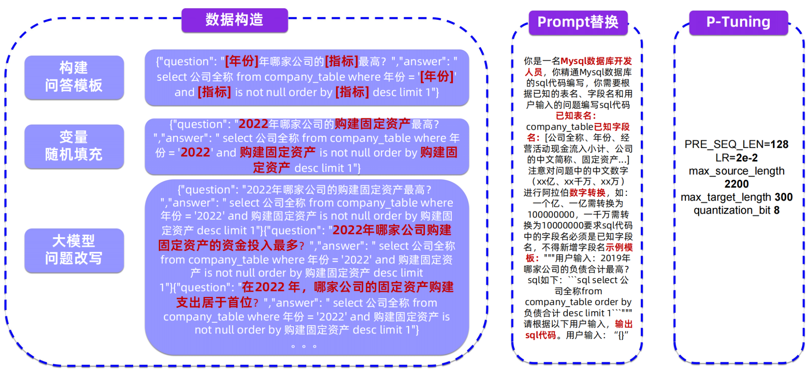
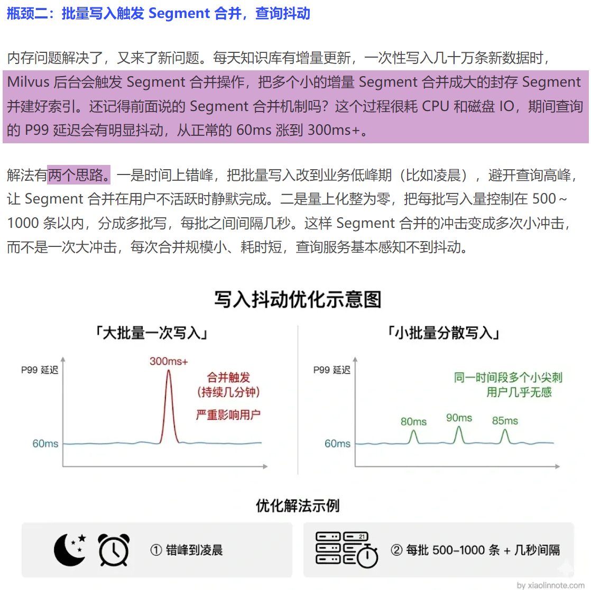
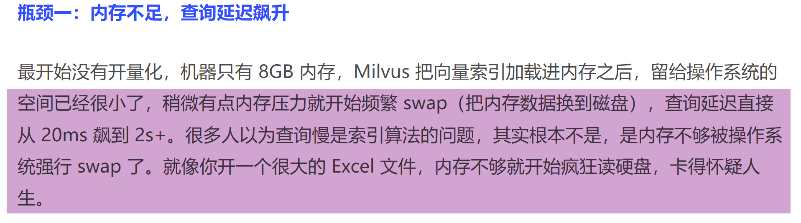
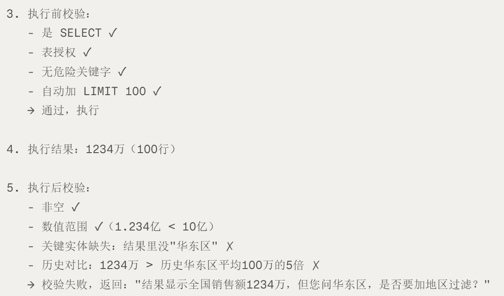

# Text2SQL 与查询校验

<!-- generated: do not hand-edit this file; put durable notes in ../wiki_manual/ -->

## 自动摘要

围绕 NL2SQL、SQL 生成、执行前校验、执行后校验和业务实体一致性的材料集合。

- 证据数量：10 条，其中图片 5 条、文本链接 5 条。
- 涉及 OneNote 页面：Agent, RAG, Text2SQL。

## 关键要点

- Text2SQL 模板生成训练样本：AR 数据构造 eee eee ~ Prompts、 P-Tuning、
/ / /
N\ f \ 1 1 1 |
/ 构建 {"question": " TEAR B) AY 最高? ","answer":" \ 1 你是一名Mysql数据库开发 | | |
I 问答模板 select 公司全称 ffom company_table where 年份 =' | 1 1 人 1 | |
| es and is not null order by desc limit 1"} 1 | 据已知的表名、字段名和用 | | |
| 1。 1 PRA SIRES salttes | _ 已 = {"question": " 年哪冢公司的最局? 1 1! company_table已知字段 | | | 变量 ""answer": "select 公司全称from company_table where 年 1 | SS | PRE SEQ LEN=128 |
=' | SRaOREM NH, Ba I 一 ——
I desc limit 1"} | 1 a i 1 max_source_length 1
i Z, 万、XX万
1 {"question": "2022年哪家公司的购建固定资产最高? | powomiameem am: 1 1 2200 1
I " "answer": "select 公司全称 from company_table where | 1 一个亿、 一亿需转换为 I i ax_ 机本 8 i I 年份 ='2022' and 购建固定资产is not null order by 购建固 | 1 100000000, —FAR% | quantization_bi I
| 定资产 desc limit 1"}{"question": " | 1 pee Sean | | 1
| ARE Manswer": "select Sale;。，。 名，不得新增字段名示例模 1 1 1
I 问题改写 from company_table where #4 ='2022' and 购建国定资 1 | 板: PMA: 2019年 1 | |
[ 产is not null order by 购建固定资产 desc limit 哪家公司的负债合计最高 | 1
ae LIANE 1 1 sqt如下: ”sqlselect 2 |
| 1"j{"question": 1 1 司全称from 1 | 1
| " "answer": "select 公司全称 from 1 | 人 order by 1 i 1
ey 1 o> - Si 4 itt"
\ company_table where #4 = 2022 and 购建固定资产 is pape see e a 1 i
\ not null order by 购建固定资产 desc limit 1" 1/ sat. REMY “DI !
  
- 中国电科十所的研究实验了这套"双向增：中国电科十所的研究实验了这套"双向增强"框架 （问题→SQL正向 + SQL→问题逆向），与仅用少量人工标注语料的LoRA微调相比，模型执行准确率提升了 16.3%，相较few-shot提示学习提升了 35.7%。
- Text2SQL 模板生成训练样本：AR 数据构造 eee eee ~ Prompts、 P-Tuning、
/ / /
N\ f \ 1 1 1 |
/ 构建 {"question": " TEAR B) AY 最高? ","answer":" \ 1 你是一名Mysql数据库开发 | | |
I 问答模板 select 公司全称 ffom company_table where 年份 =' | 1 1 人 1 | |
| es and is not null order by desc limit 1"} 1 | 据已知的表名、字段名和用 | | |
| 1。 1 PRA SIRES salttes | _ 已 = {"question": " 年哪冢公司的最局? 1 1! company_table已知字段 | | | 变量 ""answer": "select 公司全称from company_table where 年 1 | SS | PRE SEQ LEN=128 |
=' | SRaOREM NH, Ba I 一 ——
I desc limit 1"} | 1 a i 1 max_source_length 1
i Z, 万、XX万
1 {"question": "2022年哪家公司的购建固定资产最高? | powomiameem am: 1 1 2200 1
I " "answer": "select 公司全称 from company_table where | 1 一个亿、 一亿需转换为 I i ax_ 机本 8 i I 年份 ='2022' and 购建固定资产is not null order by 购建固 | 1 100000000, —FAR% | quantization_bi I
| 定资产 desc limit 1"}{"question": " | 1 pee Sean | | 1
| ARE Manswer": "select Sale;。，。 名，不得新增字段名示例模 1 1 1
I 问题改写 from company_table where #4 ='2022' and 购建国定资 1 | 板: PMA: 2019年 1 | |
[ 产is not null order by 购建固定资产 desc limit 哪家公司的负债合计最高 | 1
ae LIANE 1 1 sqt如下: ”sqlselect 2 |
| 1"j{"question": 1 1 司全称from 1 | 1
| " "answer": "select 公司全称 from 1 | 人 order by 1 i 1
ey 1 o> - Si 4 itt"
\ company_table where #4 = 2022 and 购建固定资产 is pape see e a 1 i
\ not null order by 购建固定资产 desc limit 1" 1/ sat. REMY “DI !
  
- 小批量错峰写入降低索引抖动：瓶颈二: iS SAR Segment AFH, Agta
内存问题解决了，又来了新问题。每天知识库有增量更新，一次性写入几十万条新数据时，
its. 一是时间上错峰，把批量写入改到业务低峰期 (比如凌晨)，避开查询高峰，
LE Segment 合并在用户不活跃时静默完成。二是量上化整为矢，把每批写入量控制在 500 ~
1000 条以内，分成多批写，每批之间间隔几秒。这样 Segment 合并的冲击变成多次小冲击，
而不是一次大冲击，每次合并规模小、耗时得，查询服务基本感知不到持动。
写入抖动优化示意图
「大批量一次写入1 [小批量分散写入1、 300ms+、 合并触发 — 同一时间段多个小尖刺
(持续几分钟) 用户几乎无感严重影响用户 8oms “90ms “85ms
60ms 60ms
优化解法示例
* OSD eae
¢ () GD 错峰到凌晨 SSIS) © Sit 500-1000 s + Mia
  
- 内存不足会导致向量检索延迟飙升：瓶颈一：内存不足，查询延迟飙升最开始没有开量化，机器只有8GB内存，Milvus把向量索引加载进内存之后，留给操作系统的空间已经很小了，稍微有点内存压万就开始频繁swap（把内存数据换到磁盘），查询延迟直接从20ms飙到2S+0很多人以为查询慢是索引算法的问题，其实根本不是，是内存不够被操作系统强行swap了。就像你开一个很大的Excel文件，内存不够就开始疯狂读硬盘，卡得怀疑人生。
  
- 中国电科十所的研究实验了这套"双向增：中国电科十所的研究实验了这套"双向增强"框架 （问题→SQL正向 + SQL→问题逆向），与仅用少量人工标注语料的LoRA微调相比，模型执行准确率提升了 16.3%，相较few-shot提示学习提升了 35.7%。
- Text2SQL 需要执行前后双校验：3 .执行前校验;
- 是 SELECT V
- RRM V
- 无危险关键字 V
- 自动加 LIMIT 100 V
> 通过，执行
4. 执行结果: 1234万〈100行)
5. 执行后校验:
- 非空 V
- 数值范围 V (1.234亿 < 10亿)
- 关键实体缺失: 结果里没"华东区"” X
- 历史对比: 1234万 > 历史华东区平均100万的5倍 X
> 校验失败，返回: "结果显示全国销售额1234万，但您问华东区，是和否要加地区过滤? "
  
- Text2SQL 应作为只读受控工具：在工程中，我把 Text2SQL 作为 Agent 的一个只读工具来设计。 Agent 负责意图判断、歧义澄清和流程调度， Text2SQL 只在条件齐全时被调用。
- 在实现上，我通过动态 Schema ：在实现上，我通过动态 Schema 裁剪降低 token 和歧义，通过业务术语词典和澄清机制提升理解准确率，并在执行前加入 SQL 安全校验和 LIMIT 约束，防止风险查询。
- 执行后，我会对结果做合理性验证，并结：执行后，我会对结果做合理性验证，并结合日志和用户反馈持续优化 few-shot 示例，从而形成稳定可迭代的闭环系统。

## 证据表

| evidence_id | 类型 | OneNote 页面 | 原链接 | 图片 | 摘要片段 |
|---|---|---|---|---|---|
| agent_img_001_004_90500f357b93 | onenote_image | Agent |  |  | Text2SQL 模板生成训练样本: AR 数据构造 eee eee ~ Prompts、 P-Tuning、
/ / /
N\ f \ 1 1 1 |
/ 构建 {"question": " TEAR B) AY 最高? ","answer":" \ 1 你是一名Mysql数据库开发 | | |
I 问答模板 select 公司全称 ffom company_table where 年份 =' | 1 1 人 1 | |
| es and is not null order by desc limit 1"} 1 | 据已知的表名、字段名和用 | | |
| 1。 1 PRA SIRES salttes | _ 已 = {"question": " 年哪冢公司的最局? 1 1! company_table已知字段 | | | 变量 ""answer": "select 公司全称from company_table where 年 1 | SS | PRE SEQ LEN=128 |
=' | SRaOREM NH, Ba I 一 ——
I desc limit 1"} | 1 a i 1 max_source_length 1
i Z, 万、XX万
1 {"question": "2022年哪家公司的购建固定资产最高? | powomiameem am: 1 1 2200 1
I " "answer": "select 公司全称 from company_table where | 1 一个亿、 一亿需转换为 I i ax_ 机本 8 i I 年份 ='2022' and 购建固定资产is not null order by 购建固 | 1 100000000, —FAR% | quantization_bi I
| 定资产 desc limit 1"}{"question": " | 1 pee Sean | | 1
| ARE Manswer": "select Sale;。，。 名，不得新增字段名示例模 1 1 1
I 问题改写 from company_table where #4 ='2022' and 购建国定资 1 | 板: PMA: 2019年 1 | |
[ 产is not null order by 购建固定资产 desc limit 哪家公司的负债合计最高 | 1
ae LIANE 1 1 sqt如下: ”sqlselect 2 |
| 1"j{"question": 1 1 司全称from 1 | 1
| " "answer": "select 公司全称 from 1 | 人 order by 1 i 1
ey 1 o> - Si 4 itt"
\ company_table where #4 = 2022 and 购建固定资产 is pape see e a 1 i
\ not null order by 购建固定资产 desc limit 1" 1/ sat. REMY “DI ! |
| agent_link_001_003_4eea312600bf | onenote_text_link | Agent | [source](https://pdf.hanspub.org/csa_1543666.pdf) |  | 中国电科十所的研究实验了这套"双向增: 中国电科十所的研究实验了这套"双向增强"框架 （问题→SQL正向 + SQL→问题逆向），与仅用少量人工标注语料的LoRA微调相比，模型执行准确率提升了 16.3%，相较few-shot提示学习提升了 35.7%。 |
| agent_img_002_005_90500f357b93 | onenote_image | RAG |  |  | Text2SQL 模板生成训练样本: AR 数据构造 eee eee ~ Prompts、 P-Tuning、
/ / /
N\ f \ 1 1 1 |
/ 构建 {"question": " TEAR B) AY 最高? ","answer":" \ 1 你是一名Mysql数据库开发 | | |
I 问答模板 select 公司全称 ffom company_table where 年份 =' | 1 1 人 1 | |
| es and is not null order by desc limit 1"} 1 | 据已知的表名、字段名和用 | | |
| 1。 1 PRA SIRES salttes | _ 已 = {"question": " 年哪冢公司的最局? 1 1! company_table已知字段 | | | 变量 ""answer": "select 公司全称from company_table where 年 1 | SS | PRE SEQ LEN=128 |
=' | SRaOREM NH, Ba I 一 ——
I desc limit 1"} | 1 a i 1 max_source_length 1
i Z, 万、XX万
1 {"question": "2022年哪家公司的购建固定资产最高? | powomiameem am: 1 1 2200 1
I " "answer": "select 公司全称 from company_table where | 1 一个亿、 一亿需转换为 I i ax_ 机本 8 i I 年份 ='2022' and 购建固定资产is not null order by 购建固 | 1 100000000, —FAR% | quantization_bi I
| 定资产 desc limit 1"}{"question": " | 1 pee Sean | | 1
| ARE Manswer": "select Sale;。，。 名，不得新增字段名示例模 1 1 1
I 问题改写 from company_table where #4 ='2022' and 购建国定资 1 | 板: PMA: 2019年 1 | |
[ 产is not null order by 购建固定资产 desc limit 哪家公司的负债合计最高 | 1
ae LIANE 1 1 sqt如下: ”sqlselect 2 |
| 1"j{"question": 1 1 司全称from 1 | 1
| " "answer": "select 公司全称 from 1 | 人 order by 1 i 1
ey 1 o> - Si 4 itt"
\ company_table where #4 = 2022 and 购建固定资产 is pape see e a 1 i
\ not null order by 购建固定资产 desc limit 1" 1/ sat. REMY “DI ! |
| agent_img_002_026_f9760a189147 | onenote_image | RAG | [source](https://mp.weixin.qq.com/s/i9L-II6miRrQ1em3O3UFnw) |  | 小批量错峰写入降低索引抖动: 瓶颈二: iS SAR Segment AFH, Agta
内存问题解决了，又来了新问题。每天知识库有增量更新，一次性写入几十万条新数据时，
its. 一是时间上错峰，把批量写入改到业务低峰期 (比如凌晨)，避开查询高峰，
LE Segment 合并在用户不活跃时静默完成。二是量上化整为矢，把每批写入量控制在 500 ~
1000 条以内，分成多批写，每批之间间隔几秒。这样 Segment 合并的冲击变成多次小冲击，
而不是一次大冲击，每次合并规模小、耗时得，查询服务基本感知不到持动。
写入抖动优化示意图
「大批量一次写入1 [小批量分散写入1、 300ms+、 合并触发 — 同一时间段多个小尖刺
(持续几分钟) 用户几乎无感严重影响用户 8oms “90ms “85ms
60ms 60ms
优化解法示例
* OSD eae
¢ () GD 错峰到凌晨 SSIS) © Sit 500-1000 s + Mia |
| agent_img_002_027_e76d357cd694 | onenote_image | RAG | [source](https://mp.weixin.qq.com/s/i9L-II6miRrQ1em3O3UFnw) |  | 内存不足会导致向量检索延迟飙升: 瓶颈一：内存不足，查询延迟飙升最开始没有开量化，机器只有8GB内存，Milvus把向量索引加载进内存之后，留给操作系统的空间已经很小了，稍微有点内存压万就开始频繁swap（把内存数据换到磁盘），查询延迟直接从20ms飙到2S+0很多人以为查询慢是索引算法的问题，其实根本不是，是内存不够被操作系统强行swap了。就像你开一个很大的Excel文件，内存不够就开始疯狂读硬盘，卡得怀疑人生。 |
| agent_link_002_002_299ba7379201 | onenote_text_link | RAG | [source](https://pdf.hanspub.org/csa_1543666.pdf) |  | 中国电科十所的研究实验了这套"双向增: 中国电科十所的研究实验了这套"双向增强"框架 （问题→SQL正向 + SQL→问题逆向），与仅用少量人工标注语料的LoRA微调相比，模型执行准确率提升了 16.3%，相较few-shot提示学习提升了 35.7%。 |
| agent_img_004_001_c7a560785213 | onenote_image | Text2SQL |  |  | Text2SQL 需要执行前后双校验: 3 .执行前校验;
- 是 SELECT V
- RRM V
- 无危险关键字 V
- 自动加 LIMIT 100 V
> 通过，执行
4. 执行结果: 1234万〈100行)
5. 执行后校验:
- 非空 V
- 数值范围 V (1.234亿 < 10亿)
- 关键实体缺失: 结果里没"华东区"” X
- 历史对比: 1234万 > 历史华东区平均100万的5倍 X
> 校验失败，返回: "结果显示全国销售额1234万，但您问华东区，是和否要加地区过滤? " |
| agent_link_004_001_a434e04af222 | onenote_text_link | Text2SQL | onenote:#在工程中，我把%20Text2SQL%20作为%20Agent%20的一个只读工具来设计。%20Agent%20负责意图判断、歧义澄清和流程调度，Text2SQL%20只在条件齐全时被调用。&section-id={24CDEF27-AE4E-4836-98CF-E7D923AC149F}&page-id={7868D26B-1E75-4B99-B740-25BBF49A5059}&end&base-path=C:\Users\李鑫\Documents\OneNote%20笔记本\我的笔记本\Agent.one |  | Text2SQL 应作为只读受控工具: 在工程中，我把 Text2SQL 作为 Agent 的一个只读工具来设计。 Agent 负责意图判断、歧义澄清和流程调度， Text2SQL 只在条件齐全时被调用。 |
| agent_link_004_002_1309c6f76a59 | onenote_text_link | Text2SQL | [source](https://mp.weixin.qq.com/s/KG-0kV7cLunKL8GJwu_FCg) |  | 在实现上，我通过动态 Schema : 在实现上，我通过动态 Schema 裁剪降低 token 和歧义，通过业务术语词典和澄清机制提升理解准确率，并在执行前加入 SQL 安全校验和 LIMIT 约束，防止风险查询。 |
| agent_link_004_003_efdfe5a416f4 | onenote_text_link | Text2SQL | [source](https://mp.weixin.qq.com/s/KG-0kV7cLunKL8GJwu_FCg) |  | 执行后，我会对结果做合理性验证，并结: 执行后，我会对结果做合理性验证，并结合日志和用户反馈持续优化 few-shot 示例，从而形成稳定可迭代的闭环系统。 |

## 后续人工补充建议

- 将稳定理解写入 `wiki_manual/`，不要直接修改本文件。
- 已有关联审校页：查看 `wiki_manual/` 下对应主题。
