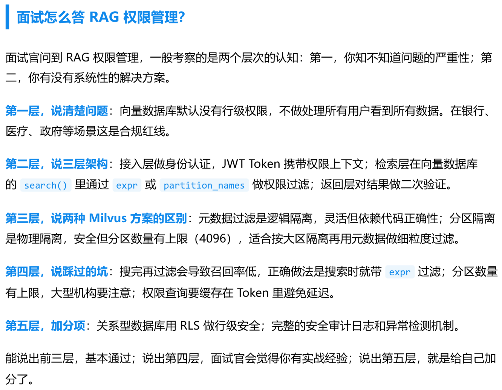
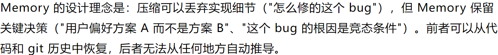

# 容错、权限与安全边界

<!-- generated: do not hand-edit this file; put durable notes in ../wiki_manual/ -->

## 自动摘要

围绕 Agent 安全边界、权限控制、容错机制和数据安全的材料集合。

- 证据数量：4 条，其中图片 4 条、文本链接 0 条。
- 涉及 OneNote 页面：Agent, Claude code, RAG, 容错 / 权限。

## 关键要点

- RAG 权限管理采用三层架构：| 面试怎么答 RAG 权限管理? 面试官问到 RAG 权限管理，一般考察的是两个层次的认知: 第一，你知不知道问题的严重性; 第二，你有没有系统性的解决方案。 第一层，说清楚问题: 向量数据库默认没有行级权限，不做处理上所有用户看到所有数据。在银行、
医疗、政府等场景这是合规红线。 第二层，说三层架构: 接入层做身份认证，JWT Token 携带权限上下文; 检索层在向量数据库的 search() 里通过 expr 或 partition_names 做权限过滤; 返回层对结果做二次验证。 第三层，说两种 Milvus 方案的区别 : 元数据过滤是逻辑隔离，灵活但依赖代码正确性; 分区隔离是物理隔离，安全但分区数量有上限 (4096)，适合按大区隔离再用元数据做细粒度过滤。 第四层，说踩过的坑: 搜完再过滤会导致召回率低，正确做法是搜索时就带 expr 过滤; 分区数量有上限，大型机构要注意; 权限查询要缓存在 Token 里避免延迟。 SHAE, MAM: 关系型数据库用 RLS 做行级安全; 完整的安全审计日志和异常检测机制。 能说出前三层，基本通过; 说出第四层，面试官会觉得你有实战经验; 说出第五屋，就是给自己加
DT.
  
- RAG 权限管理采用三层架构：| 面试怎么答 RAG 权限管理? 面试官问到 RAG 权限管理，一般考察的是两个层次的认知: 第一，你知不知道问题的严重性; 第二，你有没有系统性的解决方案。 第一层，说清楚问题: 向量数据库默认没有行级权限，不做处理上所有用户看到所有数据。在银行、
医疗、政府等场景这是合规红线。 第二层，说三层架构: 接入层做身份认证，JWT Token 携带权限上下文; 检索层在向量数据库的 search() 里通过 expr 或 partition_names 做权限过滤; 返回层对结果做二次验证。 第三层，说两种 Milvus 方案的区别 : 元数据过滤是逻辑隔离，灵活但依赖代码正确性; 分区隔离是物理隔离，安全但分区数量有上限 (4096)，适合按大区隔离再用元数据做细粒度过滤。 第四层，说踩过的坑: 搜完再过滤会导致召回率低，正确做法是搜索时就带 expr 过滤; 分区数量有上限，大型机构要注意; 权限查询要缓存在 Token 里避免延迟。 SHAE, MAM: 关系型数据库用 RLS 做行级安全; 完整的安全审计日志和异常检测机制。 能说出前三层，基本通过; 说出第四层，面试官会觉得你有实战经验; 说出第五屋，就是给自己加
DT.
  
- 容错要让模型感知失败：这是很多人做 Agent 项目时会忽略的地方 : 容错不是 try/except，容错是让模型感知到失败，然后做出正确的决策。
  
- Memory 保留关键决策而非实现细节：Memory 的设计理念是: 压缩可以丢痉实现细节 ( "怎么修的这个 bug")，但 Memory 保留天键决策 ("AP iat se A 而不是方案 B"、 "这个 bug 的根因是竞态条件")。前者可以从代码和 git 历史中恢复，后者无法从任何地方自动推导。
  

## 证据表

| evidence_id | 类型 | OneNote 页面 | 原链接 | 图片 | 摘要片段 |
|---|---|---|---|---|---|
| agent_img_001_010_06e3063fd73c | onenote_image | Agent | [source](https://mp.weixin.qq.com/s/M6BiWlGmfijlU9yUQXmRoA) |  | RAG 权限管理采用三层架构: | 面试怎么答 RAG 权限管理? 面试官问到 RAG 权限管理，一般考察的是两个层次的认知: 第一，你知不知道问题的严重性; 第二，你有没有系统性的解决方案。 第一层，说清楚问题: 向量数据库默认没有行级权限，不做处理上所有用户看到所有数据。在银行、
医疗、政府等场景这是合规红线。 第二层，说三层架构: 接入层做身份认证，JWT Token 携带权限上下文; 检索层在向量数据库的 search() 里通过 expr 或 partition_names 做权限过滤; 返回层对结果做二次验证。 第三层，说两种 Milvus 方案的区别 : 元数据过滤是逻辑隔离，灵活但依赖代码正确性; 分区隔离是物理隔离，安全但分区数量有上限 (4096)，适合按大区隔离再用元数据做细粒度过滤。 第四层，说踩过的坑: 搜完再过滤会导致召回率低，正确做法是搜索时就带 expr 过滤; 分区数量有上限，大型机构要注意; 权限查询要缓存在 Token 里避免延迟。 SHAE, MAM: 关系型数据库用 RLS 做行级安全; 完整的安全审计日志和异常检测机制。 能说出前三层，基本通过; 说出第四层，面试官会觉得你有实战经验; 说出第五屋，就是给自己加
DT. |
| agent_img_002_011_06e3063fd73c | onenote_image | RAG | [source](https://mp.weixin.qq.com/s/M6BiWlGmfijlU9yUQXmRoA) |  | RAG 权限管理采用三层架构: | 面试怎么答 RAG 权限管理? 面试官问到 RAG 权限管理，一般考察的是两个层次的认知: 第一，你知不知道问题的严重性; 第二，你有没有系统性的解决方案。 第一层，说清楚问题: 向量数据库默认没有行级权限，不做处理上所有用户看到所有数据。在银行、
医疗、政府等场景这是合规红线。 第二层，说三层架构: 接入层做身份认证，JWT Token 携带权限上下文; 检索层在向量数据库的 search() 里通过 expr 或 partition_names 做权限过滤; 返回层对结果做二次验证。 第三层，说两种 Milvus 方案的区别 : 元数据过滤是逻辑隔离，灵活但依赖代码正确性; 分区隔离是物理隔离，安全但分区数量有上限 (4096)，适合按大区隔离再用元数据做细粒度过滤。 第四层，说踩过的坑: 搜完再过滤会导致召回率低，正确做法是搜索时就带 expr 过滤; 分区数量有上限，大型机构要注意; 权限查询要缓存在 Token 里避免延迟。 SHAE, MAM: 关系型数据库用 RLS 做行级安全; 完整的安全审计日志和异常检测机制。 能说出前三层，基本通过; 说出第四层，面试官会觉得你有实战经验; 说出第五屋，就是给自己加
DT. |
| agent_img_008_001_28c3e7496fff | onenote_image | 容错 / 权限 | [source](https://mp.weixin.qq.com/s/nvZE1pOGPIH2sJP4yJQxjA) |  | 容错要让模型感知失败: 这是很多人做 Agent 项目时会忽略的地方 : 容错不是 try/except，容错是让模型感知到失败，然后做出正确的决策。 |
| agent_img_010_012_450cba6d1d68 | onenote_image | Claude code |  |  | Memory 保留关键决策而非实现细节: Memory 的设计理念是: 压缩可以丢痉实现细节 ( "怎么修的这个 bug")，但 Memory 保留天键决策 ("AP iat se A 而不是方案 B"、 "这个 bug 的根因是竞态条件")。前者可以从代码和 git 历史中恢复，后者无法从任何地方自动推导。 |

## 后续人工补充建议

- 将稳定理解写入 `wiki_manual/`，不要直接修改本文件。
- 已有关联审校页：查看 `wiki_manual/` 下对应主题。
