# 微调、轨迹与训练数据

<!-- generated: do not hand-edit this file; put durable notes in ../wiki_manual/ -->

## 自动摘要

围绕 SFT、RL、训练数据构造、轨迹评估和模型能力内化的材料集合。

- 证据数量：14 条，其中图片 14 条、文本链接 0 条。
- 涉及 OneNote 页面：Agent, Claude code, RAG, 微调, 杂项。

## 关键要点

- 文档切块先识别标题层级：1. 拆文档: 按行提取文字 + 字体、加粗、缩进等样式
2. 正则挖标题: 匹配章节、编号，生成标题特征 3. 人工标少量数据: 标注 level1/2/3 / 正文 4. 训练小模型: XGBoost 学特征，自动分标题层级 5. 后处理修正: 规则补全错误，得到完整结构 6. 按层级切块: 不割裂语义，生成高质量 chunk
  
- 文档切块先识别标题层级：1. 拆文档: 按行提取文字 + 字体、加粗、缩进等样式
2. 正则挖标题: 匹配章节、编号，生成标题特征 3. 人工标少量数据: 标注 level1/2/3 / 正文 4. 训练小模型: XGBoost 学特征，自动分标题层级 5. 后处理修正: 规则补全错误，得到完整结构 6. 按层级切块: 不割裂语义，生成高质量 chunk
  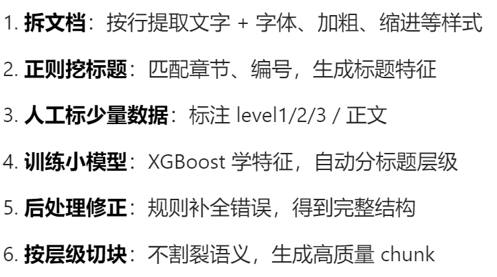
- 用离线实验标定检索阈值：阔值如何标定雹不建议直接拍脑袋设 0.5。正确的做法是用已标注的问答对做离线实验: 准备一批有标准答案的问题，以及人工标注的相关/不相关文要，然后遍历不同的靖值 (比如 0.3 到
0.8 步长 0.05)，计算每个阀值下的 Precision 和 Recall，找到 F1 分数最高的冰值点作为线上使用的闪值。我们训练萤的保险项目通过这种方式找到的最优靖值是 0.52，在此赋值下 F1
从 0.74 提升到了 0.81。
1.0
1王F1最大值 0.81
0.8
* 0.6 ; = Precision
= == Recall Bre | ASB: 0.52 —— FI
二 0.4 1
0.2
0.0
0.3 0.4 0.5 0.6 0.7 0.8
AAD
配图2
  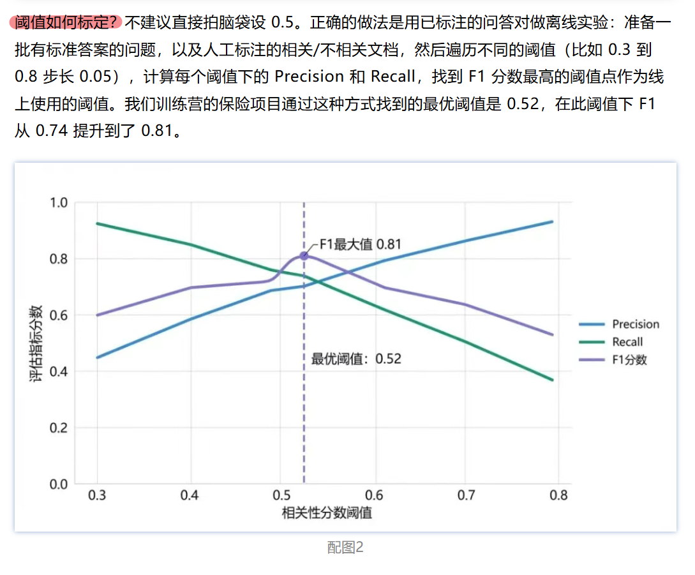
- 动态 RAG 数据质量用五维打分：=, 如何给动态 RAG 数据质量“打分一?
在训练营项目里，我们最终落地的是一个5 维综合评分体系:
ee P = 可解析性
D = 去重质量
R = 相关性
C = 切片质量
F = 时效性即便只是粗评，也能做到:。 哪天怜虫异常。 哪天数据结构变了。 哪天切片失败。 哪天抓取大规模重复。 哪天时效性下降都会自动报警。
  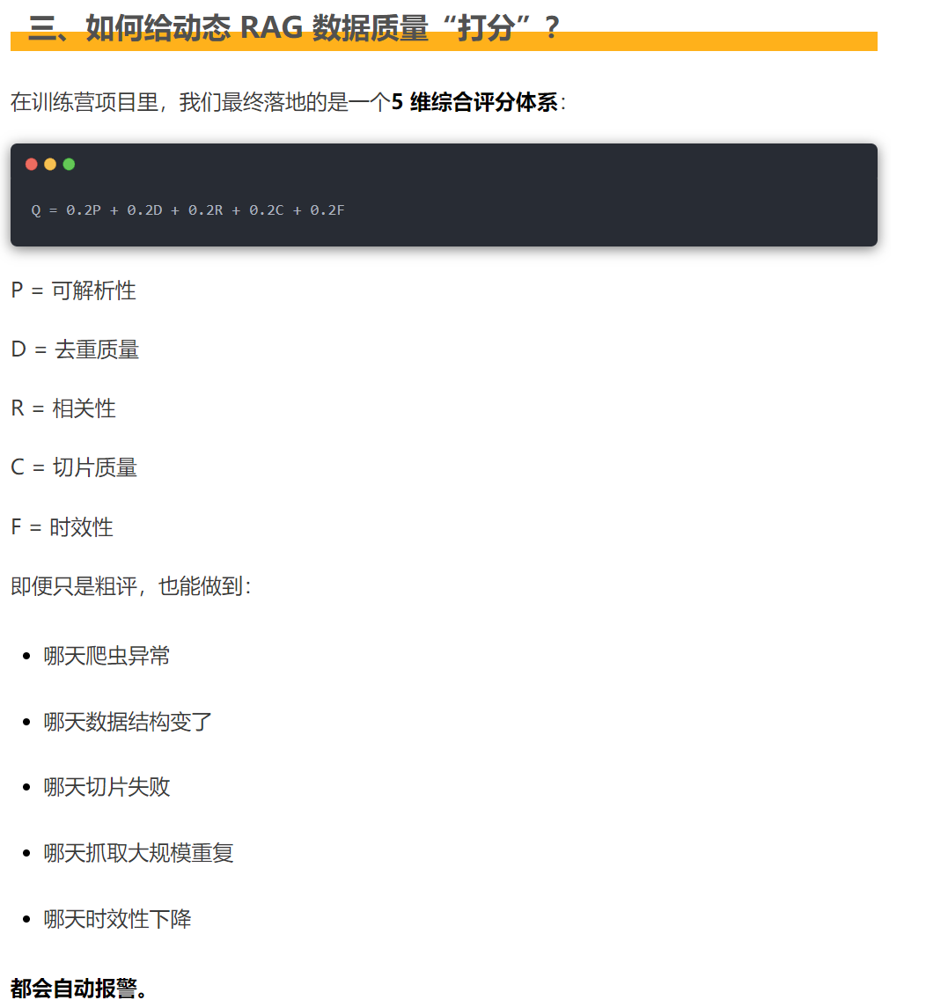
- SFT 数据通过多策略扩充轨迹：、 造流程
SFT 训练数据构造流程 bine hte
3 略轨迹筛选70%、
种子数据扩充后最终训练集
200条 fF 12008 Fy wales ES 840%
( .， @ 问题改写 x1.5 as V3 格式标准化
Thought Acti SFT微调
cans | SRS。 Haim as Raunt ction Fox
  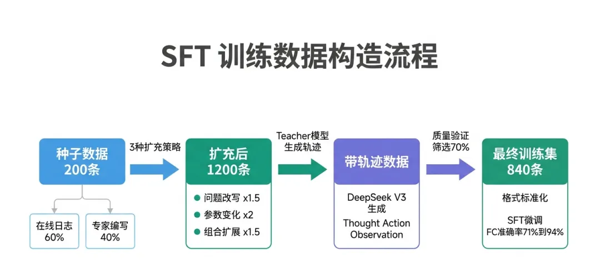
- 微调效果要用三层测试集验证：| 微调完成后: 怎么知道这 23 个百分点是真实的? SFT 做完，皇么验证提升是真实的”这是很多人忽视的步又，也是面试官经党追问的地方。
评估的核心原则是测试集和训练集不能有重奸，测试场景要履导圳练里没见过的分布。 我们构建的测试集有三层: 层 1: 标准测试集 (100 条)。从种子数据里留出来的，没有参与训练。这一层测的是基础能万，主要验证微调没有毅掉基础。 层 2: 分布外测试 (50 条)。履兰训练数据里没有或者很少的场景——比如需要 4 个以上工具协同调用的复杂任务，或者工具返回了错误时的处理。这一层测的是泛化能万。 层 3: 对抗测试 (30 条)。故意构造一些`看起来应该调工具但其实不应该"的问题，测试模型有没有被过拟合到"有问题融调工具"的模式里。比如"2 加 2 等于多少"——正确答案是直接回答 4，而不是调用 Python 工具去计算。
  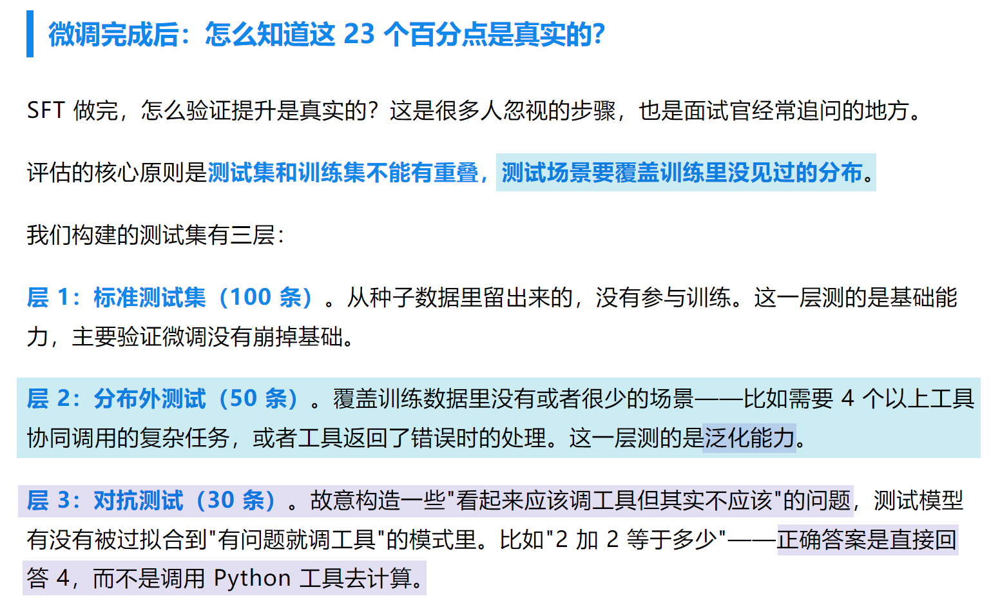
- 工具调用评估需拆分多个维度：测试维度不只看"工具调用准确率"，还要看:。工具选择准确率
: 是否选了正确的工具。参数格式准确率
: 工具名选对了，但参数格式写错了的比例。调用顺序准确率
: 多工具任务里，顺序是否合理 (不该先计算就先搜索。遗忘率
: 微调后在非工具调用任务 (普通问答) 上的表现有没有明显下降最后这一项很重要。SFT 有"遗忘"风险: 专项微调做得太猛，模型会在专项任务上提升，但在其他任务上变差。控制遗忘的方法是在训练数据里混入 30% 的通用指令数据——不能全是工具调用样本，否则模型会"忘记"怎么做普通问答。这个数字 (30%) 是实验出来的，不是拍脑袋定的。
在我们的测试里，FC-SFT 5000 样本 (我们做了更多轮迭代)，工具调用准确率最终从 71%
提升到 94%，普通问答任务的退化在统计上不显著 (MMLU 下降 0.3%，在误差范围内)。
  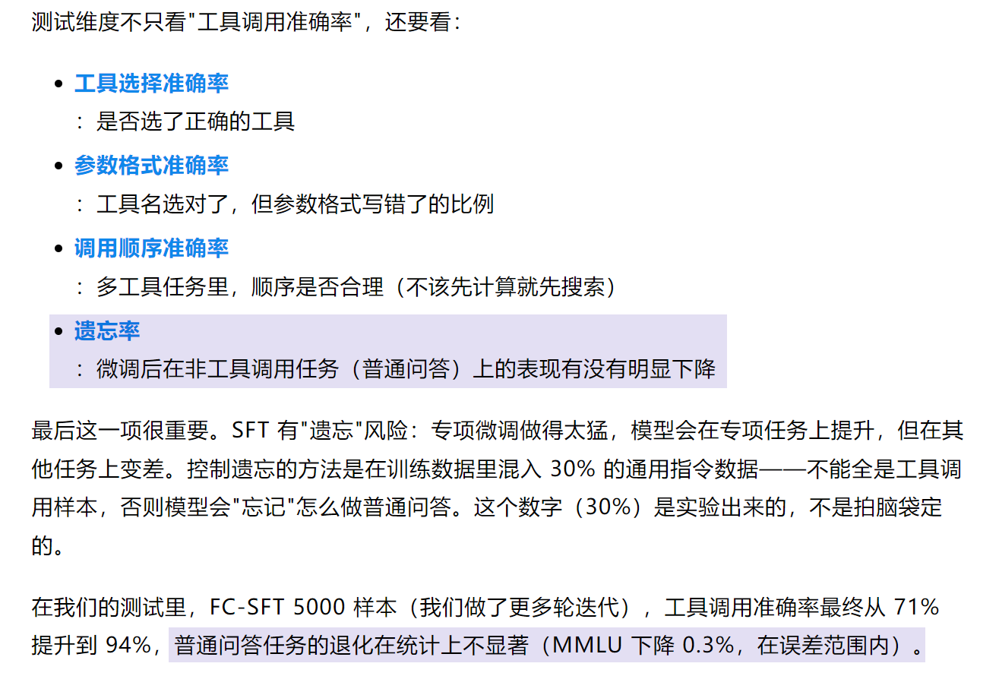
- SFT 学调用流程，RLHF 学边界：第一个是 SFT，就是给模型喂大量 [包含工具调用的完整对话样本|，每条样本覆盖工具定义、用户问题、模型应该输出的结构化 JSON 调用、工具执行结果、最终答案，让模型通过模仿学会整套流程。但光有 SFT 不够，模型可能学得过沿，遇到什么问题都想调工具。 第二个阶段是 RLHF，通过人类标注【哪种回答更好」 来训练奖励模型，再用强化学习调整主
RY, Thera 【能直接回答的就直接回答，需要实时数据才去调工具」 这个边界感。
  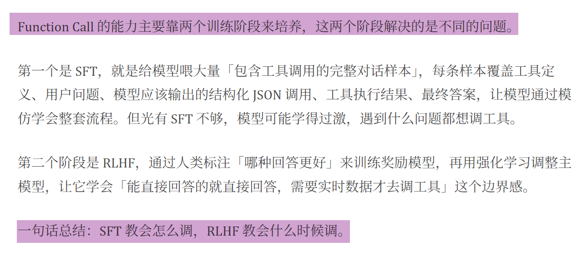
- 人工标注结合蒸馏扩展训练数据：人工标注模型自动生成 (蒸馏)
ao 人工标注员 GF} GPT-4 等强模型
Sr 逐条手写批量生成
Vv Vv een SDE) 批量生成对话样本
=p 逐条标注对话样本 ee w v
质量高但量小人工抽查过滤
(UFR) 去重 / 去噪 / 质检
J v
S|。 用于规模化训练
©} 用于核心种子数据 wa (AMEE)
(高质量基准) Eee
| A 幻觉传递风险:
上游错一个、下游学一个喇了现在业界常用组合:
全 ” ”少量人工保质量 + 大量蒸馏保规模
  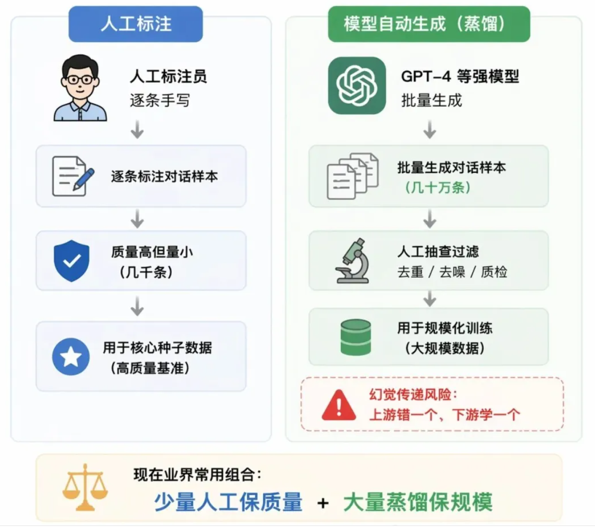
- SFT 与 RLHF 共同训练工具判断：SFT 解决的是 「会不会」 的问题，RLHF 解决的是 DRAMA) 的问题。
只有SFT 而没有RLHF 的模型，可能遇到什么问题都冲动地调工具; 反过来，只有 RLHF 而没有 SFT，模型连工具调用的格式都输不出来，奖励信号根本没地方发万。
两个阶段配合起来，才能训练出【知道怎么调、也知道什么时候该调」 的工具使用能万。
只有 SFT SFT + RLHF
| 141=? 1+1=2 我查一下计算器 _ 我自己可以直接算出
Seen
—— Ere [会不会」，
w sees 要一 V)
RLHF 教会输出 (JSON) 该不该」， 输出 (JSON)
{ =
“action": "calculator", 缺 AY ea "answer", input : “1+1", "answer": 2
"result": 2 } GO GO
会输出规范 JSJON，但过度调用工具既保留 JSON 能万，又有边界感
@ SFT “ RLHF ha 像教新员工流程 aia 像老板教他判断万
2 a 教会他怎么做教会他什么时候该做，什么时候不该做
  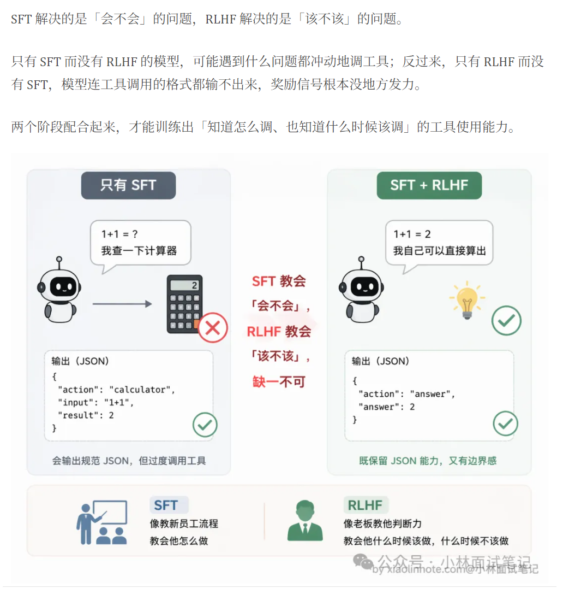
- Hermes 通过 Skill 与 RL 双路径自进化：° . 6 ” Z = 66 * ”
Self-Evolving: “内外”双路径驱动的“目进化
Hermes Agent之所以可以做到“自进化”，最主要就是依赖于两条路径: 一是日常的自动skil生成 (Skill Generation)，可以快速、轻量、即时生效; 至是可以手动触发的RE训练(Reinforcement Learning)，从更深度、根本上改变模型本身的能万。这两种路径共同构成了Hermes Agent的“内外”双轮驱动的“自进化闭环”。
路径一: 自动Skill生成 (日常运行时)
ag Meets 二生效速度: 即时 + 改变什么: Agent. Fs
1D) 10 轮对话自动触发 (下一轮对话就能用) ”下文知识 (SNE)，不改模型路径二: RL训练〈需手动触发)
< 质量 => GRPO <i} &
Pl MAB: 用户通过 =) 生效速度: 慢改变什么: 模型本身的
rl cli.py 手动发起 =Y (训练需要数小时) lem ee (内在能万) |
  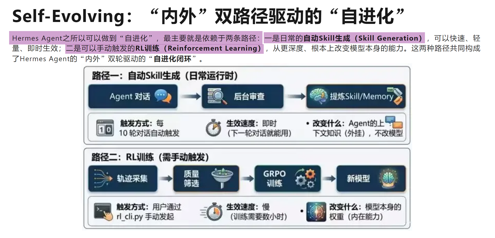
- RL 训练将经验内化到模型权重：RL训练财环: “权重内化”的终极“自进化” 虽然通过动态生成 Skill 沉淀实现的司2E进化在时效性和可解释性正表现优异 —— 毕竟明文记录的 Markdown 文件允许人工进来进行干预和纠偏，确保
Agent 不会在错误的道路上越走越远 —— 但我们儿须承认一个事实: 这并不是真正意义上的“自进化”或者“自我学习”。因为无论 Agent RAT BZ skill,
其底层的“模型权重”始终没变。它只是在不断地检索外部知识库，而非将经验内化为自身的直觉与能万。对于追求极致性能、或在特定垂直领域需要突破通用模型瓶颈的场景来说，这种基于Context Engineering的优化方式依然存在着天化板。 因此，Hermes 引入了第二条更深层、更直接的进化路径: 基于强化学习 (RL) 的模型训练闭环。如果说 Skill 生成是“记笔记”，那么 RL 训练就是“练内功”，就是在通过改变模型权重，实现真正的能万“自进化”。这个部分比较像Andrej Karpathy之前时间提出的开源项目AutoResearch[3]，可以在单GPU上做自动化的RL模型训练，但Hermes相比而言做的更加完善和成熟。 Hermes 在项目的 README.md文件中有个说法是iResearchsReady' (HAMA) WEAVE. 为什么不直接叫“Model Fine-Tuning”或者“Model Training”呢?这就恰恰反映出了 Hermes 的一个细节了,到是构建二会从数据合成质量第选、RB咱练环境构建、小规模实验、 正式训练及自动化评估的一个完整闭环，所以如果只强调是“模型训练”，反而把格局变小了。 整个RL训练过程分阶段来看，主要是下面几个部分 :。 任务定义: 用户可以指定具体的训练目标，例如“提升数学推理能万”或“优化特定业务问题”的成功率。系统会根据目标去选择可用的训练数据、
Benchmark或者让用户提供相应数据集。。 轨迹捕获 & 批量数据合成: Hermes 内置了批量处理模块batch_runner.py，能够自动去合成Agent的运行轨迹 (Trajectory)，并且饰选过滤出高质量的数据集。然后将这些轨迹数据清洗并转换为标准的ShareGPT格式，为后续的模型训练提供高质量的“原料”。在这个过程中，Hermes 通常会利用最强的旗舰模型 (如 Claude Opus 4.6) 作为“教师模型”来生成初始的高质量示范数据，确立一个高起点的Baseline。随后，系统会自动创建隔离的RL训练环境，并配置相应的超参数。。 渐进式训练与自动评估: 为了降低试错成本，Hermes 采用“小步快跑”策略: 先使用小规模数据集进行实验性训练，验证可行性后，再启动正式的大规模训练。训练结束后，系统会自动评估 (Evaluate)，分析各项指标是否有显著提升。如果效果未达预期，反馈信号将指导下一轮的参数调整或数据优化; 如果效果显著，则将该版本模型固化。。 领域内的局部最优解: 这套机制的价值在于，它能让通用大模型在特定领域 (Domain-Specific) 实现超越基座模型的表现。通过强化学习中的奖励机制 (Reward Model)，模型不再仪仅依赖通用的概率预测，而是针对特定场景下的正确行为获得正向反馈，从而逐渐“学会”该领域的专有逻辑，最终达到该场景下的局部最优解。
  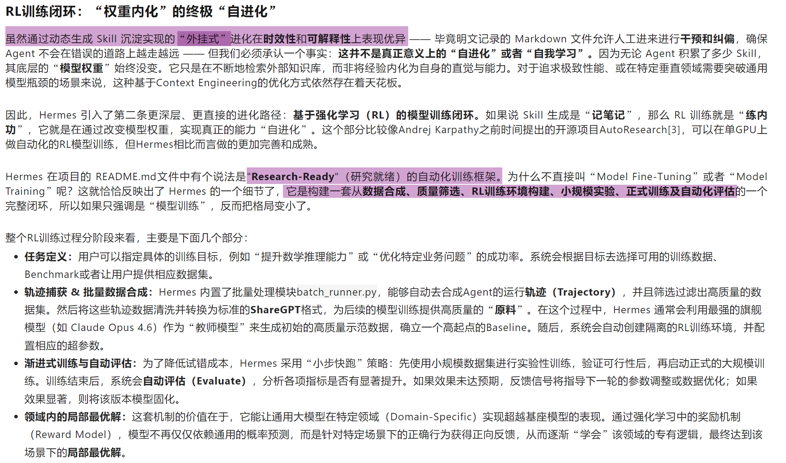
- 用户角色记忆指导回答关注点：2. 子文件一: user_role data_scientist.md
文件路径:
~/.claude/projects/a3f8c2bidee9/memory/user_role_data_scientist.md OD
文件内容:
4《》 Markdown 加
name: user_role_ data_scientist description: 用户是数据科学家，关注数据管道、可观测性和横型评估
type: user
用户主要以数据科学家和机器学习工程视角使用 Claude Code.
回答时应优先关注以下方面:
1. 数据管道是否稳定、可追踪、可复现。
2. 指标口径是否清晰，尤其是样本量、窗口期、过滤条件和异常值处理。
3. 模型评估是人否包含离线指标、线上指标和监控指标。
4. 代码解释需要说明数据流、状态变化和边界条件。
用户通常不满足于“怎么用”的回答，更希望理解“为什么这样设计”。
  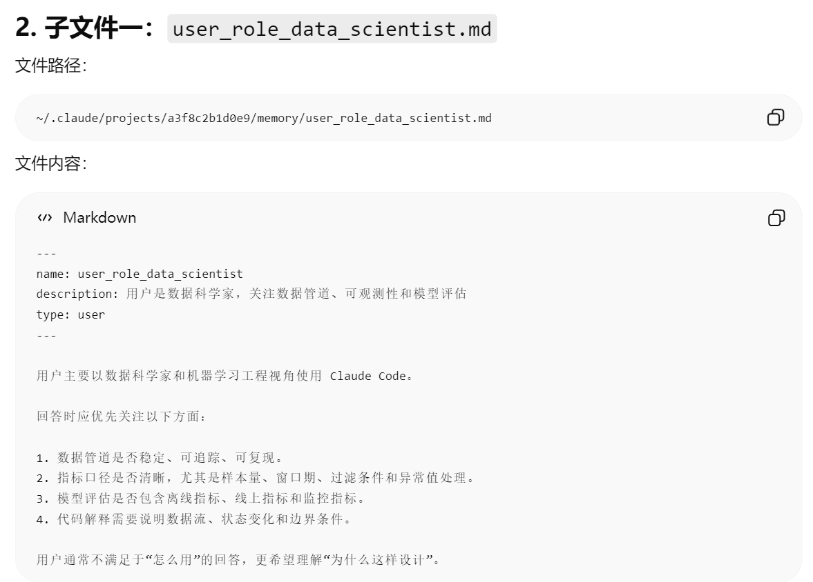
- Memory 索引汇总用户偏好和反馈：<> Markdown (ey
- [user_role_data_scientist](user_role_data_scientist.md) -- 用户是数据科学家，关注数据管道、可观测性和模型评估
- [user_pref_deep_explanation](user_pref_deep_explanation.md) -- 用户喜欢机制级、源码级、流程级的详细解释
- [feedback_no_mock_database](feedback_no_mock_database.md) -- 不要在数据库测试中使用 mock，需要真实数据库或测试容
- [feedback_no_fake_business_data](feedback_no_fake_business_data.md) -- 不要编造业务数据; 不确定时要明确说明假设
- [project_release_freeze_2626_65 67](project_release_freeze_2626 65 67.md) -- ingest-service 项目在 2026-05-07
- [project_ingest_refactor](project_ingest_refactor.md) -- ingestion 模块正在从同步批处理改造成异步队列架构
- [reference_linear_ingest_bug](reference_linear_ingest_bug.md) -- pipeline 延玉问题在 Linear 的 INGEST-4821 ‘11
- [reference_sentry_dashboard](reference_sentry_dashboard.md) -- ingest-service 的钳误监控入口在 Sentry ingestio
《人你可以先把 MEMORY.md 理解成这样:
MEMORY .md = 当前项目的记忆目录 ‘eo!
—— AN = 局它只告诉模型有哪些记忆， O)
每条记忆大概是什么;
如果需要详细内容，应该读哪个子 md 文件。
  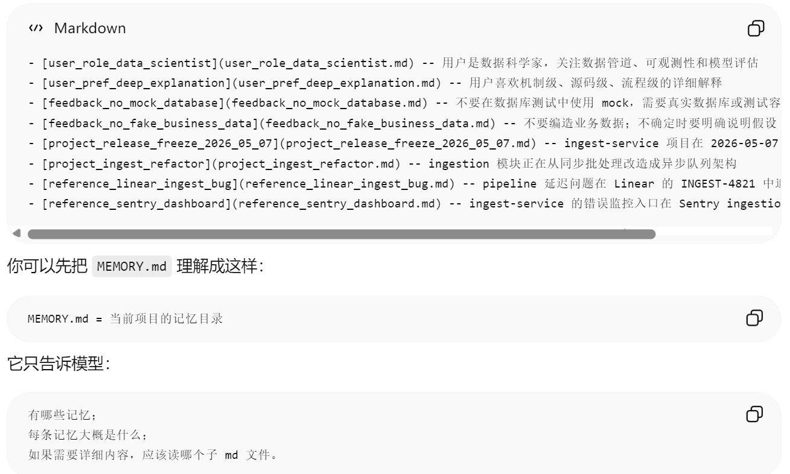

## 证据表

| evidence_id | 类型 | OneNote 页面 | 原链接 | 图片 | 摘要片段 |
|---|---|---|---|---|---|
| agent_img_001_001_e11ee8244f22 | onenote_image | Agent |  |  | 文档切块先识别标题层级: 1. 拆文档: 按行提取文字 + 字体、加粗、缩进等样式
2. 正则挖标题: 匹配章节、编号，生成标题特征 3. 人工标少量数据: 标注 level1/2/3 / 正文 4. 训练小模型: XGBoost 学特征，自动分标题层级 5. 后处理修正: 规则补全错误，得到完整结构 6. 按层级切块: 不割裂语义，生成高质量 chunk |
| agent_img_002_002_e11ee8244f22 | onenote_image | RAG |  |  | 文档切块先识别标题层级: 1. 拆文档: 按行提取文字 + 字体、加粗、缩进等样式
2. 正则挖标题: 匹配章节、编号，生成标题特征 3. 人工标少量数据: 标注 level1/2/3 / 正文 4. 训练小模型: XGBoost 学特征，自动分标题层级 5. 后处理修正: 规则补全错误，得到完整结构 6. 按层级切块: 不割裂语义，生成高质量 chunk |
| agent_img_002_015_f700f7babd51 | onenote_image | RAG | [source](https://mp.weixin.qq.com/s/1GZtibu07K2rzhGF-PZJ2Q) |  | 用离线实验标定检索阈值: 阔值如何标定雹不建议直接拍脑袋设 0.5。正确的做法是用已标注的问答对做离线实验: 准备一批有标准答案的问题，以及人工标注的相关/不相关文要，然后遍历不同的靖值 (比如 0.3 到
0.8 步长 0.05)，计算每个阀值下的 Precision 和 Recall，找到 F1 分数最高的冰值点作为线上使用的闪值。我们训练萤的保险项目通过这种方式找到的最优靖值是 0.52，在此赋值下 F1
从 0.74 提升到了 0.81。
1.0
1王F1最大值 0.81
0.8
* 0.6 ; = Precision
= == Recall Bre | ASB: 0.52 —— FI
二 0.4 1
0.2
0.0
0.3 0.4 0.5 0.6 0.7 0.8
AAD
配图2 |
| agent_img_002_034_dc0373ea17a7 | onenote_image | RAG | [source](https://mp.weixin.qq.com/s?__biz=MzkzMDIwMzg1Mw==&mid=2247489172&idx=1&sn=bf3a10e4f280767835a66be85ee602eb&chksm=c27c8736f50b0e20fb7342bf349260ba061c6c2b45ac26955232dfc71a809fba098a671a904a&cur_album_id=3045414873540739074&scene=189#wechat_redirect) |  | 动态 RAG 数据质量用五维打分: =, 如何给动态 RAG 数据质量“打分一?
在训练营项目里，我们最终落地的是一个5 维综合评分体系:
ee P = 可解析性
D = 去重质量
R = 相关性
C = 切片质量
F = 时效性即便只是粗评，也能做到:。 哪天怜虫异常。 哪天数据结构变了。 哪天切片失败。 哪天抓取大规模重复。 哪天时效性下降都会自动报警。 |
| agent_img_005_002_2a1ff9be530f | onenote_image | 微调 | [source](https://mp.weixin.qq.com/s?__biz=MzkzMDIwMzg1Mw==&mid=2247490352&idx=1&sn=c939b0dfe04ec996333465dc36104aa1&chksm=c3200f0c6778a816179a634c3baef843f29a5519029d240cd521dc2de2dc8cf95f9c34523edc&scene=126&sessionid=1778660362&subscene=91&clicktime=1778660363&enterid=1778660363#rd) |  | SFT 数据通过多策略扩充轨迹: 、 造流程
SFT 训练数据构造流程 bine hte
3 略轨迹筛选70%、
种子数据扩充后最终训练集
200条 fF 12008 Fy wales ES 840%
( .， @ 问题改写 x1.5 as V3 格式标准化
Thought Acti SFT微调
cans | SRS。 Haim as Raunt ction Fox |
| agent_img_005_003_90624dde4170 | onenote_image | 微调 | [source](https://mp.weixin.qq.com/s?__biz=MzkzMDIwMzg1Mw==&mid=2247490352&idx=1&sn=c939b0dfe04ec996333465dc36104aa1&chksm=c3200f0c6778a816179a634c3baef843f29a5519029d240cd521dc2de2dc8cf95f9c34523edc&scene=126&sessionid=1778660362&subscene=91&clicktime=1778660363&enterid=1778660363#rd) |  | 微调效果要用三层测试集验证: | 微调完成后: 怎么知道这 23 个百分点是真实的? SFT 做完，皇么验证提升是真实的”这是很多人忽视的步又，也是面试官经党追问的地方。
评估的核心原则是测试集和训练集不能有重奸，测试场景要履导圳练里没见过的分布。 我们构建的测试集有三层: 层 1: 标准测试集 (100 条)。从种子数据里留出来的，没有参与训练。这一层测的是基础能万，主要验证微调没有毅掉基础。 层 2: 分布外测试 (50 条)。履兰训练数据里没有或者很少的场景——比如需要 4 个以上工具协同调用的复杂任务，或者工具返回了错误时的处理。这一层测的是泛化能万。 层 3: 对抗测试 (30 条)。故意构造一些`看起来应该调工具但其实不应该"的问题，测试模型有没有被过拟合到"有问题融调工具"的模式里。比如"2 加 2 等于多少"——正确答案是直接回答 4，而不是调用 Python 工具去计算。 |
| agent_img_005_004_0f915a300596 | onenote_image | 微调 |  |  | 工具调用评估需拆分多个维度: 测试维度不只看"工具调用准确率"，还要看:。工具选择准确率
: 是否选了正确的工具。参数格式准确率
: 工具名选对了，但参数格式写错了的比例。调用顺序准确率
: 多工具任务里，顺序是否合理 (不该先计算就先搜索。遗忘率
: 微调后在非工具调用任务 (普通问答) 上的表现有没有明显下降最后这一项很重要。SFT 有"遗忘"风险: 专项微调做得太猛，模型会在专项任务上提升，但在其他任务上变差。控制遗忘的方法是在训练数据里混入 30% 的通用指令数据——不能全是工具调用样本，否则模型会"忘记"怎么做普通问答。这个数字 (30%) 是实验出来的，不是拍脑袋定的。
在我们的测试里，FC-SFT 5000 样本 (我们做了更多轮迭代)，工具调用准确率最终从 71%
提升到 94%，普通问答任务的退化在统计上不显著 (MMLU 下降 0.3%，在误差范围内)。 |
| agent_img_005_005_1e3f27dfddbc | onenote_image | 微调 | [source](https://mp.weixin.qq.com/s/vOh3qVl9jStG8MSPSnF6jw) |  | SFT 学调用流程，RLHF 学边界: 第一个是 SFT，就是给模型喂大量 [包含工具调用的完整对话样本|，每条样本覆盖工具定义、用户问题、模型应该输出的结构化 JSON 调用、工具执行结果、最终答案，让模型通过模仿学会整套流程。但光有 SFT 不够，模型可能学得过沿，遇到什么问题都想调工具。 第二个阶段是 RLHF，通过人类标注【哪种回答更好」 来训练奖励模型，再用强化学习调整主
RY, Thera 【能直接回答的就直接回答，需要实时数据才去调工具」 这个边界感。 |
| agent_img_005_006_82adbd19533c | onenote_image | 微调 |  |  | 人工标注结合蒸馏扩展训练数据: 人工标注模型自动生成 (蒸馏)
ao 人工标注员 GF} GPT-4 等强模型
Sr 逐条手写批量生成
Vv Vv een SDE) 批量生成对话样本
=p 逐条标注对话样本 ee w v
质量高但量小人工抽查过滤
(UFR) 去重 / 去噪 / 质检
J v
S|。 用于规模化训练
©} 用于核心种子数据 wa (AMEE)
(高质量基准) Eee
| A 幻觉传递风险:
上游错一个、下游学一个喇了现在业界常用组合:
全 ” ”少量人工保质量 + 大量蒸馏保规模 |
| agent_img_005_008_8e11e3ef39a2 | onenote_image | 微调 | [source](https://mp.weixin.qq.com/s/vOh3qVl9jStG8MSPSnF6jw) |  | SFT 与 RLHF 共同训练工具判断: SFT 解决的是 「会不会」 的问题，RLHF 解决的是 DRAMA) 的问题。
只有SFT 而没有RLHF 的模型，可能遇到什么问题都冲动地调工具; 反过来，只有 RLHF 而没有 SFT，模型连工具调用的格式都输不出来，奖励信号根本没地方发万。
两个阶段配合起来，才能训练出【知道怎么调、也知道什么时候该调」 的工具使用能万。
只有 SFT SFT + RLHF
| 141=? 1+1=2 我查一下计算器 _ 我自己可以直接算出
Seen
—— Ere [会不会」，
w sees 要一 V)
RLHF 教会输出 (JSON) 该不该」， 输出 (JSON)
{ =
“action": "calculator", 缺 AY ea "answer", input : “1+1", "answer": 2
"result": 2 } GO GO
会输出规范 JSJON，但过度调用工具既保留 JSON 能万，又有边界感
@ SFT “ RLHF ha 像教新员工流程 aia 像老板教他判断万
2 a 教会他怎么做教会他什么时候该做，什么时候不该做 |
| agent_img_009_004_7a49da56130f | onenote_image | 杂项 |  |  | Hermes 通过 Skill 与 RL 双路径自进化: ° . 6 ” Z = 66 * ”
Self-Evolving: “内外”双路径驱动的“目进化
Hermes Agent之所以可以做到“自进化”，最主要就是依赖于两条路径: 一是日常的自动skil生成 (Skill Generation)，可以快速、轻量、即时生效; 至是可以手动触发的RE训练(Reinforcement Learning)，从更深度、根本上改变模型本身的能万。这两种路径共同构成了Hermes Agent的“内外”双轮驱动的“自进化闭环”。
路径一: 自动Skill生成 (日常运行时)
ag Meets 二生效速度: 即时 + 改变什么: Agent. Fs
1D) 10 轮对话自动触发 (下一轮对话就能用) ”下文知识 (SNE)，不改模型路径二: RL训练〈需手动触发)
< 质量 => GRPO <i} &
Pl MAB: 用户通过 =) 生效速度: 慢改变什么: 模型本身的
rl cli.py 手动发起 =Y (训练需要数小时) lem ee (内在能万) | |
| agent_img_009_007_6d1f81043b69 | onenote_image | 杂项 |  |  | RL 训练将经验内化到模型权重: RL训练财环: “权重内化”的终极“自进化” 虽然通过动态生成 Skill 沉淀实现的司2E进化在时效性和可解释性正表现优异 —— 毕竟明文记录的 Markdown 文件允许人工进来进行干预和纠偏，确保
Agent 不会在错误的道路上越走越远 —— 但我们儿须承认一个事实: 这并不是真正意义上的“自进化”或者“自我学习”。因为无论 Agent RAT BZ skill,
其底层的“模型权重”始终没变。它只是在不断地检索外部知识库，而非将经验内化为自身的直觉与能万。对于追求极致性能、或在特定垂直领域需要突破通用模型瓶颈的场景来说，这种基于Context Engineering的优化方式依然存在着天化板。 因此，Hermes 引入了第二条更深层、更直接的进化路径: 基于强化学习 (RL) 的模型训练闭环。如果说 Skill 生成是“记笔记”，那么 RL 训练就是“练内功”，就是在通过改变模型权重，实现真正的能万“自进化”。这个部分比较像Andrej Karpathy之前时间提出的开源项目AutoResearch[3]，可以在单GPU上做自动化的RL模型训练，但Hermes相比而言做的更加完善和成熟。 Hermes 在项目的 README.md文件中有个说法是iResearchsReady' (HAMA) WEAVE. 为什么不直接叫“Model Fine-Tuning”或者“Model Training”呢?这就恰恰反映出了 Hermes 的一个细节了,到是构建二会从数据合成质量第选、RB咱练环境构建、小规模实验、 正式训练及自动化评估的一个完整闭环，所以如果只强调是“模型训练”，反而把格局变小了。 整个RL训练过程分阶段来看，主要是下面几个部分 :。 任务定义: 用户可以指定具体的训练目标，例如“提升数学推理能万”或“优化特定业务问题”的成功率。系统会根据目标去选择可用的训练数据、
Benchmark或者让用户提供相应数据集。。 轨迹捕获 & 批量数据合成: Hermes 内置了批量处理模块batch_runner.py，能够自动去合成Agent的运行轨迹 (Trajectory)，并且饰选过滤出高质量的数据集。然后将这些轨迹数据清洗并转换为标准的ShareGPT格式，为后续的模型训练提供高质量的“原料”。在这个过程中，Hermes 通常会利用最强的旗舰模型 (如 Claude Opus 4.6) 作为“教师模型”来生成初始的高质量示范数据，确立一个高起点的Baseline。随后，系统会自动创建隔离的RL训练环境，并配置相应的超参数。。 渐进式训练与自动评估: 为了降低试错成本，Hermes 采用“小步快跑”策略: 先使用小规模数据集进行实验性训练，验证可行性后，再启动正式的大规模训练。训练结束后，系统会自动评估 (Evaluate)，分析各项指标是否有显著提升。如果效果未达预期，反馈信号将指导下一轮的参数调整或数据优化; 如果效果显著，则将该版本模型固化。。 领域内的局部最优解: 这套机制的价值在于，它能让通用大模型在特定领域 (Domain-Specific) 实现超越基座模型的表现。通过强化学习中的奖励机制 (Reward Model)，模型不再仪仅依赖通用的概率预测，而是针对特定场景下的正确行为获得正向反馈，从而逐渐“学会”该领域的专有逻辑，最终达到该场景下的局部最优解。 |
| agent_img_010_014_190a24782f95 | onenote_image | Claude code |  |  | 用户角色记忆指导回答关注点: 2. 子文件一: user_role data_scientist.md
文件路径:
~/.claude/projects/a3f8c2bidee9/memory/user_role_data_scientist.md OD
文件内容:
4《》 Markdown 加
name: user_role_ data_scientist description: 用户是数据科学家，关注数据管道、可观测性和横型评估
type: user
用户主要以数据科学家和机器学习工程视角使用 Claude Code.
回答时应优先关注以下方面:
1. 数据管道是否稳定、可追踪、可复现。
2. 指标口径是否清晰，尤其是样本量、窗口期、过滤条件和异常值处理。
3. 模型评估是人否包含离线指标、线上指标和监控指标。
4. 代码解释需要说明数据流、状态变化和边界条件。
用户通常不满足于“怎么用”的回答，更希望理解“为什么这样设计”。 |
| agent_img_010_015_8da4dcbcb47c | onenote_image | Claude code |  |  | Memory 索引汇总用户偏好和反馈: <> Markdown (ey
- [user_role_data_scientist](user_role_data_scientist.md) -- 用户是数据科学家，关注数据管道、可观测性和模型评估
- [user_pref_deep_explanation](user_pref_deep_explanation.md) -- 用户喜欢机制级、源码级、流程级的详细解释
- [feedback_no_mock_database](feedback_no_mock_database.md) -- 不要在数据库测试中使用 mock，需要真实数据库或测试容
- [feedback_no_fake_business_data](feedback_no_fake_business_data.md) -- 不要编造业务数据; 不确定时要明确说明假设
- [project_release_freeze_2626_65 67](project_release_freeze_2626 65 67.md) -- ingest-service 项目在 2026-05-07
- [project_ingest_refactor](project_ingest_refactor.md) -- ingestion 模块正在从同步批处理改造成异步队列架构
- [reference_linear_ingest_bug](reference_linear_ingest_bug.md) -- pipeline 延玉问题在 Linear 的 INGEST-4821 ‘11
- [reference_sentry_dashboard](reference_sentry_dashboard.md) -- ingest-service 的钳误监控入口在 Sentry ingestio
《人你可以先把 MEMORY.md 理解成这样:
MEMORY .md = 当前项目的记忆目录 ‘eo!
—— AN = 局它只告诉模型有哪些记忆， O)
每条记忆大概是什么;
如果需要详细内容，应该读哪个子 md 文件。 |

## 后续人工补充建议

- 将稳定理解写入 `wiki_manual/`，不要直接修改本文件。
- 已有关联审校页：查看 `wiki_manual/` 下对应主题。
