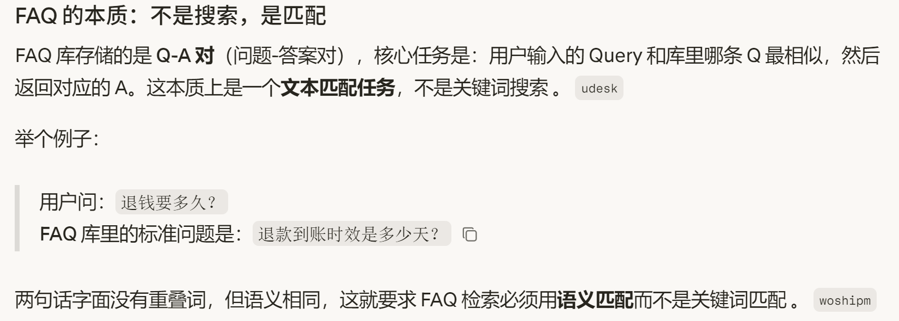
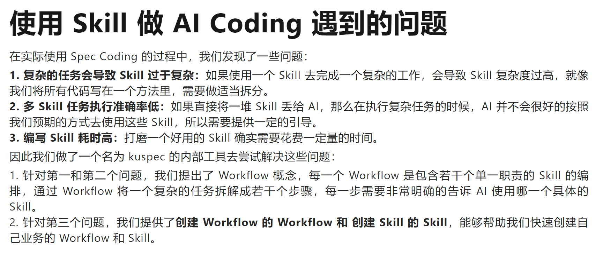
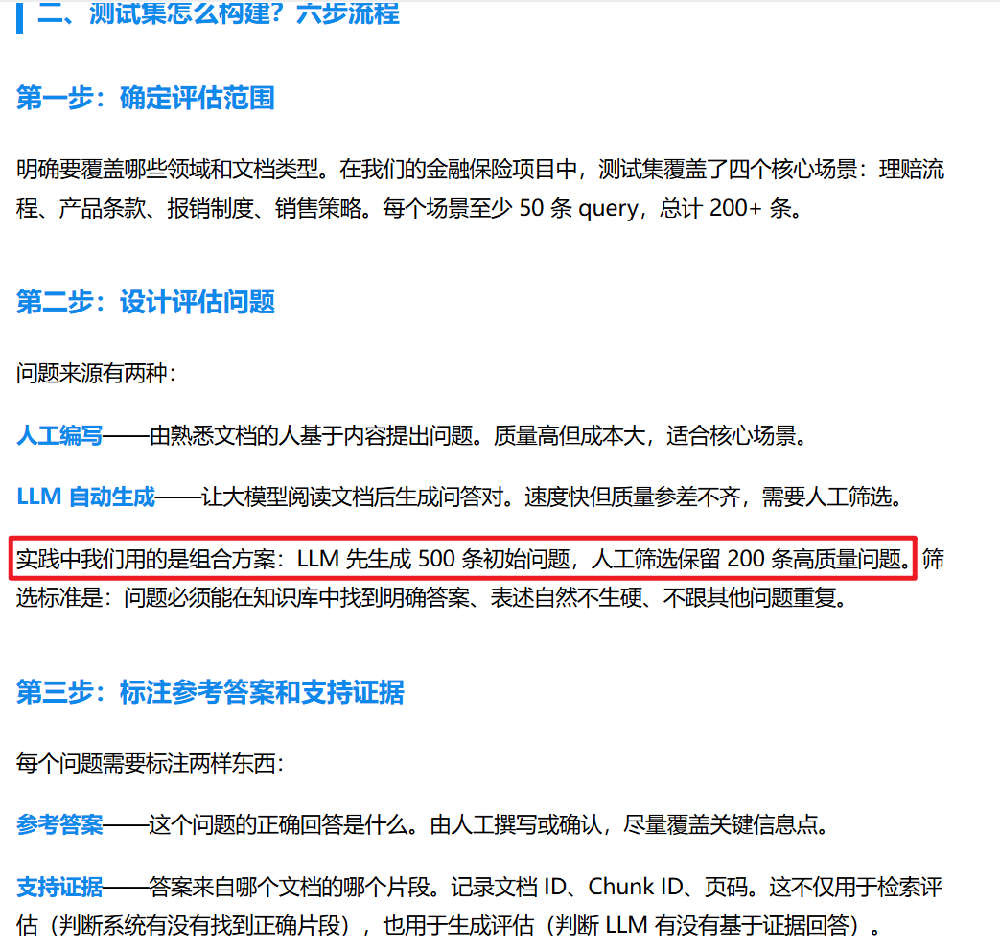
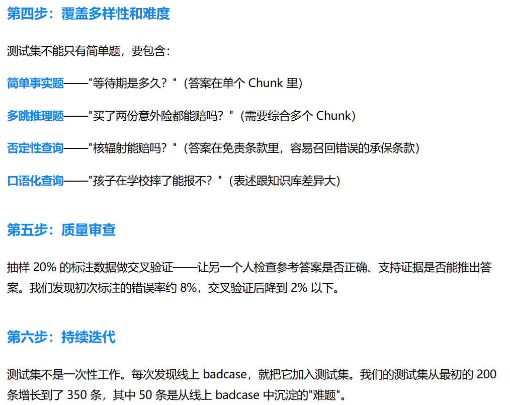
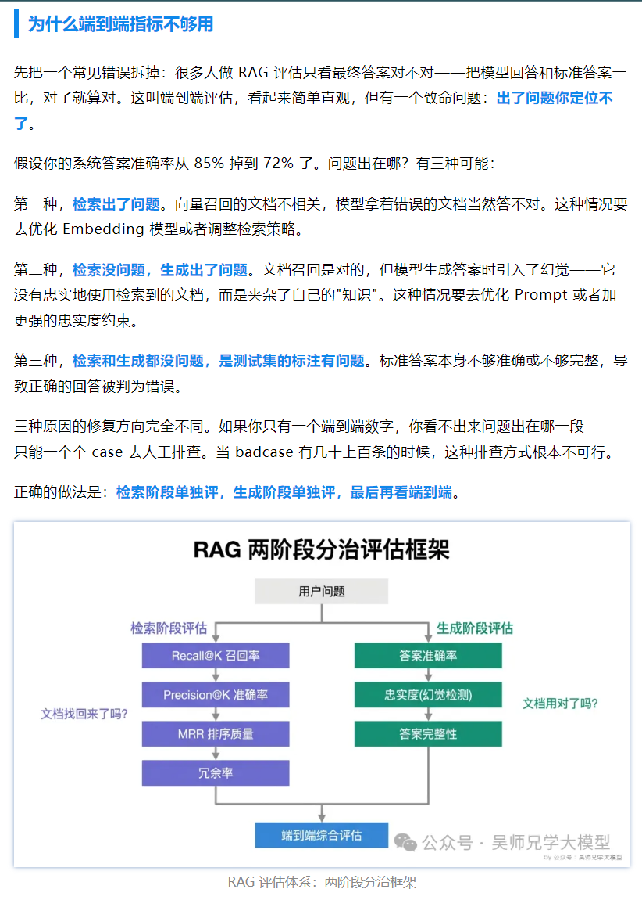
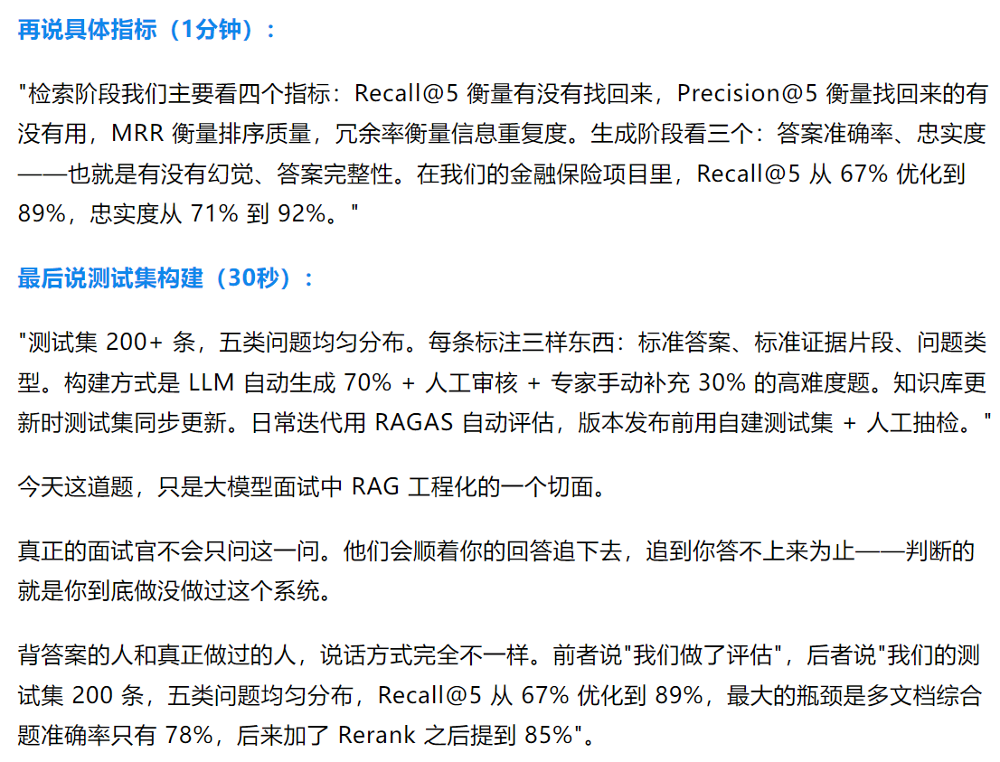

# 评测集与数据构造

<!-- generated: do not hand-edit this file; put durable notes in ../wiki_manual/ -->

## 自动摘要

围绕评测指标、测试集构造、RAGAS 评测和评估方法的数据集合。

- 证据数量：9 条，其中图片 9 条、文本链接 0 条。
- 涉及 OneNote 页面：Agent, RAG。

## 关键要点

- RAG 测试集先确定覆盖范围：| —. Witte Ata? NS intt= 第一步: 确定评估范围明确要履盖哪些领域和文档类型。在我们的金融保险项目中，测试集覆盖了四个核心场景: 理赔流程、产品条款、报销制度、销售策略。每个场景至少 50 条 query, Mit 200+ 条。 第二步: 设计评估问题问题来源有两种: 人工编写——由熟悉文档的人基于内容提出问题。质量高但成本大，适合核心场景。 LLM 自动生成——让大模型阅读文档后生成问答对。速度快但质量参差不齐，需要人工筛选。
选标准是: 问题必须能在知识库中找到明确答案、表述自然不生硬、不跟其他问题重复。 第三步: 标注参考答案和支持证据每个问题需要标注两样东西: 参考答案——这个问题的正确回答是什么。由人工撰写或确认，尽量履盖关键信息点。 支持证据——答案来自哪个文档的哪个片段。记录文档ID、Chunk ID、页码。这不仅用于检索评估 (判断系统有没有找到正确片段)，也用于生成评估 (判断 LLM 有没有基于证据回答)。
  
- 测试集需覆盖多样难题：BOS: 覆盖多样性和难度测试集不能只有简单题，要包含: 简单事实题——"等待期是多久”” (答案在单个 Chunk 里) 多跳推理题——"买了两份意外险都能赔吗? ” (需要综合多个 Chunk) 否定性查询——"核辐射能赔吗?”” (答案在免责条款里，容易召回错误的承保条款) 口语化查询——"孩子在学校摔了能报不?” (表述跟知识库差异大) 第五步: 质量审查抽样 20% 的标注数据做交叉验证——让另一个人检查参考答案是否正确、支持证据是否能推出答案。我们发现初次标注的错误率约 89%，交叉验证后降到 2% 以下。 第六步: RBG 测试集不是一次性工作。每次发现线上 badcase，就把它加入测试集。我们的测试集从最初的 200
条增长到了 350 条，其中 50 条是从线上 badcase 中沉泥的"难题"。
  
- FAQ 问答本质是语义匹配：FAQ 的本质: 不是搜索，是匹配
FAQ 库存储的是Q-A对 (占题-答案对)，核心{王务是: 用户输入的 Query 和库里哪条 Q 最相似，然后返回对应的 A。这本质上是一个文本匹配任务，不是关键词搜索。 udesk
举个例子:
FAP Ia):，退钱要多久?
FAQ 库里的标准问题是: ”退款到账时效是多少天? O
两句话字面没有重考词，但语义相同，这就要求 FAQ 检索必须用语义匹配而不是关键词匹配。 woshipm
  
- 复杂 Skill 任务需要 Workflow 编排：@ @ e y £N % 回使用 Skill 做 Al Coding 录到的问题在实际使用 Spec Coding 的过程中，我们发现了一些问题 :
1. 复杂的任务会导致 Skill 过于复杂: 如果使用一个 Skill 去完成一个复杂的工作，会导致 Skill 复杂度过高，就像我们将所有代码写在一个方法里，需要做适当拆分。
2. 多 Skill 任务执行准确率低: 如果直接将一堆 Skill 丢给 Al1，那么在执行复杂任务的时候，Al 并不会很好的按照我们预期的方式去使用这些 Skill，所以需要提供一定的引导。
3. 编写 Skill 耗时高: 打磨一个好用的 Skill 确实需要人花费一定量的时间。
因此我们做了一个名为 kuspec 的内部工具去党试解决这些问题:
1. 针对第一和第二个问题，我们提出了 Workflow 概念，每一个 Workflow 是包含若干个单一职责的 Skill 的编排，通过 Workflow 将一个复杂的任务拆解成若干个步骤，每一步需要非常明确的告诉 Al 使用哪一个具体的
Skill。
2. 针对第三个问题，我们提供了创建 Workflow 的 Workflow 和创建 Skill 的 Skill，能够帮助我们快速创建自己业务的 Workflow 和 Skill,
  
- RAG 测试集先确定覆盖范围：| —. Witte Ata? NS intt= 第一步: 确定评估范围明确要履盖哪些领域和文档类型。在我们的金融保险项目中，测试集覆盖了四个核心场景: 理赔流程、产品条款、报销制度、销售策略。每个场景至少 50 条 query, Mit 200+ 条。 第二步: 设计评估问题问题来源有两种: 人工编写——由熟悉文档的人基于内容提出问题。质量高但成本大，适合核心场景。 LLM 自动生成——让大模型阅读文档后生成问答对。速度快但质量参差不齐，需要人工筛选。
选标准是: 问题必须能在知识库中找到明确答案、表述自然不生硬、不跟其他问题重复。 第三步: 标注参考答案和支持证据每个问题需要标注两样东西: 参考答案——这个问题的正确回答是什么。由人工撰写或确认，尽量履盖关键信息点。 支持证据——答案来自哪个文档的哪个片段。记录文档ID、Chunk ID、页码。这不仅用于检索评估 (判断系统有没有找到正确片段)，也用于生成评估 (判断 LLM 有没有基于证据回答)。
  
- 测试集需覆盖多样难题：BOS: 覆盖多样性和难度测试集不能只有简单题，要包含: 简单事实题——"等待期是多久”” (答案在单个 Chunk 里) 多跳推理题——"买了两份意外险都能赔吗? ” (需要综合多个 Chunk) 否定性查询——"核辐射能赔吗?”” (答案在免责条款里，容易召回错误的承保条款) 口语化查询——"孩子在学校摔了能报不?” (表述跟知识库差异大) 第五步: 质量审查抽样 20% 的标注数据做交叉验证——让另一个人检查参考答案是否正确、支持证据是否能推出答案。我们发现初次标注的错误率约 89%，交叉验证后降到 2% 以下。 第六步: RBG 测试集不是一次性工作。每次发现线上 badcase，就把它加入测试集。我们的测试集从最初的 200
条增长到了 350 条，其中 50 条是从线上 badcase 中沉泥的"难题"。
  
- FAQ 问答本质是语义匹配：FAQ 的本质: 不是搜索，是匹配
FAQ 库存储的是Q-A对 (占题-答案对)，核心{王务是: 用户输入的 Query 和库里哪条 Q 最相似，然后返回对应的 A。这本质上是一个文本匹配任务，不是关键词搜索。 udesk
举个例子:
FAP Ia):，退钱要多久?
FAQ 库里的标准问题是: ”退款到账时效是多少天? O
两句话字面没有重考词，但语义相同，这就要求 FAQ 检索必须用语义匹配而不是关键词匹配。 woshipm
  
- RAG 评估需拆分检索和生成：| 为什么端到端指标不够用先把一个常见错误拆掉: 很多人做 RAG 评估只看最终答案对不对——把模型回答和标准答案一比，对了就算对。这叫端到端评估，看起来简单直观，但有一个致命问题: 出了问题你定位不
Ty.
假设你的系统答案准确率从 85% 掉到 72% 了。问题出在哪?》有三种可能:
第一种，检索出了问题。向量召回的文档不相关，模型拿着错误的文档当然答不对。这种情况要去优化 Embedding 模型或者调整检索策略。
第二种，检索没问题，生成出了问题。文档召回是对的，但模型生成答案时引入了幻觉——它没有忠实地使用检索到的文档，而是夹杂了自己的"知识"。这种情况要去优化 Prompt 或者加更强的忠实度约束。
第三种，检索和生成都没问题，是测试集的标注有问题。标准答案本身不够准确或不够完整，导致正确的回答被判为错误。
三种原因的修复方向完全不同。如果你只有一个端到端数字，你看不出来问题出在哪一段——
只能一个个 case 去人工排查。当 badcase 有几十上百条的时候，这种排查方式根本不可行。
正确的做法是: 检索阶段单独评，生成阶段单独评，最后再看端到端。
RAG 两阶段分治评估框架用户问题检索阶段评估生成阶段评估
Recall@K 召回率
Precision@K 准确率忠实度(幻觉检测) san
文档找回来了吗? ee al MRR 排序质量答案完整性
VRE RAG 评估体系: 两阶段分治框架
  
- RAG 评估指标覆盖召回与忠实度：再说具体指标 (1分钟) : "检索阶段我们主要看四个指标: Recall@5 衡量有没有找回来，Precision@5 衡量找回来的有没有用，MRR 衡量排序质量，宛余率衡量信息重复度。生成阶段看三个: 答案准确率、忠实度
——也就是有没有幻觉、答案完整性。在我们的金融保险项目里，Recall@5 从 67% 优化到
89%，忠实度从 71% 到 92%, " 最后说测试集构建 (30秒) : "测试集 200+ 条，五类问题均匀分布。每条标注三样东西: 标准答案、标准证据片段、问题类型。构建方式是 LLM 自动生成 70% + 人工审核 + 专家手动补充 30% 的高难度题。知识库更新时测试集同步更新。日常和迭代用 RAGAS 自动评估，版本发布前用自建测试集 + 人工抽检。"
今天这道题，只是大模型面试中 RAG 工程化的一个切面。 真正的面试官不会只问这一问。他们会顺着你的回答追下去，追到你答不上来为止——判断的就是你到底做没做过这个系统。 背答案的人和真正做过的人，说话方式完全不一样。前者说"我们做了评估"，后者说"我们的测试集 200 条，五类问题均匀分布，Recall@5 从 67% 优化到 89%, RANMMESNAEA
题准确率只有 78%，后来加了 Rerank 之后提到 85%",
  

## 证据表

| evidence_id | 类型 | OneNote 页面 | 原链接 | 图片 | 摘要片段 |
|---|---|---|---|---|---|
| agent_img_001_002_cd654a4171e8 | onenote_image | Agent | [source](https://mp.weixin.qq.com/s/GUeJCJfd03cSK5aCoefRaA) |  | RAG 测试集先确定覆盖范围: | —. Witte Ata? NS intt= 第一步: 确定评估范围明确要履盖哪些领域和文档类型。在我们的金融保险项目中，测试集覆盖了四个核心场景: 理赔流程、产品条款、报销制度、销售策略。每个场景至少 50 条 query, Mit 200+ 条。 第二步: 设计评估问题问题来源有两种: 人工编写——由熟悉文档的人基于内容提出问题。质量高但成本大，适合核心场景。 LLM 自动生成——让大模型阅读文档后生成问答对。速度快但质量参差不齐，需要人工筛选。
选标准是: 问题必须能在知识库中找到明确答案、表述自然不生硬、不跟其他问题重复。 第三步: 标注参考答案和支持证据每个问题需要标注两样东西: 参考答案——这个问题的正确回答是什么。由人工撰写或确认，尽量履盖关键信息点。 支持证据——答案来自哪个文档的哪个片段。记录文档ID、Chunk ID、页码。这不仅用于检索评估 (判断系统有没有找到正确片段)，也用于生成评估 (判断 LLM 有没有基于证据回答)。 |
| agent_img_001_003_30bfe2dad039 | onenote_image | Agent | [source](https://mp.weixin.qq.com/s/GUeJCJfd03cSK5aCoefRaA) |  | 测试集需覆盖多样难题: BOS: 覆盖多样性和难度测试集不能只有简单题，要包含: 简单事实题——"等待期是多久”” (答案在单个 Chunk 里) 多跳推理题——"买了两份意外险都能赔吗? ” (需要综合多个 Chunk) 否定性查询——"核辐射能赔吗?”” (答案在免责条款里，容易召回错误的承保条款) 口语化查询——"孩子在学校摔了能报不?” (表述跟知识库差异大) 第五步: 质量审查抽样 20% 的标注数据做交叉验证——让另一个人检查参考答案是否正确、支持证据是否能推出答案。我们发现初次标注的错误率约 89%，交叉验证后降到 2% 以下。 第六步: RBG 测试集不是一次性工作。每次发现线上 badcase，就把它加入测试集。我们的测试集从最初的 200
条增长到了 350 条，其中 50 条是从线上 badcase 中沉泥的"难题"。 |
| agent_img_001_006_ccc7f5e4f8ea | onenote_image | Agent |  |  | FAQ 问答本质是语义匹配: FAQ 的本质: 不是搜索，是匹配
FAQ 库存储的是Q-A对 (占题-答案对)，核心{王务是: 用户输入的 Query 和库里哪条 Q 最相似，然后返回对应的 A。这本质上是一个文本匹配任务，不是关键词搜索。 udesk
举个例子:
FAP Ia):，退钱要多久?
FAQ 库里的标准问题是: ”退款到账时效是多少天? O
两句话字面没有重考词，但语义相同，这就要求 FAQ 检索必须用语义匹配而不是关键词匹配。 woshipm |
| agent_img_001_013_803b291fe2c9 | onenote_image | Agent |  |  | 复杂 Skill 任务需要 Workflow 编排: @ @ e y £N % 回使用 Skill 做 Al Coding 录到的问题在实际使用 Spec Coding 的过程中，我们发现了一些问题 :
1. 复杂的任务会导致 Skill 过于复杂: 如果使用一个 Skill 去完成一个复杂的工作，会导致 Skill 复杂度过高，就像我们将所有代码写在一个方法里，需要做适当拆分。
2. 多 Skill 任务执行准确率低: 如果直接将一堆 Skill 丢给 Al1，那么在执行复杂任务的时候，Al 并不会很好的按照我们预期的方式去使用这些 Skill，所以需要提供一定的引导。
3. 编写 Skill 耗时高: 打磨一个好用的 Skill 确实需要人花费一定量的时间。
因此我们做了一个名为 kuspec 的内部工具去党试解决这些问题:
1. 针对第一和第二个问题，我们提出了 Workflow 概念，每一个 Workflow 是包含若干个单一职责的 Skill 的编排，通过 Workflow 将一个复杂的任务拆解成若干个步骤，每一步需要非常明确的告诉 Al 使用哪一个具体的
Skill。
2. 针对第三个问题，我们提供了创建 Workflow 的 Workflow 和创建 Skill 的 Skill，能够帮助我们快速创建自己业务的 Workflow 和 Skill, |
| agent_img_002_003_cd654a4171e8 | onenote_image | RAG | [source](https://mp.weixin.qq.com/s/GUeJCJfd03cSK5aCoefRaA) |  | RAG 测试集先确定覆盖范围: | —. Witte Ata? NS intt= 第一步: 确定评估范围明确要履盖哪些领域和文档类型。在我们的金融保险项目中，测试集覆盖了四个核心场景: 理赔流程、产品条款、报销制度、销售策略。每个场景至少 50 条 query, Mit 200+ 条。 第二步: 设计评估问题问题来源有两种: 人工编写——由熟悉文档的人基于内容提出问题。质量高但成本大，适合核心场景。 LLM 自动生成——让大模型阅读文档后生成问答对。速度快但质量参差不齐，需要人工筛选。
选标准是: 问题必须能在知识库中找到明确答案、表述自然不生硬、不跟其他问题重复。 第三步: 标注参考答案和支持证据每个问题需要标注两样东西: 参考答案——这个问题的正确回答是什么。由人工撰写或确认，尽量履盖关键信息点。 支持证据——答案来自哪个文档的哪个片段。记录文档ID、Chunk ID、页码。这不仅用于检索评估 (判断系统有没有找到正确片段)，也用于生成评估 (判断 LLM 有没有基于证据回答)。 |
| agent_img_002_004_30bfe2dad039 | onenote_image | RAG | [source](https://mp.weixin.qq.com/s/GUeJCJfd03cSK5aCoefRaA) |  | 测试集需覆盖多样难题: BOS: 覆盖多样性和难度测试集不能只有简单题，要包含: 简单事实题——"等待期是多久”” (答案在单个 Chunk 里) 多跳推理题——"买了两份意外险都能赔吗? ” (需要综合多个 Chunk) 否定性查询——"核辐射能赔吗?”” (答案在免责条款里，容易召回错误的承保条款) 口语化查询——"孩子在学校摔了能报不?” (表述跟知识库差异大) 第五步: 质量审查抽样 20% 的标注数据做交叉验证——让另一个人检查参考答案是否正确、支持证据是否能推出答案。我们发现初次标注的错误率约 89%，交叉验证后降到 2% 以下。 第六步: RBG 测试集不是一次性工作。每次发现线上 badcase，就把它加入测试集。我们的测试集从最初的 200
条增长到了 350 条，其中 50 条是从线上 badcase 中沉泥的"难题"。 |
| agent_img_002_007_ccc7f5e4f8ea | onenote_image | RAG |  |  | FAQ 问答本质是语义匹配: FAQ 的本质: 不是搜索，是匹配
FAQ 库存储的是Q-A对 (占题-答案对)，核心{王务是: 用户输入的 Query 和库里哪条 Q 最相似，然后返回对应的 A。这本质上是一个文本匹配任务，不是关键词搜索。 udesk
举个例子:
FAP Ia):，退钱要多久?
FAQ 库里的标准问题是: ”退款到账时效是多少天? O
两句话字面没有重考词，但语义相同，这就要求 FAQ 检索必须用语义匹配而不是关键词匹配。 woshipm |
| agent_img_002_032_4819f89e3efc | onenote_image | RAG | [source](https://mp.weixin.qq.com/s/uIHCaA1bUo8d8m5bfOQ0TQ) |  | RAG 评估需拆分检索和生成: | 为什么端到端指标不够用先把一个常见错误拆掉: 很多人做 RAG 评估只看最终答案对不对——把模型回答和标准答案一比，对了就算对。这叫端到端评估，看起来简单直观，但有一个致命问题: 出了问题你定位不
Ty.
假设你的系统答案准确率从 85% 掉到 72% 了。问题出在哪?》有三种可能:
第一种，检索出了问题。向量召回的文档不相关，模型拿着错误的文档当然答不对。这种情况要去优化 Embedding 模型或者调整检索策略。
第二种，检索没问题，生成出了问题。文档召回是对的，但模型生成答案时引入了幻觉——它没有忠实地使用检索到的文档，而是夹杂了自己的"知识"。这种情况要去优化 Prompt 或者加更强的忠实度约束。
第三种，检索和生成都没问题，是测试集的标注有问题。标准答案本身不够准确或不够完整，导致正确的回答被判为错误。
三种原因的修复方向完全不同。如果你只有一个端到端数字，你看不出来问题出在哪一段——
只能一个个 case 去人工排查。当 badcase 有几十上百条的时候，这种排查方式根本不可行。
正确的做法是: 检索阶段单独评，生成阶段单独评，最后再看端到端。
RAG 两阶段分治评估框架用户问题检索阶段评估生成阶段评估
Recall@K 召回率
Precision@K 准确率忠实度(幻觉检测) san
文档找回来了吗? ee al MRR 排序质量答案完整性
VRE RAG 评估体系: 两阶段分治框架 |
| agent_img_002_033_cd1a0caf748a | onenote_image | RAG | [source](https://mp.weixin.qq.com/s/uIHCaA1bUo8d8m5bfOQ0TQ) |  | RAG 评估指标覆盖召回与忠实度: 再说具体指标 (1分钟) : "检索阶段我们主要看四个指标: Recall@5 衡量有没有找回来，Precision@5 衡量找回来的有没有用，MRR 衡量排序质量，宛余率衡量信息重复度。生成阶段看三个: 答案准确率、忠实度
——也就是有没有幻觉、答案完整性。在我们的金融保险项目里，Recall@5 从 67% 优化到
89%，忠实度从 71% 到 92%, " 最后说测试集构建 (30秒) : "测试集 200+ 条，五类问题均匀分布。每条标注三样东西: 标准答案、标准证据片段、问题类型。构建方式是 LLM 自动生成 70% + 人工审核 + 专家手动补充 30% 的高难度题。知识库更新时测试集同步更新。日常和迭代用 RAGAS 自动评估，版本发布前用自建测试集 + 人工抽检。"
今天这道题，只是大模型面试中 RAG 工程化的一个切面。 真正的面试官不会只问这一问。他们会顺着你的回答追下去，追到你答不上来为止——判断的就是你到底做没做过这个系统。 背答案的人和真正做过的人，说话方式完全不一样。前者说"我们做了评估"，后者说"我们的测试集 200 条，五类问题均匀分布，Recall@5 从 67% 优化到 89%, RANMMESNAEA
题准确率只有 78%，后来加了 Rerank 之后提到 85%", |

## 后续人工补充建议

- 将稳定理解写入 `wiki_manual/`，不要直接修改本文件。
- 已有关联审校页：查看 `wiki_manual/` 下对应主题。
