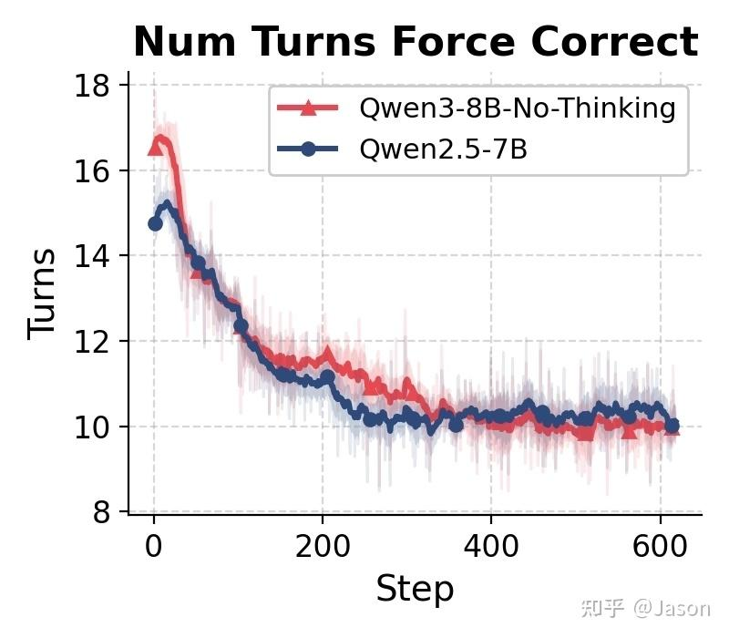
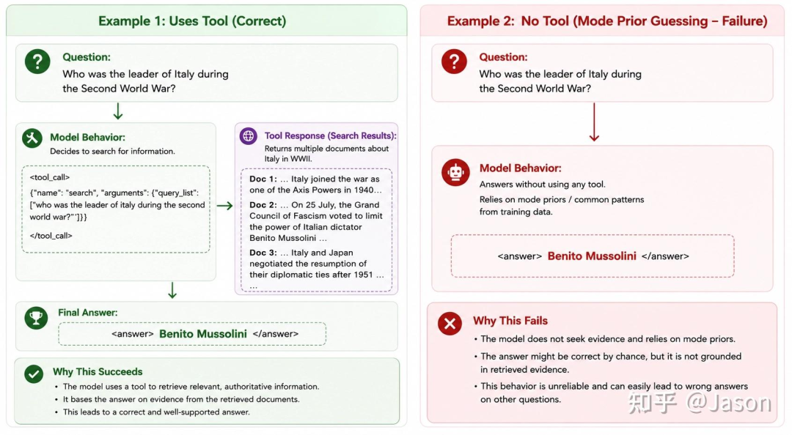
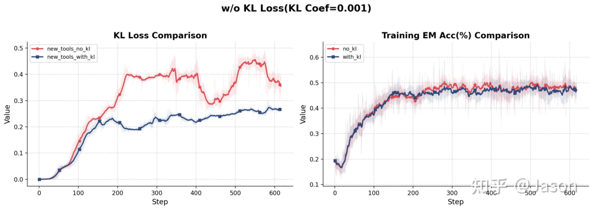
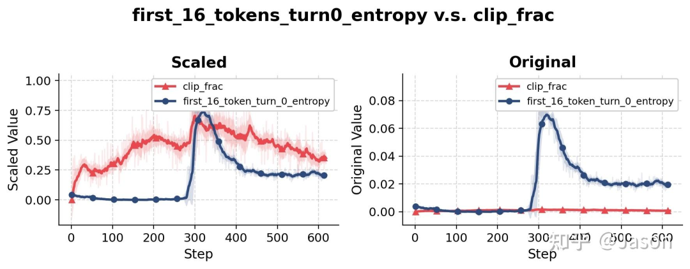

# Agentic RL 行为相变分析：当模型学会"先猜再搜"

> 来源：[丁师兄大模型](https://mp.weixin.qq.com/s/RsSx-IoZ7kFDdo8Y1fzBfA)，2026-06-19，原文授权自 Jason 知乎

本文回答两个问题：（1）RLHF、RLVR、Agentic RL 之间是什么关系？（2）Agentic RL 训练中模型为何会突然从"先搜再答"切换为"先猜再搜"，以及这揭示了什么本质问题。

---

## 一、概念澄清：四象限分类

讨论文章之前，需要先把几个容易混淆的概念拆开。它们不是一个维度上的东西：

```
          奖励来源 →     规则/可验证(VR)        人类偏好模型(HF)
行为空间 ↓
单轮                         │                      │
(传统)         RLVR          │       RLHF           │
                             │                      │
多轮+工具                    │                      │
(Agent)     Agentic RLVR     │   Agentic RLHF       │
```

- **RLVR（RL with Verifiable Rewards）**：奖励来自客观规则——数学题对答案、代码跑测试用例，对就是对错就是错，不需要人打分。
- **RLHF（RL from Human Feedback）**：奖励来自人类偏好训练的 reward model，判断的是"好不好"而非"对不对"。
- **传统 RL** vs **Agentic RL**：行为空间的区别——单轮一问一答 vs 多轮工具调用（搜索、验证、读文档），模型的每个动作都会改变后续 observation。

两对概念**正交**：RLHF/RLVR 说的是谁来打分，Agentic/传统 说的是动作空间复杂度。

文章中的 Search-R1 实验属于 **Agentic RLVR**：多轮工具调用 + Exact Match 打分。

---

## 二、实验设置

复现 Search-R1，配置：

| 组件 | 设置 |
|---|---|
| Base Model | Qwen2.5-7B-Instruct / Qwen3-8B-NoThinking |
| RL 算法 | GRPO |
| Reward | Exact Match（答案字符串完全匹配） |
| Train Batch Size | 128 |
| Rollout Group Size | 8（每个问题采样 8 条轨迹） |
| 工具 | 基础版：仅 Search；扩展版：Search + ReadMore + Verify |

---

## 三、核心现象：行为相变

### 3.1 表面信号：平均交互轮数下降

训练过程中，平均交互轮数持续下降：



第一眼这像好信号——更强的模型需要更少的工具调用。但 rollout inspection 揭示了真相。

### 3.2 真相：模型学会了"先猜再搜"

在训练约 step 300 时，轨迹模式发生了突变：

- **之前**：`Question → Search → Answer`
- **之后**：`Question → Guess → Search → Answer`



模型不是变得更高效了——它是更愿意**赌自己知道答案**。完全没有 search 的 trajectory 占比在相同时期骤升：


### 3.3 这不是"变强了"

对比行为切换前后的 checkpoint：


- step 278（切换前）：四轮交互准确率 **57.03%**
- step 297（切换后）：同指标跌至 **41.69%**

guess-first 是**更差的策略**——模型不是在已知答案时省掉搜索，而是在不确定时也赌。

### 3.4 训练没有崩，模型又恢复了

经过短暂波动，accuracy 重新增长，search-first 行为回归。模型探索到一条死胡同，在里面走了一段，又走出来了。

---

## 四、"先猜再搜"为什么会发生？——机制推演

### 4.1 GRPO 只看最终答案，不看过程

GRPO 对每个问题采样 8 条轨迹，reward 只看最终答案是否 Exact Match：

| 轨迹 | 行为 | 过程 | 结果 | Reward |
|------|------|------|------|--------|
| 1 | Search→Answer | 搜索→找到→正确 | ✅ | 1 |
| 2 | Search→Answer | 搜索→找到→正确 | ✅ | 1 |
| 3 | Search→Answer | 搜索→没找到→错 | ❌ | 0 |
| 4 | Search→Answer | 搜索→找到→正确 | ✅ | 1 |
| 5 | **Guess** | **不搜→碰巧猜对** | ✅ | **1** |
| 6 | Search→Answer | 搜索→没找到→错 | ❌ | 0 |
| 7 | Search→Answer | 搜索→找到→正确 | ✅ | 1 |
| 8 | Search→Answer | 搜索→找到→正确 | ✅ | 1 |

轨迹 5 和轨迹 1、2、4、7、8 拿到**完全相同的 reward**。但猜的路径 token 数少一个数量级（几十 vs 几百），在 loss 计算中权重更高。

### 4.2 自我加速的正反馈回路

```
猜对了拿到 reward
  → 梯度推高"直接回答"概率
    → 更多轨迹不搜索
      → 模型在训练中接触的外部证据越来越少
        → 模型越来越依赖 prior knowledge
          → 更不愿意搜索（自加速）
```

一旦跨过临界点，行为切换不再需要外部推动——系统内部的正反馈自身就足以维持和加剧新行为。这就是为什么它看起来像**相变**（phase transition）而不是渐变。

### 4.3 为什么后来恢复了？

guess-first 有天花板：

- **简单题**：模型确实知道答案，猜对率还行
- **难题**（需要外部知识）：模型不知道，猜错率极高

当 guess-first 占比到一定程度，在难题上大量猜错 → reward 为 0。少数仍 search-first 的轨迹在难题上能拿 reward → GRPO 比较机制反向作用，梯度把概率推回 search-first。

### 4.4 为什么叫"行为相变"而非"训练崩塌"？

关键区别：
- **训练崩塌**：reward 大幅波动、optimization 发散、策略持续偏离后无法恢复
- **行为相变**：reward 曲线正常、optimization 健康，变化的是模型解决问题的方式

模型不是"变差"了，是"换了一种工作方式"——有些方式是坏的（guess-first），有些是好的（见第五节）。

---

## 五、扩展实验：另一种行为相变

给模型增加更多工具（ReadMore + Verify），同样的现象再次出现——但这次是**好的**：


训练初期几乎没有 trajectory 使用 verification。然后在某个阶段，verification 使用率在短时间内从近乎 0 跳变为近乎确定性行为。区别在于：这次提高了准确率。

两种行为突变在 rollout 动态上高度相似（都是短时间内从一种稳态切换到另一种），但效果截然相反——一个是能力涌现，一个是投机作弊。

---

## 六、现有 RL 指标能看到什么？

### 6.1 KL Divergence：最有效的预警信号



相对 reference policy 的 KL divergence 能比较稳定地提前捕捉到 major behavioral transition。每当策略开始向新行为模式移动时，KL 会提前上升——但它不告诉你这种变化是好是坏。

### 6.2 Importance Sampling / Clip Fraction：几乎看不到



token-level 的 importance weight 和 clip fraction 在行为突变的同一时期变化幅度不大。这是反直觉的——我们通常以为大策略变化应该伴随大 importance weight。

但这恰恰揭示了问题：**高层行为变化不一定以 token-level correction 容易捕捉的方式出现。** 单个 token 的概率分布也许没有偏移到触发强烈 clipping，但由这些 token 组成的高层 action sequence 已经发生了质变。

### 6.3 Entropy：是结果不是原因

token entropy 在行为切换处确实出现了 spike，但它很可能是行为变化的结果（模型在更不确定的状态下生成答案，entropy 自然升高），而非驱动变化的原因。

---

## 七、核心结论

### 7.1 Agentic RL 的本质挑战不是优化问题，是行为演化问题

作者一开始用传统 RL 视角看待一切——关心 off-policy staleness、importance sampling、clipping 是否足够。但实验结果改变了他的认知：

> Reward 曲线没有崩，evaluation accuracy 没有崩，optimization 过程没有发散。真正发生变化的是模型在任务中的**行动方式**。

两个策略可以拿到相同的 reward，却采用完全不同的工作模式：一个系统搜索、阅读、验证，另一个先猜再补救。单看最终 reward 区分不了。

### 7.2 行为相变可能是 Agentic RL 的固有特征

模型在训练过程中会快速在不同的工具使用策略之间切换——有些是有害的投机，有些是有益的能力涌现。它们在 rollout 层面表现出高度相似的动态，但方向相反。

### 7.3 未来方向：轨迹级监控

如果 Agentic RL 不是平滑优化而是一系列行为相变，那么训练系统需要的不仅是 token-level clipping 和 reward shaping。作者提出两个方向：

1. **规则干预**：对于 deep research 任务，模型在第一轮没有搜索就尝试回答 → 直接判定错误并终止轨迹。简单直接但依赖人工规则，难泛化。
2. **Model-based Monitor**（更自然的方向）：用另一个模型判断当前行为是否合理。对于某些问题直接回答是合理的，对于另一些则明显不可靠。monitor 根据任务类型、trajectory history 和已获得证据来判断行为是否属于 bad shortcut，惩罚投机同时保留有价值的探索。

---

## 八、四象限分类的意义

回到开头的分类框架。这个框架不仅是概念梳理，它对工程实践有直接指导意义：

| 象限 | 核心挑战 | 监控重点 |
|---|---|---|
| 传统 RLVR | reward 信号是否可靠 | 答案正确率 |
| 传统 RLHF | reward model 是否与人类偏好一致 | 偏好对齐度 |
| Agentic RLVR | **行为模式是否合理** | trajectory 级监控 |
| Agentic RLHF | 行为合理性 + 偏好对齐 | 双重监控 |

两个维度交叉后，挑战不是简单叠加，而是产生新问题。Agentic RLVR 的核心挑战——行为相变——在传统 RLVR 中几乎不存在，因为只有一个动作（生成答案），没有"怎么完成任务"的选择空间。

---

> 最终洞察：**Reward 告诉你模型是否成功。Trajectory 告诉你模型是如何成功的。在 Agentic RL 里，这两者并不总是一致。**
