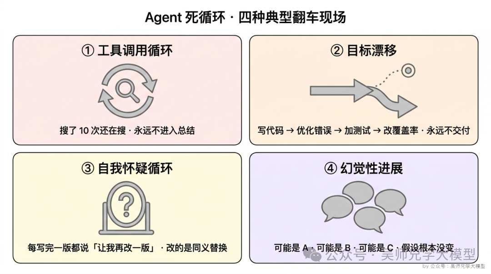
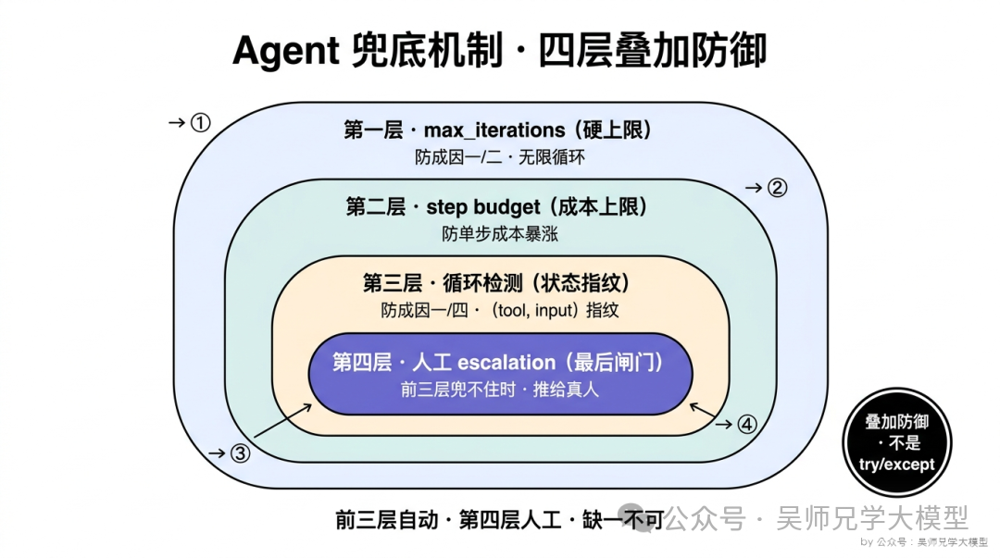
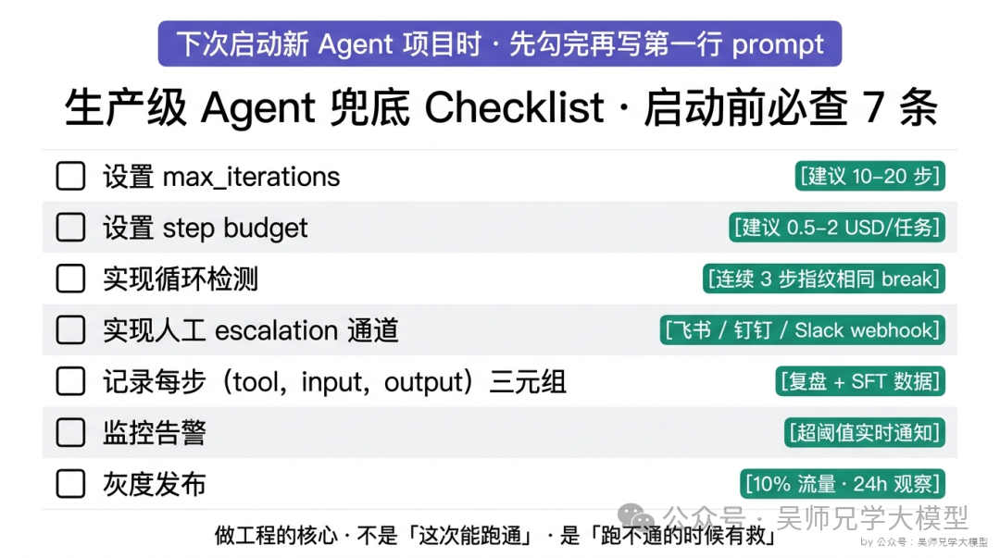

# Agent 死循环与生产级兜底机制

> 来源：[吴师兄学大模型](https://mp.weixin.qq.com/s/WufLje1K1q7q_ZqXVQftDw)，2026-05-29

核心命题：**Agent 工程师和 Agent 玩家的区别，就是前者永远先想兜底。** Demo 阶段做的是"让它能跑通"，生产阶段做的是"让它跑飞了也不至于烧到你哭"。

---

## 一、Agent 死循环的四种成因

症状都是"死循环"，但里面有四种完全不同的失败模式，对应的解药也不一样。



### 成因一：工具调用循环

Agent 反复调用同一个工具，每次参数只做微调，但永远不收敛。比如搜索 Agent——你让它"搜索 + 总结"，它一直在搜，永远不进入总结环节。每一次搜索它都觉得"我还缺一点信息"，所以再搜一次，越搜越乱。

> 本质：模型在每一步都"乐观地高估了下一次搜索的价值"。

### 成因二：目标漂移

Agent 在执行过程中把子目标当成了主目标，越走越远。让它写一段代码，它先写完，然后开始"优化错误处理"，优化完又觉得"可以再加点单元测试"，然后又觉得"测试覆盖率不够"……每一步看起来都"在前进"，但整个任务永远不交付。

> 本质：Agent 把"局部最优"误当成"全局最优"。

### 成因三：自我怀疑循环

Agent 完成任务之后又反复 review 自己的输出，每次都觉得"还能更好"。比如写作 Agent，每写完一版都说"让我再改一版"，每一版的改动还都是同义替换。

> 本质：prompt 里"追求高质量"的指令过强，导致模型陷入"反复 polish"的无限循环。

### 成因四：幻觉性进展

Agent 觉得自己在推进，但实际上只是在换说法重复同一件事。调试 bug 时反复"分析 → 假设 → 验证"，但假设根本不变——只是把"可能是数据库连接问题"换成"可能是连接池配置问题"再换成"可能是 connection 超时设置问题"。

> 本质：模型在玩同义词游戏，语义上等价。读 transcript 以为在认真想，仔细看走了 8 步等于走了 1 步。

**关键判断：失败模式分不清，兜底就一定打偏。** 你以为是工具调用循环往里加 retry 上限，结果真正的病是目标漂移，加再多 retry 都救不了。先诊断成因，再选兜底机制。

---

## 二、四层叠加防御机制

生产级 Agent 的兜底是叠加防御——四层一起上，每一层防一种失败模式，任何一层兜不住下一层接住。



### 第一层：`max_iterations`——硬上限

```python
def run_agent(task, max_iterations=20):
    for step in range(max_iterations):
        action = agent.decide(task, history)
        if action.is_done:
            return action.result
        history.append(action.execute())
    raise AgentTimeoutError(f"超过 {max_iterations} 步未完成")
```

> **`max_iterations` 不是为了让 Agent "做完"，是为了"止损"。** 一个 20 步还没收敛的任务，再跑 100 步大概率也收敛不了。与其继续烧 token，不如立刻断电让人工接手。

防**成因一（工具调用循环）和成因二（目标漂移）**——它们的共同特点是"会无限往下走"。

LangGraph 把这个值叫 `recursion_limit`，超过抛 `GraphRecursionError`；LangChain `AgentExecutor` 有 `max_iterations` 参数。这是行业共识的第一道兜底。

### 第二层：`step budget`——成本上限

`max_iterations` 按轮数算，但每轮成本可能差很多——有些任务每步 10000 token，有些只用 500 token。生产环境真正的硬约束往往是**钱**，不是轮数。

```python
budget = max_cost_usd / avg_cost_per_step
# 例: max_cost_usd=2.0, avg_cost_per_step=0.05 → budget=40 步
```

更精细的是实时追踪累计花费——每一步算一次 `total_cost`，超过阈值就停。防的是"轮数没超但单步代价暴涨"（比如某一轮 Agent 突然下载 50MB 文件做向量化）。

> **常见反模式：只看 `max_iterations` 不看 budget。** 某天用户提交特别复杂的任务，10 步之内每步把上下文塞到 100K token，烧了几十美金任务还没跑完——`max_iterations` 没触发（只走了 8 步），但账单已经爆了。

### 第三层：循环检测——状态指纹

前两层是"撞墙才停"，第三层是**主动识别**——给 Agent 每一步的状态算 hash，连续 N 步 hash 相同就判定死循环，立刻停。

```python
window = collections.deque(maxlen=3)
for step in range(max_iterations):
    action = agent.decide(...)
    fingerprint = (action.tool, sha256(json.dumps(action.input, sort_keys=True)))
    if window.count(fingerprint) == 3:
        raise LoopDetectedError(f"连续 3 步重复: {fingerprint}")
    window.append(fingerprint)
```

专门防**成因一（工具调用循环）**——"工具+参数完全一样"，hash 一定相同。也能部分防成因四（幻觉性进展）。

三个工程细节：
1. **窗口不能太短**：设 2 步会误伤合理回溯，3-5 步是经验值。
2. **input 要 normalize**：空格、引号、key 顺序差异会让 hash 不一致。最佳实践：`json.dumps(input, sort_keys=True)` 后再 hash。
3. **break 后别直接报错**：把"我检测到你在循环 `{tool}({input})`，可以换个策略吗？"作为新一轮 observation 推回给模型，给它一次自救机会。如果新一轮还命中，再走 escalation。

### 第四层：人工 escalation——最后一道闸门

前三层兜不住时，不是直接报错或重试，而是把当前状态打包推给人工，附上完整的"我尝试了什么、卡在哪、需要你做什么决策"。

实现示例（飞书 webhook）：

> ⚠️ Agent 任务 #4729 已触发兜底
> 已用 18 步 / 预算的 90%
> 失败模式：循环检测
> 最近 3 步：search_docs(query="rag rerank") × 3
> [查看完整 transcript] [批准继续] [终止并退款]

---

## 三、Claude Code 的做法

Claude Code 的官方 tool use 文档定义了 agentic loop 标准模式：模型返回 `stop_reason: "tool_use"` → 执行工具 → 把结果包成 `tool_result` 喂回去 → 循环到 `stop_reason: "end_turn"`。

但产品层在外面包了一整套兜底：内置工具调用次数限制、单次任务 token 预算、当任务复杂度超出预算时主动提示用户"是否继续"而不是闷头烧 token。

> **Anthropic 的标准答案：模型层负责生成，产品层负责止损。两者一定要分开。** 如果期待模型自己学会停，那是把工程问题甩给概率分布——99% 能停，1% 就足以让你账单爆炸。

---

## 四、生产级 Agent 兜底 Checklist



- [ ] 设置 `max_iterations`（初始值 10-20，根据任务复杂度调）
- [ ] 设置 `step budget`（按业务能承受的成本算，0.5-2 美金/任务起步）
- [ ] 实现循环检测（连续 3 步 `(tool, input)` 指纹相同即 break）
- [ ] 实现人工 escalation 通道（飞书 / 钉钉 / Slack webhook，不是 try/except 吞掉）
- [ ] 记录每一步 `(tool, input, output)` 三元组（用于事后复盘和 SFT 数据沉淀）
- [ ] 监控告警（单任务成本超阈值、单步耗时超阈值时实时发通知）
- [ ] 灰度发布（新 Agent 先跑 10% 流量，观察 24 小时再全量）

---

## 五、面试回答框架

面试官问"你的 Agent 上过生产吗？跑飞过吗？怎么救的？"，三段答法：

**先抛立场（20 秒）：**
> "我做 Agent 项目的第一步不是设计 prompt，是设计兜底。Agent 一定会失控，区别只在于失控时烧的是用户的钱还是公司的钱。"

**再讲四层叠加（60 秒）：**
> "我的兜底是四层叠加：第一层 `max_iterations` 设硬上限；第二层 `step budget` 防单步成本暴涨；第三层 `(tool, input)` 指纹做循环检测；第四层人工 escalation 推飞书让真人接管。前三层自动，第四层人工，缺一不可。"

**最后讲数字（30 秒）：**
> "我们项目里 `max_iterations` 设到 25 步、`step budget` 卡在 2 美金、循环检测窗口设到 3、escalation 接飞书 webhook，跑了三个月没有过一次超过 5 美金的事故。"

三段答完不到两分钟。面试官一听就知道你不是在背概念，是真的把 Agent 跑过生产、踩过坑、有数字。
