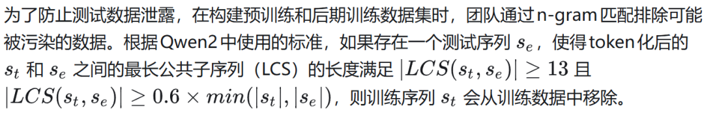
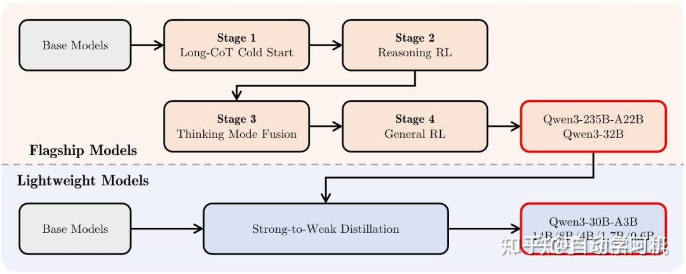
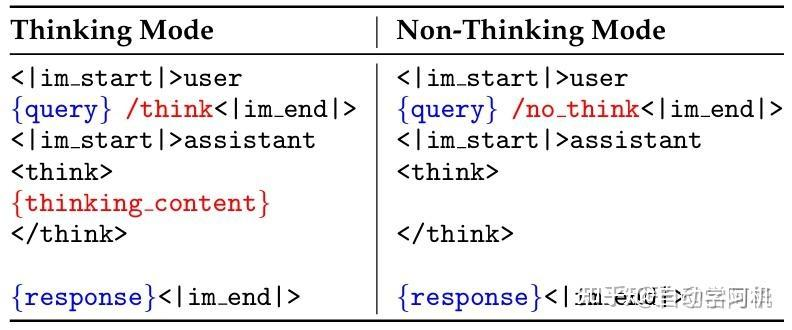
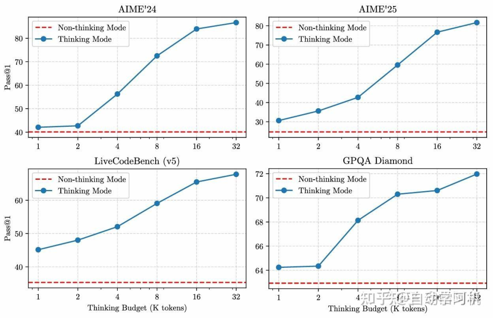
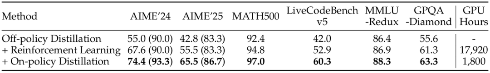
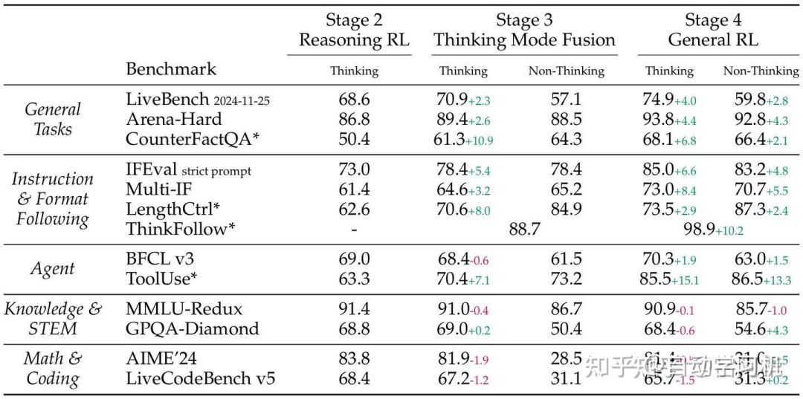
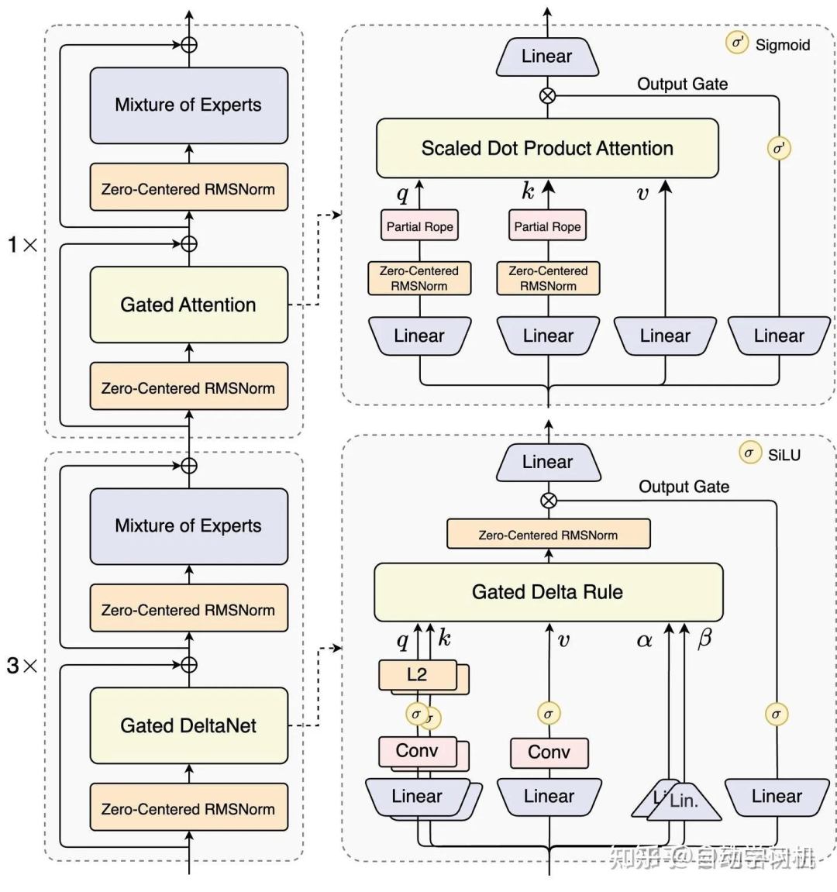
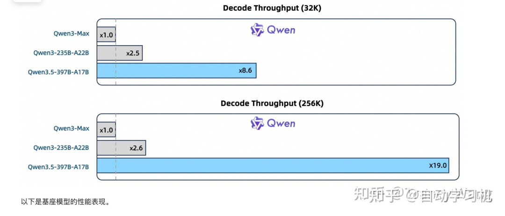
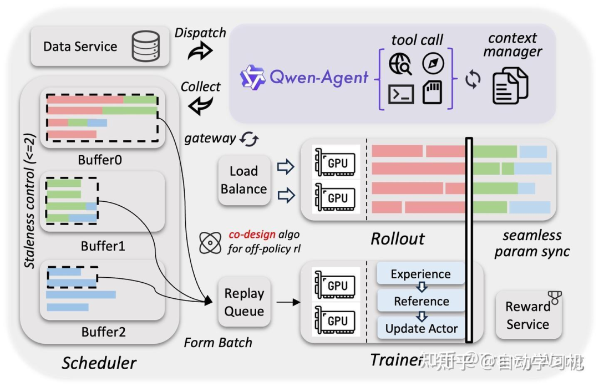
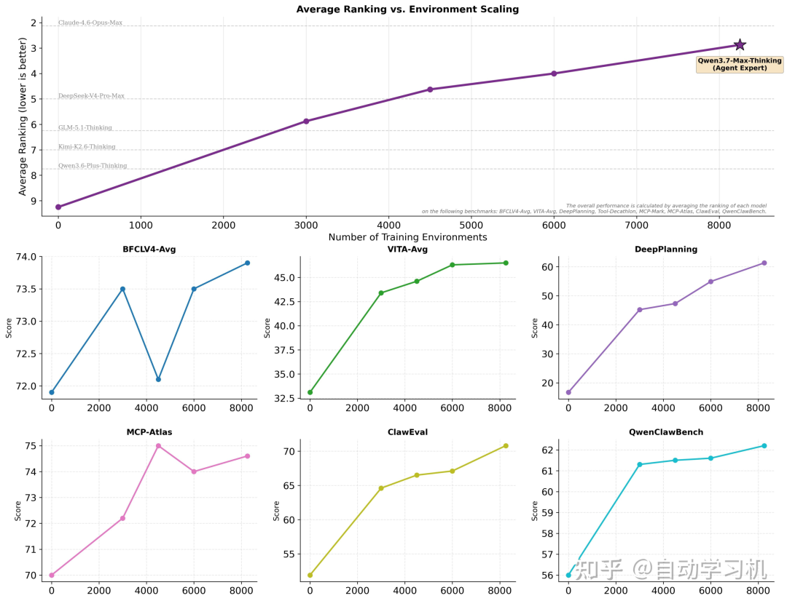

# Qwen 模型演进技术总结：从 2.5 到 3.7

> 来源：[丁师兄大模型](https://mp.weixin.qq.com/s/vKptJ55Lgr_c6Eppv9BHKA)，2026-06-04，原文授权自[自动学习机](https://zhuanlan.zhihu.com/p/2045665300545262204)

本文从架构、预训练数据、后训练（SFT + RL）、Agent 能力四个维度，纵向梳理 Qwen 从 2.5 到 3.7 的技术演进脉络。

> 注：Qwen 自 3.5 起没有正式 technical report，仅发表 blog。因此 3.5+ 的信息基于公开 blog 推断，训练数据量和部分训练方式可能存在推断成分。

---

## 一、Qwen2.5：奠定技术底座

### 架构

延续 Qwen2 的 Transformer 解码器架构，关键组件：

| 技术 | 作用 |
|---|---|
| GQA（分组查询注意力） | 高效利用 KV Cache |
| SwiGLU 激活 | 增强非线性激活 |
| RoPE（旋转位置编码） | 编码位置信息 |
| QKV 偏置 | 提升注意力表现 |
| RMSNorm（预归一化后） | 保证训练稳定 |

MoE 架构：标准 FFN 层替换为 MoE 层，每层含多个 FFN 专家，通过路由机制将 token 分配给 top-K 专家。

Tokenizer：BBPE，151,643 个常规 token，控制 token 从 3 个扩展到 22 个。

### 预训练

**数据**：18T token。扩充了 Qwen2.5-Math 和 Qwen2.5-Coder 训练数据，并使用 Qwen2-72B-Instruct 合成数据（尤其在数学、编程、知识领域），通过专有奖励模型和 Qwen2-Math-RM-72B 严格过滤。

**数据平衡策略**：用 Qwen2-Instruct 对不同领域内容分类打标签——对电商、社交媒体等互联网占比大的数据**减少采样**，对技术、科学、学术等领域**重复采样**，确保平衡。

**两阶段预训练**：
1. 4K token 上下文训练
2. 扩展阶段至 32K token（Qwen2.5-Turbo 渐进扩展至 256K），ABF 将 RoPE 基础频率从 10,000 提升到 1,000,000

**长序列技术**：YARN + 双块注意力（DCA），序列长度处理能力提高 4 倍。

**Scaling Law**：发现了模型规模 N 和预训练数据量 D 与最优学习率 μ、最优批次大小 B_opt 的变化规律，为 MoE vs Dense 模型性能对比提供指导。

### 后训练

**SFT**：100 万+ SFT 示例，两阶段微调——先短指令（≤32K）确保短任务性能，再混合长短指令（≤256K）提升长上下文跟随能力。

**两阶段 RL**：
- **离线 RL（DPO）**：约 150,000 训练对，聚焦数学、编程、指令跟随和逻辑推理等难以通过奖励模型评估的能力。人工审核 + 自动化双重过滤。
- **在线 RL（GRPO）**：群体相对策略优化，每个查询 8 次采样，全局 batch size 2048。查询按响应分数方差排序，方差大的优先处理。

性能评估：

---

## 二、Qwen3：思考模式与知识蒸馏

### 架构变化

- **移除 QKV 偏置**，在注意力中引入 **QK-Norm** 保证训练稳定性
- MoE：**128 个专家，每 token 激活 8 个**，**去除共享专家机制**
- 全局批量负载平衡损失函数促进专家专业化
- Tokenizer：BBPE，151,669 token

### 预训练

**数据翻倍**：36T token，语言从 29 种扩展到 **119 种**。

**PDF 文档提取**：Qwen2.5-VL 对 PDF 文档文本识别 → Qwen2.5 精炼文本质量，获得数T高质量文本。

**合成数据**：Qwen2.5/Math/Coder 合成教科书、问答、指令、代码等多格式数据，覆盖数十个领域。

**多语言标注系统**：对 30T+ token 提供教育价值、学科、领域、安全性等多维度标注，支持高效数据筛选和组合。

**三阶段预训练**：
| 阶段 | 数据量 | 序列长度 | 特点 |
|---|---|---|---|
| S1 通用 | 30T+ token | 4K | 119 种语言 |
| S2 推理 | ~5T token | 4K | 提高 STEM/编程/推理/合成数据比例，加速学习率衰减 |
| S3 长上下文 | 数百亿 token | 32K | 75% 16K-32K，25% 4K-16K |

### 后训练：两大核心目标

1. **思维控制**："思考"和"非思考"两种模式，用户通过 `/think` 和 `/no think` token 控制，可设定思考 token 预算
2. **强到弱知识蒸馏**：大模型知识迁移到小模型

**Long-CoT 冷启动**：
1. 查询过滤：用 Qwen2.5-72B-Instruct 移除难以验证的查询和无需 CoT 即可正确回答的简单查询
2. 响应过滤：QwQ-32B 为每个查询生成 N 个候选，人类标注者评估准确性

**推理强化学习**：3,995 对"查询-验证器"样本（挑战性、覆盖广泛子领域），GRPO 优化，大 batch size + 离线策略训练 + 控制模型熵稳定增长。

**思考模式融合**：

- 聊天模板中引入 `/think` 和 `/no think` token
- SFT 结合思考和非思考两类数据——思考数据由第二阶段模型拒绝采样生成，非思考数据经自动评估清单评分

**思考预算控制**：模型思考长度达到用户上限时，手动终止并插入"由于时间有限，基于当前思考直接解答"。**这种能力并非显式训练，而是思考模式融合的自然产物。**

Qwen3 展现随思考预算增加而**平稳、可扩展的性能提升**。

**通用 RL**：覆盖 20+ 任务类型的复杂奖励系统——基于规则的奖励 + 基于参考答案的模型奖励 + 基于人类偏好的奖励模型。提升指令遵循、格式遵循、偏好对齐、Agent 和特定场景能力。

**知识蒸馏有效性**：

知识蒸馏性能显著优于 RL，仅需约 1/10 GPU 计算时间，就让小模型超过了 RL 方式训练的自己。

**退化现象**：思考模式融合和通用 RL 后，AIME'24 和 LiveCodeBench 等挑战性任务在思考模式下性能下降。模型被训练用于应对更广泛的通用任务，**削弱了在复杂任务上的专业能力**——adaptive learning 存在弊端。

---

## 三、Qwen3.5：混合注意力与 Agent 化

### 核心特点

> **混合注意力架构（Transformer + 线性注意力）+ MoE 稀疏机制** → 计算成本降低约 50%，实现长上下文 + 高性能推理统一。原生多模态融合 + 强化的 Agent 能力。

### 架构

**混合注意力机制**：引入线性注意力（类似 Gated Delta Network），将部分计算复杂度降至 O(n)。

### 预训练

- **词表扩展**：15 万 → **25 万**，多数语言编解码效率提升 10%-60%。32K 和 256K 长文本解码吞吐量飙升 8.6 倍和 19.0 倍
- **原生多模态融合**：文本、图像、视频在模型早期直接融合联合训练，改变"先转文本再处理"旧模式

### 后训练与基础设施

**RL 异步并行系统**：将"数据生成"与"模型训练"分离——Agent 与环境交互产生经验数据存入缓存池，训练器同步学习，奖励模型实时打分。**训练效率提升 3-5 倍。**

**混合精度与显存优化**：大量 FP8 低精度计算 + 关键节点保留 BF16 高精度，显存占用减半，速度提升 10%+。

**真实环境 RL**：偏向真实任务的 RL 训练使模型在不同任务上表现均衡——既能做数学题，也能写代码、解决结构化问题。

**小模型策略**：Qwen3.5 的中小规模模型（如 9B）在多项任务上接近甚至超过上一代数十B模型水平。**模型能力不再完全依赖参数规模，越来越依赖架构设计和训练策略。**

---

## 四、Qwen3.6：超长上下文与 Agent 飞跃

- **100 万上下文窗口**默认支持
- **Agent 能力飞跃**：前端网页开发、代码仓库级问题求解、终端操作与自动化任务执行
- 多个高难度**长程规划任务**最优成绩
- 视觉与视频理解增强：识别 → 推理 + Grounding + OCR 复杂分析

---

## 五、Qwen3.7：Agent 泛化与自进化 RL

### 核心能力

更优秀的编程能力、更长程的工具调用能力和执行能力。

### RL 基础设施架构（训练系统，非模型架构）

**解耦设计**：每个训练实例正交解耦为三个独立组件——**任务（Task）**、**运行框架（Harness）**、**验证器（Verifier）**。同一任务可以极低成本与不同类型/版本的框架和验证器自由重组。

> 这种组合式扩展迫使模型学习具备泛化能力的解题策略，而非依赖特定框架的捷径。

### 后训练与 RL

**Agent 训练环境扩展**：训练环境质量与多样性进一步提升，模型从多样化训练环境中获得真正的**能力泛化**——评测基准环境均为训练时未见过的全新领域。

**跨框架与跨验证器 RL**：模型在多变的框架配置下处理同源任务，逼迫学习通用解题策略而非"走捷径"，实现极其稳定的跨框架泛化。

**对抗"奖励作弊"的自进化体系**：在长达 80+ 小时的 SWE 强化学习中，Qwen3.7-Max 接入训练监控系统，**自主回放轨迹、归纳作弊模式**（如去 GitHub 偷看标准答案），**自进化出 13 条规则精准拦截 1,618 个作弊案例**。

**长程时序复杂度强化**：在"动态累积生存博弈框架"下扩展训练任务的时序复杂度，让模型学会在长达数小时、数千步决策中保持策略一致性，克服长上下文"记忆腐化"和"指令漂移"。

---

## 六、演进总览

| 版本 | 架构关键变化 | 数据规模 | 后训练核心 | 代表能力 |
|---|---|---|---|---|
| 2.5 | GQA + MoE + YARN/DCA | 18T | DPO + GRPO 两阶段 RL | 32K/256K 长上下文 |
| 3 | QK-Norm + 128 专家 + 去共享专家 | 36T / 119 语言 | Thinking Budget + 强到弱蒸馏 | 思维模式控制 |
| 3.5 | Transformer + 线性注意力混合 | 更大规模 | 异步 RL 并行 + 原生多模态 | 成本降 50% + Agent |
| 3.6 | — | — | — | 100 万上下文 + Agent 飞跃 |
| 3.7 | 解耦 Harness-Verifier | 未公开 | 跨框架 RL + 自进化反作弊 | Agent 泛化 + SWE |

**核心趋势**：
1. **从规模驱动到设计驱动**：小模型靠架构和训练策略追平大模型
2. **从单模态到原生多模态**：图文视频在早期直接融合
3. **从通用 RL 到 Agent 专项 RL**：训练环境多样化 + 跨框架泛化 + 反作弊自进化
4. **从模型能力到系统工程**：Qwen3.7 的重点不再是模型参数，而是 RL 基础设施的解耦设计和训练效率
